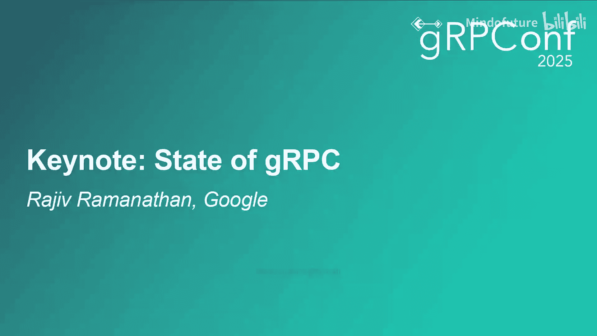
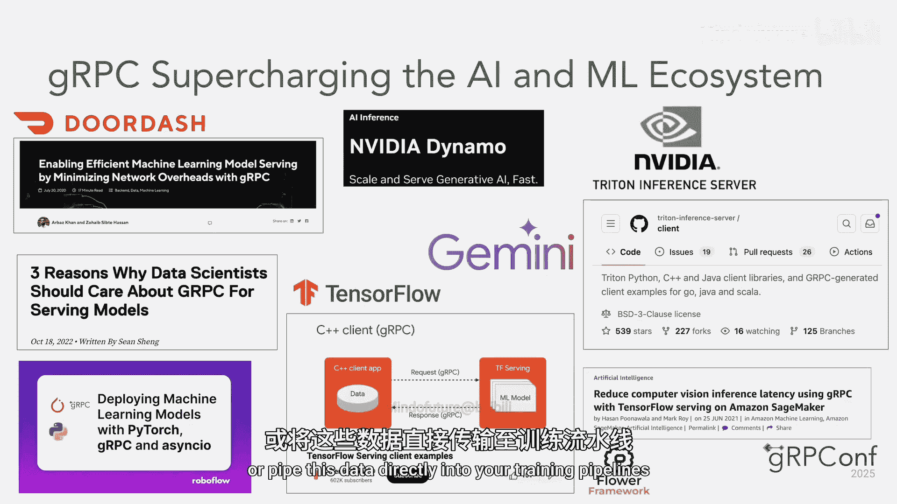

# 002：主题演讲

在本节课中，我们将学习gRPC的发展历程、成功的关键因素、在云原生和人工智能领域的最新进展，以及未来的发展方向。

---

## 🚀 gRPC的广泛采用

我是Rajeiv。我使用gRPC已经超过10年，大概就在它开源之后不久。这段时间里，我在初创公司和大公司都有使用经验。因此，我非常高兴能作为gRPC和gRPC conf的赞助商来到这里。

感谢大家参加gRPC conf。能与各位相聚，我感到非常兴奋。在接下来的几分钟里，我将讨论gRPC令人难以置信的采用率、我们当前的状况以及未来的发展方向。

自我们发布gRPC以来，已经过去了10年。在这段时间里，gRPC在各个行业经历了快速的采用。其高性能和对多种语言的支持，使其成为构建现代分布式系统高效、可扩展通信的优选方案。

思科可能是第一个开始集成gRPC的公司，大概在gRPC开源一年后。随后是Netflix，它既是贡献者，也将其用于后端通信，接着是Spotify、Reddit、LinkedIn等公司。事实上，我记得在去年的Qcon大会上，LinkedIn分享了他们如何将5万个端点从内部框架迁移到gRPC。看到我们的解决方案被广泛接受，并在各个行业和应用中产生积极影响，这非常令人鼓舞。

---

## 🔑 gRPC成功的关键因素

上一节我们看到了gRPC的广泛采用，本节中我们来看看是什么让它如此成功。

gRPC非常适合云原生环境。它旨在通过使用协议缓冲区来减少消息大小，以及利用HTTP/2来提高网络效率和实现实时通信，从而实现高效通信。这使其成为需要交换大量数据的微服务的理想选择。

gRPC与语言无关的特性允许您使用偏好的语言构建和部署服务。这种可移植性对于云原生环境至关重要，因为在云原生环境中，使用不同语言构建微服务是很常见的。

最后，gRPC支持微服务的架构模式。这允许团队将大问题分解为更小、封装良好的服务，最终提升开发速度，并让小型团队能够并行工作，从而加速整体开发过程。此外，gRPC还提供了负载均衡和重试等功能，以提高这些分布式系统的可靠性。

我们在Google内部大量使用gRPC，例如GKE、Cloud Run、Kubernetes以及许多Google项目都将其用于内部通信。因此，gRPC已成为云原生环境中构建现代、可扩展、高效应用程序的热门选择。

---

## ☁️ gRPC的云原生演进

我们持续致力于让gRPC更加云原生友好。无代理的gRPC服务网格简化了部署流程，并消除了运行和维护边车代理的操作开销。这种方法不仅降低了复杂性，还提高了资源效率，使其对大规模云原生环境具有吸引力。

此外，gRPC自带许多功能，允许您将这些服务网格能力直接集成到应用程序中。如果您想了解更多相关信息，Eric Anderson将在下午1:50讨论服务网格和gRPC。

在去年的gRPC conf上，我们宣布了与Tokio的合作，并且自那时起一直与维护者紧密合作。过去一年我们取得了重大进展，并将很快推出预览版。请参加Doug在下午2:20的精彩演讲，深入了解gRPC Rust并了解我们的进展。如果您想亲自动手并获得一些gRPC Rust的实践经验，我们在下午4:10还有一个代码实验室。

---

## 🤖 gRPC在人工智能与机器学习中的角色

过去几年，人工智能与机器学习领域蓬勃发展。gRPC正在彻底改变AI模型通信和操作的方式。其固有的速度、效率和对数据流的支持，使其成为这些AI/ML管道中的关键构建块，有助于训练大型模型并快速处理推理请求。

gRPC促进的高效数据摄取和处理，显著加速了我们的模型开发生命周期。训练大规模机器学习模型需要使用海量数据，gRPC由协议缓冲区驱动的数据序列化能力，结合其处理大负载的能力，使其成为一个可靠且稳健的解决方案，能够将这些数据直接导入训练管道。

得益于其低延迟和高吞吐量，gRPC也能高效处理推理请求。像TensorFlow这样著名的机器学习框架就利用gRPC来管理和处理大量的推理请求。NVIDIA的Triton推理服务器框架，帮助您构建和部署模型，也使用gRPC作为其传输层。因此，gRPC确保了实时应用能够以最小的延迟接收预测。

我们在Google的AI/ML领域做了大量工作。今天我们可以宣布一些关于MCP和A2A的令人兴奋的事情。MCP（模型上下文协议）允许AI代理连接并使用外部工具、数据库和服务。A2A是一种协议，允许不同的AI代理相互协作、相互委派任务等。gRPC将伴随您的AI/ML之旅，我们今天晚些时候还有几场会议会讨论这个话题。

---

## 📝 总结

本节课中我们一起学习了gRPC过去十年的发展历程和广泛采用。我们探讨了其成功的关键因素，包括对云原生环境的卓越适应性、语言无关性以及对微服务架构的支持。我们还了解了gRPC在云原生演进方面的最新进展，例如无代理服务网格，以及它与Rust生态的集成。最后，我们看到了gRPC在人工智能和机器学习领域扮演的关键角色，它正成为高效数据管道和实时推理的基石。

再次感谢大家来到gRPC conf。我们真诚感谢您抽出时间来到这里。我们衷心希望您能度过充满激动人心话题和宝贵见解的美好一天。关于gRPC如何被使用以及它如何可能帮助您解决问题，还有很多值得学习的地方。祝您会议期间一切愉快。