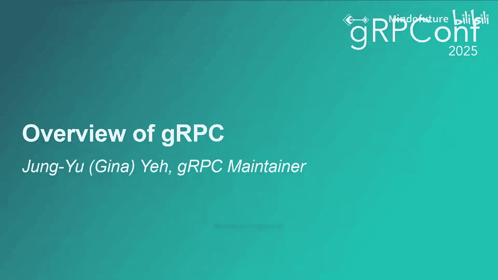
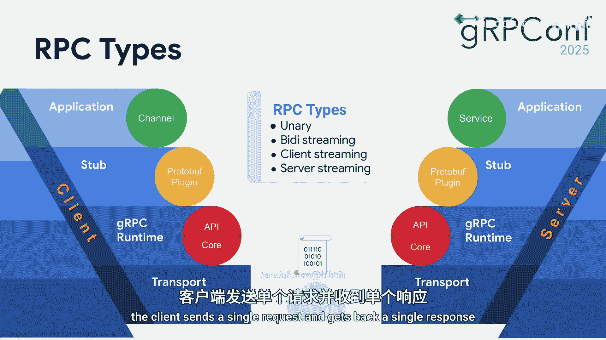
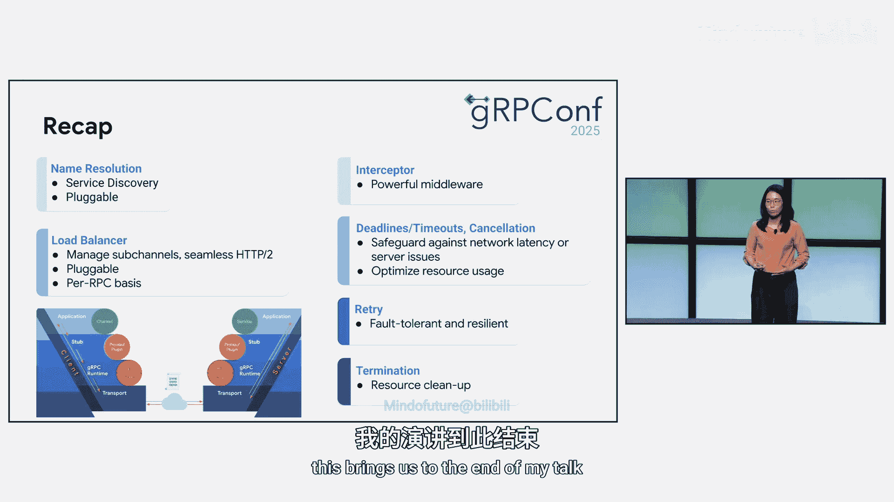

# 003：gRPC核心概念与生命周期详解 🚀

在本节课中，我们将要学习gRPC的核心概念及其完整的生命周期。如果你是gRPC的新手，你将掌握其基本概念。对于已经熟悉gRPC的开发者，这可以作为一个快速的复习，为后续深入学习高级主题和用例做好准备。

## 什么是gRPC？ 💡

gRPC是一个开源的高性能远程过程调用（RPC）框架。它易于使用、高效，并已成为行业标准。简单来说，你可以将gRPC视为一个高速的数据传输服务，它能在互联网上可靠且快速地在你的服务与应用之间传递信息。

gRPC的流行源于其灵活性和高性能。除了支持广泛的编程语言和平台外，其性能在业界处于领先地位。该框架采用可插拔架构，能够灵活高效地与各种开发栈集成。此外，gRPC还提供了丰富的功能集，用于流量管理、安全和服务网格集成。

## 核心设计决策 🔧

gRPC的一个关键设计选择是使用**Protocol Buffers**作为其接口定义语言来构建服务消息。Protobuf采用二进制编码格式，这带来了更小的消息体积和高效的解析效率。与其他RPC框架相比，这直接促成了gRPC的高性能和高灵活性。

gRPC的另一个基础设计决策是构建在**HTTP/2**之上。这确保了与许多现有负载均衡器的兼容性。HTTP/2的头部压缩、二进制编码以及在单个TCP连接上的多路复用特性，使得gRPC成为一个能降低网络延迟、更高效利用资源的高性能框架。

## gRPC核心概念 🧩

上一节我们介绍了gRPC的基础，本节中我们来看看它的核心组成部分。

### 通道

一个gRPC通道是一个对象，代表到一个gRPC服务的虚拟连接，由目标URI标识。gRPC通道负责管理与目标服务的TCP连接，根据应用需求，可以建立0个、1个或多个连接。通道还负责处理关键功能，如名称解析和负载均衡，开发者无需自行处理。

### 存根与调用

建立gRPC通道后，你可以从中创建一个客户端存根。这个从你的proto定义生成的存根，是你用来进行远程调用的对象。当你在存根上调用一个方法时，它会在gRPC运行时内发起一个逻辑调用。这个调用随后在传输层被映射到一个HTTP/2流，由该流处理实际的数据传输。本质上，RPC、调用和流指的是同一个基本概念，只是在不同抽象层使用的不同术语。

### 名称解析

在gRPC通道连接到服务器之前，它必须首先执行名称解析。这是因为应用程序在创建gRPC通道时使用目标URI来指定要连接的服务，但底层的传输层需要具体的IP地址来建立连接。在gRPC中，名称解析是根据给定的URI找出服务器IP地址的过程。可以将其视为gRPC的电话簿。当客户端想要调用服务器时，它会使用服务器URI来查找其地址，然后再建立连接。虽然这听起来很像DNS的工作，但gRPC的名称解析更加灵活，它采用可插拔架构，允许使用不同的策略来查找服务器地址。

名称解析器随后将服务配置返回给下一个组件：负载均衡器。

### 负载均衡

负载均衡器管理到后端服务器的开放连接，并根据服务配置在多个后端服务器之间分发请求。gRPC内置了负载均衡功能，提供了几种常见的负载均衡策略，例如轮询、加权轮询，默认策略是“pick first”。负载均衡是gRPC中最关键的组件之一。

一旦连接建立，gRPC会序列化请求数据，并按照HTTP/2协议以帧的形式发送。

## 服务器端处理流程 🔄

服务器端与客户端镜像对应。服务器传输层接收请求，然后通知应用层。应用服务器逻辑随后处理请求，并返回响应发送回客户端。

## 通信模式 📡

gRPC支持四种通信模式，你可以选择最适合你通信需求的一种。

以下是四种主要的通信模式：

1.  **一元RPC**：经典的请求-响应模型。客户端发送单个请求，并收到单个响应。
    
2.  **服务器端流式RPC**：客户端发送单个请求，并收到多个响应。
3.  **客户端流式RPC**：客户端发送多个请求，并收到单个响应。
4.  **双向流式RPC**：客户端和服务器各自向对方发送独立的、并行的消息流。

## 其他重要特性 ⚙️

现在我们已经介绍了gRPC的生命周期，接下来看看其他几个重要特性。

### 拦截器

gRPC拦截器是gRPC框架中一个强大的中间件组件，允许你在请求到达预定目的地之前或之后拦截并修改它们。如图所示，gRPC会在特定点调用你的拦截器任务。拦截器提供了一种简洁的方式来为你的gRPC服务添加横切关注点，如认证、授权、错误处理等，而无需污染主应用逻辑。

### 截止时间

截止时间是gRPC提供的另一个特性，它是一种客户端机制，用于防止RPC无限期运行。客户端指定愿意等待响应的时间，这个超时可以设置为一个固定的时间点或一个持续时间。如果超过时间，调用将被取消，并返回“截止时间已过”的状态。这可能由多种原因导致，例如连接服务器失败，或者服务器认为客户端设置的截止时间太短而无法完成。

至关重要的是，gRPC支持截止时间传播。当服务器收到请求时，它也会收到关联的截止时间。如果该服务器随后向其他上游服务发起自己的RPC调用，它会自动转发剩余时间，确保原始客户端的时间限制在整个分布式系统中得到执行。这是应对网络延迟或服务器问题的重要保障措施。我们强烈建议你在应用中始终设置截止时间或超时。

### 取消

除了截止时间，gRPC客户端还可以在不再需要时手动取消一个RPC。取消信号通过HTTP/2传输层传播到服务器，允许服务器停止处理并清理资源。为了使此功能有效，特别是对于长时间运行的RPC，服务器处理程序应定期检查其正在服务的调用是否已被取消。一旦检测到取消，服务器应立即停止处理，清理资源，并理想情况下将取消传播到它可能调用的任何下游服务。

### 重试

gRPC重试是一个允许客户端在RPC调用失败时自动重试的特性。这是一个构建弹性应用的强大机制，可以优雅地处理短暂的服务器端问题或临时网络问题，而无需在应用代码中添加复杂逻辑。

当你启用gRPC重试时，客户端通道会配置一个重试策略。该策略定义了重试失败调用的规则，例如最大尝试次数、退避延迟和可重试状态码。当满足条件时，gRPC会在指数退避延迟后创建一个新的重试流。一旦收到响应，将不再尝试重试，gRPC会将调用移交给应用。如果你启用了可观测性，你将能看到重试指标，包括每次调用的重试尝试次数和退避延迟等详细信息。

### 状态码与终止

每个RPC最终都会终止，要么成功，要么返回错误码。调用的终止通过状态码进行通信，状态码告知客户端RPC的结果。

在关闭应用程序时，正确终止gRPC通道非常重要。你可以使用`shutdown`方法启动优雅终止，该方法会拒绝新的调用，但允许任何正在进行的请求完成。由于关闭是异步的，你必须等待该过程完成。你可以使用`awaitTermination`方法阻塞直到通道完全终止，或达到某个特定时间，以确保干净的关闭。对于更即时的停止，`shutdownNow`方法将强制取消所有正在进行的和新的调用。

## 总结 📝

本节课中我们一起学习了gRPC的核心概念与生命周期。

我们首先从基础开始：gRPC是一个现代、开源、高性能的远程过程调用框架，构建在Protocol Buffers和HTTP/2之上。

接着，我们走查了一个gRPC调用的完整生命周期，从通道创建、名称解析到负载均衡。

最后，我们涵盖了几个关键的最佳实践和用例，这些对于构建健壮的应用程序至关重要：
*   使用**拦截器**作为强大的中间件，在gRPC调用到达预定目的地之前或之后修改它们。
*   设置**截止时间或超时**以防止RPC无限期运行，并且截止时间会传播到任何上游服务。
*   使用**取消**功能，如果你不再关心RPC的结果。服务器处理程序应在处理请求前定期检查其调用是否已被取消，并强烈建议将取消传播到任何下游服务。
*   配置**重试**策略以实现容错和弹性。
*   在应用程序关闭期间**优雅地终止**gRPC通道。

希望本教程能帮助你更好地理解和使用gRPC。祝你在gRPC应用开发中取得成功！