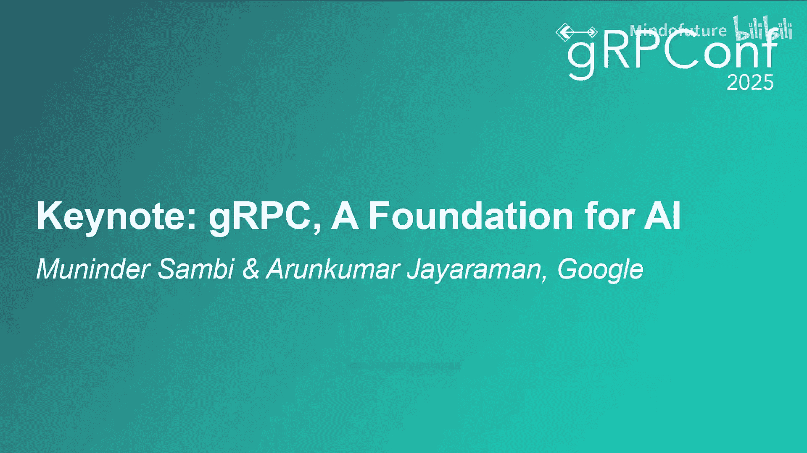
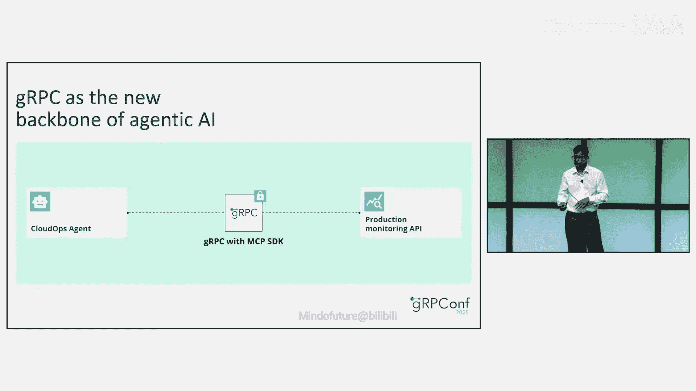
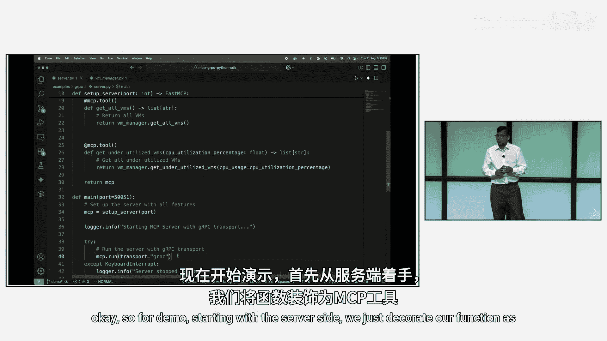
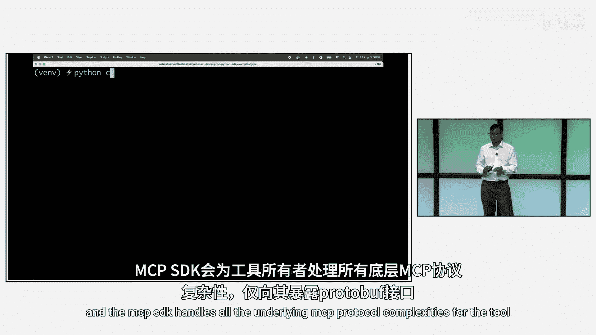
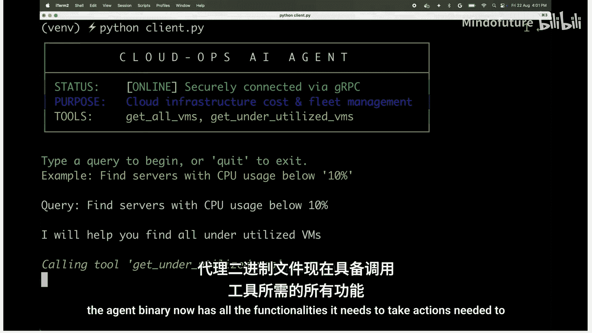
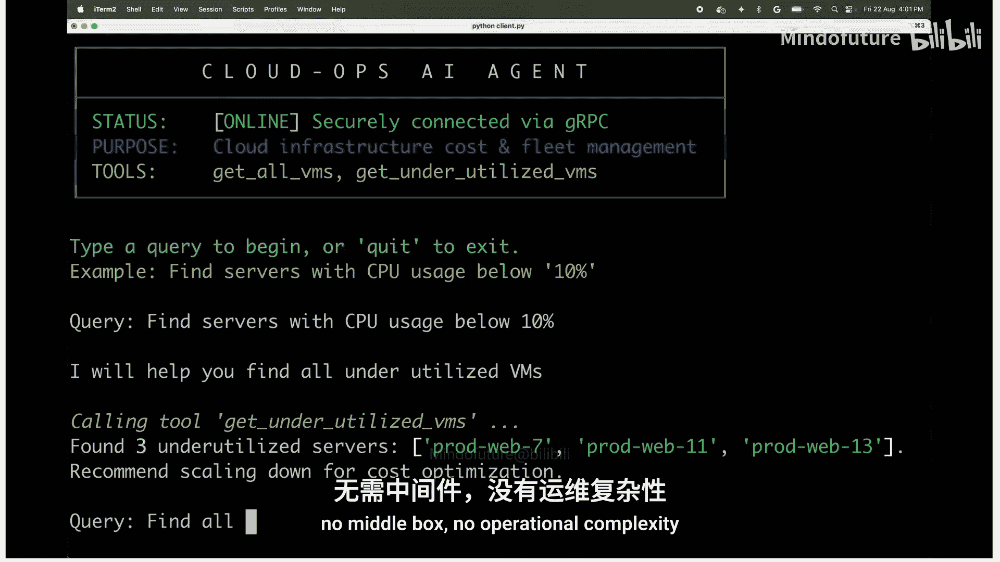
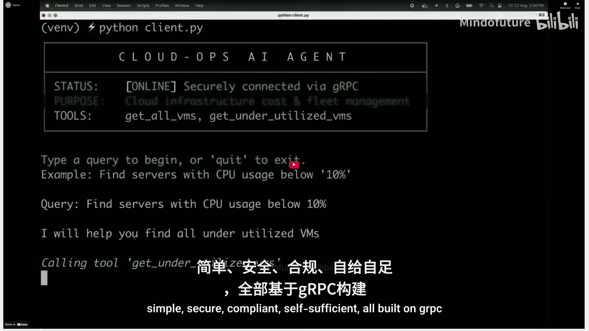
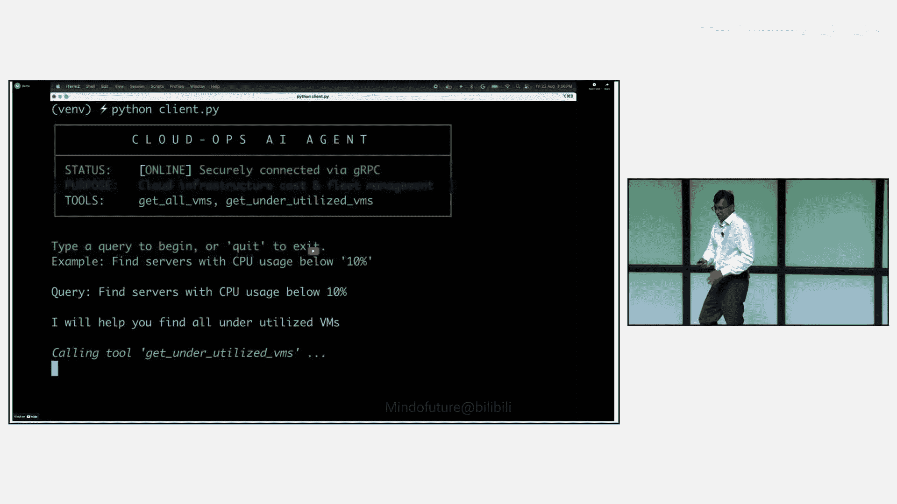

# 004：主题演讲

在本节课中，我们将探讨gRPC在人工智能时代的基础性作用。我们将回顾市场趋势，分析AI对网络基础设施提出的新要求，并介绍Google Cloud为支持AI训练与推理、保障安全以及赋能智能体（Agent）通信所推出的关键技术与创新。

## 市场趋势与AI时代的网络需求 🚀

首先，我们简要回顾过去25年的市场趋势。众所周知，我们经历了互联网时代，构建了大量基础设施、工作负载和电子商务，许多新公司应运而生。随后，我们进入了以YouTube和Netflix等为代表的流媒体时代，云计算也随之兴起。

如今，我们正处于第四个，也是数十年来最大的转折点。这意味着我们现有的网络和gRPC能力必须演进，不能与过去二十年完全相同。我们需要重新构想网络栈的未来面貌。

在AI训练和推理的背景下，我们需要一个高性能、低延迟的云基础设施，能够支持所有类型的模型，连接任何类型的智能体，并安全地接入任何模型或工具。

## 行业现状与挑战 ⚙️

接下来，我们具体看看行业从AI视角面临的现状与挑战。

以下是企业普遍观察到的情况：

*   **模型多样性**：约93%的财富500强公司已在同时使用多个模型。平均而言，这些企业针对不同工作负载会使用多达三个模型。这带来了复杂性，并可能导致GPU/TPU基础设施利用率不足和成本效率低下。
*   **数据量与工作负载转移**：我们看到因训练而产生的数据传输量达到PB级别。同时，几乎所有企业都在大力推动将其应用演进为生成式AI应用，这使得推理工作负载的重要性将远超训练。
*   **安全至关重要**：安全必须内建于我们所做的一切之中，不能是事后补救。在AI领域，我们已经看到关于大语言模型被轻易攻破、护栏被移除、模型被投毒、数据被窃取或恶意流量注入导致模型产生幻觉的新闻。例如，有报告显示，90%的提示词泄露数据都针对某个在年初发布的特定模型。

因此，企业必须确保数据受到保护，LLM模型、智能体、工具以及它们之间的通信都尽可能安全。

## Google Cloud的AI基础设施创新 🛠️

基于上述挑战，我们首先介绍过去几个月推出的关键能力。在与客户探讨AI时，他们通常围绕三大策略进行构建：

1.  **AI与云战略**：确定GPU部署位置，选择GPU供应商，标准化模型，并确定优先迁移到云端以利用并演进为生成式AI应用的工作负载。
2.  **数据管理战略**：如何以安全、高性能、低延迟的方式将PB级数据传输到GPU/TPU基础设施附近。
3.  **网络演进战略**：网络是确保企业能够迁移并利用云能力、AI能力以及模型基础设施和智能体的基础。

我们正是从这些方面着手。首先从数据摄取开始，让客户能更轻松简单地将数据移入云端。我们很高兴地宣布推出**400Gb Google Cloud Interconnect**，客户现在可以以4倍于以往的速度进行连接。这提供了更优的价格点，并能以高性能、低延迟的方式更快地移动更多数据。它是完全可靠、完全由SLA管理的。

第二大能力是支持GKE。众所周知，Kubernetes和GKE几乎是任何推理或生成式AI应用的事实标准。我们现在支持每个GPU集群高达**65000个节点**。不仅如此，我们还开发了**RDMA VPC**，能以低延迟、高性能、非阻塞的方式为GPU到GPU或TPU到TPU通信提供**每秒3.2TB**的带宽。这对我们至关重要。

最后，我们意识到生成式AI和AI/ML应用（包括训练和推理）的流量模式与传统的基于Web的应用截然不同。必须考虑KV缓存等指标以实现智能流量管理。为此，我们推出了**推理网关**。

## 深入推理网关与成本优化 💡

接下来，我们详细探讨推理网关，这对我们而言非常令人兴奋。我们是首家在云端提供与GKE架构原生集成的推理网关的厂商。它能将推理延迟降低**60%**，吞吐量提升**40%**。我们能做到这一点，是因为我们拥有来自GPU模型KV缓存的智能，能够优化流量管理，从而获得最佳体验。它支持任何类型的模型，如vLLM、NVIDIA TensorRT-LLM、JetStream等。所有这些都需要能够通过gRPC基础设施提供，这一点极其重要。

进入第二大支柱：成本优化。众所周知，GPU/TPU成本极高。网络能否通过提供支持来降低总体拥有成本？我们团队应对的挑战之一是，能够基于基础设施上单个或多个模型的GPU利用率来提供智能流量管理。我们相信这可以将您的总体拥有成本降低约**30%**。这不仅指网络成本，而是包括占主导地位的GPU/TPU或AI基础设施投资在内的整体物料成本。

## 安全集成与智能体通信演进 🔒

上一节我们讨论了成本，现在谈谈安全，这对我们至关重要。我们见过诸如提示词注入攻击、训练数据投毒、模型窃取、敏感数据泄露等攻击。通过推理网关，我们现在集成了业界领先的安全设备，可以是您选择的ISV供应商（如Palo Alto Networks的AI防火墙），也可以是我们原生的Model Armor。这为您提供了灵活性，确保您的安全控制、SecOps团队对将工作负载迁移到云端充满信心，并确保它们符合安全团队的监管要求。

但我们不会止步于此，因为挑战仍在继续。模型只是我们AI旅程的一部分。客户端或智能体访问模型，也只是智能体AI拼图的一环。传统上，我们会为每个API构建自定义连接器。但这种方法效率低下且无法扩展。想象一下模型和工具的数量，如果每个都构建专属API，您将永远无法进入生成式AI时代。

这就是Anthropic宣布的统一协议——**模型上下文协议**的重要性所在。它允许每个API生产者暴露一个MCP服务器。这使得任何AI智能体都能统一访问工具或数据，简化部署，保持一致性，并实现快速采用。您无需担心创建专属API，可以依赖MCP这一单一基础设施。

最后，未来将会有大量智能体。它们可能由企业内部开发，也可能由外部提供，甚至可能由LLM模型按需生成和删除代理代码。我们希望构建一个能够一致、全面地支持所有这三种情况的基础设施，并以标准化的方式提供支持。这正是Google开创**A2A**（智能体到智能体通信）的原因，我们已经看到许多企业开始采纳和验证它。

## 未来愿景与核心挑战 🎯

综上所述，我们的愿景是让模型、智能体和工具无处不在，无论它们是在本地、Google Cloud还是其他云中，都能安全地连接到您的开发人员和公共基础设施，并在此过程中提供治理和安全保障。

然而，实现这一战略也带来了诸多挑战。以下是我们认为的核心挑战：

*   **挑战一：协议支持**：生成式AI希望利用gRPC工具和数据源来加速开发速度。但MCP协议目前不支持gRPC。
*   **挑战二：运行时支持**：无服务器Kubernetes（如GKE或原生Kubernetes）将成为智能体开发者的首选平台。但目前，我们在无服务器运行时以及智能体SDK上缺乏gRPC支持。
*   **挑战三：新型威胁与安全集成**：生成式AI将引入新的威胁向量。智能体需要访问其他智能体、工具或LLM模型，并且您希望能在任何地方、通过您首选的安全供应商来实现。传统的安全设备（在链路中或云中插入代理以重定向流量）非常复杂，且可能在成本、性能甚至安全方面并非最优。

## 宣布的创新解决方案 🚀

针对这些挑战，我们宣布了三项创新：

1.  **启用gRPC作为A2A和MCP的原生传输协议**：您现有的、连接到传统应用的所有gRPC数据源和工具，在演进到生成式AI基础设施或应用时，可以使用相同的传输协议。
2.  **以安全为核心，扩展服务扩展能力**：我们投资了一项名为“服务扩展”的技术，提供数据平面可编程性。现在，我们对其进行扩展，您既可以使用Google原生的Model Armor来保护您的LLM和智能体，也可以引入第三方解决方案（如Palo Alto Networks的AI防火墙、NVIDIA的解决方案等）。
3.  **在Google所有计算运行时上支持gRPC**：包括Cloud Run。这样，您开发的所有智能体SDK都能自动扩展，并可用于这个新的智能体世界。

我们对这些创新感到非常兴奋。当我们将这些创新推向预览版时，非常希望获得大家的反馈。今天实现的许多功能，都得益于在座各位的反馈。我们投入了大量精力，以确保gRPC能够延续您过去的使用体验，并适用于下一代应用。

## 演示：gRPC作为MCP的传输协议 💻

接下来，我们通过一个演示来具体展示。演示将展示gRPC作为MCP传输选项的进展（目前尚未发布）。我们以一个典型云环境中的用例为例：一个云运维智能体需要安全地访问监控工具。传统上，这需要在智能体和工具之间部署代理来执行各种功能。

但gRPC改变了这一点。我们通过将gRPC集成为MCP的传输协议，并部署gRPC智能体网格进行集中运营控制，将这些由代理提供的功能直接移入智能体二进制文件中。

演示从服务器端开始。我们只需将我们的函数装饰为一个MCP工具，MCP SDK会为工具所有者处理所有底层的MCP协议复杂性，为他们提供一个生产就绪的接口。

现在，看一个用户查询的实际例子。我们给智能体一个自然语言查询：“查找利用率不足的VM”。智能体和LLM理解请求并调用正确的工具。作为MCP SDK一部分的gRPC核心，随后负责提供安全的TLS连接到工具，将所有复杂性从智能体所有者处卸载。智能体二进制文件现在拥有了调用工具所需的所有功能，无需中间盒，没有运营复杂性。

这就是智能体代理基础设施的承诺：简单、安全、合规、自给自足，全部构建在gRPC之上。

## 总结 📝

本节课中，我们一起学习了gRPC在AI时代的基础角色演变。我们探讨了市场向AI的转型对网络基础设施提出的高性能、低延迟和安全需求。重点介绍了Google Cloud推出的400Gb互联、RDMA VPC、推理网关等创新，以优化AI训练与推理。我们深入分析了智能体通信的演进，以及MCP和A2A协议的重要性。最后，我们了解了为应对协议支持、运行时集成和安全挑战而宣布的三项关键创新：将gRPC作为A2A/MCP原生传输、通过服务扩展增强安全、以及在全平台运行时支持gRPC。这些努力旨在确保gRPC继续作为连接传统应用与下一代生成式AI应用的坚实桥梁。