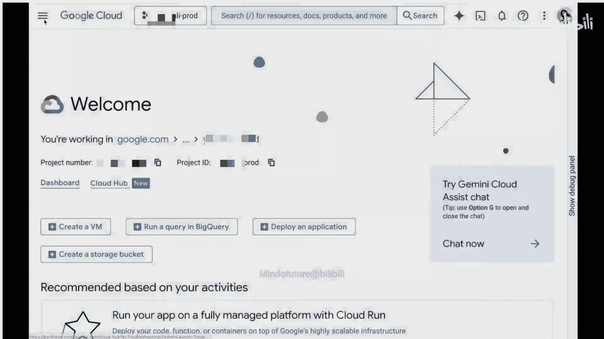
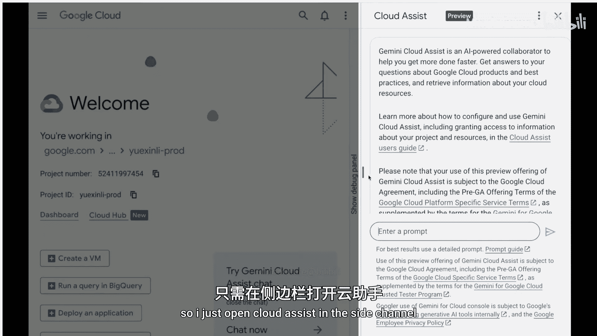
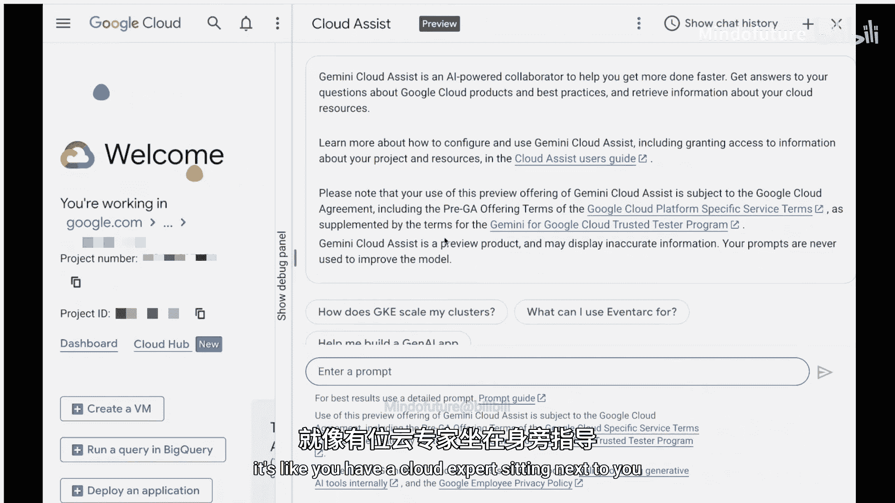
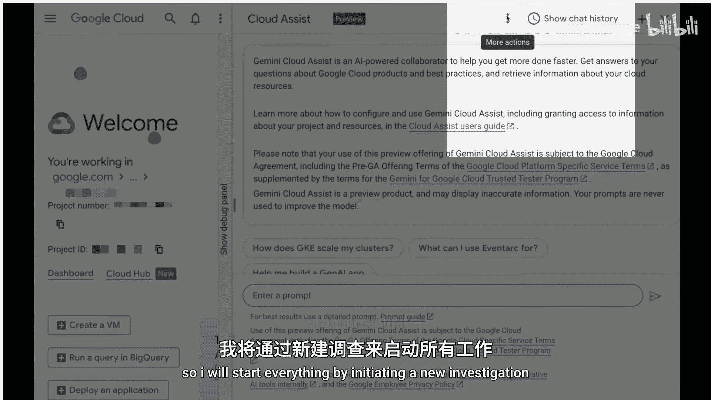
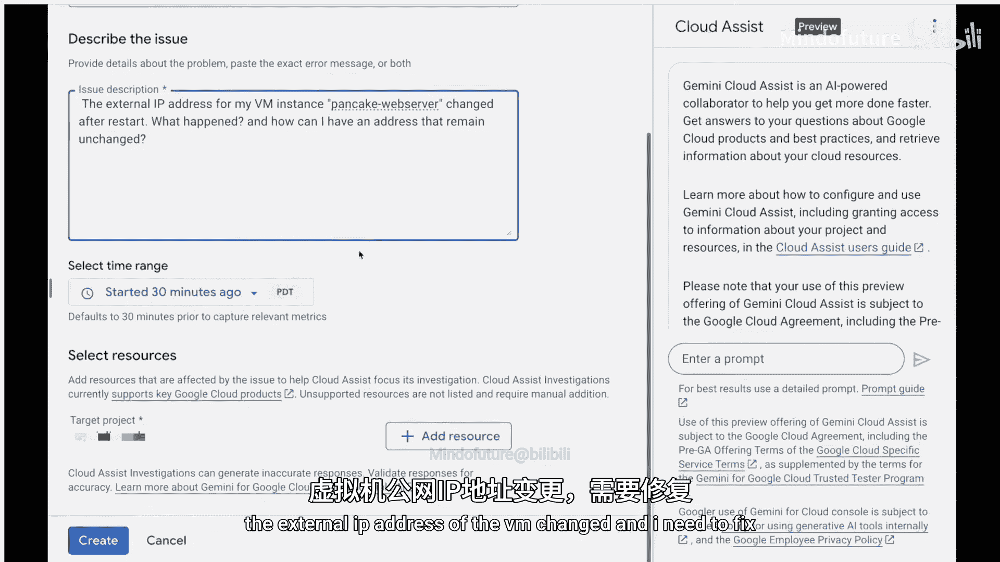
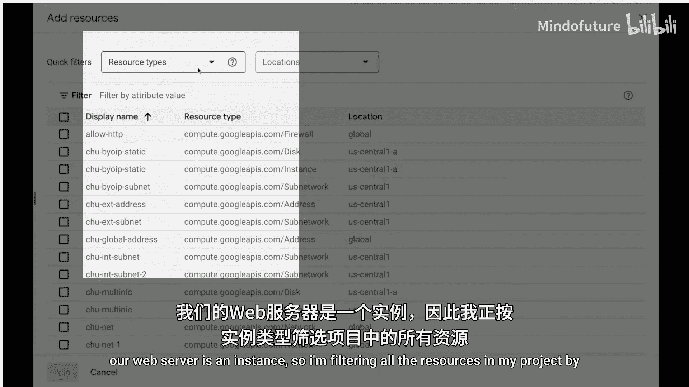
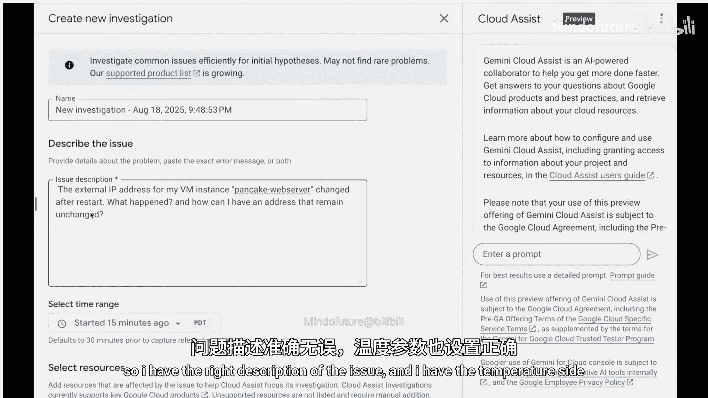
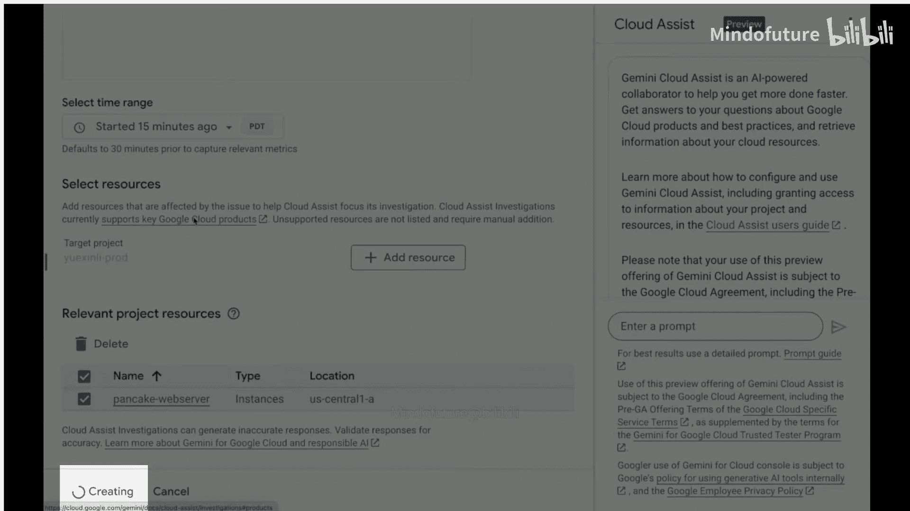

# 005：使用 Gemini Cloud Assist 解决 VM 外部 IP 地址变更问题 🐕🔧

在本节课中，我们将学习如何利用 Google Cloud 平台上的 Gemini Cloud Assist 工具，快速诊断并解决一个虚拟机（VM）实例重启后外部 IP 地址意外变更的故障。我们将跟随一位开发者的真实经历，了解从发现问题到使用 AI 辅助工具定位并修复问题的完整流程。


几天前，我帮助我的朋友 Cassie，一位才华横溢的时装设计师，将她的品牌“Pancake”（一只金毛寻回犬，也是 GRP 的吉祥物）的业务拓展到线上。我们使用 Gemini 编写了网站代码，并将服务部署在 Google Cloud 的虚拟机实例上。在重要的劳动节促销活动开始前，我们及时完成了所有设置。

然而，Cassie 打来电话告知网站无法访问。劳动节促销即将开始，情况紧急。我立即着手检查网站，发现了两个关键现象：第一，VM 网络服务器在昨晚为了应用更新而重启；第二，重启后，VM 的外部 IP 地址发生了改变。我们的任务很明确：修复网站，保留 IP 地址，并确保未来的更新不会再次引发此问题。

## 启动调查

对于大多数云用户来说，面对此类突发事件，有时就像在解决一个拥有百万碎片的拼图，不知从何入手。但如今，我们有了 Gemini Cloud Assist。打开 Cloud Console 中的 Cloud Assist 面板，就像有一位云专家坐在你身边。

我通过发起一项新的调查来开始工作。在调查描述中，我粘贴了之前的观察：“虚拟机的外部 IP 地址变更，需要修复。” 同时，我将时间范围设置为大约 50 分钟前，并将我们的 Web 服务器 VM 实例附加到此调查中。

## AI 分析与诊断













创建调查后，Gemini 开始在后台为我们进行全面的分析。它首先为问题描述创建一个高维空间中的嵌入向量，这代表了对问题和用户意图的理解。基于此，它开始获取与当前情境最相关的信息，包括事件前后 VM 配置的差异、过去 15 分钟内的审计日志，并交叉参考公共文档和 Google 工程师的领域知识。

很快，Gemini 给出了清晰的诊断结果：我们使用的是临时性的**临时外部 IP 地址**。这意味着每次 VM 实例停止后启动，该地址都会改变。解决方案是创建一个**静态外部 IP 地址**并将其分配给我们的 VM 实例。

## 执行修复

更棒的是，Gemini 甚至直接提供了我们需要运行的精确 `gcloud` 命令，并且自动填充了我们创建的 VM 实例名称。我只需复制并粘贴该命令到 Cloud Shell 中执行即可。





命令类似于：
```bash
gcloud compute addresses create [STATIC_IP_NAME] --region=[REGION]
gcloud compute instances delete-access-config [INSTANCE_NAME] --access-config-name="external-nat"
gcloud compute instances add-access-config [INSTANCE_NAME] --access-config-name="external-nat" --address=[STATIC_IP_ADDRESS]
```

执行完成后，网站立即恢复了访问。


## 总结与展望

本节课中，我们一起学习了如何使用 Gemini Cloud Assist 将可能耗时数小时的故障排除过程缩短至几分钟。通过一个真实的 VM 外部 IP 地址变更案例，我们体验了从描述问题、附加资源到获取 AI 驱动的诊断和具体修复方案的完整流程。


Gemini Cloud Assist 目前处于公开预览阶段，它能极大地提升您在 Google Cloud 平台上的开发和运维效率。正如演示所示，借助 AI 的力量，解决问题的时间甚至可以比制作一个煎饼还要短。我们鼓励每位开发者尝试并利用这一强大工具来优化您的工作流。