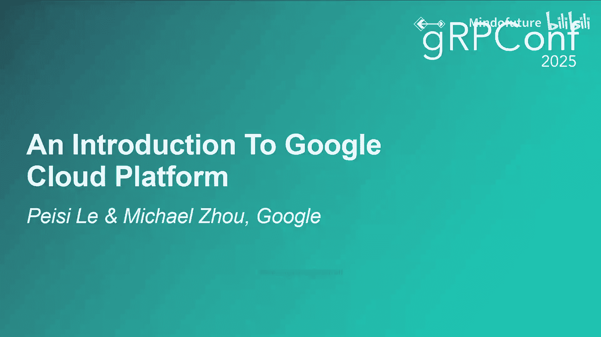
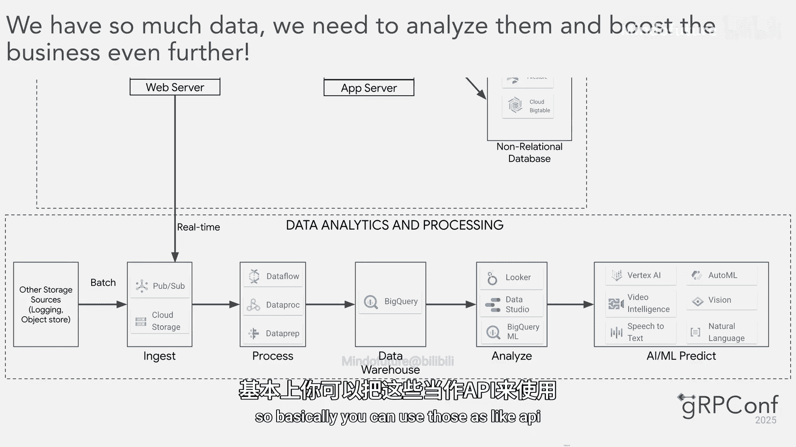

# 006：从车库到云端，构建 Jshu 电商平台

在本节课中，我们将通过一个虚构的创业故事，学习如何使用 Google Cloud Platform (GCP) 构建一个可扩展的电商应用。我们将跟随两位前谷歌工程师 Pay 和 Michael，看他们如何将初创公司 Jshu 从家庭车库迁移到云端，并利用 GCP 的各项服务处理数据与人工智能。

## 概述：从车库创业开始

故事始于 2026 年，Pay 和 Michael 决定从谷歌退休，创立一家名为 Jshu 的在线鞋店。作为软件工程师，他们的第一反应是从技术栈开始，但创业的第一步其实是找到一个办公地点。他们决定效仿谷歌的创始人，从自家车库开始。

## 初始架构：车库里的服务器

以下是他们构建的最初技术架构：

*   **计算资源**：他们购买主板、内存和 CPU，组装成几台大型服务器。一台用作 **Web 服务器**，另一台用作处理认证、库存和支付等任务的**应用服务器**。
*   **数据库**：他们准备了两种数据库。**关系型数据库**用于存储用户资料、交易记录和会员订阅等事务性数据。**非关系型数据库**用于存储文章和产品目录等。
*   **前端与域名**：借助代码助手，他们轻松构建了前端界面。并成功注册了域名 `Jshu.com`，通过 DNS 服务器将域名解析到车库中 Web 服务器的 IP 地址。

几周后，应用成功上线。然而，随着业务增长，流量激增，用户开始遇到错误页面，系统遇到了扩展性瓶颈。

## 第一次扩展：应对流量增长

为了解决流量问题，他们考虑了两种扩展方式：
1.  **纵向扩展**：为现有服务器购买更多 CPU 和内存，放入更大的机箱。
2.  **横向扩展**：购买额外的 Web 服务器和应用服务器。

纵向扩展存在物理极限，因此对于大流量场景，**横向扩展**通常是首选方案。

新的架构引入了几个核心组件：

*   **负载均衡器**：由于现在有多台 Web 服务器，需要一个**负载均衡器**位于其前方。它拥有一个单一的 IP 地址，接收所有用户流量，并根据预定义的算法（如轮询或最少连接）将流量分发到后端的多台 Web 服务器。公式可以简化为：
    `用户请求 -> 负载均衡器(单一IP) -> 算法分发 -> [Web服务器1, Web服务器2, ...]`
*   **内部负载均衡**：应用服务器层同样需要负载均衡，但这属于内部网络流量，无需暴露在公网。
*   **缓存层**：为了减轻关系型数据库的压力并降低查询延迟，他们增加了**内存缓存层**，用于缓存频繁访问的查询结果。

尽管新架构性能大幅提升，但新的问题出现了：房东朋友开始抱怨电费飙升和机器噪音。这促使他们迈出关键一步——将整个系统迁移到云端。

## 迁移到 Google Cloud Platform

作为前云工程师，他们自然选择了 Google Cloud Platform。在 GCP 中构建应用，第一步是创建一个**虚拟私有云**，它为所有云资源提供托管的网络功能。

### 计算服务选择

对于 Web 和应用服务器（计算基础设施），GCP 提供了多种选项，选择取决于团队规模和对控制的偏好。

以下是主要的计算选项：

*   **Cloud Run / App Engine**：**无服务器**选项。适合小型团队，无需管理基础设施，可自动扩展。`Cloud Run` 支持运行无服务器容器，处理 Web 流量、WebSocket 和 gRPC。
*   **Google Kubernetes Engine**：如果需要更多配置灵活性来运行容器化应用，**GKE** 是理想选择。它帮助用户基于 Kubernetes 部署应用，同时允许用户控制底层节点的配置。
*   **Compute Engine**：提供**最大控制权**的选项，即纯粹的虚拟机。用户可以自定义 CPU、内存等配置，但也需自行负责扩展、管理和维护。

### 网络与负载均衡

在云端，他们使用 **Cloud Load Balancing**。这是一个完全分布式、软件定义的负载均衡系统，每秒可处理超过百万次查询。它基于 **Anycast IP** 技术，意味着可以为全球用户提供一个单一的 IP 地址，并将请求路由到离用户最近的服务器，从而实现低延迟和高可用性。同样，GCP 也提供**内部负载均衡**用于内部服务。

### 数据库服务选择

GCP 为不同类型的数据提供了全托管的数据库服务。

以下是数据库选项：

*   **关系型数据库**：
    *   **Cloud SQL**：适用于通用 SQL 需求（如 MySQL， PostgreSQL），完全托管。
    *   **Cloud Spanner**：适用于需要**大规模水平扩展**且保持**强一致性**的关系型数据库，完美支持高并发事务。
*   **非关系型数据库**：
    *   **Firestore**：**无服务器文档数据库**，易于设置，实时响应复杂查询，支持离线数据同步，非常适合移动、Web 和游戏应用。
    *   **Cloud Bigtable**：一个高性能的 **宽列 NoSQL** 数据库，支持海量读写和极低延迟，非常适合 IoT 设备数据、时间序列数据和个性化推荐。
*   **缓存服务**：他们使用 **Cloud Memorystore**，这是一个全托管的 Redis 和 Memcached 服务。它省去了配置、复制和修补的复杂工作，提供极低的延迟和高性能，适用于会话存储、实时排行榜等场景。

### 域名解析

最后，他们使用 **Cloud DNS** 作为 DNS 解析服务。Cloud DNS 基于谷歌的全球网络提供高容量、权威的 DNS 解析服务，提供 100% 的服务可用性，通过遍布全球的冗余位置确保高可用性和低延迟。

至此，Jshu 的应用完全运行在 Google Cloud 上，具备了服务全球数亿用户的能力。但故事并未结束，海量用户意味着海量数据，下一步是利用这些数据进行分析和人工智能预测。

## 数据处理与分析

随着 Jshu 用户量的增长，产生了大量数据。Michael 接下来介绍了如何利用 GCP 进行数据处理和分析，从原始数据一直推导出 AI 驱动的预测。

### 数据摄取

第一步是将数据导入云端。GCP 处理两种主要类型的数据：

*   **批量数据**：对于来自日志文件或其他对象存储的离线数据，使用 **Cloud Storage** 作为可扩展、持久的数据着陆区。
*   **实时数据**：对于来自 Web 或应用服务器的流式数据，使用 **Pub/Sub**。这是一个无服务器消息服务，每秒可轻松摄取数百万事件，非常适合流式数据。

### 数据处理

数据摄取后，需要进行处理（如清洗、转换、丰富），以便分析。GCP 提供了多种处理选项：

*   **Dataflow**：基于 Apache Beam 框架，可用于**统一处理批数据和流数据**。用户只需编写一次处理逻辑，即可部署到多种运行引擎。
*   **Dataproc**：如果团队已在使用 Hadoop 或 Spark 生态系统，**Dataproc** 是最佳选择。它是一个托管的 Hadoop/Spark 服务，让用户专注于任务而非集群管理。
*   **Dataprep**：对于偏好无代码方式的团队，**Dataprep** 提供了基于 UI 的数据转换工具。

### 数据存储与分析

处理后的数据存储在哪里？他们使用 **BigQuery**。BigQuery 是一个完全无服务器的企业数据仓库，可处理 PB 级数据，运行标准 SQL 查询。它同时充当长期数据湖和分析引擎。

有了 BigQuery 中的数据仓库，就可以开始获取洞察：
*   可以连接 **Looker** 或 **Data Studio** 等工具，直接基于 BigQuery 构建强大的交互式仪表板。
*   BigQuery 本身通过 **BigQuery ML** 提供了内置的机器学习能力，允许用户直接使用 SQL 语句在数据仓库内创建和运行机器学习模型进行预测。
*   BigQuery 团队还在尝试利用自然语言 API，让用户能够用自然语言生成 SQL 语句，进一步简化使用。

## 高级机器学习与 Vertex AI

最令人兴奋的部分是高级机器学习，其核心是 **Vertex AI**。Vertex AI 是谷歌统一的人工智能平台，可以把它想象成一个超级充电的工作坊，能够利用 BigQuery 中的数据构建真正令人惊叹的应用。

Vertex AI 提供了一系列选项：

*   **预训练模型**：对于许多常见任务，可以直接使用谷歌强大的预训练模型，例如支持文本、图像、音频、视频等多种输入的多模态模型 **Gemini**。此外，还有专注于特定领域的模型，如用于徽标检测、人脸识别的 **Vision AI**，以及 **Speech-to-Text** 和 **Text-to-Speech**。
*   **AutoML**：就像为你雇佣了一位博士。你只需上传自己的数据集，**AutoML** 会自动为你寻找最佳的模型架构，无需深厚的机器学习专业知识。
*   **自定义模型训练**：对于拥有数据科学家或机器学习工程师的专业团队，Vertex AI 提供了完整的环境，可以使用 PyTorch、TensorFlow 等框架构建和训练自己的模型，并轻松部署到生产环境。

Vertex AI 还有其他值得注意的功能：

*   **Model Garden**：就像 AI 模型的“应用商店”，汇集了来自谷歌和其他领先公司的超过 200 个模型，可以浏览、测试并一键部署。
*   **Agent Builder**：一个创新的工具，允许用户以低代码/无代码方式创建复杂的智能体和聊天机器人，这些智能体可以自动化任务、回答复杂问题。
*   **MLOps 工具**：包括用于自动化机器学习工作流的 **Vertex AI Pipelines**，用于集中管理模型版本的 **Model Registry**，以及确保生产环境模型性能的 **Model Monitoring**。

当然，还必须提到最先进的硬件 **TPU**，它能够以极高的成本效益和可扩展性部署和运行模型。

借助 Vertex AI，我们不仅仅是在进行预测，更是在构建能够以几年前科幻小说中的方式看、听、说和理解世界的智能应用。

## 总结

本节课中，我们一起学习了如何利用 Google Cloud Platform 构建和扩展一个完整的应用。我们从车库创业的简单架构开始，经历了应对流量增长的横向扩展，最终将整个系统迁移到云端。我们探讨了 GCP 的核心服务，包括计算选项（如 Cloud Run, GKE）、网络服务（如 Cloud Load Balancing）、数据库（如 Cloud SQL, Firestore, BigQuery）以及缓存服务（Cloud Memorystore）。随后，我们深入了解了如何利用 GCP 进行数据处理、分析，并最终通过强大的 Vertex AI 平台集成高级机器学习能力，从数据中获取洞察并构建智能应用。这个故事展示了 GCP 如何为从初创公司到大型企业的各种场景提供全面、可扩展且强大的云解决方案。