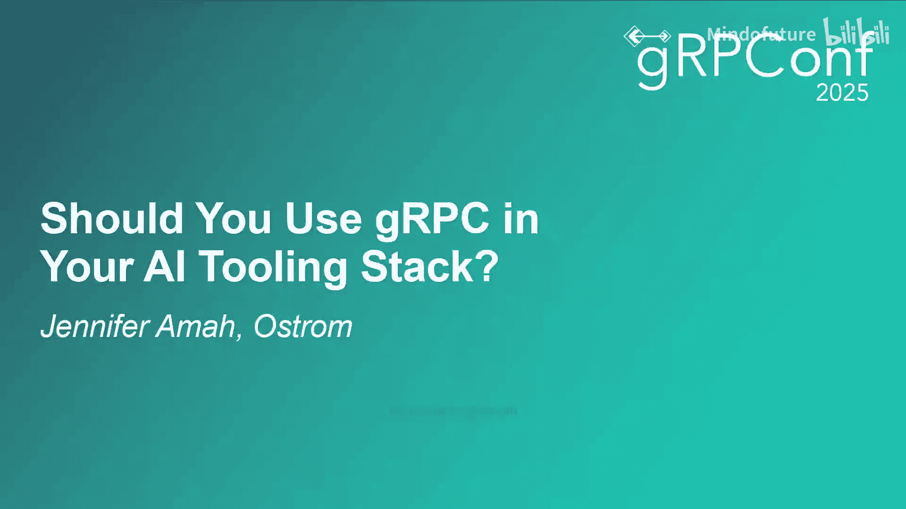
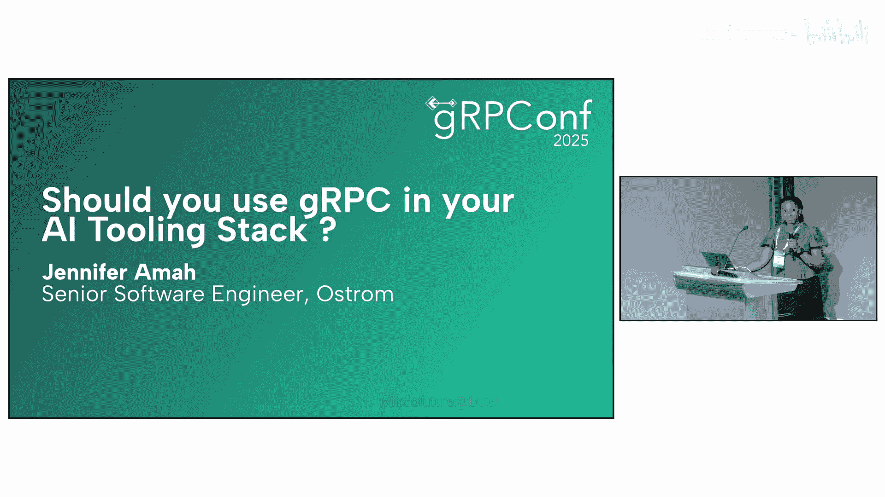
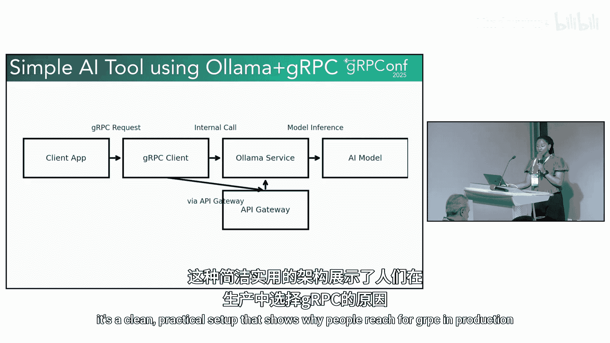
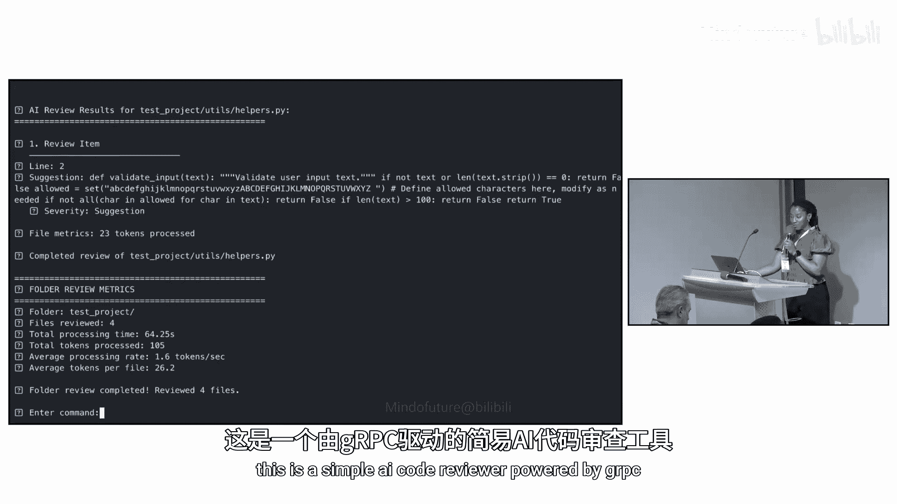
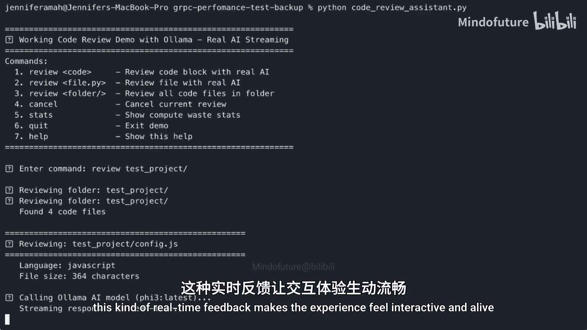
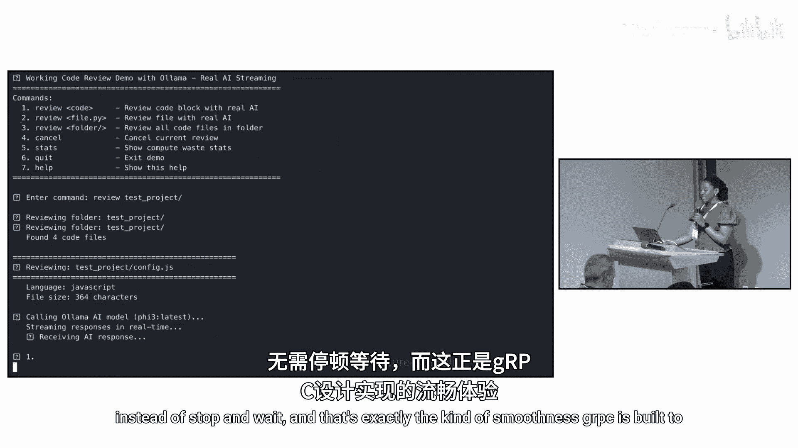
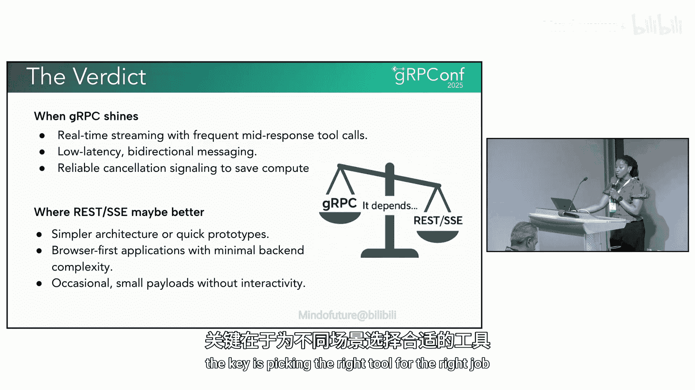
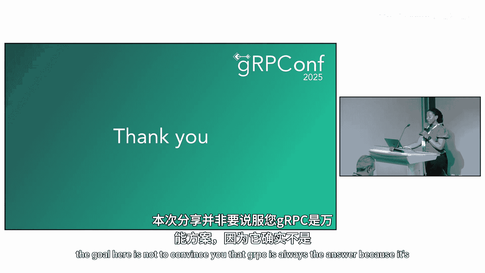
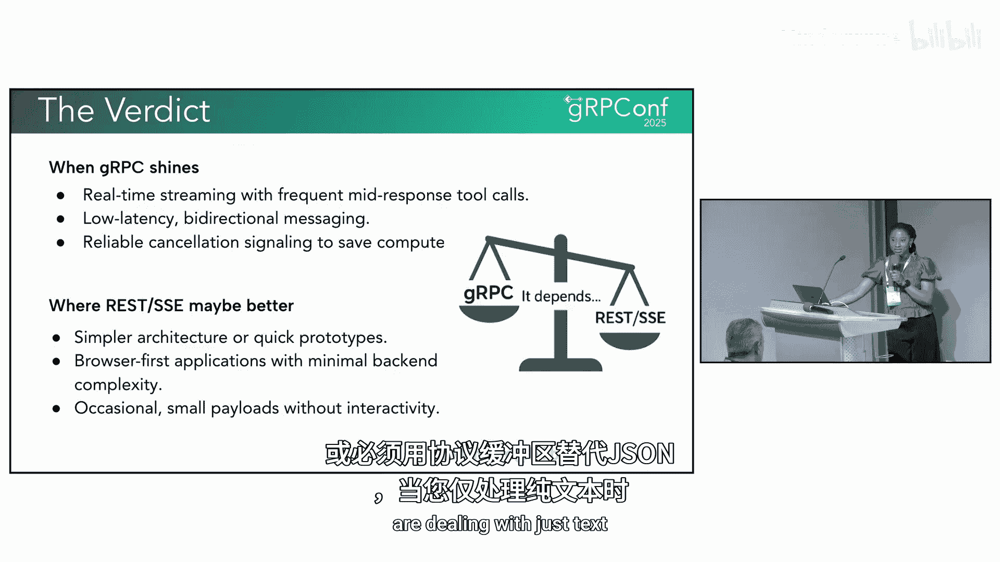

# 008：是否应该使用gRPC？ 🚀

## 概述
在本节课中，我们将探讨在构建AI工具栈时，是否应该采用gRPC作为通信框架。我们将了解gRPC的核心概念、它如何解决AI应用中的性能痛点、其带来的权衡，以及它最适合的应用场景。

---

## 什么是gRPC？ 🤔

上一节我们介绍了课程主题，本节中我们来看看gRPC究竟是什么。

gRPC本质上是一个让服务之间相互通信的框架。但其实现方式使其速度非常快。它不使用JSON，而是使用**协议缓冲区**，后者更小、更高效。因为它基于**HTTP/2**构建，所以你能获得双向流和多路复用等特性。

一个简单的比喻是：REST就像通过邮件寄信，一次请求，一次回复。而gRPC就像在进行实时通话，双方可以同时说和听。

**核心概念公式/代码描述：**
*   **协议缓冲区 (Protocol Buffers):** 一种比JSON更高效的序列化数据格式。
*   **HTTP/2:** 支持多路复用和双向流的网络协议。

---

## gRPC对AI为何重要？ ⚡

随着AI从研究走向产品，用户的期望发生了变化。人们不希望等待，他们希望答案能即时地以流式方式生成。这正是gRPC的用武之地：它速度快，流式处理能力强，并且能跨多个核心扩展。

因此，gRPC已成为大规模服务AI模型的热门工具。下图展示了gRPC在AI模型和并发调用数量增加时，仍能保持恒定、低延迟的性能，这使其非常适合实时AI工作负载。

---

## AI工具栈中的常见痛点 🐌

当我们剖析任何一个AI工具时，通常会经历以下几个阶段：
1.  用户发送输入（文本、语音、图像）。
2.  模型处理输入并生成响应。
3.  有时需要调用外部API或数据库以获取额外信息。
4.  同时，以流式方式将资源返回给用户，让他们看到实时进度。
5.  最后，用户可能给出反馈甚至中途取消。

以下是每个阶段可能遇到的痛点：
*   **冷启动延迟：** 第一个请求耗时极长，因为模型需要启动。
*   **令牌生成延迟：** 模型生成文本的速度很慢，用户缺乏耐心。
*   **中间调用响应迟缓：** 中断AI去调用API会导致响应迟钝，破坏对话流畅性。
*   **流式传输不可靠：** 用户可能面对一个冻结的屏幕。
*   **取消操作无效：** 用户取消后，系统仍在消耗计算资源，浪费金钱。

如果你曾感觉某个AI工具反应迟钝，很可能就是上述问题之一导致的。

---

## gRPC提供的解决方案 🛠️

针对上述痛点，gRPC提供了一系列可能的解决方案。

以下是具体的解决方案列表：
*   **预热启动：** 预先启动模型，避免第一个请求像等待水烧开一样漫长。
*   **高效令牌流：** 每个令牌一旦准备就绪就立即发送，使响应感觉更快。
*   **双向工具调用：** 无需中断AI来发起API调用，可以在同一通道上处理，避免往返延迟。
*   **即时取消：** 用户停止的瞬间，系统实际停止工作。

这些不是抽象概念，它们决定了AI演示是笨拙难用，还是成为人们乐于使用的产品。

---

## gRPC的关键优势场景 🎯

在AI交互中，有两个关键时刻性能至关重要。

**第一个是AI需要在响应过程中调用外部工具。** 即使是很小的延迟也会让对话感觉中断。使用gRPC，你可以获得单一的双向流，因此响应可以即时返回，无需等待建立全新的连接。

**第二个是取消操作。** 当用户决定停止时，你希望一切立即关闭。否则，你就在浪费计算时间和资金。gRPC内置了快速可靠的取消支持。

仅这两点就能完全改变用户体验，尤其是在大规模场景下。

---

## 实践示例：AI代码审查 ✨

这是一个由gRPC驱动的简单AI代码审查工具示例。

请注意，反馈并非在最后一次性全部出现，而是建议在生成过程中就以流式方式传入。这意味着当模型仍在“思考”时，用户已经能看到关于其代码的有用提示。这种实时反馈使体验感觉是交互式和生动的，而非“停止-等待”模式。

这正是gRPC旨在交付的那种流畅体验。

---

## gRPC的权衡与不足 ⚖️

但是，我们必须现实一点。gRPC并非完美无缺。

设置gRPC需要更多工作。你需要定义协议缓冲区、生成调用代码以及额外的工具链，这对于小团队或快速原型来说可能负担较重。浏览器并不原生支持gRPC，因此如果你的产品重度依赖浏览器，你需要一个gRPC Web代理，这增加了系统的复杂性。

与普通的HTTP相比，调试也更困难。消息不是人类可读的，因此你需要外部工具来查看。坦白说，如果你的工具栈只偶尔发出JSON请求，gRPC可能就大材小用了。

---

## 何时使用gRPC？ 📈

那么，何时使用gRPC才有意义呢？

当你的应用需要**实时流式传输响应**、进行**频繁的中间响应调用**，以及要求**取消操作立即生效**时，gRPC绝对会大放异彩。这是它的最佳应用场景。

另一方面，如果你正在构建更简单的东西，比如一个原型、一个浏览器优先的应用，或者一个只偶尔进行轻量级调用的系统，REST通常是更好的选择。

这不一定非此即彼。你可以混合使用两者。在简单的地方使用REST，在性能真正重要的地方引入gRPC。关键在于为正确的工作选择正确的工具。

---

## 总结

本节课中，我们一起学习了gRPC在AI工具栈中的应用。我们了解到，gRPC通过其高效的协议缓冲区和HTTP/2基础，为AI应用提供了低延迟、双向流和可靠的取消机制，特别适合需要实时交互和高性能的场景。

然而，它也存在设置复杂、浏览器支持需要代理等权衡。最终，决策不应基于gRPC是否是“默认答案”，而应基于它是否能在你的特定场景中带来切实的回报——尤其是在处理实时流、频繁中间调用和即时取消需求时。希望本教程能为你提供一个清晰的评估框架。