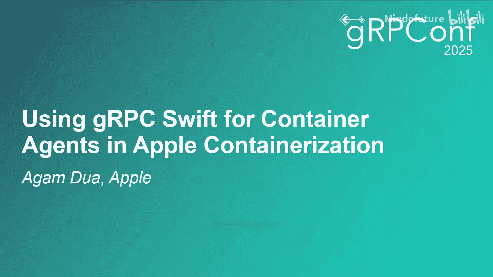
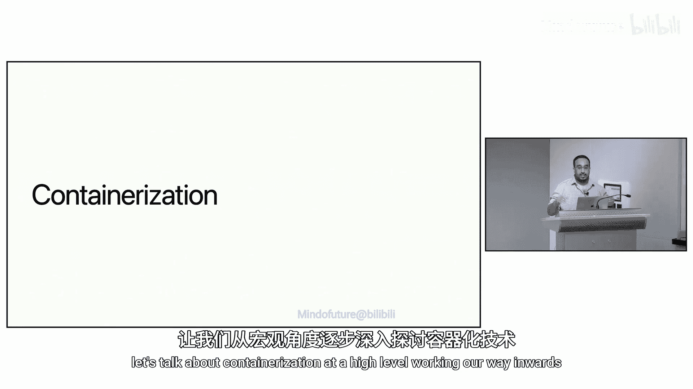
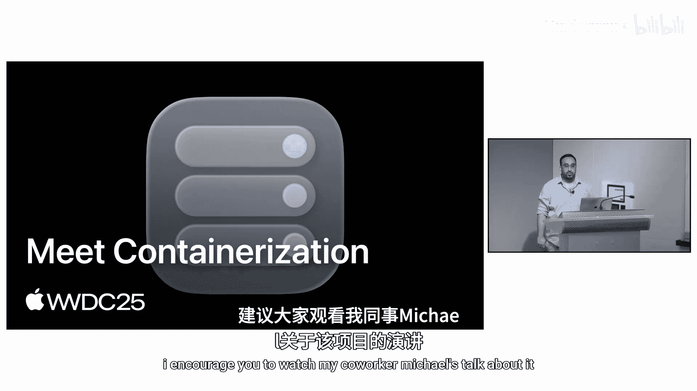
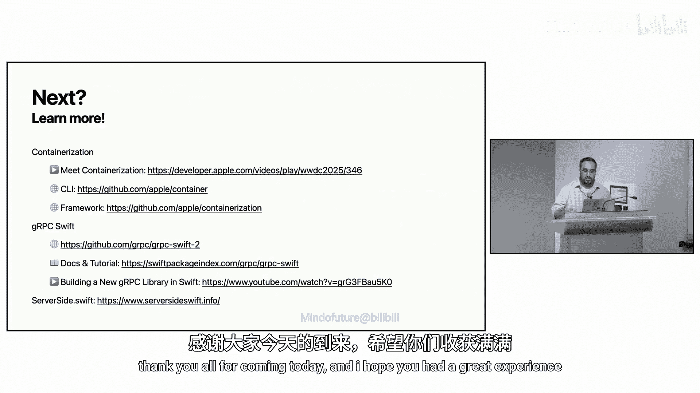

# 009：在Apple容器化中使用gRPC Swift实现容器代理

在本节课中，我们将学习Apple容器化框架如何利用gRPC Swift来实现容器代理（VMinitd），以协调和管理容器启动时的运行时配置。我们将从容器化的高层概念入手，逐步深入到gRPC通信的具体实现。

---

## 概述：容器化与轻量级虚拟机

我的名字是Aga，是Apple Swift服务器团队的一名软件工程师。过去几年，我参与了容器化项目和一个Swift NTP库的开发工作，它们都可以在GitHub.com/apple找到。今天，我们将探讨如何在容器化框架中使用gRPC Swift。

每次使用容器化框架启动一个容器时，例如运行 `container run hello-world`，我们都会启动一个gRPC服务器。这个服务器帮助我们协调启动容器所需的所有运行时配置，这正是我们今天要深入探讨的内容。

我们将讨论容器化框架帮助我们实现了什么，以及我们如何使用一个在容器化容器中运行的、带有gRPC服务器的代理来协调运行时配置。这是一个成功的案例。最后，我们将总结在Swift和gRPC中使用这一技术的体验。

---

## 容器化架构概览

为了理解我们的gRPC服务器如何作为容器代理工作，让我们从高层开始，逐步深入探讨容器化。

我们在今年的WWDC上发布了容器化项目，我鼓励你观看我的同事Michael关于此的演讲。

我们也在GitHub上将其开源，如果你有兴趣，我们非常欢迎贡献。

那么，这个项目是做什么的呢？容器化使应用程序能够使用Linux容器。我们实现方式的一个独特之处在于，每个容器都表现为一个轻量级虚拟机，这提供了有助于安全和隐私的隔离优势。

---

## 理解容器与轻量级虚拟机

现在，让我们进一步解析什么是容器，并在此过程中更深入地理解“作为轻量级虚拟机的容器”这一概念。这将帮助我们构建起用于将虚拟机配置为实际容器的gRPC服务器。

退一步看，什么是容器？让我们以一个服务器端应用程序为例。容器是运行一组打包应用程序的单一单元，这可能是一个Linux服务器端应用程序及其依赖项。通常，这些被打包成一个单一的镜像，你可以用正确的工具指定运行它。

例如，如果服务器端应用程序叫做“Hello World”，它被构建为一个二进制文件，并且需要安装一些操作系统依赖项，那么该应用程序及其依赖项就可以被打包到那个镜像中。

一旦我有了Hello World的镜像，我就可以确保在我的MacBook上安装了开源的容器CLI，并运行命令 `container run hello-world` 来启动一个容器。这将运行我刚打包的Hello World镜像，并为其分配一个IP地址，使其在我的本地机器上可通过网络寻址。

假设我打包的Hello World应用程序是一个运行在80端口的简单HTTP服务器。一旦该容器与服务器一起运行，我将能够通过容器的IP地址在80端口进行curl操作，并获得一个200 OK响应。

因此，从用户的角度来看，你只需要执行 `container run` 就可以开始了。

---

## 实现方式：利用虚拟化

现在，如果我们思考一下我们是如何到达这一步的，也就是容器运行时的实际实现，有很多方法可以实现。在容器化中，我们特别采用了利用虚拟化概念的方法。具体来说，我们利用虚拟化框架在每个轻量级虚拟机内部执行Linux容器。

要了解更多关于虚拟化框架的信息，developer.apple.com上有很棒的文档。

但是，要运行我之前在上一张幻灯片中执行的 `container run hello-world`，我们需要使用这个框架来启动轻量级虚拟机，然后由虚拟机启动服务器。

进一步剖析，虚拟机如何知道实际启动服务器进程呢？这就是我们的容器代理（VMinitd）的作用，它负责管理其他运行时配置。这个代理是我们称为VMinitd或虚拟机初始化守护进程的init进程。我们稍后会深入探讨，但正是这个进程承载了我们用于通信的gRPC服务器。

---

## 架构全景与通信

让我们整体看一下容器化架构，以了解这实际上是在哪里以及如何发生的。

我们的容器作为轻量级虚拟机运行，显示在示意图的一侧。在容器化框架中，我们需要一个客户端来实际启动我们一直在讨论的这个容器。这个客户端表示在另一侧。例如，它可能是我们刚刚提到的开源容器CLI，或者是你自己利用容器化框架编写的程序。

无论哪种方式，为了利用虚拟化框架依赖，这个客户端都将在macOS上运行以创建和运行我们的容器。

现在，客户端必须将启动需求传达给VMinitd。例如，它应该运行什么进程？我们想运行Hello World吗？我们想运行Postgres吗？如果想，我们实际上如何运行Postgres？为了理解我们的gRPC服务器将要利用的这个连接，让我们看一下项目中创建Linux容器的一些代码，我们甚至会涉及一些虚拟化框架的内容，以便理解我们是如何通过gRPC跨越虚拟化边界的。

---

## 代码示例：创建Linux容器

我们在这里为容器运行时使用Swift，这在某些方面看起来很熟悉，但无论如何我会尝试添加一些注释。从容器化代码的概要开始，我们有一个 `LinuxContainer`，它遵循一个 `Container` 协议。对于Swift新手来说，协议与其他语言中的接口非常相似。

为了能够在我们的代码中定义一个Linux容器，我们需要一些配置，以便容器知道它是什么样子。然后我们最终可以创建底层容器的虚拟机。你会注意到函数签名中的 `async throws`。简单来说，这是Swift中处理异步编程和错误处理的一种方式，我们稍后会详细讨论。

现在，让我们看看一些实际帮助创建容器的虚拟化代码。这非常重要，因为它定义了gRPC服务器如何跨越虚拟化主机边界进行通信。

首先，我们将导入虚拟化框架来定义虚拟机的初始配置，这个虚拟机最终将成为我们的容器。你会注意到从虚拟化框架导入的任何内容前面都有 `VZ` 前缀。例如，这里为了定义配置，我们有 `VZVirtualMachineConfiguration`。

然后我们可以为其提供一些资源。虚拟机需要特定的大小，我以CPU数量为4、内存大小为1024兆字节为例。这些可以根据你的项目和硬件配置轻松调整。实际上，当你在自己的机器上启动容器时，无论是通过CLI执行 `container run` 还是直接在容器化中操作，你都可以自己调整这些值并进行自定义。

现在，这一行是今天演讲中最重要的。我们需要思考如何跨越虚拟化主机边界进行通信，以便主机能够向客户机发送RPC调用。虚拟化框架允许我们暴露一个vsock设备，这是一个管理主机和客户机之间基于端口的连接的设备。

由于我们通过VMinitd在客户机上运行着一个gRPC服务器，并且我们希望利用它来设置启动时的动态运行时配置，我们需要这个通信通道来通过gRPC发送我们所需的请求。

现在，为了本次演讲的目的，我们已经完成了一组最小的配置，我们可以用我们定义的配置实例化一个虚拟机。我说最小是因为这个代码片段为我们今天的演讲提供了一个很好的思路。当然，虚拟化框架在此上下文之外还有很多更强大的功能可以利用。

---

## 深入容器代理：VMinitd

现在，让我们回到架构图，以完全理解我们跨平台使用gRPC和vsock来建立所需通信通道的方式。

让我们深入了解实际利用gRPC的容器代理VMinitd的更多细节。那么，VMinitd在高层是做什么的呢？它帮助设置所有运行时配置，我们需要在虚拟机上建立一个执行环境，使其表现为一个容器。

需要注意的是，这些是非常底层的操作，通过多个RPC调用来协调。通常，我看到gRPC更多地用于分布式系统设置，例如调用另一个与负载均衡器后面的数据库交互的服务，或者在其他容器运行时中用于客户端和守护进程之间的交互。我们今天在主题演讲之前也看到了一些例子。但在这种情况下，跨越虚拟化主机边界进行通信有点独特。

因此，让我们具体看看VMinitd帮助了什么，并回顾一些功能。

我最喜欢的例子之一是挂载和卸载调用，可以通过几种不同的方式利用。你可以利用挂载将文件系统挂载到容器上。一个非常酷的用法是当你想在Apple Silicon上的Linux容器内运行x86工作负载时。挂载调用用于在你运行的Linux容器上配置Rosetta模拟。这非常强大，能够让你运行并非为多架构构建的镜像，在你的Apple Silicon机器上仍然运行良好。

还有一个网络层，例如，对于IP地址管理，我们有一些逻辑来启动和关闭接口，并配置我们想要的特定路由。这使用了我们用Swift编写的底层netlink代码。

进程监督将启动你指定或运行的进程。例如，如果你想运行我们讨论过的 `container run postgres`，它将确保Postgres实际正确启动。事实上，我们稍后将在演讲中查看一些这方面的代码。但当你执行 `container stop` 时，它也会确保回收子进程。所以，这是一个很酷的init守护进程，在底层做了许多不同的事情。

而所有这些都是通过gRPC API调用来协调的。

---

## gRPC Swift的优势

gRPC Swift是一个用于在Swift中利用gRPC的很棒的开源库。你可能之前听说过它。我的同事George去年就在这个会议上做过演讲。

我们已经使用它一段时间了，并且非常满意。说实话，它是我们今天谈论的成功案例的核心。

因为我们跨越主机边界，所以需要它超级高效。例如，你希望你的容器启动非常快，如果你希望你的Hello World应用程序或Postgres容器能够尽快提供服务。其次，我们很多人过去都使用过gRPC，所以很自然地，我们会在Swift生态系统中寻找同样稳定、出色的工具。有些人可能认为这很“无聊”，但像这样的“无聊”技术非常棒。我们可以在不担心底层细节的情况下进行构建。在这方面，gRPC绝对做到了。

它在数据中心也运行得很好，我们稍微讨论过这一点，但我学到的一点是，它在本地机器上跨越虚拟化边界也运行得很好。

最后，该工具还帮助我们从一开始就考虑版本控制和迭代。

当我们谈论版本控制时，你可以看到项目中的代码摘录，我们现在是第3版。这意味着我们已经迭代了两次。但即使在我们不得不完全破坏版本控制之前，Protobuf也非常适合随时间演进。我们能够通过添加客户端不会立即使用的字段，在某些情况下将我们的类型从V1演进到V2，甚至从V2演进到V3。此外，可选字段等功能有助于我们偶尔需要一些额外配置的用例。

在屏幕上，你可以看到我们以 `CreateProcessRequest` 消息为例。这提供了我们需要通过VMinitd提供的所有内容，以便在容器上为我们配置一个进程。我们可以立即看到它如何与gRPC服务器一起使用，包括请求及其匹配的响应。

gRPC的一个很棒的地方是它为服务器和客户端生成的代码，这使得两者都可以立即生成并在我们的代码中使用，这非常方便。

这是我们可以查看的相应客户端代码，你可以看到上面proto中的字段反映在这个外部函数中，在内部我们使用 `CreateProcessRequest` 调用生成的客户端作为 `try await client.createProcess`。

gRPC Swift另一个很棒的地方是该库如何很好地采用了Swift运行时并发概念。因此，在处理客户端和服务器时，异步编程是常规活动。同样重要的是要认识到，没有工具或语言特性编写异步代码可能会冗长、复杂，在某些情况下甚至不正确。Swift有 `async`/`await` 关键字，这是几年前引入的，可以真正帮助解决这个问题。

---

## 异步编程示例

让我们看一个带有一些代码的例子。具体来说，让我们看看我们在容器化中使用的一个简单的gRPC请求，从请求和响应消息开始。当容器启动时，我们希望确保正确的进程随之启动，正如我们讨论过的。

在过去的几张幻灯片中，你已经看到了这个过程是如何创建的。现在讨论的是我们如何启动已创建的进程。例如，如果你正在执行 `container run postgres`，我们希望确保Postgres实际上以你希望的方式、在你希望的端口上启动，等等。

正如你所看到的，`StartProcessRequest` 接收我们创建的进程的ID和我们想要在其上启动进程的容器ID。响应在进程启动后返回给我们进程的PID。

RPC调用简单地接收 `StartProcessRequest` 并返回我们刚刚讨论过的 `StartProcessResponse`。为了看看这一切是如何实际运作的，让我们看看其他一些代码。

当容器代理VMinitd实际被调用来启动进程时，我们使用 `try await` 来调用。这里的 `try` 非常适合错误处理，而 `await` 确保虽然代码以线性格式编写，但它仍然是我们能够理解的异步代码。有趣的是，这也向上传播到函数调用栈。这显示了包含 `async throws` 在其签名中的封闭 `start` 函数，当然，这与 `try` 和 `await` 的顺序相反。

---

## 成功经验总结

如果我们把最后几节的内容放在一起，我们可以构建一个简化的视图，了解在轻量级虚拟机中启动Linux进程需要什么，在容器化项目中，利用gRPC作为我们的通信通道。

我之前稍微提到过这一点，但对我来说，这是一个学习过程：将gRPC与Swift一起用于系统编程很容易。在我们开始一些实验之前，我并没有真正这样想过gRPC甚至Swift。

事实上，在早期的原型设计阶段，VMinitd是用Go编写的，拥有gRPC接口允许我们在决定简化技术栈以使用一种语言之前，演进项目的其余部分。统一使用一种语言来简化技术栈，在保持良好用户体验的同时，极大地改善了开发人员体验。所以，从开发人员的角度来看，我很高兴我们做出了这个改变。

回顾一些在gRPC Swift系统端帮助我们的代码，当我们想从主机连接到客户机时，我们实例化一个VMinitd的客户端。gRPC在如何创建与远程对等体的连接方面非常灵活。它不仅仅需要主机和端口。因此，在我们的案例中，当我们想通过vsock连接虚拟机时，我们只需传递从虚拟化框架获得的文件句柄，然后我们就差不多可以开始了。

在运行在Linux容器内部的服务器端，gRPC服务器也会有一种方式使用上下文ID和端口原生地使用vsock连接。总的来说，在连接方面是双赢的。

---

## Swift作为容器运行时语言

Swift被证明是一种用于容器运行时的非常棒的语言，当我们在项目开始时，这对我来说也有点意外。Swift是一种现代的通用语言，具有表现力、安全性和快速性。使用它也是一种乐趣。过去几年，我一直在多个系统和服务器用例中使用它，并对它的良好表现感到惊喜。

还有一个非常棒的C互操作性，这对我从事的这类项目很有效。对于我们的用例，我们还希望利用一个具有原生Swift绑定的框架。因此，使用相同的编程语言确实有帮助。但它的跨平台特性也确实有帮助，因为我们确实有那些macOS和Linux的部分。事实上，我们实际上是在Mac上交叉编译我们的Linux部分，比如VMinitd，这从开发人员体验的角度来看又是一个很大的便利。

---

## 关键要点与下一步

那么，从我们今天的成功故事中，我们得到了哪些启示呢？

1.  **架构成功**：带有容器代理和gRPC的容器化架构，使我们能够执行运行时配置，使执行环境启动并运行。
2.  **通信高效**：通过vsock连接的gRPC通信通道非常适合我们的用例，用于跨越虚拟化主机边界发送那些RPC调用。
3.  **语言与框架契合**：gRPC与Swift配合得很好，Swift是一种我逐渐喜欢的编程语言。
4.  **工具链成熟**：尽管在今天的演示中，我们只构建了VMinitd进程管理能力的简化视图（包括创建进程和启动进程通信），但gRPC Swift在版本控制、代码生成和Swift的异步特性方面都表现得非常好。

**下一步你可以做什么？**

*   **尝试容器**：观看演讲，下载并安装CLI来运行你自己的容器，甚至使用该框架编写你自己的客户端。
*   **探索gRPC Swift**：给仓库点星、复刻，完成超级快速的教程，并观看George去年的演讲。
*   **参与社区**：George和我都将在10月参加伦敦的Server-Side Swift会议，他将在那里谈论gRPC Swift。我将主持一个关于如何使用Swift作为服务器端编程语言，让HTTP服务器与数据库协同工作的研讨会。所以，请在10月1日加入我们在伦敦的活动。

感谢大家今天的到来。希望你们有很好的体验。