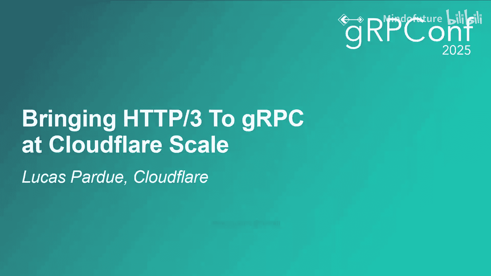
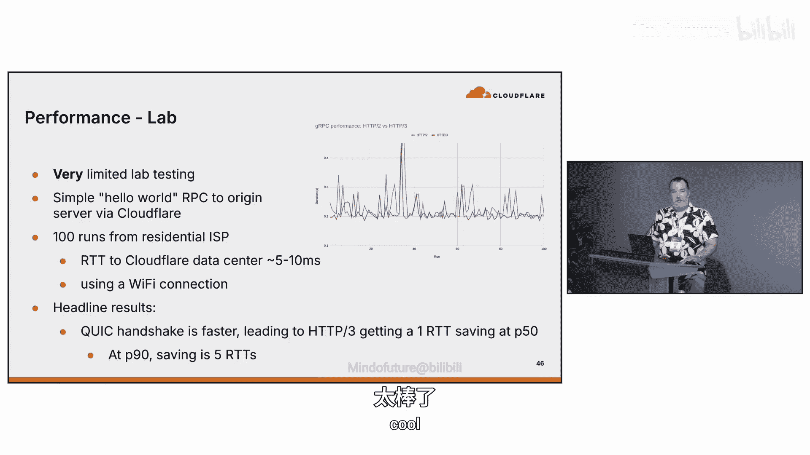

# 010：在 Cloudflare 规模下将 HTTP/3 引入 gRPC 🚀

## 概述

在本教程中，我们将跟随 Cloudflare 协议工程师 Lucas 的分享，了解如何将 HTTP/3 引入 gRPC，并使其在 Cloudflare 的全球规模下运行。我们将从背景知识开始，回顾 HTTP/2 的挑战，探讨 HTTP/3 和 QUIC 协议的优势，并最终了解 Cloudflare 的实现历程与性能收益。

---

## 背景：QUIC 与 HTTP/3 📚

我是 Lucas，一名常驻伦敦的 Cloudflare 协议工程师。今天我想和大家分享在 Cloudflare 规模下将 HTTP/3 引入 gRPC 的历程。

首先，我们需要理解两个核心协议：QUIC 和 HTTP/3。

### QUIC 协议

QUIC 不是 TCP。它是一个不同的传输层协议，由 IETF 标准化为 **RFC 9000**。QUIC 也不是 TLS，但它集成了基于 TLS 模型的安全性。这意味着握手过程可以更高效，有时能节省一个或更多的往返时间（RTT）。

QUIC 的关键设计点在于它运行在 **UDP** 之上，利用 UDP 的不可靠性来构建可靠、多路复用的安全传输。你可以将一个 QUIC 流（stream）近似理解为一条 TCP 连接，但在一个 QUIC 连接内可以并行多个流。

**核心公式/概念：**
- **QUIC 连接**：一个安全的、多路复用的传输层连接。
- **QUIC 流**：连接内的独立、有序的字节流。流之间互不阻塞。

### HTTP/3 协议

HTTP/3 不是 HTTP/2，但它提供了 HTTP/2 的所有核心能力，例如流、帧、头部压缩等。它与 HTTP/2 功能兼容，因此也完全支持标准的 HTTP 语义。

HTTP/3 的关键改进在于，它使用 QUIC 作为传输层，从而避免了 **队头阻塞（Head-of-Line Blocking）**。在 HTTP/2 中，如果 TCP 包丢失，所有多路复用的流都会被阻塞。而在 HTTP/3 中，由于 QUIC 流是独立的，一个流的丢包不会影响其他流。

**核心概念：**
- **避免队头阻塞**：`HTTP/3 over QUIC` 使得单个流的丢包不会阻塞同一连接内的其他流。

上一节我们介绍了 QUIC 和 HTTP/3 的基本概念，接下来我们看看它们在协议栈中的位置。

---

## 协议栈对比 🧱

为了更直观地理解，我们可以对比传统的 HTTP/2 栈和新的 HTTP/3 栈：

**传统 HTTP/2 栈：**
1.  **应用层**: HTTP
2.  **安全层**: TLS
3.  **传输层**: TCP
4.  **网络层**: IP

**HTTP/3 栈：**
1.  **应用层**: HTTP
2.  **传输/安全层**: QUIC (集成了 TLS 功能)
3.  **网络层**: IP (基于 UDP)

在 HTTP/2 中，帧（如 HEADERS 帧、DATA 帧）和流的概念都属于 HTTP/2 层。而在 HTTP/3 中，流的概念下放到了 QUIC 层，HTTP/3 的帧（同样是 HEADERS 和 DATA）则映射到这些 QUIC 流上。这种分离是架构上的一个重要区别。

---

## Cloudflare 的实现时间线 ⏳

了解了协议基础后，我们来看看 Cloudflare 是如何实现和部署这些技术的。

Cloudflare 是一个全球性的“连接云”，我们在世界各地拥有大量数据中心，旨在为客户提供安全、高性能的网络连接。我们的系统由一系列代理服务器链组成，处理包括 HTTP、gRPC、WebSocket 在内的多种流量。

以下是我们在 QUIC 和 HTTP/3 上的关键里程碑：

*   **2018年9月**: 开始支持草案版本的 QUIC，参与标准化过程的运行代码测试。
*   **2019年**: 开源了用 Rust 编写的 QUIC 和 HTTP/3 库 —— **quiche**。这个库后来成为我们边缘基础设施的核心组件。
*   **2019年9月**: 向早期用户开放 HTTP/3 支持。
*   **2024年12月**: 开源了协议测试和调试工具 **h3i**，以应对复杂的协议层测试挑战。

我们的代理链大致如下：客户端连接到 Cloudflare 边缘（Ingress，负责 TLS 终止），然后流量经过一系列内部代理（应用缓存、路由规则等），最后从 Egress 代理发往用户源站。

---

## 回顾：gRPC over HTTP/2 的挑战 🔙

在探讨 HTTP/3 之前，有必要回顾一下我们最初引入 gRPC over HTTP/2 时遇到的挑战。这能帮助我们理解升级的必要性。

2020年，应客户需求，Cloudflare 推出了 gRPC over HTTP/2 支持。目标是让 gRPC 流量也能享受到 Cloudflare 为常规 HTTP 流量提供的保护。

当时的架构挑战在于，我们内部的代理链之间仍在使用 HTTP/1.1。为了支持端到端的 HTTP/2，我们设计了一个方案：在入口（Ingress）和出口（Egress）代理都处理 HTTP/2，但在中间使用 **gRPC-Web** 协议进行转换。

这个方案虽然可行，但也带来了复杂性和一些实际问题。HTTP/2 协议层暴露的攻击面让我们遇到了不少挑战：

以下是几个具体的例子：

*   **Ping Flood 攻击 (2019)**: HTTP/2 的一种拒绝服务攻击方式。我们实施的缓解措施意外影响了新建的 gRPC 连接，导致它们被默认的 Ping 帧淹没而中断。这体现了底层协议行为可能带来的意外后果。
*   **Rapid Reset 攻击 (2023年8月)**: 攻击者利用 HTTP/2 协议完全合法但非预期的方式，在我们的代理链中制造了大量的工作积压。
*   **Continue Reset 攻击 (近期)**: 与 Rapid Reset 类似但方向相反的另一种攻击。

这些案例表明，HTTP/2 在协议设计上存在一些固有的弱点，修复起来很困难。而 QUIC 协议从设计上就对许多此类攻击具有免疫力，部分原因在于其加密和帧结构的设计。

---

## 机遇：gRPC over HTTP/3 🆙

鉴于 HTTP/2 的挑战，将 gRPC 迁移到 HTTP/3 上显得尤为有吸引力。这不仅是为了安全性，也为了性能提升。

gRPC 社区对 HTTP/3 的支持工作早已开始：
*   **2019年**: gRPC 项目开启了 HTTP/3 支持的相关议题。
*   **2021年**: James K. 和 Eric A. 等人提出并合并了初步设计提案。

从 gRPC 应用层的角度看，迁移到 HTTP/3 的变化并不大，因为差异主要被底层的 RFC 标准所封装。开发者可以使用 `curl` 等工具通过 `--http3` 标志进行测试。

对于 Cloudflare 而言，让我们能够提供 gRPC over HTTP/3 服务的最后一个技术障碍是完善对 **Trailers**（尾部头部）的支持。一旦解决，前端支持 HTTP/3 的 gRPC 流量就可以无缝通过 Cloudflare 网络，而用户的后端源站无需任何更改。

---

## 性能表现 📊

理论上的优势需要数据验证。我们进行了一些实验室测试和早期客户数据验证。

在实验室环境中，模拟从家庭网络通过 WiFi 发起简单 gRPC 请求：
*   **平均情况**: 节省了约 **1个 RTT**（往返时间）。
*   **P90情况 (90%分位)**: 节省了多达 **5个 RTT**。这表明在网络状况不佳时，HTTP/3 的优势更加明显。

更重要的是来自早期采用者 Uber 的生产环境数据（经授权分享）：
*   **延迟**: 在 P75 和 P95 分位数上，**HTTP/3 的延迟均低于 HTTP/2**。
*   **成功率**: 使用 HTTP/3 的请求成功率也更高。

这些数据令人鼓舞，我们正在收集更多信息以全面评估性能收益。

---

## 未来展望与问答要点 💡

在分享的最后，Lucas 回答了听众的一些问题，并提到了未来的发展方向：

1.  **与 MASQUE 协议的关系**: MASQUE 是一种基于 HTTP（包括 HTTP/3）的代理和隧道协议，用于转发 UDP 等流量。gRPC over HTTP/3 可以通过 MASQUE 隧道运行，这为隐私增强和复杂网络环境下的代理提供了可能性。
2.  **连接失败检测**: QUIC 的错误检测机制与 TCP 类似（如重传超时），但提供了更丰富的错误码和可配置的空闲超时，使得连接管理更精细。由于其加密特性，未来也有可能设计更快速的故障检测扩展。
3.  **高丢包环境下的性能**: QUIC 流独立的特性意味着在高并发请求场景下，个别流的延迟或丢包对其他流的影响更小，这可能带来比 HTTP/2 更好的整体体验。但具体性能高度依赖于实现和算法调优。
4.  **延迟收益分析**: 实验室数据显示，主要收益来自 **QUIC 握手节省的 1个 RTT**（约数毫秒）。在生产中，对于长连接和连接池，HTTP/3 在弱网环境下（高延迟、高丢包）的流独立性优势会带来更显著的尾部延迟改善。
5.  **未来工作 - 传输层抽象**: 目前 QUIC 必须运行在 UDP 上，这可能会带来一些系统调用开销。IETF 正在开展一项新工作，旨在将 **QUIC 流抽象** 与底层传输层解耦，使其可以运行在任意双向传输协议上（如 Unix Domain Socket, RDMA）。这为数据中心内部等高性能场景的 gRPC over HTTP/3 应用打开了新的大门。

---

## 总结 🎯

本节课我们一起学习了将 HTTP/3 引入 gRPC 的完整历程：

1.  **回顾了基础**：了解了 QUIC 和 HTTP/3 协议如何通过解决队头阻塞等问题，为 gRPC 带来潜在的性能和安全优势。
2.  **追溯了历史**：看到了 Cloudflare 从支持 gRPC over HTTP/2 时遇到的协议层挑战，这些挑战推动了向 HTTP/3 的演进。
3.  **看到了实践**：介绍了 gRPC 社区对 HTTP/3 的支持时间线，以及 Cloudflare 通过解决 Trailers 支持等最后障碍来实现该功能。
4.  **验证了价值**：通过实验室和早期生产数据，证实了 HTTP/3 在延迟和成功率上带来的切实改善。
5.  **展望了未来**：探讨了与 MASQUE 等协议的协同，以及 QUIC 流抽象未来可能脱离 UDP，应用于更高性能的内部网络场景。

对于开发者而言，开始尝试 gRPC over HTTP/3 的壁垒正在迅速降低。随着像 Cloudflare 这样的边缘提供商以及客户端库的广泛支持，这项技术有望为分布式应用带来更快速、更稳健的网络通信体验。