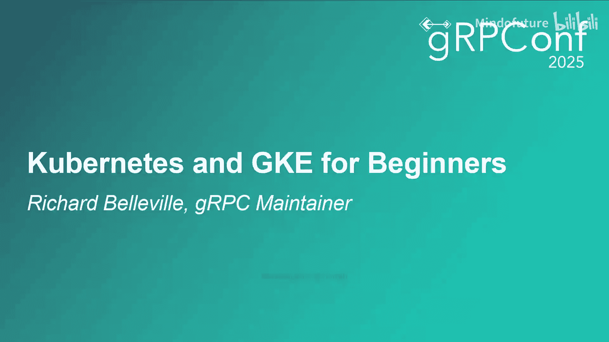
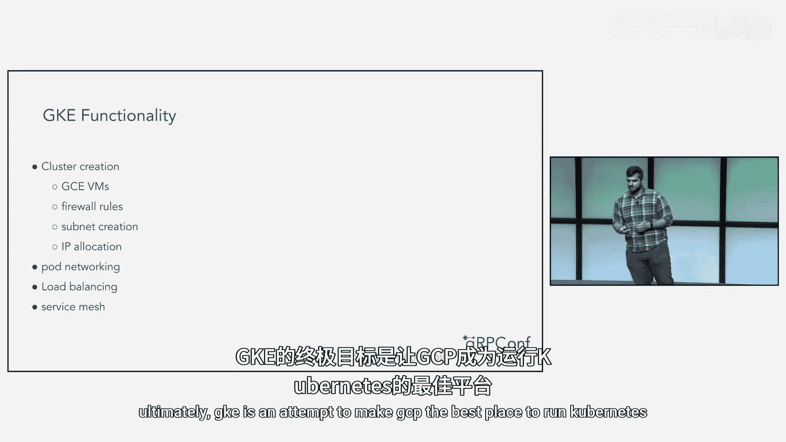
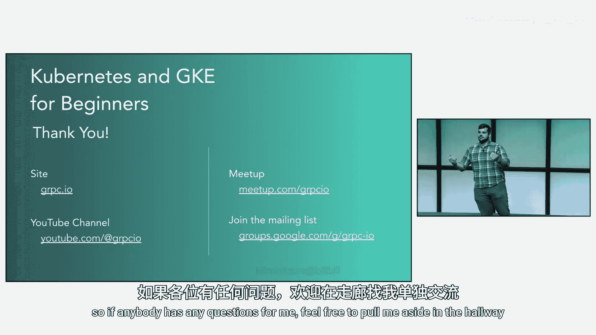

# 011：什么是Kubernetes？

在本节课中，我们将从零开始学习Kubernetes和GKE。我们将通过三个不同的视角来理解Kubernetes：作为开发者的日常工具、作为团队协作的平台，以及作为计算机集群的操作系统。

## 概述

Kubernetes是一个用于自动化部署、扩展和管理容器化应用程序的开源系统。在本教程中，我们将从三个层面逐步深入，帮助你构建对Kubernetes的全面理解。

## 开发者的视角：软件部署

上一节我们介绍了课程概述，本节中我们来看看开发者如何使用Kubernetes。

谈论Kubernetes时，我们无法避免频繁提及容器。那么，什么是容器？

容器常被描述为“轻量级虚拟机”。虽然其底层技术与虚拟机不同，这使得它们平均速度更快，但容器为用户提供的界面与虚拟机非常相似。它们看起来就像是你计算机内部的一个独立计算机，拥有自己的文件系统、进程树、权限管理等一切。

容器也是一种软件打包和分发机制。就像Java的Maven或Python的Pip一样，你可以从Docker Hub以容器镜像的形式拉取现成的、可工作的软件。不同之处在于，容器镜像中打包的软件可以用任何语言编写。

过去，如果我想运行网上找到的某个软件，我必须经历一系列复杂的步骤，才能让它在我特定版本的Linux上，配合所有正确版本的依赖项运行起来。而有了容器，运行任何软件真的只需要几秒钟。

这就是为什么容器是解决“在我电脑上能运行”问题的方案。过去，你写完代码，让它运行起来，提交后，经常有人会说：“嘿，这东西在我这儿跑不起来。”经过一番头疼的调试，你最终发现问题出在某个你甚至没意识到的晦涩依赖项的版本不匹配，或者某个你从未听说过的目录中存在冲突的配置文件。容器直接打包了整个Linux发行版的轻量级文件系统，因此这个问题不复存在。

当然，你可能在容器语境下听说过Docker。Docker是目前最流行的用于构建、运行和分发容器的软件。事实上，我们现在拥有的容器开放标准，很大程度上直接源自Docker。但如今实际上有许多其他容器实现，包括Podman等。你可以使用几乎任何你喜欢的容器实现与Kubernetes配合。

好的，我们知道了什么是容器。那么这如何应用于为Kubernetes开发呢？

答案是：用你喜欢的任何方式为Linux构建软件，将其放入容器，然后在几分钟内将其运行在Kubernetes上。最后一步通常只需要几分钟。

历史上，托管软件部署对如何构建软件的要求非常苛刻。例如Apache Heroku、Google App Engine等。它们要求你用特定的语言编写代码，严格按照某种结构布局文件，并使用非常特定的运行时版本。Kubernetes使用容器来声明：如果你的软件能在某个版本的Linux上运行，你就可以在Kubernetes上运行它。用Go、Ruby、Java 4写代码？谁在乎？它都能在Kubernetes上运行。所以，如果你不熟悉这类系统，这是Kubernetes真正解放生产力的第一点。

构建完软件后，下一步是将其放入容器中。这个过程通常比想象的要简单得多。有大量公开可用的基础镜像，可以为你提供所需的运行时环境。如果你使用特定JVM版本的Java，你可以从Docker Hub拉取该镜像，并非常轻松地将你的软件层叠在上面。Python也是如此。如果你能构建静态二进制文件（比如用Go），你的容器可以非常精简，甚至只包含那一个二进制文件。

最后，你编写一些YAML来定义你的工作负载。在该YAML中，你引用新创建的容器镜像，并使用`kubectl` CLI工具将其部署到你的集群。通常只需要一两分钟编写，几秒钟即可启动并运行。

以上就是定义工作负载的方式。Kubernetes真正闪耀的地方在于运维，即操作你的软件部署。这方面的深度远超本次分享所能涵盖，因此我将聚焦于两个最重要的部分：扩缩容和滚动更新。

传统软件部署中最具挑战性的事情之一就是扩容。根据你已有的自动化水平，将用于运行服务的计算资源翻倍可能需要数天或数周。但在Kubernetes中，这就像在你的部署YAML文件中增加一个数字一样简单。当在像GCP这样的云提供商上运行时，如果增加副本数意味着机器不足，GKE会直接配置更多虚拟机来运行你的软件。

事情甚至可以比这更自动化。Kubernetes允许你将各种指标（如CPU利用率或每秒请求数）挂钩，以自动触发扩容。这被称为**水平Pod自动扩缩**，简称HPA。

Kubernetes擅长的另一项运维任务是：在不中断用户流量的情况下推出服务的新版本。Kubernetes通过服务的滚动更新来实现这一点。假设你开始时有三个Pod以版本A处理请求，你想将它们全部更新到版本B。使用Kubernetes，你只需要将部署的版本从A更新到B。Kubernetes将关闭一个版本A的Pod，启动一个新的版本B的Pod，并重复此过程，直到所有Pod都运行版本B。这个滚动更新过程的许多细节都是可配置的，因此你可以调整它以完全按照你想要的方式工作。

## 平台团队的视角：团队协作

上一节我们从开发者的角度体验了Kubernetes，本节中我们来看看它如何帮助平台团队和整个组织协作。

让我们回溯一下时间。在行业里待过一段时间的人可能熟悉基于虚拟机的软件部署和运维模型。无论你是在GCP、AWS、Azure上运行，甚至在很大程度上在本地运行，这都是基本的操作模式。你使用云提供商的CLI工具启动一些虚拟机，使用相同的CLI工具配置一些负载均衡器，然后通过某种方式（最基本的是SSH）将你的软件部署到虚拟机上。

在这种模式下，组织管理软件部署的方式大致有两种。

人们有时称第一种模式为“DevOps”，因为每个开发者也负责运维或操作他们的软件。这意味着每个团队都需要管理自己的虚拟机池和所有相关的基础设施。CTO或多或少地给团队云预算，然后说：“搞定它。”他们需要弄清楚如何将软件部署到虚拟机：是打包成tarball还是Debian包？他们需要弄清楚已部署软件的生命周期管理：如何处理崩溃和内存不足错误？也许使用systemd或supervisord。他们需要弄清楚调试访问方法：是否允许到处使用SSH？这甚至还没涉及到最困难的部分：扩缩容。我刚才提出的许多问题的答案在尝试扩展系统时效果不佳。

在这个图表中，你可以看到两个功能团队：开发Foo应用的Foo团队和开发Bar应用的Bar团队。他们的部署是完全独立的。除了计费账户或云项目外，没有任何共享。开发人员通常只想把代码发布出去，所以他们不会花时间研究管理部署的最新、最棒的工具。因此，他们大多使用Stack Overflow、`gcloud`命令和通过SSH执行的`chmod`命令的混合体。换句话说，在这种模式下，每个开发人员还需要成为一名系统管理员，照料他们部署软件的个人小花园。

这大致是我上一家公司的模式。虽然这对培养系统管理技能很有好处，但这也导致了长达17小时的部署会议。对任何人来说都不太有趣。

这也意味着整个组织在软件部署方面缺乏统一性，这使得强制执行横向标准变得非常困难。并且，这使得组织其他部门的人员很难在不先做大量研究的情况下，介入并了解另一个团队系统中发生了什么。

显然，这很难管理。不是每个大学毕业生都会带着专家级的系统管理技能和出色的编码技能入职。因此，一些组织采取的替代方案是将组织划分为开发团队和运维团队。

运维团队负责管理计算资源池和其他云基础设施。运维团队将大部分时间用于研究和决定云基础设施的最佳实践。他们确保软件部署生命周期管理在整个组织内是统一的，这使得强制执行横向标准变得容易得多。他们确保负载均衡和扩缩容对每个服务都运行良好。这解决了我们在上一张幻灯片中看到的许多问题。但现在，问题变成了开发团队和运维团队之间的交接。很多时候，这种交接是粗糙的。

那么，在这种模式下，开发团队如何发布新版本的软件呢？他们向运维团队创建一个工单。当部署失败时他们做什么？添加一条评论。换句话说，根据设计，开发团队不接触基础设施，运维团队不接触代码。这里的官僚主义变得非常痛苦。当然，这两个极端之间存在一个谱系，但在对开发团队的专业知识要求和对这些开发团队的繁文缛节之间的权衡总是存在的。

回到GKE和Kubernetes，Kubernetes使运维团队能够就基础设施做出跨领域的决策，同时也为开发团队提供了可编程的自助服务API，以便在运维团队设定的边界内部署和管理他们的软件。

这是一个简化的图景，但Kubernetes为以下问题提供了答案：工作负载将被调度到哪些虚拟机上？应用程序将使用什么交付格式？日志如何收集？以及许多其他问题。对于那些Kubernetes本身不发表意见的问题，它通常提供一种机制，让运维团队为该特定Kubernetes集群的所有用户提供他们自己的横向标准。

这意味着开发团队能够按照自己的时间表重新部署，并且他们可以使用一套更加精简、在所有云提供商中都相同的API来完成。如果出现问题，他们会立即知道，并且能够访问调试所需的所有工具。因此，在平衡运维需求和开发需求方面，Kubernetes让你鱼与熊掌兼得。

## 抽象视角：集群操作系统

上一节我们探讨了Kubernetes如何促进团队协作，本节我们将从更抽象的视角，将其视为一个操作系统。

我们的最后一个视角将更加抽象。我们将拉回到一万英尺的高空。我要提出一个主张：Kubernetes是计算机集群的操作系统，不是单台计算机，而是多台计算机的操作系统，可能用于整个数据中心，甚至多个数据中心。我曾与GKE项目的产品经理争论过，认为这个主张过于宽泛。但我认为有充分的理由支持它，并且论证这一点将真正帮助你感受Kubernetes。

那么，如果Kubernetes是一个操作系统，那么什么是操作系统？让我们以Linux为例。

首先，最重要的是，操作系统是一组抽象。如果完全没有操作系统更容易开发，那么你就不会使用那个操作系统。提供的具体抽象因平台而异。例如，Android提供的抽象就与Linux不同。好的操作系统用共同的惯用法构建这些抽象。也就是说，提供的抽象应该彼此足够相似，以至于整个系统不会崩溃成一堆没有开发者能理解的复杂性。真正优秀的操作系统提供一个工具链，为99%的用例铺平道路。

现在，让我们通过观察Linux来具体化这一点。Linux提供了相当多的抽象。最明显的是进程的概念，它使你不必担心将应用程序的地址空间调度到内存中。你有很多用于与CPU外部事物交互的抽象：用于驱动旋转盘片和SSD的文件系统API、用于闪存驱动器和键盘的设备驱动程序，以及用于连接网络硬件的通用API。Linux通过统一“一切皆文件”的概念，使这些抽象更容易理解。你获得一个文件描述符，然后从中读取字节并向其写入字节。

最后，使你能够利用这一切的工具链以C语言为基础，并用Lib C包装原始的、中断驱动的系统调用。你可以直接针对Linux的汇编API编程，就像Go所做的那样。但依赖Lib C要容易得多，就像我们大多数人甚至没有意识到的那样。

Kubernetes的情况惊人地相似。现在，面对多台机器，我们希望抽象掉的是我们的应用程序最终运行在哪台机器上。Kubernetes负责查看它可以访问的所有机器，并决定调度所有工作负载的最佳方式。

它提供了一个API来持久化数据。由于工作负载可能最终运行在任何机器上，这变得更为困难，而Kubernetes允许你控制这一点。Kubernetes为你提供API来配置负载均衡器以与外部世界通信。现在，面对多台机器，你需要担心整个网络的配置，而不仅仅是本地机器到该网络的连接。

Kubernetes为大多数这些API提供了一个共同的惯用法：**一切皆资源**，即存储在Kubernetes内部的YAML对象。我们之前看到过一些。CLI工具`kubectl`利用所有资源共有的结构来简化工作流。

最后是工具链。虽然你可以在Kubernetes上运行任何语言编写的代码，但Kubernetes提供的`client-go`库，如果你想与Kubernetes紧密集成（例如自己读写那些资源），它是最容易的选择。这类似于Lib C和C语言对Linux的作用。

现在，如果我们将上游开源Kubernetes与Linux进行比较，它最像的是没有附加组件的内核。如果你曾经从源代码构建Linux内核并尝试用它运行一个系统，你就会知道它基本上没用。没有你需要的打印机或WiFi设备驱动程序，没有GUI，没有文字处理器，没有文本编辑器，甚至没有像`ls`这样的基本命令。Kubernetes本身（开源版）是类似的。实际上，唯一内置的功能是调度容器的能力。其他一切，包括网络模型、数据持久化和服务发现，都是由各种插件实现的，通常是供应商特定的插件。也就是说，有些能在GCP上工作，有些能在AWS上工作，只有少数能在任何地方工作。所有这些功能都是由各种插件提供的。

第一种插件称为**控制器**或**操作符**。这些是可以在任何地方作为工作负载运行的应用程序：在集群内、直接在虚拟机上，甚至在你的桌面上。它们使用标准的Kubernetes惯用法：通过HTTP传输YAML。它们监视Kubernetes跟踪的资源的变化，并根据这些Kubernetes资源的内容在外部世界做出更改。在像GKE这样的云托管Kubernetes服务上，有一堆控制器监视Kubernetes资源，并将它们直接转换为等效的GCP资源。这样，你可以直接在Kubernetes中定义所有GCP基础设施。

换句话说，控制器是控制循环。它们查看Kubernetes资源所传达的意图，并将该意图转化为GCP层面的现实。

Kubernetes中的另一种插件实际上就叫做**插件**。这些是必须在节点上运行才能工作的东西。通常，这些插件会修改在节点上运行的容器。因此，它们必须直接在主机上运行，或者作为特权容器运行。这些包括像CNI（容器网络接口）插件这样的东西。这些是负责为Pod分配独立IP、将这些IP分配给底层容器并确保网络连接到网络的东西。这些插件，令人惊讶的是，不使用HTTP和YAML，而是使用gRPC和Protocol Buffers。这对于这类插件是更好的选择，因为API通常是命令式的而非声明式的，并且它们不使用构成Kubernetes API其余部分的资源。

## 什么是GKE？

现在你理解了Kubernetes如何扩展，终于可以回答这个问题了：什么是GKE？它是一个产品，将上游Kubernetes与一系列GCP特定的插件捆绑在一起，使其变得非常有用。换句话说，GKE是一个Kubernetes发行版。你可能熟悉像Debian、Ubuntu或Red Hat这样的Linux发行版。它们对Linux内核做的正是同样的事情。那么GKE具体做什么呢？

实际上，它做了很多事情。它完全自动化了在GCP上配置虚拟机、配置其网络、确保它们具有正确的Linux版本以及将所有这些软件安装到这些虚拟机上以将它们绑定到Kubernetes集群的任务。如果你使用像Kelsey Hightower的“Kubernetes the Hard Way”这样的教程手动完成这个过程，你会了解到这绝非易事。相对于纯粹的上游Kubernetes，这里有巨大的附加价值。

除此之外，还有大量的运行时集成，例如Pod原生网络，每个Pod都获得自己可单独寻址的IP，而无需借助NAT将数据包发送到单个Pod。这个列表只是GKE实际添加到上游Kubernetes功能的一小部分。最终，GKE是试图使GCP成为运行Kubernetes的最佳场所。

## 总结与建议

本节课中我们一起学习了Kubernetes的三个核心视角：作为简化软件部署和运维的开发工具，作为促进开发与运维团队高效协作的平台，以及作为抽象计算机集群资源的操作系统。我们还了解了GKE作为Kubernetes的一个特定发行版，如何通过集成GCP插件提供开箱即用的强大功能。

如果你对Kubernetes感兴趣，我强烈建议你尽快开始与一个集群进行实际交互，而不是试图阅读大量书籍。即使只是在GKE上设置一个简单的Web服务器应用程序，也能极大地帮助你理解这一切是如何运作的。