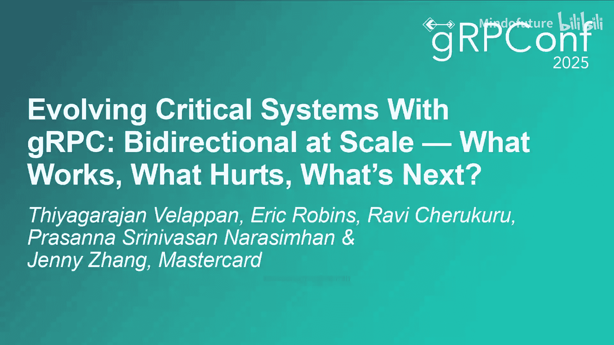
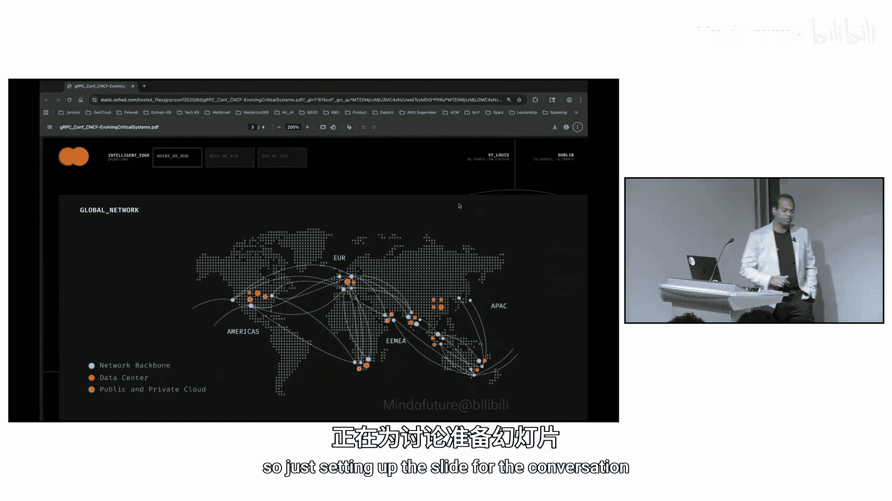
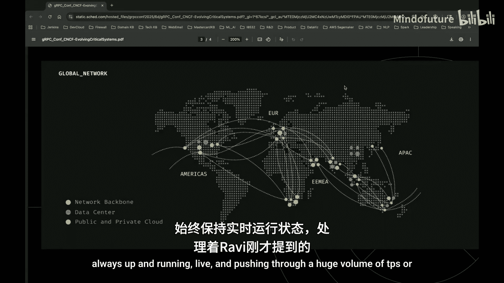

# 012：在规模下演进关键系统——什么有效、什么有害、下一步是什么

在本节课中，我们将学习万事达卡（Mastercard）的工程师团队如何利用gRPC双向流技术，在庞大的支付网络系统中实现高性能、高可扩展性和高安全性的服务演进。我们将探讨实践中的成功经验、遇到的挑战以及未来的技术方向。

---

## P12.1：什么有效——gRPC如何成为支付网络的基石

上一节我们介绍了课程概述，本节中我们来看看gRPC技术栈在万事达卡支付系统中的成功应用。

万事达卡是一家技术公司，管理着一个全球网络，用于处理跨越地理区域的金融交易、服务和数据。我们以极高的吞吐量、低延迟和安全性处理这些支付交易。我们构建的技术栈经过大量定制，以在全球范围内传输低延迟数据。

我们通过使用双向协议进行了定制，但下一步是如何在全球范围内构建可扩展的支付网络。大约五年前，我们开始接触gRPC。自那时起，我们围绕gRPC协议演进并构建了万事达卡的技术栈和事件驱动架构，因为它提供了安全性、开发者体验和更快的交付速度。如今，我们每天在全球范围内以闪电般的速度处理数亿笔交易。这就是我们演进万事达卡网络的方式。

以下是gRPC带来核心优势的几个方面：

*   **安全性与性能**：gRPC提供了内置的安全性（如TLS）和基于HTTP/2的高性能通信。
*   **开发者体验**：强类型API、清晰的合约（Protocol Buffers）以及多语言支持，使其易于在我们的多语言生态系统中大规模采用。
*   **边缘集成**：与传统的REST over HTTP/1.1系统不同，gRPC在可信边界上暴露API时提供了清晰的语义，并支持细粒度的访问控制。

在金融科技领域，性能不是奢侈品，而是必需品。每一个字节、每一毫秒都决定了交易的成本和效率。gRPC无缝地契合了安全、性能、可扩展性和最小开销这些核心原则。

---

## P12.2：可扩展性与可观测性——持久连接带来的新范式

上一节我们介绍了gRPC的核心优势，本节中我们来看看在引入gRPC双向流后，可扩展性和可观测性方面面临的挑战和解决方案。

gRPC协议是一个多层网络协议。底层是TCP/IP（第3/4层），之上是HTTP/2流，最上层是应用层消息。当消息在全球范围内发送时，如何维持持久的双向连接，并在出现问题时进行报告和修复，是网络层面持续给我们带来的挑战。

我们进行了巨大的投资，在每一个层面（TCP、HTTP/2、流、通知）都构建了遥测系统，并嵌入了详细的追踪。在双向通信中，客户端或服务器任何一端出现问题都会导致交易失败，因此必须从两端审视流量，并建立告警机制。

关于可扩展性，当流量跨越多个区域时，如何实现横向扩展？传统的基于实例扩展的思维在gRPC世界中并不完全适用，因为gRPC是基于持久连接的。一旦与后端服务器实例建立连接，该连接就会保持，后续的所有RPC调用都指向同一个后端实例。这可能导致某些实例过载，而其他实例闲置。

因此，我们不得不采用不同的策略来实现水平扩展，并转向了**客户端负载均衡**。客户端需要具备智能，了解所有可用的后端服务器实例，并在启动时建立到多个实例的连接和流，从而将流量均匀地分布到所有可用的流上。

---

## P12.3：安全性考量——从无状态REST到有状态gRPC流的转变

上一节我们讨论了扩展性挑战，本节中我们深入探讨引入gRPC双向流协议时，必须解决的关键安全问题。

万事达卡是一家受到严格监管的支付行业公司。引入像gRPC这样的新协议时，必须确保其符合现有的安全标准、法规和客户要求。这些要求最终会转化为技术控制措施。

最大的一个安全范式转变是从基于HTTP/1.1的无状态REST API，转向在客户端和服务器之间保持基于连接状态的协议。

*   **REST API**：每个请求都是独立的，服务器每次都需要对客户端进行身份验证和授权，然后连接关闭。
*   **gRPC双向流**：客户端和服务器建立连接后，可能会长时间通信。在大多数情况下，客户端可能只进行一次身份验证（通过通道凭证或调用凭证），之后便基于这个已建立的连接进行通信。

这里的关键在于信任基础。gRPC运行在TCP之上，而TCP本身不是安全的连接协议。唯一能保证连接安全的是其上的**TLS（传输层安全）**。TLS在密码学上将客户端和服务器绑定在一起。

为了验证gRPC连接的安全性，我们进行了深入测试。我们在沙箱环境中，在gRPC客户端和服务器之间放置了一个TCP代理（如Nginx），并编程方式修改TLS记录中的单个字节。测试证实，一旦TLS层抛出致命警报，客户端和服务器都会收到通知，TCP连接会被关闭。当连接重新建立时，身份验证会被强制再次执行。这符合我们的安全要求：我们不希望gRPC在子通道（承载实际TCP连接的逻辑实体）出现问题时，在不重新进行身份验证的情况下尝试自动修复它。

---

## P12.4：什么有害——实践中遇到的痛点与挑战

上一节我们确认了gRPC在安全模型上是可靠的，本节中我们来看看在实际大规模应用gRPC双向流时，遇到的具体困难和“痛点”。

### 负载均衡的思维转变

传统的负载均衡器（如F5）是服务器端负载均衡器，在TCP层进行路由决策。这对于HTTP/1.1很有效，因为路由决策在连接建立时做出。

但在gRPC世界中，连接是持久的。一旦与某个后端实例建立连接，所有后续RPC都通过这个通道指向同一个实例。随着时间的推移，这会导致某些实例过载，而其他实例闲置。因此，**传统的服务器端负载均衡器在这种情况下效果不佳**。

解决方案是转向**客户端负载均衡**。客户端需要内置智能，知晓所有可用的后端服务实例，并在初始化时建立到多个实例的连接和流。这样，客户端可以基于每个消息（per-message）或更细的粒度，将流量智能地分发到所有健康的流上，实现真正的均衡。

### 服务发现与API暴露

我们内部已经大规模安全地实现了数十个gRPC API。在向外部客户暴露这些API时，我们遇到了挑战。

我们采用了gRPC反射机制来帮助内部集成，但反射器会暴露一些内部方法，因此需要确保外部API得到适当的安全保护。

此外，服务发现、端点发现等挑战仍然存在。为此，我们正在采用**xDS（通用数据平面API）协议**来实现服务发现、端点发现、负载均衡技术和流量整形技术。我们计划在熟悉xDS后，基于此协议向外部客户暴露API。

### 协议转换与开发者体验

在前端技术栈（如接收来自用户或前端应用的数据）和后端gRPC服务之间，存在协议转换的摩擦点。对于成千上万的开发者而言，如何处理这种转换是一个挑战。

我们的方法是首先确立标准：使用**强类型API和清晰的合约（Protocol Buffers）**。我们有一个中央仓库来管理所有的原型定义。清晰的合约有助于在开发周期早期发现问题，减少歧义。对于必要的协议转换层，我们通过服务等级协议（SLA）进行治理，并精细调整这些底层的TCP参数。

---

## P12.5：下一步是什么——未来的技术探索方向

上一节我们剖析了当前的挑战，本节中我们展望万事达卡在gRPC和通信协议方面的未来规划。

### 更智能的客户端与xDS

除了采用xDS协议来实现地理服务发现、故障转移和动态配置外，我们还将结合一项**自适应的请求处理机制**。该机制会监控通道健康度、流健康度等网络层信息，从而动态、自适应地路由流量，其能力将远超现有gRPC框架。

### 探索更轻量、更快速的协议

我们始终在寻找更轻量、更快、更具弹性的协议。在这方面，我们正在探索**HTTP/3 QUIC协议**。目前已有试点项目在进行中。

QUIC基于UDP构建，其流彼此独立，避免了TCP队头阻塞等缺点。此外，其安全连接可以做到0-RTT或1-RTT，因此速度更快，对连接失败的恢复能力也更强。

### 统一的客户端库与外部集成

我们目前使用的具备客户端负载均衡等智能的客户端库，既可用于内部也可用于外部。未来的方向是将这种能力通过统一的接口暴露给所有客户。无论是支付处理器还是希望构建自身逻辑的现代化客户，都能利用这些库与我们的网络集成。这需要谨慎设计，确保支付网络细节的保密性。

---

## P12.6：总结与问答精要

本节课中，我们一起学习了万事达卡利用gRPC双向流技术演进其关键支付系统的旅程。

**核心总结如下：**
*   **什么有效**：gRPC凭借其高性能、强类型合约、多语言支持和良好的安全基础，成为构建现代、可扩展支付服务的基石。
*   **什么有害**：持久连接改变了负载均衡的范式（需转向客户端负载均衡），服务发现与安全暴露存在挑战，协议转换层需要精心设计。
*   **下一步是什么**：拥抱xDS实现更智能的服务治理，探索HTTP/3 QUIC以获得更佳性能，并致力于提供统一的客户端库以简化外部集成。

**以下是问答环节中提炼的关键点：**

*   **关于负载均衡**：我们采用**基于消息的客户端负载均衡**。通过建立足够数量的冗余连接和流，系统保持无状态。每个消息都有唯一ID，可以在任何可用的流上处理，通过元数据来区分消息和流。
*   **关于客户端位置**：智能客户端库可部署在内部或外部。它封装了负载均衡逻辑，未来目标是将其作为统一接口提供给合作伙伴和客户。
*   **关于服务器亲和性**：在我们的设计中，**没有服务器亲和性**。依靠冗余的连接和流，任何消息都可以由任何可用的流处理，从而保证弹性和无状态性。

（注：由于原始内容为研讨会转录，存在口语化、重复和逻辑跳跃。本教程已对内容进行梳理、重组和精简，在严格保留每一句原意的基础上，使其更符合教程的连贯性和可读性要求。）