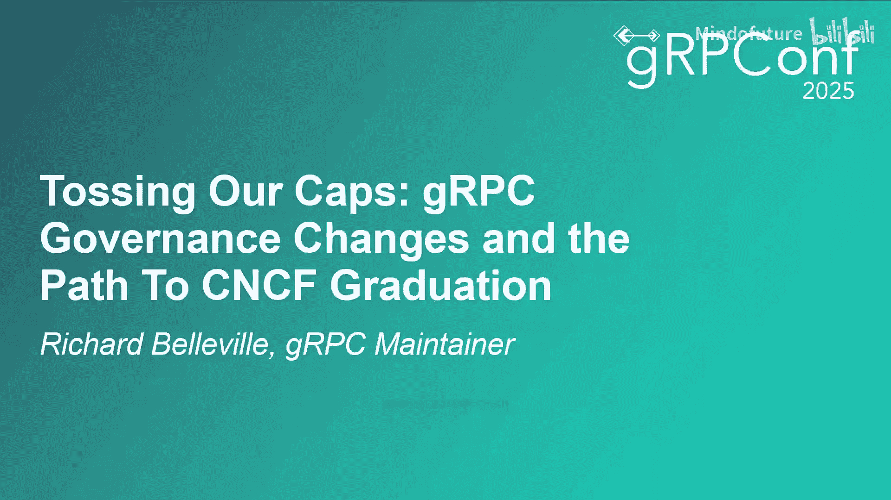
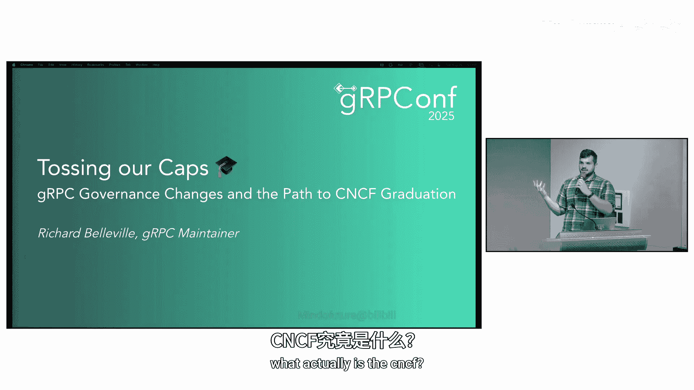
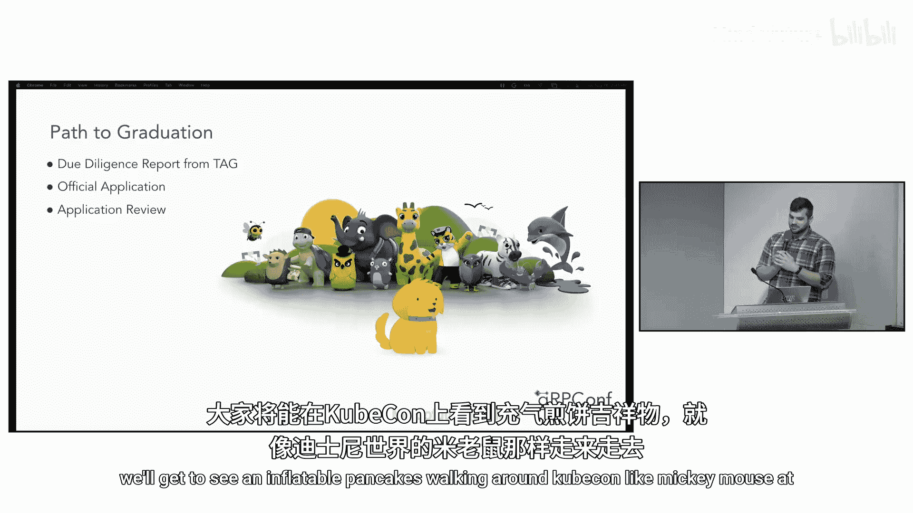
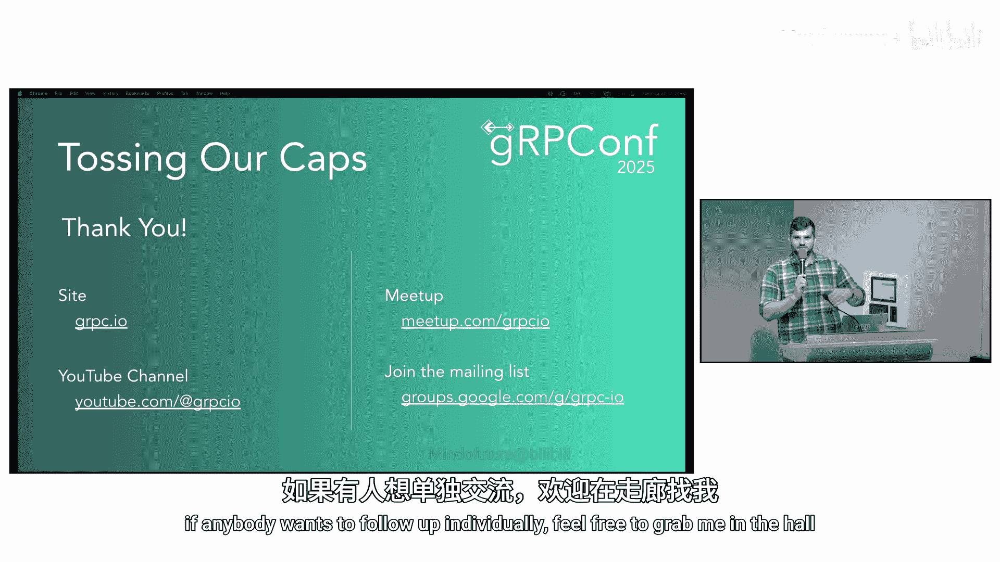

# 013：项目治理变革与未来展望

在本节课中，我们将学习gRPC项目为达成CNCF毕业目标所进行的治理结构变革。我们将了解CNCF的基本情况、项目成熟度等级，并详细解析gRPC新引入的贡献者阶梯制度和指导委员会。

## 认识CNCF

我是Richard Bellville，gRPC项目的维护者之一。本次演讲将详细解释gRPC项目为在CNCF内达到毕业状态所做的准备，以及近期为确保达成目标而实施的一些变革。

在深入细节之前，我们先来了解一下CNCF。许多人可能对它并不熟悉。

CNCF代表云原生计算基金会。如果你听说过它，很可能是在与Kubernetes相关的语境中。这是因为CNCF持有Kubernetes的商标，并投入大量时间推广Kubernetes。

深入细节来看，CNCF是Linux基金会的一个非营利性子公司，由包括AT&T、思科、Docker、谷歌、推特等多家公司在2015年共同创立，旨在推动云原生技术的协同发展。

当时，这主要意味着涉及容器（如Docker、Kubernetes等）的软件。事实上，Kubernetes是第一个捐赠给CNCF的项目。

随着时间的推移，CNCF已扩展到涵盖种类繁多的软件。

## CNCF的职责

CNCF充当捐赠给它的项目的管理者。公司将其软件项目开源并捐赠给CNCF，希望提高该软件在更广泛领域的采用率。

CNCF在其旗舰活动KubeCon等会议上推广这些项目。KubeCon每年在全球各地举办多次，每次吸引数千名访客。事实上，您正在参加的gRPCConf也是一个CNCF活动。

下图是云原生全景图，展示了CNCF旗下所有项目的分布。项目数量众多，无法一一辨认。

显然，公司将项目捐赠给CNCF能获得巨大价值。捐赠能提高项目采用率的原因是，全球公司的软件开发人员关注CNCF，因为它以质量著称。

当CNCF推广一项技术时，通常意味着它是高质量、安全、经过实战检验的，并且是您可以放心用于生产系统的技术。

## gRPC与CNCF

基于同样的原因，谷歌在2017年将gRPC捐赠给了CNCF。

如今在2025年，CNCF在众多不同领域托管着超过200个项目，涵盖存储、可观测性、CI/CD、网络等，数量之多难以在此列举。

但并非所有项目都处于相同的状态，每个项目都有其指定的成熟度等级。

## 项目成熟度等级

当一个项目首次捐赠给CNCF时，它从沙箱项目开始。CNCF将沙箱项目称为实验、早期工作和前沿技术。换句话说，它们是未来值得关注的事物，但不一定是当前需要下重注的事物。

下一个成熟度等级是孵化中。项目通过CNCF技术监督委员会的审查流程，从沙箱项目晋升为孵化项目。

技术监督委员会认证新的孵化项目拥有健康的贡献者群体，并且至少被几家公司成功用于生产环境。

最终等级是已毕业。孵化项目被认为是稳定和成熟的，而已毕业项目则被广泛采用，并已成为云原生计算领域的基石。

从孵化状态晋升到毕业状态的过程，涉及与CNCF技术监督委员会进行更深入的认证流程。

## gRPC的现状与目标

信不信由你，gRPC目前还不是一个已毕业项目，而只是一个处于中间状态的孵化项目。

当我告诉别人这一点时，他们通常非常惊讶。gRPC难道不是云原生计算领域的基石吗？无论您在哪家公司，在世界上哪个国家，它都是RPC系统的事实标准。

这正是我们认为现在应该认真追求CNCF毕业的原因。

## 迈向毕业的治理变革

不久前，我们与CNCF的一些人员会面，就我们需要做什么才能走上毕业之路获得了一些指导。

他们的反馈是，我们能做的最重要的事情是对治理结构进行一些调整，以提高成功几率。

我们的治理章程最初写于七年前的2018年，此后从未更改。CNCF的联系人指出了其中的不足，例如维护者退出流程定义不够明确，可能被人利用。

我们的结构是完全扁平的。你要么是维护者，要么完全不是项目的一部分。对于某人何时应该成为维护者，也没有真正的标准。那么，个人或公司想要参与gRPC项目该如何做呢？

我们采纳了所有反馈，查看了CNCF推荐的治理模板，制定了一份提案，并在几周前召集了所有67位现任维护者，投票通过了该提案。

以下是该提案的高层概述。

## 新的贡献者阶梯

首先，我们将之前完全扁平的结构分解为具有多个层级的贡献者阶梯。每个层级代表更高的承诺度和专业水平。

在这个新阶梯中，维护者是顶峰。我们的维护者现在是最资深、最专业的贡献者。

我们制定此治理章程的最终目标是展示新公司如何逐步晋升为维护者。稍后将详细介绍阶梯结构。

## 新增指导委员会

我们还新增了一个选举产生的指导委员会。指导委员会由七人组成，负责与CNCF沟通、代表项目发表声明，并确定宣传和营销的整体方向。

我们刚刚完成了第一届指导委员会的选举，他们的任期已于8月15日开始。

## 贡献者阶梯详解

以下是新的贡献者阶梯的具体细节。

在新的贡献者阶梯中，人们将以组织成员的身份加入项目。根据经验法则，组织成员每年至少贡献四个PR、错误修复或代码审查，算是初步接触项目。

达到此级别只需要两位现有组织成员或更高级别成员的推荐。

一旦成为组织成员，他们可以在特定代码仓库中被分配问题和审查任务，并可以推荐他人成为组织成员。

随着时间的推移，当他们在某个领域获得专业知识时，他们会被晋升为核心贡献者以表彰其专长。

此晋升只需要两位现有核心贡献者或更高级别成员的推荐。

在此阶段，您的专业领域会被正式记录在贡献者阶梯中。它可能是一个代码目录、整个代码仓库，或一个更跨领域的问题，例如可观测性或安全性。

无论领域如何，核心贡献者负责审查该领域的大部分PR，同时与维护者和各自仓库的负责人合作，确保工作朝着整个gRPC项目的战略方向发展。

最后，当该人员展示了跨多个领域的广泛专业知识，并参与了指导新贡献者时，他们会被投票选为维护者以表彰这些成就。

成为维护者不仅意味着负责项目的关键部分，例如整个语言实现，还意味着定义项目的整体技术战略。

例如，维护者经常花费很长时间共同研究如何在不同实现之间存在巨大差异的情况下，使跨语言设计工作。

## 治理变革的实施

综合来看，这为新贡献者加入gRPC并逐步晋升到最高层提供了一条非常清晰的路径。

当我们投票通过这项新治理章程时，我们在旧章程下有67位维护者，他们的经验和专长水平差异巨大。其中一些维护者已经在gRPC上工作了十年，而另一些只工作了几个星期。

我们使用本幻灯片上的经验法则，根据每位贡献者在项目中的经验水平，将他们回溯性地安置在阶梯的相应层级。

## 指导委员会的职责

gRPC项目一直有一些人较少参与日常琐碎细节，而更多地参与项目的高层方向。指导委员会在开源项目中正式确立了这一点，并让他们负责与CNCF沟通、代表项目发表声明，并处理宣传和营销事务。

因此，指导委员会每年选举一次。成员不必是维护者，尽管今年名单中有几位维护者。您可能会从今天的会议上注意到这个名单上的一两个名字。

指导委员会将定期举行会议，这些会议默认在线且公开。请关注gRPC邮件列表以获取相关设置详情。

## 毕业之路的后续步骤

通过这些治理变革，我们认为我们已经为在CNCF成功毕业做好了准备，但仍需采取一些更具体的步骤。

首先，我们需要技术咨询小组撰写一份尽职调查报告。他们将按照清单进行检查，确保我们确实遵循了治理章程、保持供应商中立、遵循安全最佳实践等。

之后，我们将向技术监督委员会提交正式申请。他们会指派人员审查我们的材料和尽职调查报告。希望一切顺利，我们就能在KubeCon上看到像迪士尼世界的米老鼠一样走动的充气煎饼吉祥物。

## 如何参与gRPC项目

我们已经了解了CNCF和gRPC项目结构的具体细节。显然，这些治理变革的一个重要部分是让新成员更容易加入项目。

如果您对此感兴趣，最好的开始方式是加入邮件列表。如果您已经知道自己感兴趣的领域，例如特定语言或特定代码仓库，我们有很多标有“需要帮助”或“适合新手”的问题。

如果您完成了一些此类贡献，您就是成为组织成员的绝佳候选人。如果您有兴趣追求这一点，请随时通过邮件列表联系我们。

## 总结

本节课中，我们一起学习了gRPC项目为达成CNCF毕业目标所进行的治理结构变革。我们了解了CNCF的概况及其项目成熟度体系，详细解析了gRPC新建立的贡献者阶梯制度和指导委员会，并明确了项目后续的毕业申请步骤。这些变革旨在使项目治理更加清晰、开放，并鼓励更广泛的社区参与。