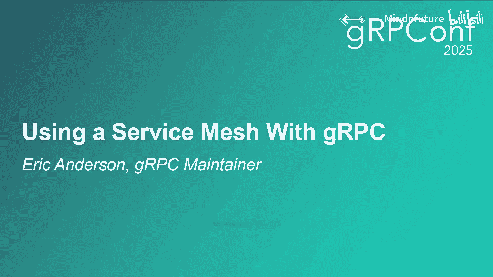
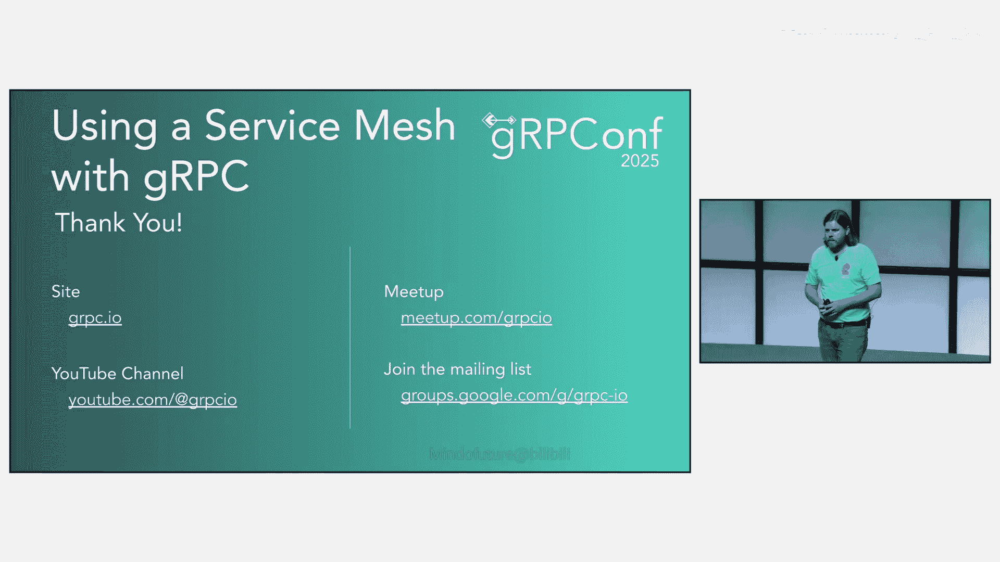

# 014：使用服务网格与gRPC 🚀

在本节课中，我们将要学习服务网格（Service Mesh）的基本概念、它与gRPC的交互方式，以及不同的服务网格架构如何影响gRPC应用的性能、安全性和部署。我们将探讨何时选择代理模式（Proxy）或无代理模式（Proxyless），并理解其中的权衡。

## 概述

服务网格是一个用于增强服务间通信的基础设施层。它处理诸如加密、负载均衡、可观测性和弹性等功能，并将这些功能从应用代码中解耦。这使得开发者可以专注于业务逻辑，而服务网格则确保服务交互的可靠与安全。

## 什么是服务网格？ 🧩

服务网格是应用的基础设施层，用于增强服务到服务之间的通信。它处理诸如加密、负载均衡、可观测性和弹性功能。这些功能与应用代码解耦，因此可以独立管理。这也使得开发者能够专注于业务逻辑，而服务网格则确保服务交互的可靠与安全。

## gRPC与服务网格的兼容性

一个常见的问题是：服务网格能与gRPC一起工作吗？答案是肯定的。gRPC需要HTTP/2，而HTTP/2通常被广泛支持。另一个相关的问题是：哪种服务网格与gRPC配合得最好？这两个问题的答案都取决于你使用服务网格要解决的具体问题。因此，请记住，选择是围绕你的具体目标展开的。

问题在于，“你”的需求可能有些模糊。你的团队可能有特定需求，但公司里的其他团队也在优化他们自己的需求。例如，基础设施团队可能希望部署简单，而兄弟团队可能想要更多功能，另一个团队可能追求性能。因此，建议你记住，这是一个看似简单但实则复杂的问题。

## 服务网格架构类型 🏗️

考虑到这些不同的目标，让我们看看gRPC如何与服务网格交互。为此，我们需要了解一些服务网格架构。以下是几种粗略的架构分类，不同的人可能使用不同的名称，但足以用于本次讲解：网关（Gateway）、守护进程集（DaemonSet）、边车（Sidecar）、无代理（Proxyless）。让我们逐一看看它们有何不同。

### 无网格架构

首先从“无网格”开始。我们只有应用程序，服务直接相互通信。这种方式可以工作，但可能存在负载均衡问题。总的来说，它缺乏安全性，并且对策略变更的响应可能很慢。

“对策略变更响应慢”意味着，如果你想更改一个设置，必须推出应用程序的不同版本。如果需要对客户端进行更新，情况可能特别棘手。例如，如果你是图中的App4，可能很难让App1重新部署。

### 网关架构

你可以在客户端和服务器之间放置一个代理，现在你获得了良好的负载均衡，并且可以快速更新服务的策略，而无需重启或重新部署客户端或服务器。

我使用“网关”来称呼这种模型，这可能看起来有些奇怪，因为我们最常在网格间通信时使用“网关”，但其架构本质上是相同的。与典型的服务网格相比，这种架构主要缺少的是安全性。请注意，代理可以在多个服务之间共享，也可以每个服务拥有自己的代理。

### 守护进程集架构

现在我们来到第一种服务网格的架构。我们在每个节点上放置一个代理，并设置一些内核规则，使得该代理能够控制应用程序的网络通信。

现在，代理可以强制执行并使用双向TLS来加密网络流量，并限制对服务的访问。代理使用Kubernetes的守护进程集在每个节点上运行，然后在节点上的Pod之间共享。

### 边车架构

接下来是第二种人们常与服务网格关联的架构。不是每个节点一个代理，而是每个Pod一个代理。这种架构与守护进程集的主要区别不在于功能，而在于部署和资源。如果一个应用产生大量流量，你可以给该Pod的代理分配更多资源。但另一方面，它将共享Pod的资源，这可能会增加部署的复杂性。

## 回到起点：为什么需要服务网格？ 🤔

既然这是一个关于gRPC的演讲，让我们回到第一张架构幻灯片。服务网格的初衷是，人们有一些应用程序自身无法实现各种功能，而为各种语言的不同客户端和服务器库添加这些功能工作量太大。因此，他们决定使用代理。但是，如果客户端和服务本身直接具备这些功能，那么你就不需要代理也能实现。

让我们再次看看我们的架构列表。这些架构有一定的灵活性。例如，Linkerd可以切换到边车模式，以便按Pod启用，这得益于更高效的代理成为可能。Istio的Ambient Mesh则切换到一个更小的守护进程集代理，以简化资源管理，因为代理不再与应用竞争资源。

但为什么Istio会同时使用守护进程集和网关呢？我们可能不需要完全理解这一点。

## 代理类型：L4与L7 🔌

当我们谈论代理时，有两种主要类型对架构很重要。一种是OSI参考模型中的第3层或第4层，即网络层或传输层。这类代理工作在IP或TCP层面。

我们将它们统称为L4代理，因为尽管从技术上讲它们可能工作在不同的层，但它们产生的结果相似。

另一种是第7层，即OSI模型中的应用层。对我们来说，这类代理通常处理HTTP，尽管它也可以处理其他协议。

我知道有些人可能只认为L7代理才是代理。一些L3代理，我们只称之为路由器，人们可能不认为它们是代理，但它们确实是。它们在做很多相同的事情。这应该提醒我们，实现方式很重要。路由器速度非常快，我们甚至不考虑它们的延迟成本。它们就在那里，这很好。部署和维护也被抽象化了。我们通常不考虑使用什么规格的机器或CPU使用率，只是让它运行。

概括来说，L4代理往往更高效，而L7代理往往功能更丰富。考虑到这一点，再次思考：为什么Istio会同时使用守护进程集和网关？答案是，一个是L4代理，一个是L7代理。

## gRPC对服务网格的特殊之处 🎯

好了，我们已经有几张幻灯片没谈gRPC了。那么，是什么让gRPC对网格来说很特别呢？答案很简单：HTTP/2。HTTP/2可以在单个连接上处理多个请求。这与HTTP/1.1不同。

回顾我们之前提到的代理类型，L4代理只能对连接进行负载均衡。HTTP/2需要更少的连接，因此获得负载均衡的机会更少。你们中的许多人可能对Kubernetes中的这种情况很熟悉。如果每个客户端只占服务器总负载的一小部分，Kubernetes原生的L4负载均衡可能就足够了。但对于负载较重的客户端，你需要进行L7负载均衡，而gRPC原生支持这一点。这就是为什么人们随后会使用无头服务（Headless Services）。HTTP/2在部署这些网格时也会导致类似的行为。

## 架构示例分析 📊

例如，这对gRPC效果如何？我们使用较新的Istio架构，但选择不使用Waypoint代理。这些代理只能进行L4级别的负载均衡。

因此，这将表现得类似于Kubernetes的负载均衡。如果你有小型客户端，这可能没问题。否则，你可能需要为每个RPC添加一个Waypoint代理，以实现更好的后端分发。

再举一个Linkerd的例子。这看起来非常相似。但现在代理是L7的。所以实际上这样就足够了，你不需要再添加其他东西。

## 性能与安全考量 ⚖️

我时间掌握得不错，所以再补充一点。你可能想知道HTTP/2是怎么回事。Linkerd实际上可以从HTTP/1.1升级到HTTP/2。当它使用某些东西时，Istio的Ztunnel也可以使用HTTP/2进行自身通信。然后我们让gRPC使用HTTP/2。为什么我们要为所有这些使用HTTP/2？答案实际上是安全。进行安全握手可能非常昂贵。如果你使用明文，你不会注意到，因为没有TLS握手。但一旦你开始尝试做安全，建立连接就变得昂贵得多。这就是为什么这些不同的工具系统试图重用连接并避免不必要的握手。

如果你的服务对性能敏感，那么无代理模式最终可能对你选择哪种架构更有意义。代理会增加延迟。因此，当你追求极致性能时，你会希望移除任何可能的延迟源。如果你几乎只使用gRPC，那么无代理模式可能是一个不错的选择，因为我见过一些开发者选择它，因为他们不需要担心部署代理。他们可以迭代式地只对特定工作负载推出，并一次性地开启网格部署。

但这假设你不需要代理来处理非gRPC流量。如果你的应用程序混合使用gRPC和其他东西（如REST），无论如何你都需要部署和管理代理。所以这没问题。你会使用一个基于常规L7代理的网格，它与gRPC配合得很好。

根据你的需求，你仍然可以尝试将其与无代理模式混合使用，但你的网格需要支持这一点。

## 可选的无代理模式示例：Google Cloud Service Mesh ☁️

为了演示我所说的“可选地使用无代理模式”是什么意思，让我们看看Google的Cloud Service Mesh。顺便提一下，如果你熟悉那个名字，它以前叫做Traffic Director。

Cloud Service Mesh支持无代理模式，但你可以为每个Pod选择是否使用代理。然而，它仍然形成一个单一的网格。因此，图中的App1将使用无代理模式，但App4使用边车，但它们仍然可以直接相互通信。

我知道Istio也对无代理模式有实验性支持。gRPC确实在那里引入了一个不兼容性，但我希望这能在C++和Java中很快得到解决。

## 问答环节精选 💬

**问：** 关于版本控制，特别是当你进行版本变更时，哪种服务架构能真正扩展到数千个gRPC部署？

**答：** 对于模式更新，你需要服务器与旧客户端兼容，所有架构都工作得差不多，这更多是在应用逻辑层面。一个区别是，如果你想进行A/B测试或红绿部署等变体，网格有工具可以帮助。但就管理而言，哪种架构真正能扩展？一般来说，扩展性主要与节点或Pod的数量有关，客户端和服务器的版本数量可能根本不是一个重要因素。

**问：** 请详细说明为什么建议对gRPC重度使用无代理模式，以及在这种情况下服务网格的功能将如何实现？

**答：** 如果有很多重度使用gRPC的工作负载，如果你能只启动一个作业并开始为这一个服务使用无代理模式，那会非常好。你可以尝试一下，看看是否喜欢。它不需要是整个Kubernetes集群的选择。我知道其他一些网格也允许你按Pod启动，但你得到了类似的好处，可以轻松尝试，对代码做一个小改动，就可以选择并比较你是否喜欢它。gRPC将实现各种功能。是的，有可能你想要的一些功能gRPC没有实现。在那些情况下，你最终会想要使用代理。很多人想要的功能都在gRPC中。所以，如果是一些常规功能，检查一下，它可能正在做你想要的事情。如果不是，我们可能有兴趣弄清楚那个功能是什么。但是，是的，如果明天发布了一个新版本的网格，gRPC可能不支持那个新功能，而L7代理可能会支持。这是需要考虑的。所以，是的，无代理模式可能功能较少。但对很多gRPC用户来说，这不是问题。它要么对你是个问题，要么不是。有些人可能谈论使用WASM之类的东西，功能使用越复杂，gRPC不支持的可能性就越大。

**问：** 关于安全性，如果gRPC是无代理的，谁来管理边车？管理边车是一种开销，是你在网络或其他方面必须考虑的其他问题。那么，如果我们都回到无代理模式，为什么我还要选择边车模型呢？

**答：** 最初你会。在我的演讲中，有第三点：你混合了各种东西。网格出现时，你有一些遗留应用程序，或者你只是以五种不同的方式做事。很难在所有地方都获得所有功能。代理在这种情况下工作得非常好。你是在做权衡。你要么在资源成本、延迟等方面付出代价，而你可能甚至不在乎，因为你获得的价值与这些微小成本相比是如此巨大。但是，是的，如果你主要是一家gRPC商店，有很多通信，进行大量RPC，那么这就是一个不同的计算了。

**问：** 关于gRPC的安全性，我完全同意建立连接会很昂贵。所以这就是为什么一旦你建立了连接，你可能只做一次。无代理模式是如何工作的？你只在建立连接时进行身份验证和授权吗？

**答：** gRPC的行为方式与代理在那里时的行为方式类似，你尝试重用连接。关于身份验证的具体细节，你如何进行身份验证。但正常的网格代理身份验证会以相同的方式发生。正常的模式是，你在每个事务发生时都进行身份验证，因为它更像是HTTP/1.1级别。所以那是每个事务。我希望gRPC模型能让我们摆脱那种方式，对于网格来说，很多他们谈论的身份验证，你可以谈论两种身份验证：一种是服务到服务的身份验证，另一种是像用户身份验证。服务到服务的身份验证可以每个连接做一次，然后他们尝试重用这些连接。

## 总结 📝

本节课中，我们一起学习了服务网格的核心概念及其与gRPC的交互。我们探讨了从无网格到网关、守护进程集、边车和无代理等多种架构，理解了它们各自的优缺点和适用场景。关键点在于，gRPC基于HTTP/2的特性（如多路复用）对服务网格的负载均衡行为有显著影响。L4代理高效但功能有限，L7代理功能丰富但可能引入延迟。选择无代理模式可以避免代理开销，特别适合gRPC重度使用且对性能敏感的场景，但前提是你的应用栈相对统一且所需功能gRPC原生支持。最终，架构选择应基于你的具体需求，在功能、性能、安全性和部署复杂度之间做出权衡。