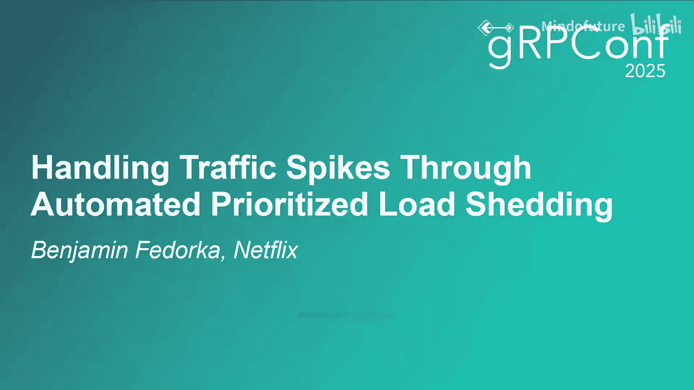
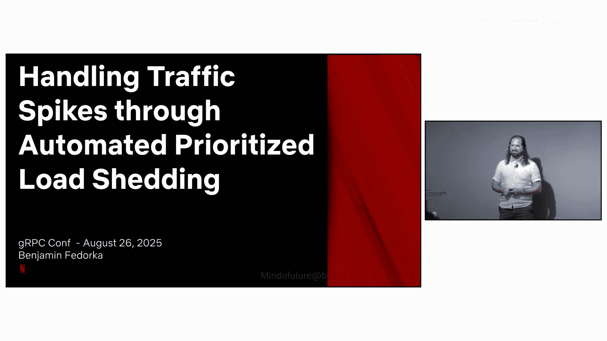

# 016：通过自动化优先负载削减处理流量高峰 🚀

在本节课中，我们将学习Netflix如何通过自动化、基于优先级的负载削减策略，来优雅地处理突发的流量高峰，从而在不增加服务器容量的情况下保护核心用户体验。

## 概述

我是Benjamin Fudorka，来自Netflix Java平台团队。我的主要工作是帮助工程师们轻松地集成他们的后端系统。我们通过提供一系列RPC框架（包括Netflix JRPC Java、Netflix Web Client、Spring WebMVC等）以及相关工具链，为JVM应用中的点对点通信提供一致的开发者体验。

Netflix JRPC Java是我们功能最丰富、最复杂的RPC框架，支撑着超过600个应用、1300项服务和1500多个客户端应用。确保这一切易于使用是我们的核心目标。今年，我们将深入探讨我们如何处理流量高峰，同时保护客户体验的能力。

## 为什么不能简单地自动扩容？🤔

一个自然的想法是：当流量增加时，自动增加服务器数量。这确实是我们通常的做法，我们允许集群自动扩容，并在重要内容发布前进行预扩容。

然而，单纯依赖扩容存在几个问题：
*   **成本高昂**：增加服务器意味着直接增加资源成本。
*   **存在容量上限**：我们可能会遇到无法添加更多节点的限制，例如控制平面达到极限或数据库连接数饱和。
*   **速度不够快**：自动扩容需要时间启动新实例，而新实例在启动初期性能较差（“冷启动”问题），这使其在面对瞬时突发流量时反应不够迅速。

因此，虽然我们改进了预扩容和自动扩容技术，但并未完全依赖它们来实现我们的目标。

## 理解系统故障：拥堵性失败 🚧

如果不做任何处理，系统在流量高峰下最常见的故障模式是“拥堵性失败”。

想象一个系统接收的流量持续增加。起初，所有请求（绿色）都能成功处理。随着流量和系统利用率攀升，系统会到达一个临界点（利用率达到100%），此时几乎所有请求（红色）都会失败。这是最坏的情况，系统会迅速从正常工作状态过渡到完全失败，并且通常无法自行恢复，即使重启节点也需要付出代价。

## 核心概念：成功缓冲区与失败缓冲区 🛡️

我们可以将系统想象成一条高速公路。大多数时候，道路有充足的容量容纳所有车辆，我们预留的这部分额外容量称为**成功缓冲区**。它允许系统成功处理额外的请求而不产生任何失败。

当流量过大时，会发生“交通堵塞”，即拥堵性失败。一个简单的改进是：在入口匝道设置一个红绿灯，只在道路有容量时才放行车辆。我们预留的这部分用于优雅拒绝请求的容量，称为**失败缓冲区**。被红绿灯拦下的请求可以被“削减”，即永远不会被处理。但关键的是，仍然有一些请求能够通过，并且我们知道哪些请求被削减了，因此可以做出优雅的响应。

## 从测量到行动：关键指标与自动化决策 📊

要操作这个“红绿灯”，我们需要知道系统能支持多少请求。但这取决于许多因素：单节点能力、节点数量、请求成本差异、依赖的下游服务能力等。手动为每个集群确定一个静态数值既耗时又不准确。

因此，我们决定测量少数几个具体的、可客观度量的信号：
*   节点的CPU消耗
*   资源是否出现排队
*   支撑服务的利用率
*   **最重要的是：每个请求的耗时（延迟）**。在高速公路的类比中，这就是“你到家需要多长时间”。

挑战在于，我们需要了解每个请求的正常耗时，而它们各不相同。我们需要自动区分系统执行的不同类型的工作，并判断其延迟是否符合预期分布。过去我们在服务级别跟踪延迟分布，但现在我们为每个独立的RPC进行跟踪，这帮助我们更好地适应一天中不断变化的请求组合。

集群中的每个服务器持续分析自身性能，将原始数据标准化为一个代表**系统利用率**的数值。当系统利用率过高时，我们就开始拒绝请求。

## 演进：从平等削减到优先感知削减 ⚖️

上述技术并非全新，我们多年来一直在优化。然而，仅凭这些仍无法提供我们所需的全部容量。

我们之前的假设是：所有请求应有同等的概率被拒绝。但并非所有请求都具有相同的价值。我们可以利用这一点。

例如，当您访问Netflix网站时，网站可以预测您可能点击的内容并预取信息。这些预取请求如果出错是可以接受的。但一旦您点击了某个内容，获取该数据的请求就变得**至关重要**。

关键在于：我们并不需要为所有请求都增加成功缓冲区，只需要为我们最关键的请求增加即可。因此，我们需要对流量进行优先级分类，实现**优先感知**的负载削减。
*   无拥堵时：服务所有请求（包括预取和非关键请求），以提供更好体验。
*   负载增长快于扩容速度时：根据优先级逐步阻止请求。
*   拥堵非常严重时：甚至可能开始削减重要（但非最关键）的请求，以确保最关键的业务能通过。

以前我们只在边缘应用此逻辑，现在则能在调用栈的所有层级应用，使系统对意外的负载模式和调用图深处的问题反应更灵敏。

## 示例：四级优先级的削减策略

我们将请求优先级简化为四个等级进行说明：
1.  **利用率极低时**：接受所有类型的请求。
2.  **利用率开始上升时**：逐步削减较低优先级的请求。
3.  **利用率变得很高时**：开始削减重要（但非最关键）的请求。我们宁愿服务部分关键流量，也不愿让系统崩溃重启。

我们为每个集群调整这些阈值，以根据其预期的请求分布定制分级响应。

## 进阶策略：通过去分片化创造缓冲区 🧩

几年前，我们会根据关键性对流量进行分片（即运行独立的集群）。成功缓冲区和失败缓冲区是通过保有未使用的容量来实现的，这很昂贵。

我们可以通过允许非关键请求拥有更小的缓冲区来节省成本。我们还可以针对吞吐量而非延迟来优化非关键流量分片，从而降低其成本。如果我们将这些流量去分片化（合并回主集群），那么所有这些容量现在都可用于关键流量。

这显著增加了关键调用的成功缓冲区。我们甚至可能使用更少的总体容量，因为我们现在能更高效地利用资源来服务非关键流量。此外，运营更少的集群也减轻了工程师的认知负担。

我们不需要对所有服务都进行去分片化，但这项技术是为你最关键流量增加成功缓冲区的绝佳方式。它让我们在需要时能立即获得额外的计算资源，同时在正常负载下仍能高效使用它们。

## 总结：组合策略的效果 ✅

本节课中，我们一起学习了Netflix处理流量高峰的组合策略：

1.  **优化现有负载削减能力**：通过测量延迟和利用率，维持特定的成功与失败缓冲区。
2.  **实施优先感知削减**：认识到我们不需要为所有请求增加容量，只需为最关键请求保障容量。通过削减低优先级请求，将容量让给高优先级请求。
3.  **去分片化集群**：为最关键流量创造额外的成功缓冲区。

通过自动化这些决策，系统的响应速度可以快于人工操作。通过在每集群基础上应用此能力，我们允许特定功能优雅降级，而其他部分仍以其最大容量运行。

与遭受拥堵性失败的系统相比，具备优先负载削减能力的系统不会突然崩溃。它能在整个流量高峰期间持续服务基线流量。在高峰初期，系统会切换为仅服务关键流量，确保我们为已服务的请求提供最大价值。当然，如果负载超过了我们设定的失败缓冲区，服务器仍会拒绝请求，但这是一种受控的、优雅的降级，而非全面的系统崩溃。

## 技术实现与自动化配置 ⚙️

上一节我们介绍了策略思想，本节中我们来看看如何将其大规模落地。系统需要大量调优：每个RPC的预期延迟分布、每个集群的请求优先级分布、每个集群的CPU和数据源预期利用率水平等。手动维护这些信息是不可行的。

因此，我们设计并构建了一个系统，用于按集群管理和验证负载削减配置。该系统的工作流程如下：

以下是自动化配置管理的关键步骤：
1.  **自动分析**：在正常运营期间，自动分析每个集群的历史调用延迟、调用量、请求优先级、CPU使用率等信号，结合少量专家建议，生成一个韧性配置。
2.  **实验验证**：通过实验自动化平台验证每个韧性配置。实验将候选配置应用于集群，并验证其能否正确服务基线负载。然后，向实验集群施加流量高峰，确认其具备预期的成功与失败缓冲区。
3.  **自动应用**：一旦验证通过，自动化系统会分析结果并将配置推广到生产集群。

我们的优先负载削减工作也改进了自动扩缩容逻辑。韧性配置中包含快速检测流量高峰和预测所需资源的信息，以便在有容量时自动扩容，满足流量需求。

## 架构与开源共享 🤝

从技术角度看，负载削减能力主要通过相对简单的JRPC拦截器和Envoy过滤器实现。

以下是核心组件交互：
*   **客户端**：JRPC客户端拦截器为发出的请求标注其优先级。该优先级通过调用栈传播到所有下游请求。
*   **代理层**：负载削减决策在边车代理Envoy中做出，依据的是客户端设置的请求优先级。
*   **服务端**：对于被允许的请求，gRPC服务端拦截器监控其延迟分布，并与该特定服务或RPC的预期分布进行比较，用于计算系统利用率。实际延迟分布也会保存到指标数据库，供未来调优使用。
*   **反馈**：应用程序通过边信道，使用开放标准（如ORCA）将完整的利用率数据集传回Envoy。

我们站在巨人的肩膀上，也通过博客和演讲持续与社区分享我们的进展。

本节课中，我们一起学习了Netflix如何通过自动化、基于优先级的负载削减策略，在不增加服务器容量的情况下，优雅应对流量高峰，保障核心用户体验。这套组合拳包括优化传统负载削减、实施请求优先级识别与差异化处理，以及通过去分片化策略高效利用资源，并通过全自动化的配置管理管道实现大规模落地。