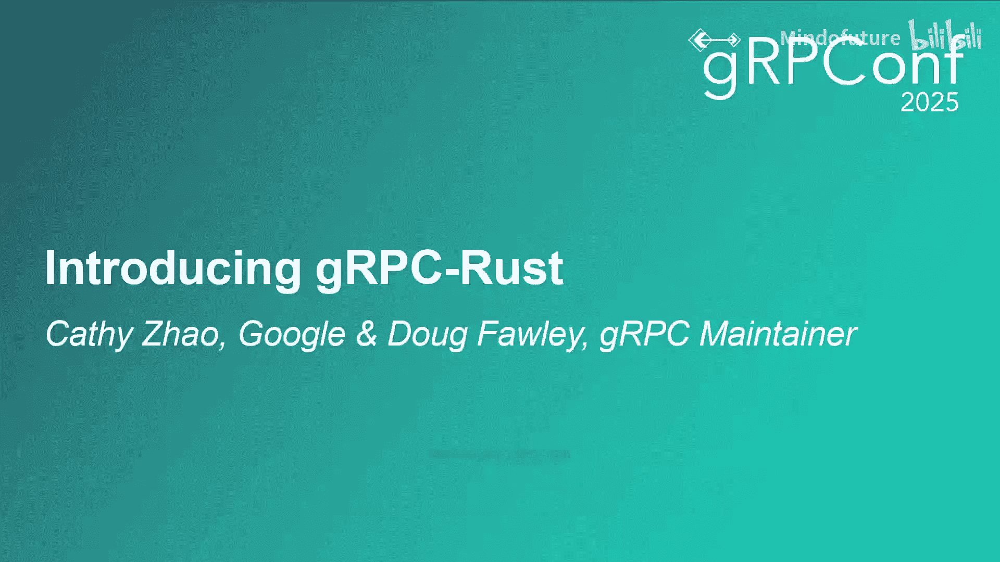
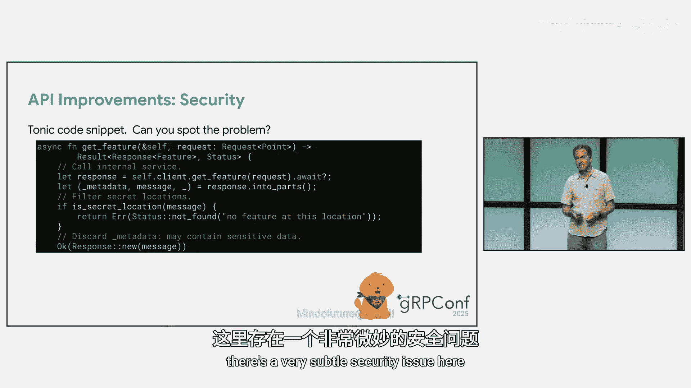
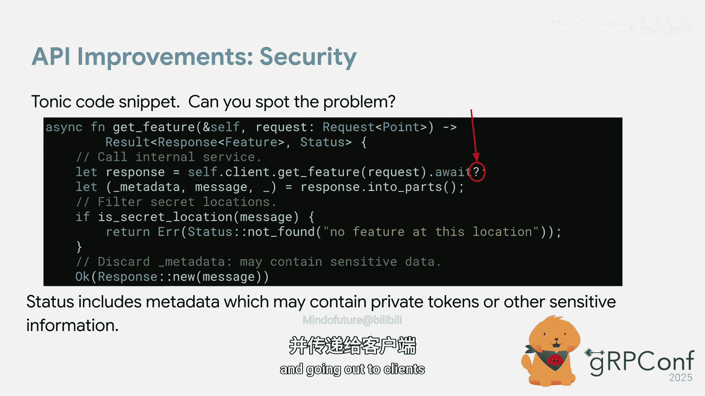
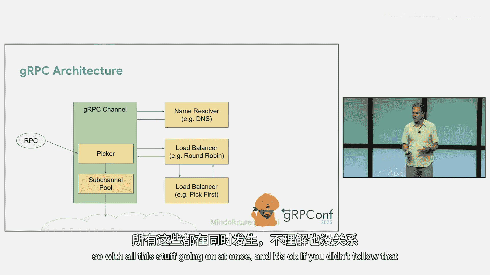
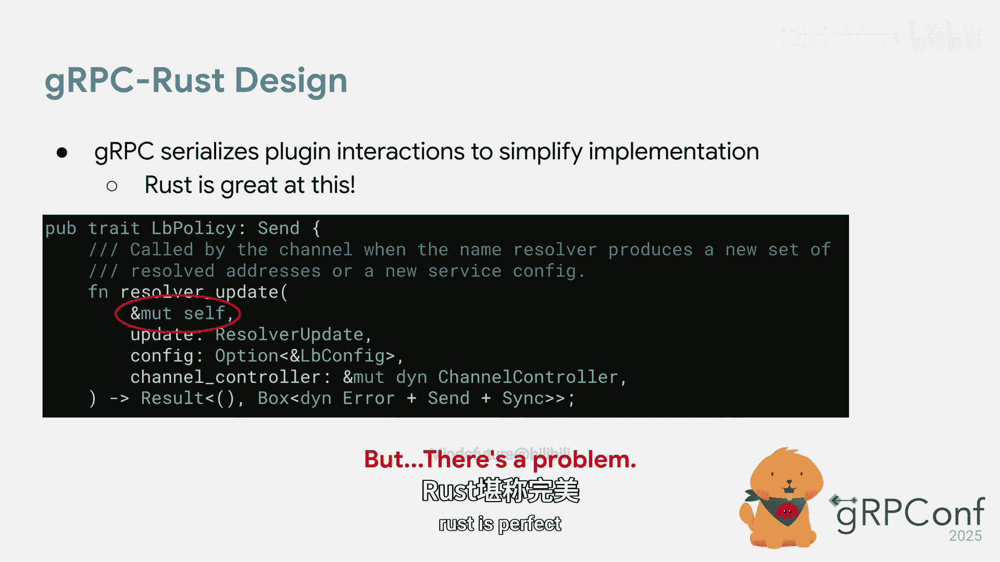
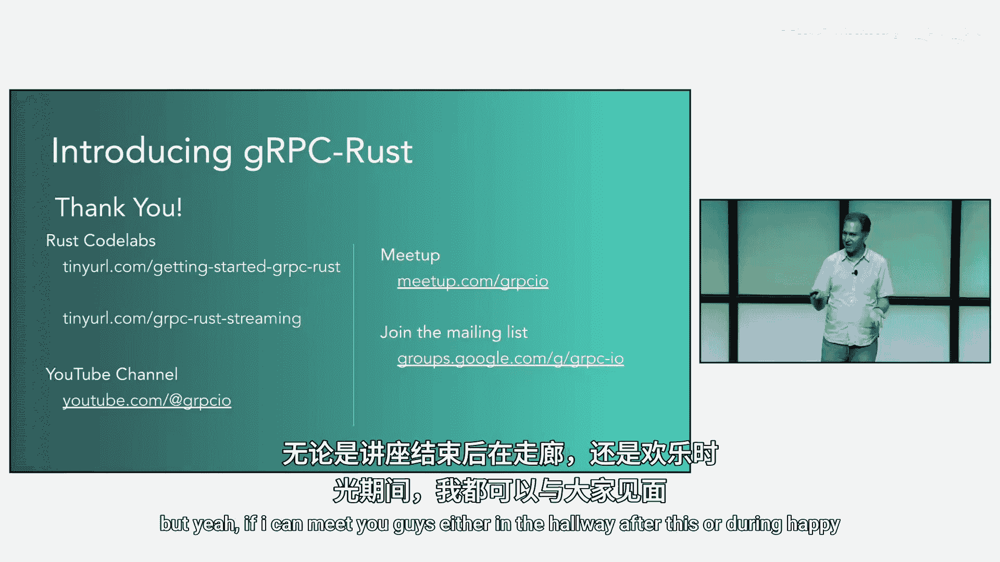

# 017：介绍 gRPC Rust

在本节课中，我们将学习 gRPC Rust 的当前进展、面临的挑战以及 Rust 语言的基础知识。课程分为两部分：首先介绍 Rust 语言的核心特性，然后深入探讨 gRPC Rust 的实现细节和未来规划。

## Rust 基础：为何它如此特别？ 🦀

上一节我们概述了课程内容，本节中我们来看看 Rust 语言的基础知识。Rust 是一门近年来人气迅速增长的语言。在 2023 年和 2024 年初的 gRPC 大会上，我们收到了许多关于 gRPC Rust 支持的询问。截至 2024 年，Rust 开发者数量已达到 400 万，自 2021 年以来增长了三倍，赶上了许多流行语言。

此外，自 2016 年起，Rust 每年都被 Stack Overflow 评为最受喜爱的语言。Rust 于 2015 年首次发布，这确实表明人们对它充满热情。

从 TIOBE 指数可以看出，Rust 自首次发布以来人气确实大幅增长。

许多大公司都在使用 Rust。例如，微软正在用 Rust 重写部分 Windows 组件。亚马逊用 Rust 构建了微虚拟机 Firecracker。Meta 也在用 Rust 重写一些内部源代码控制工具。

Rust 变得如此流行主要归因于三点：安全性、性能和便利性。

Rust 是一门非常安全的语言，它在编译时强制执行内存安全。如果你使用过 C 或 C++ 等其他低级语言，可能遇到过一些难以追踪的 bug，甚至让 bug 进入了生产环境。对于 Rust，编译器会告诉你代码是否存在这些问题。它会指出代码是否存在段错误、内存泄漏或数据竞争。

Rust 通过**所有权**和**生命周期**这两个概念来强制执行内存安全。

所有权是一套安全管理内存的规则。编译器检查这些规则以确保代码内存安全。基本规则是：**Rust 中每个值在任意时刻有且只有一个所有者**。然而，你可以通过引用来借用所有权。但使用引用也可能出现问题，因此 Rust 有一个借用检查器。它强制执行关于数据如何被访问的规则，确保你只能有一个可变引用，或者任意数量的不可变引用。

此外，Rust 中的变量具有生命周期。生命周期本质上是一个引用有效的范围。它确保引用在值被释放后不会指向垃圾数据或垃圾内存。

Rust 的总体目标是防止段错误、数据竞争和内存泄漏。

Rust 也是一门性能很高的语言。如果你使用过 Java 或其他带有垃圾回收的编程语言，你可能知道垃圾回收会导致相对较长的暂停，并且可能有些不可预测。Rust 没有这个问题。此外，使用 Rust 可以直接管理内存，这意味着程序员可以进一步优化性能。Rust 还具有零成本抽象的特性，这意味着高级代码（如函数或结构体）不会比机器级代码产生更多开销。

如前所述，内存安全检查都在编译时进行。因此在运行时，你不会产生这种开销。

Rust 也是一门非常方便的语言。我个人非常喜欢用 Rust 编码，觉得它容易得多。这得益于 Cargo 包管理器，它使得管理依赖和创建项目变得非常容易。我们今天没有时间举例，但它确实让编码变得更容易。此外，Rust 处理错误非常方便，稍后 Doug 会举例说明。Rust 还有诸如 `rustfmt` 或 `rust-analyzer` 等工具，它们可以格式化代码，并在编译前检查代码是否存在问题。

此外，如果你遇到编译器错误，Rust 有非常详细的编译器错误信息。它会几乎准确地告诉你如何修复以及修复方法，这让我的工作轻松了许多。

为了给你一个直观对比，Rust 和 C++ 都具有零成本抽象，性能都很高。然而，Rust 能防止内存和并发错误，而 C++ 不能。Rust 内置了生命周期和所有权机制，C++ 则没有。

## 为何要构建 gRPC Rust？ 🤔

上一节我们了解了 Rust 的优势，本节我们探讨构建 gRPC Rust 的原因。从幻灯片可以看出，实际上很多人对此抱有期望。这只是我们邮件列表中的一部分，但很多人对添加 gRPC Rust 充满热情，非常关注进展并希望了解更新。

此外，Rust 在 gRPC 用户群之外也越来越受欢迎，我们希望满足所有人的需求。

Rust 和 gRPC 的理念一致，因为它们都关心安全性、可靠性和性能，因此这确实是一个完美的组合。

## gRPC Rust 的实现与挑战 ⚙️

上一节我们讨论了构建 gRPC Rust 的动机，现在 Doug 将接手，介绍 gRPC Rust 的实现背景、团队面临的挑战以及项目进展。

如果你不了解，Rust 已经有一个 gRPC 实现。它是用纯 Rust 编写的，叫做 **Tonic**。它可以说是事实上的标准，使用非常广泛。但它确实有一些局限性。

它基本上只实现了有线协议，而没有提供我们在大多数其他语言中提供的所有额外功能，例如负载均衡以及进行客户端健康检查的能力（该功能允许客户端检测服务器是否遇到问题并避免使用它们）。Tonic 期望你在其周围构建这些功能，它只提供 gRPC 的基本功能。

这就是 gRPC Rust 团队的切入点。我们正在 Tonic 的基础上进行构建。我们将把上一张幻灯片中提到的所有 gRPC 功能添加到我们为 gRPC Rust 提供的产品中。

我们将继承 Tonic 的一些设计目标，例如保持纯 Rust 实现，以便 Rust 用户获得最佳体验。当这个版本发布时，你可以在 crates.io 上找到它。我们已经获得了 `grpc` 这个 crate 名称。

实际上，我们至少在过去一年里一直与 Tonic 的维护者 Lucio Franco 合作。他去年参加了 gRPC 大会并与我进行了交谈。我们正在与 Tonic 合作，而不是创建另一个让大家纠结该用哪个的新东西。我们与他合作，本质上是为了提供一个新的东西，它将取代 Tonic。

当我说“取代”时，并不意味着你必须迁移，否则东西就无法工作。我们预计会继续维护 Tonic 并为其发布安全补丁。但它最终将停止增加新功能。我们将把整个项目上游到 CNCF 下的 gRPC 项目中。

但如果你已经在使用 Tonic，并且选择迁移到 gRPC Rust，那么你应该不会注意到任何变化，并且你将获得所有新功能。

不幸的是，它不会完全向后兼容。我稍后会谈谈原因。但我们会提供迁移指南，以便使用 Tonic 的用户可以按照基本步骤进行迁移。

我想特别感谢 Lucio。他今天不能到场。但在过去的一年里，我基本上每周都和他开会讨论这个项目。非常感谢 Lucio。

## Tonic 的现状与改进方向 🔍

上一节我们介绍了项目背景，现在我想谈谈我们在推进这个项目过程中遇到的一些问题。我们正在研究 Tonic 的 API，试图弄清楚：我们能用它做什么？这真的是我们用户想要的体验吗？等等。我们确实发现了一些问题，其中一些是我们最近才注意到的。

例如，出现了一些安全问题，一些我们认为可以做得更好的微小性能问题，以及一些我们可以修复的 bug，还有一些我们想借此机会改进的可用性问题。

以下是几个例子。这是一段当前编写的 Tonic 代码，这里有一个非常微妙的安全问题。

这是一个服务实现，用于处理客户端请求。为了做到这一点，它需要调用一个内部服务作为其工作的一部分。它查看响应，检查它是否是秘密内容。如果是，则返回错误；否则，直接返回。bug 出现在这个看似无害的问号附近。

这个问号的作用是：获取调用内部服务时产生的任何错误，并将其转发给调用你的客户端。问题不仅在于错误代码可能不正确（你可能想转换它，但这允许你绕过这一点，这不是我们想要的），也不仅仅是错误消息本身可能有问题。实际上，Tonic 中的状态包含元数据，而元数据可能包含你的 API 令牌等，你肯定不希望这些泄露给客户端。因为它让这件事变得如此容易，我们认为确实需要改变并防止这种情况发生。

我们发现的另一个可以改进的问题是，Tonic 非常喜欢对请求和响应中的 protobuf 消息使用拥有所有权的消息。

作为 Tonic 用户，这非常直观且易于使用，但它确实带来了性能损失。因为你发出的每个请求都需要分配一个请求消息。对于每个响应，gRPC 也需要为响应分配一个消息。双方在完成后都会将其丢弃。因此，尽管这不是一门垃圾回收语言，但分配内存仍然有成本。如果我们能重用这些消息会更好。所以我们也在研究改进的方法。

最后，这只是我们发现 Tonic 问题的一长串清单中的一部分。最近出现的一个问题是截止时间传播。传入的请求有一个截止时间，确保你将其传播到传出的请求。正是这类问题让我们需要重新审视 Tonic 的现状。

## gRPC 架构与 Rust 适配的挑战 🏗️

上一节我们讨论了 Tonic 的改进点，现在我想稍微深入幕后，看看我们 gRPC Rust 团队在将适用于当今所有语言的 gRPC 设计迁移到 Rust 时遇到了什么，以便我们能够支持之前讨论的所有功能。

在所有语言中，从高层次看，这些都是 gRPC 的基本设计挑战。我们的通道是非常异步的。它们同时处理很多事情。gRPC 通道不断创建连接，并可能每秒通过它们路由数百万个 RPC。

我在这里稍微介绍一下背景，让大家快速了解 gRPC 架构的工作原理。这将是非常高层次的，会很快。如果你跟不上，没关系。如果你对此感兴趣，我的同事 Ewar 在 4:10 有一个演讲，他会更详细地介绍这些工作原理。如果你有兴趣，可以去看看。如果你在 YouTube 上观看，也可以在我们的 YouTube 频道上找到那个视频。

那么，我们开始吧。gRPC 通道基本上是你连接到服务的典型客户端连接，是虚拟连接。那么，其中运行着哪些组件呢？有一个名称解析器组件。它负责将通道目标（例如 `example.com`）转换为 IP 地址列表。它不断地进行此操作，并随着 DNS 随时间变化而产生新的 IP 地址。

它还输出配置，用于配置负载均衡策略。负载均衡器，我们在 gRPC 中提供不同类型的负载均衡器。我们有 `pick_first`、`round_robin`，还有加权轮询，然后是 XDS。如果你一直在听关于代理的内容，所有的 XDS 功能主要通过负载均衡策略实现。因此，名称解析器告诉通道如何配置它。然后负载均衡器启动。它的工作是创建连接，或要求通道创建连接（我们称之为子通道）。然后它还产生一个叫做选择器的东西。选择器用于路由 RPC。

这些是独立的组件，它们都在并发运行。但当 RPC 发生时，它们会询问选择器使用哪个通道或哪个子通道，然后 RPC 通过该子通道进行。

为了让事情更复杂，增加更多复杂性，你可以链式组合负载均衡策略。当你查看 XDS 时，我们广泛地这样做。因此，不同的功能可以位于负载均衡器树中的不同位置。

所有这些事情同时发生。如果你没跟上也没关系。但所有这些事情同时发生时，我们如何保持一切有序？如何让编写这些负载均衡器变得容易？因为我们有超过 20 个负载均衡器。

我们的做法是，将所有这些插件之间的交互序列化，以便一次只发生一件事。这些操作不在 RPC 路径上，它们的性能要求稍低。事实证明，Rust 非常擅长表达这一点。

例如，如果我们看一个负载均衡策略 trait，这是一个 trait 的例子。对于非 Rust 专家，trait 类似于 Go 或 Java 中的接口。本质上，这是负载均衡策略为了接入 gRPC 而实现的东西。我们可以通过在函数方法中放入一个可变接收器来表示串行访问的概念。

这意味着，当这个函数被调用时，负载均衡策略可以可变地访问它自己的状态。因此它可以做任何想做的事情。它能够使用我们传递给它的可变通道控制器来执行操作。所以一切都很完美，对吧？Rust 很完美，我们可以很好地做到这一点。

但事实上有一个问题。当然。当负载均衡策略创建子通道时，这些子通道也是持久存在的，它们会进入连接状态，变为已连接，断开连接等等。因此，这些生命周期事件需要传递给负载均衡策略，以便它知道如何使用该子通道。

在我们所有其他语言中，这些都是通过回调传递的。在那些语言中，这些回调获得与进入负载均衡策略的其他调用相同的保证。因此一次只发生一件事。所以在其他语言中，当你通过回调被调用时，你只需假设你可以直接访问并随意改变你的状态。

但 Rust 对此并不满意。在安全的 Rust 中你不能这样做。在 Rust 中，如果你没有数据的可变引用，你就不能改变它。就是这样。

处理这个问题的唯一方法是，将你需要从回调或内联调用中访问的数据包装在一个互斥锁中。然后在你的回调中放入一个对它的引用，在你的负载均衡策略中也放入一个对它的引用。现在你就在获取锁，即使你知道你不需要，因为你是被同步调用的。我们确实找到了一个可以使用不安全逃生舱口的变通方法。但这有点丑陋。

那么我们决定怎么做呢？我们决定基本上将这些在其他语言中通过回调发生的事情，在 Rust 中变成直接的 trait 调用。这就是我们决定解决这个问题的方法。

但不幸的是，这导致了另一个问题。正如我提到的，我们有我们的架构图。你最终可能会有很多负载均衡策略，实际上这里可能有一个非常深的树。现在每一层都需要跟踪将调用转发给哪个子级，因为我们现在调用父策略，由它转发给正确的子级。所以这里有一个额外的责任。

为了解决这个问题，我们构建了一个辅助类，任何有子策略的负载均衡策略都会使用它。它将监视所有子级的操作，并为我们处理路由。

如果你没跟上，完全没关系。这些不是你作为 gRPC 用户需要担心的事情。这些只是幕后工作，让你了解我们一直在做的事情，以及如果你第一次使用 Rust 编写异步应用程序，可能会遇到的类似情况。

## 项目状态与未来计划 🚀

上一节我们探讨了技术挑战，现在时间不多了，但我想快速更新一下我们项目的状态。正如我所说，我们至少在过去一年里一直在做这个项目。我们在 Tonic 代码库中工作，现在进展相当迅速。我们在那里的 `grpc` 子目录下工作，因为那将是发布时的 crate 名称。

我们已经让基于 Google protobuf 的代码生成器工作了。目前它调用到 Tonic，但我们也完成了上一张幻灯片中展示的基本通道架构。它是完全功能性的。我们有示例来展示它，但那些示例还没有使用 protobuf 代码生成器。所以，我们接下来的任务就是将其连接起来并使其工作。

展望未来，我们目前希望达到的日期是：今年晚些时候发布测试版。如果你正在考虑在 Rust 中启动一个项目，最好等到那时再开始，因为我们认为那时会有一个相当稳定的 API 供你使用。然后我们预计在明年年初发布 1.0 版本。

很快提一下，我们有一个代码实验室。如果你想动手尝试一下 Rust 和在 Rust 中使用 gRPC，我们有一个代码实验室供你查看。今天 4:10 在 Big Maple Leaf 有活动。如果你在线观看，或者你不想或不能今天来，那么这里有一些链接，你可以用它们找到代码实验室，并在自己的时间运行它们。

看起来时间完全用完了。如果有人有任何问题，我非常兴奋能与大家交谈并了解他们的问题。如果我能在大厅里或欢乐时光见到你们，无论如何，我今天一整天都会在。请把我拉到一边。我想听听每个人的意见。

谢谢。

## 总结 📝

本节课中我们一起学习了 gRPC Rust 的全面介绍。我们从 Rust 语言的基础开始，了解了其因安全性、性能和便利性而流行的原因，以及所有权和生命周期等核心概念。接着，我们探讨了构建 gRPC Rust 的必要性，即满足社区需求并与 gRPC 的安全可靠理念契合。然后，我们深入了解了当前基于 Tonic 的实现、其存在的局限性以及改进方向，包括安全、性能和功能完整性。最后，我们分析了将 gRPC 异步架构适配到 Rust 时遇到的技术挑战（如状态管理的同步访问），并了解了项目的当前进展和未来发布计划。通过本课程，你对 gRPC Rust 的生态、技术细节和发展路线有了清晰的认识。