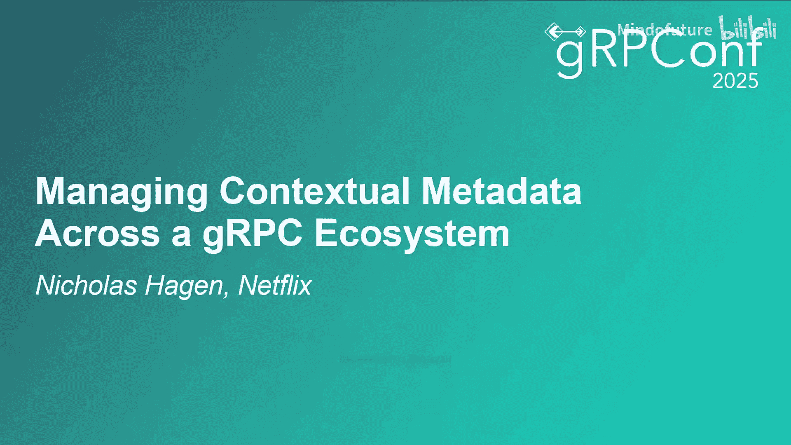
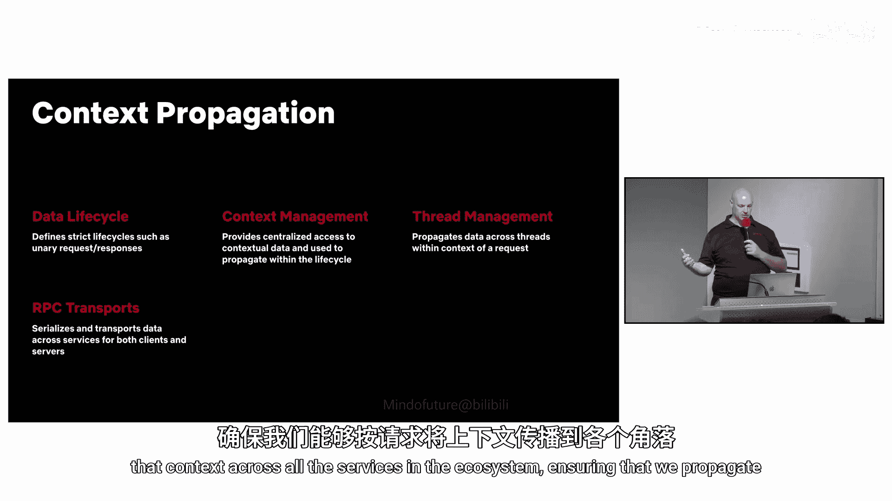
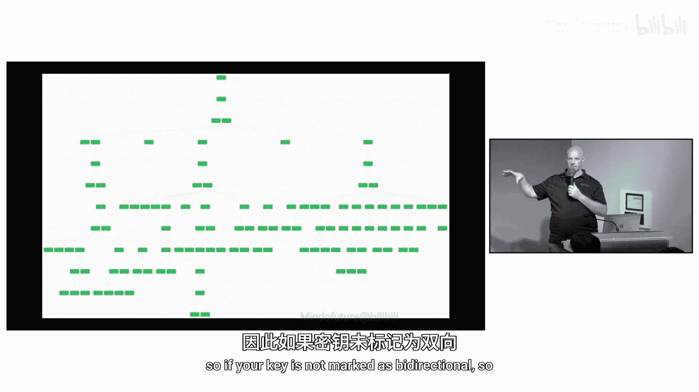
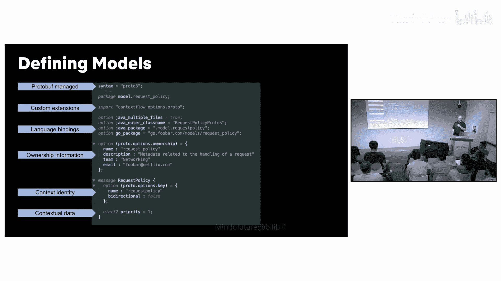

# 018：在gRPC生态系统中管理上下文元数据



在本节课中，我们将学习Netflix如何在其大规模、多语言、多框架的微服务架构中，管理和传播上下文元数据。我们将探讨上下文数据的定义、设计原则、传播机制以及如何确保系统的可观测性。

## 概述：什么是上下文数据？

上下文数据是指与具体业务请求本身无关、但用于实现跨领域功能的通用元数据。它通常是结构化的数据模型，用于增强服务能力。

以下是上下文数据的一些典型用例：

*   **故障注入测试**：用于在服务中注入错误，以验证系统的故障恢复能力。
*   **自定义路由**：支持基于上下文（如A/B测试、金丝雀发布、设备标识）的路由决策。
*   **增强的弹性功能**：例如，**请求优先级**和**负载卸载**。这允许边缘服务设置优先级，下游过载服务根据该优先级决定卸载哪些请求，确保关键请求成功。

上下文数据是**双向**的，它不仅向下游传播，也可以携带更新流回上游，用于实现**背压缓解**和**重试预算**控制等功能。

## 架构演进的经验教训

在介绍当前方案前，我们先回顾从先前架构中学到的一些关键经验，这些经验塑造了我们的设计决策。

*   **明确数据所有权**：了解数据的发布者、消费者和所有者对于简化支持模型和问题排查至关重要。
*   **控制负载大小**：随着功能增加，上下文数据负载可能增长并超过请求头的最大限制，导致失败。必须跟踪大小并定义明确的限制。
*   **支持多语言生态**：Netflix使用多种编程语言（Java, Node.js, Python, Go等）。这要求传输和序列化协议是语言无关的，并且需要提前规划标准化。
*   **聚焦“铺平的道路”**：我们维护一组高度定制化的框架（称为“铺平的道路”），只支持有限的gRPC客户端和服务器实现。这降低了维护成本，但要求服务遵循这条路径，否则可能导致上下文传播中断。
*   **管理传播复杂性**：确保上下文数据在服务内（包括跨线程）和服务间自由、一致地流动是复杂但必需的。

## 核心设计：如何管理数据？



数据管理是维护上下文系统的核心。我们确保数据所有者是架构中的一等公民。

我们使用 **Protocol Buffers** 来定义语言无关的数据模型。这很好地契合了gRPC生态系统，并简化了跨语言的代码生成。Protobuf还提供了前向和后向兼容性，便于数据演进。

所有数据模型都集中在一个公共注册中心，以简化一致性管理、代码生成和权限管理。

让我们看一个定义示例：

```protobuf
// 使用 Protobuf 定义数据模型
syntax = "proto3";

package netflix.context;

import "netflix/context/context_extensions.proto";

message LoadSheddingInfo {
  option (netflix.context.owner) = "Platform Resilience Team";
  option (netflix.context.key) = "load-shedding";
  option (netflix.context.bidirectional) = false;

  int32 request_priority = 1; // 请求优先级字段
}
```

在这个模型中：
1.  **`LoadSheddingInfo`** 是结构化的上下文数据。
2.  我们使用自定义扩展（如 `owner`, `key`, `bidirectional`）来提供框架所需的元数据，包括所有权和上下文标识信息。

## 上下文传播：数据如何在服务中流动？

上下文传播是指在单个服务内，管理特定请求生命周期（如一元调用、流式调用）中的上下文数据。它确保数据可以跨线程和服务边界访问。

这类似于Go语言中的 `context.Context`，但我们将其抽象出来以支持REST、GraphQL等其他协议。

传播的核心依赖于我们“铺平的道路”框架中的**客户端和服务器端拦截器**。这些拦截器负责序列化和传输上下文。

序列化使用Protobuf将数据模型转换为二进制格式。传输则通过**请求头**（向下游）和**响应 trailers**（向上游）来完成。

以下是处理一个一元请求的简化工作流程：

1.  **客户端发布**：框架（如边缘路由器）将数据（如 `request_priority`）设置到当前活动的上下文中。
2.  **客户端拦截**：当服务发起gRPC调用时，客户端拦截器将当前上下文序列化为二进制格式，并作为元数据头附加到请求中。
3.  **服务器端拦截**：下游服务的服务器端拦截器从请求头中读取二进制数据，反序列化为Protobuf模型，并为其创建一个新的上下文生命周期，关联到当前请求。
4.  **业务逻辑与更新**：服务业务逻辑或框架可以消费上下文（如读取优先级以决定是否卸载负载），也可以更新上下文（如将优先级调整为更关键）。
5.  **响应返回**：服务器处理完毕，响应返回。服务器拦截器会检测上下文自请求到达后的变化，但只将**发生变更的字段**（通过字段掩码标识）序列化，作为响应trailer发回。
6.  **客户端合并**：客户端拦截器收到响应，从trailer中读取字段掩码更新，并将其合并回原始的上下文数据中，供后续调用或框架使用。

这个过程在所有服务间重复，使得数据能在整个生态系统中自由、一致地流动。

## 可观测性：如何确保成功？

当所有数据都在流动时，我们通过追踪和指标来观察系统并确保其成功。

*   **指标**：告诉我们哪些数据、被哪些服务传播。这有助于管理数据迁移，并监控序列化后的大小，设置警报以避免超出头部限制。
*   **追踪**：帮助精确定位上下文在何处丢失。我们的gRPC框架会为请求添加跨度属性，追踪在客户端和服务器级别传播了哪些键，从而可视化传播路径。

我们围绕这些数据生成仪表盘、警报和工具，以便持续监控系统的健康状况。



## 总结与问答回顾

本节课我们一起学习了Netflix管理gRPC上下文元数据的完整方案。

1.  **数据定义**：数据所有者使用Protobuf创建和发布数据模型，并拥有其数据。
2.  **框架集成**：数据所有者创建跨领域框架来发布和消费上下文。遵循“铺平的道路”确保服务能自动、一致地采用这些功能。
3.  **传播机制**：gRPC拦截器通过将Protobuf模型序列化为二进制格式，并作为请求头和响应trailer传输，使上下文数据在整个生态系统中流动。
4.  **价值实现**：这最终为整个请求链路提供了丰富的业务价值，包括增强的弹性、自定义路由和故障注入测试等功能。



在问答环节，我们进一步探讨了几个关键点：
*   **上下文丢失**：主要源于不正确的线程处理或不遵循“铺平的道路”。我们通过追踪工具来定位丢失环节。
*   **流式调用**：当前方案主要针对一元调用，对于流式调用，考虑使用包装消息体来承载上下文。
*   **冲突解决**：上游数据合并存在挑战，目前策略是“最后写入获胜”，并正在探索更精细的控制（如数据应向上传播多少层）。
*   **Header大小限制**：通过为数据模型设置严格的大小限制和监控警报来预防。
*   **双向数据**：只有被显式标记为 `bidirectional=true` 的上下文字段，其更新才会通过响应trailer传回上游。
*   **与协议语义的关系**：上下文元数据是对协议（如状态码）的补充，而非替代。例如，重试预算信息通过上下文传播，而是否重试的决策仍由业务逻辑根据协议响应做出。