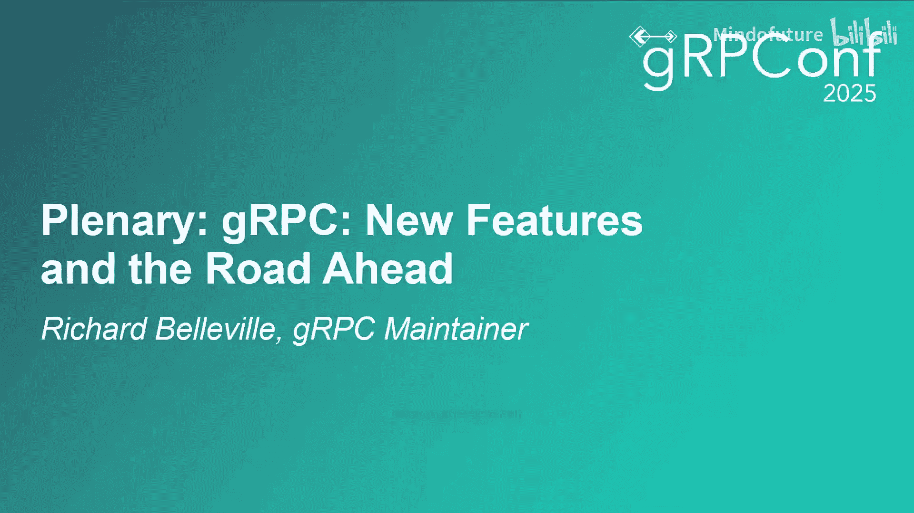

# 020：gRPC 新功能与未来展望

在本节课中，我们将学习gRPC项目在未来一年的路线图，涵盖服务网格、可观测性和现代化三大支柱领域的一系列新功能和改进计划。

## 三大核心支柱

在深入具体功能之前，我们先了解驱动gRPC项目未来发展的三大主题。

*   **服务网格**：自2019年起，gRPC致力于构建无需Sidecar代理的服务网格，并在2020年正式发布。这一方向将持续引领新功能的开发。
*   **可观测性**：gRPC全面拥抱OpenTelemetry，致力于让用户更便捷地收集和导出日志、指标与追踪数据。
*   **现代化**：为了跟上技术发展的步伐，gRPC将持续更新其支持的语言，并拥抱新兴的流行语言。

接下来，我们将基于这三大支柱，逐一介绍具体的功能规划。

## 服务网格增强功能

上一节我们介绍了gRPC发展的核心方向，本节中我们来看看服务网格相关的两项关键新功能。

### EXT Proc 与 EXT Authz

以下是两项基于全新插件模型的服务网格功能：

*   **EXT Proc**：此功能用于修改服务器的入站请求和出站响应，类似于gRPC拦截器。其独特之处在于采用gRPC调用外部服务器的模型来实现功能，而非将逻辑编译进服务器。这使得平台团队能够跨整个系统统一实施策略。
*   **EXT Authz**：此功能用于判断发送方是否有权发起特定请求。其工作方式与EXT Proc类似，应用服务器会向预配置的gRPC服务器发起调用以获取授权决策。

这种新的插件模型为系统构建提供了前所未有的灵活性。EXT Authz功能目前仍在设计阶段。

### HTTP CONNECT 隧道集成

gRPC自2017年起就支持通过HTTP CONNECT代理进行隧道传输。现在，我们正让此功能更易于使用，并与服务网格深度集成。

此前，基于HTTP CONNECT的代理需静态配置。新的计划是通过与XDS控制平面集成，实现动态配置。控制平面可以下发指令，告知客户端通过特定的HTTP CONNECT代理连接服务器。

这使用户能够轻松创建跨越本地环境和公有云的统一服务网格。该功能预计在今年晚些时候跨语言发布。

### 多SPIFFE信任域支持

SPIFFE是一个为工作负载分配和验证加密身份的系统。gRPC自2021年起支持通过XDS配置基于SPIFFE的mTLS，但仅限使用CA文件。

我们现在增加了对SPIFFE信任包的支持，这将允许利用多个SPIFFE信任域。

这在多种场景下非常有用，例如为开发、预发布和生产环境设置独立的信任链，或者允许公司内不同产品区域管理自己的身份，同时仍能跨信任域交互。

此功能预计今年在C++、Go和Java语言中落地。

## 调试与可观测性改进

在增强了服务网格的核心能力后，强大的调试和观测工具同样至关重要。本节我们将关注这方面的更新。

### Channelz V2

Channelz是一个长期的gRPC调试工具，能提供进程中各种gRPC资源的详细信息。

我们现已设计了Channelz V2，它比原版更灵活。新版从底层设计就是通用的，为各个实现留出了通过Channelz导出相关独特细节的空间。同时，它允许gRPC团队在不修改Channelz协议的情况下，演进gRPC资源层次结构。

总之，Channelz V2将使gRPC应用的调试更快、更灵活。首个实现将于今年晚些时候在C++中推出。

### 与Istio的深度集成

gRPC Proxyless自2021年起已在Istio中提供实验性支持。我们正在进行一些改进，使其与Istio的结合更加自然。

目前，Istio集成依赖于与`sdsud`代理的不安全连接。我们正进行针对性更改，以完全消除对此代理的需求，使Istio和Proxyless gRPC成为更自然的组合。

### OpenTelemetry指标增强

服务网格和可观测性的交叉领域同样火热。我们正在为以下组件添加OpenTelemetry指标：

*   加权轮询负载均衡策略
*   Pick First负载均衡策略
*   XDS客户端

除了这12个新指标，我们还添加了横切标签来指示与指标关联的XDS地域信息。此外，我们最近引入了非每次调用指标的框架，这使我们能够丰富gRPC Proxyless服务网格用户的可观测性数据。

这些功能共同使得运行gRPC服务网格比以往更加容易和可靠。

## 高级功能与现代化

除了核心的服务网格和观测能力，gRPC也在不断引入高级功能并拥抱现代化生态。本节我们将了解速率限制、无服务器集成和AI领域的新进展。

### XDS全局速率限制

这是gRPC Proxyless中一项非常令人兴奋的新能力。全局速率限制适用于服务器可能频繁被请求淹没的场景。

大多数速率限制方案都需要某种代理。借助XDS全局速率限制，gRPC服务器可以直接在gRPC库中，结合控制平面实现此功能。

该功能利用了现有的XDS协议，以及一个全新的RQS协议。RQS协议专门用于从服务器聚合负载信息，并从全局控制平面异步下发速率限制策略。

这意味着你既能获得全局速率限制决策的优势，又能享受完全去中心化数据平面的好处。这将形成一个高性能、全局感知的高流量软件管理系统。相关的协议和gRPC库实现都是开源的。

### 无服务器平台集成

服务网格运营商不仅运行在Kubernetes上，其组织内的团队也经常在各种无服务器平台上运行工作负载。

历史上，这两类平台之间在服务网格，特别是gRPC Proxyless服务网格方面的互操作性并不理想。我们针对Google Cloud Run设计和实现了一系列功能，使其成为一等公民的体验：

1.  增加了XDS主机重写功能，支持在XDS目标中使用虚URL。
2.  实现了基于JWT令牌的、针对出站服务网格RPC的授权。
3.  支持基于SPIFFE身份的mTLS。

将这些功能结合起来，无服务器平台与Proxyless服务网格之间的集成现已达到真正的一流水平。

### AI领域集成

过去一年，两个用于为AI模型丰富外部数据和能力的协议迅速流行起来：MCP和A2A。

*   **MCP**：使开发者能够通过MCP服务器，为LLM赋予任何工具的能力。
*   **A2A**：使长期运行的AI代理能够以结构化的、非英语的方式进行协作。

A2A从一开始就是基于gRPC构建的。而MCP最初仅通过JSON-RPC工作。我们收到了许多让MCP通过gRPC及其丰富功能运行的请求。因此，我们很高兴地宣布，我们将与作者合作，使gRPC成为MCP的一等传输方式。

gRPC已在AI领域确立了关键组件的地位。

### 官方支持的Rust语言

Rust凭借其默认安全性和零成本抽象，在过去几年变得极其流行。没有一流的gRPC支持，一门语言就不算完整。

我们正在确保这种支持到位。我们基于已经相当流行的Tonic实现进行构建，使其达到与C++、Java和Go等其他一等语言同等的水平。这意味着完整的XDS实现，以便你可以在Proxyless服务网格部署中使用gRPC Rust。

我们正与Tonic的作者直接合作，以确保为现有的Tonic用户和新的gRPC Rust用户提供最佳体验。预计很快将发布预览版。

## 总结

本节课中我们一起学习了gRPC在未来一年的详细路线图。我们看到了服务网格方面如EXT Proc、HTTP CONNECT集成和多信任域支持等增强功能；可观测性方面如Channelz V2和OpenTelemetry指标的改进；以及现代化方面如全局速率限制、无服务器集成、AI协议支持和全新的官方Rust语言实现。

随着gRPC加速进入第二个十年，它没有显示出任何放缓的迹象。一如既往，你可以通过我们的网站、YouTube频道、线下聚会和邮件列表关注项目进展。