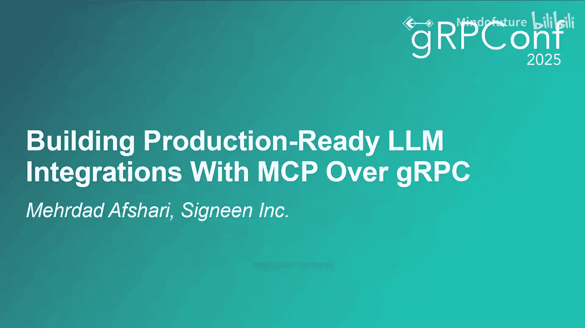
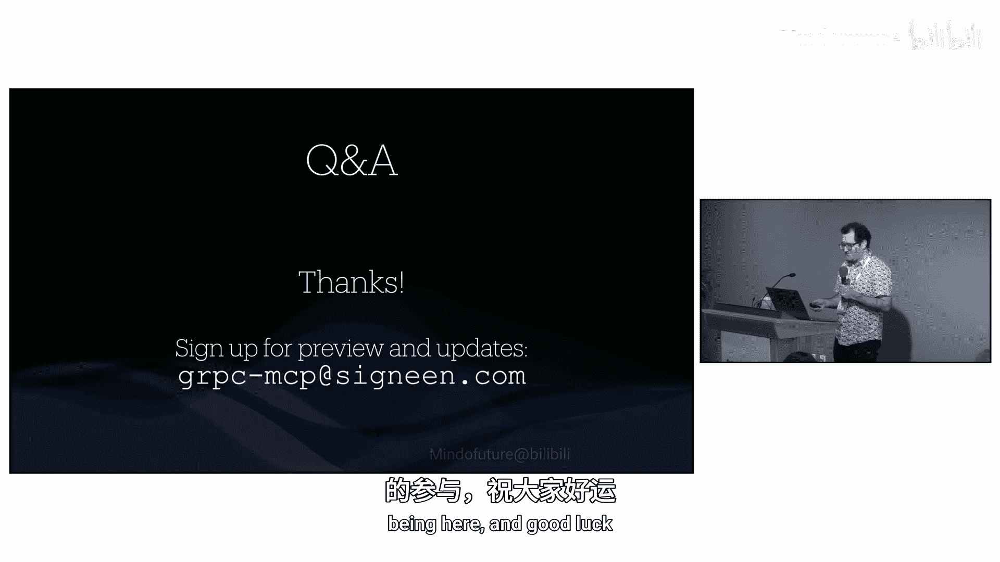

# 021：使用基于gRPC的MCP构建生产就绪的LLM集成

## 概述

在本节课中，我们将学习如何利用成熟的gRPC技术栈来构建和部署生产就绪的模型上下文协议（MCP）服务器，以实现大型语言模型（LLM）与各种资源和API的集成。

---

## MCP简介：什么是模型上下文协议？

上一节我们介绍了课程主题，本节中我们来看看MCP是什么。

如图所示，一个由AI驱动的聊天应用或IDE（称为MCP主机）通常通过API（如OpenAI）连接到LLM。MCP服务器则通过MCP协议与这个主机应用通信，并提供资源。

MCP协议支持多种传输方式，目前主要是标准I/O和HTTP流。标准I/O类似于传统的FastCGI模式。该协议定义了三种核心原语来交换数据。

以下是MCP定义的三种核心数据原语：

1.  **资源**：指代一个具体的对象，如日历条目、文件、图像或数据库记录。每个资源都有一个唯一标识符（URI）。MCP主机可以通过资源API列出和读取服务器提供的资源，并将其作为上下文提供给LLM。
    *   **公式/代码表示**：`资源 -> { uri: string, content: any }`
2.  **提示**：用于向应用提供一组预定义的命令或操作，类似于“/”命令。用户触发操作并给出参数，MCP服务器将其转换为字符串后馈送给LLM。
3.  **工具**：这是MCP调用操作的核心。工具API类似于gRPC反射，服务器可以描述一系列方法，MCP主机获取这些描述后可以调用相应的操作。这代表了API设计的一种新范式。

---

## 为什么在MCP中考虑gRPC？

了解了MCP的基本构成后，我们来看看为何要引入gRPC。

gRPC是一个经过大规模验证的、可信赖的技术栈。许多公司已经建立了完善的gRPC基础设施。在已有gRPC生态中引入新协议会增加复杂度，而直接利用gRPC则能继承其诸多优势。

以下是gRPC能为MCP带来的关键优势：

*   **性能与健壮性**：gRPC拥有高性能和健壮性，是基于HTTP/2的最受测试的栈之一。
*   **核心功能**：内置健康检查、截止时间传播、熔断和**强类型**等核心功能，这对MCP非常有益。
*   **多语言支持**：无需等待特定语言的MCP SDK，可以用任何语言快速创建MCP服务器。
*   **基础设施集成**：天然支持服务发现、负载均衡策略（可通过xDS控制）等大规模基础设施组件。
*   **版本控制**：支持API版本控制，而当前MCP规范在此方面有所欠缺。
*   **认证与安全**：可以复用gRPC成熟的认证流程，而MCP服务器设计初期常忽略此点。
*   **可观测性**：可以收集统计数据和跟踪链路，监控整个基础设施的延迟。

---

## 部署模型：如何结合gRPC与MCP？

既然gRPC有这么多优势，本节我们探讨如何将两者结合，将基础设施中运行的gRPC服务暴露为MCP。

我们提出三种部署模型：

1.  **本地二进制文件**：一个通过标准I/O与MCP主机通信的本地MCP服务器，但其内部通过gRPC与远程后端服务通信。
2.  **gRPC到MCP网关**：一个HTTP服务器，作为MCP主机与后端gRPC服务之间的翻译层。这类似于现有的gRPC网关转码解决方案。
3.  **Envoy插件**：在Envoy代理层面实现协议转换，这与转码器的功能非常匹配。

需要指出的是，gRPC并不限定序列化格式。你可以通过gRPC传输相同的JSON对象，从而获得之前提到的绝大部分优势。

那么，我们是否需要转码来映射MCP的请求和响应呢？这存在权衡。当前MCP规范可能仍在变化，为整个协议定义转码规范未来可能不适用。一个折中的方案是：对目前相对固定的资源和提示API进行转码，而对于工具API的输入输出，暂时保持JSON格式以获取灵活性，应对未来规范的变化。

这与通过gRPC网关暴露REST API的问题相似，但又不完全相同。首先，MCP不是REST API，更像是JSON-RPC。其次，**MCP本质上是状态性的**，并依赖双向流。这使得网关需要管理状态，并调用后端双向流RPC，这是主要的不同点。

---

## 实施与未来展望

我们已经讨论了部署模型，接下来看看具体的实施和社区进展。

我们已经实现了类似第二种模型（网关）的原型，并计划很快分享。如果您感兴趣，可以给我们发送邮件，我们会在可用时通知您。

关于传输协议，目前公共MCP客户端主要支持标准I/O或HTTP，而非gRPC。因此，我们描述的服务器是一个在两者之间进行翻译的HTTP服务器。未来，推动gRPC成为MCP的一等传输协议是很有价值的，因为它非常适合双向流。

社区（包括Google）正在积极推动相关工作，目标是引入真正的传输抽象层，并减少协议的默认状态性，使其在需要时才显式创建会话。这样有望实现一个一流的gRPC MCP传输方案。

在部署方面，我们目前具体实现的是中间的网关模型。最右边的Envoy插件模型尚未开始实施，但这与现有gRPC生态系统（如通过xDS统一控制面）结合会非常有趣，是我们计划探索的方向。

关于服务发现，XDS和服务发现作用于gRPC客户端层面。入站的MCP流在边缘无法直接看到XDS数据，由网关根据XDS信息将流量路由到对应的gRPC服务实例。由于状态性，网关可能需要维护与客户端HTTP流和与后端服务gRPC流的映射关系。

---

## 总结

本节课我们一起学习了如何利用gRPC构建生产就绪的MCP服务器。我们首先介绍了MCP协议及其核心原语（资源、提示、工具），然后分析了gRPC在性能、类型安全、多语言支持和基础设施集成方面为MCP带来的巨大优势。接着，我们探讨了三种结合二者的部署模型：本地二进制、HTTP网关和Envoy插件，并讨论了协议转码的权衡。最后，我们了解了相关原型实现和社区在推动gRPC成为MCP一等传输协议上的努力。通过将成熟的gRPC生态应用于新兴的MCP领域，我们可以更稳健、高效地构建LLM集成应用。

