# 022：深入理解负载均衡机制 🚀

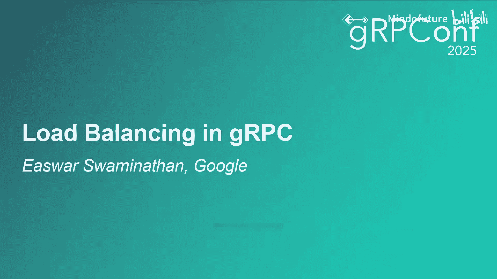

在本节课中，我们将要学习gRPC中的负载均衡机制。负载均衡对于运行多服务器后端和多客户端的系统至关重要，它能确保流量公平、合理地分布，从而保障服务的高可用性、可扩展性和高性能。

## 负载均衡概述

负载均衡的核心目标是将客户端流量公平、适当地分配到多个服务器后端。这有助于避免服务器集群中出现热点，从而保证服务的高可用性、可扩展性和高性能。

gRPC的负载均衡发生在应用层，即**每个请求**级别，而不是网络层的每个连接级别。

## 负载均衡的两种方式

上一节我们介绍了负载均衡的基本概念，本节中我们来看看实现负载均衡的两种主要方式：服务器端负载均衡和客户端负载均衡。

*   **服务器端负载均衡**：客户端将所有流量发送到一个代理，由代理负责将流量分发到各个服务器后端。这种方式的优点是客户端逻辑简单，所有负载均衡逻辑集中在代理中。缺点是代理可能成为性能和可扩展性的瓶颈，且维护代理集群有额外成本。
*   **客户端负载均衡**：客户端直接与服务器后端通信，消除了代理瓶颈，性能更佳。但负载均衡逻辑被移入客户端，导致客户端变得复杂，且需要在多种语言中实现相同的逻辑。

使用gRPC时，你可以免费获得客户端负载均衡能力。gRPC团队负责在多种语言的客户端中实现并维护复杂的负载均衡逻辑。

## gRPC中的负载均衡策略

在gRPC中，执行负载均衡的组件被称为**负载均衡策略**。它由两个主要部分组成：
1.  **连接管理组件**：负责从名称解析器接收后端地址，并创建和管理到这些后端的连接。
2.  **调用管理组件（Picker）**：在每个RPC请求时被调用，负责为该特定RPC选择一个后端。

gRPC采用插件化架构，负载均衡策略是其中之一。gRPC定义了LB策略需要实现的接口，策略实现后向gRPC注册。运行时，gRPC根据名称解析器返回的服务配置来选择具体的LB策略。

gRPC内置了多种LB策略，也允许用户引入自己的策略。

以下是gRPC支持的部分LB策略示例：
*   **`pick_first`**：按顺序连接给定的地址，直到找到一个可达的后端，之后将所有流量发送到该单个后端。
*   **`round_robin`**：并行连接到所有给定的后端地址，并尝试在所有可达的后端之间分发RPC请求。

为你的服务选择最合适的LB策略非常重要。例如，当客户端流量经过反向代理，或需要软亲和性（如特定服务器的缓存了客户端数据）时，`pick_first`策略很合适。在大多数其他情况下，`round_robin`或加权轮询策略更为合适。

## gRPC客户端架构中的负载均衡

现在我们已经了解了负载均衡的高层概览，让我们深入gRPC客户端架构，看看负载均衡是如何融入其中的。

1.  客户端应用程序创建一个gRPC通道，并传入目标服务的URI。
2.  通道启动后，会创建一个名称解析器。
3.  名称解析器返回**地址**和**服务配置**。服务配置中包含该通道应使用的LB策略名称及其配置。
4.  根据服务配置，gRPC通道创建LB策略，并将后端地址和LB配置传递给它。
5.  LB策略创建**子通道**。子通道是到后端地址的实际连接。
6.  LB策略根据子通道的连接状态，向gRPC通道发送更新。更新包含通道的总体连接状态和一个用于RPC的Picker。
7.  当客户端发起RPC时，通道要求Picker为该RPC选择一个子通道，然后RPC通过该子通道发出。

名称解析器可以随时返回更新的地址和服务配置，子通道的连接状态也可能随时变化，这些异步事件都会触发LB策略生成新的Picker。

## 深入理解子通道


子通道是到特定后端地址的潜在或已建立的连接。其实现由gRPC客户端提供，但由LB策略决定何时创建及如何管理其生命周期。

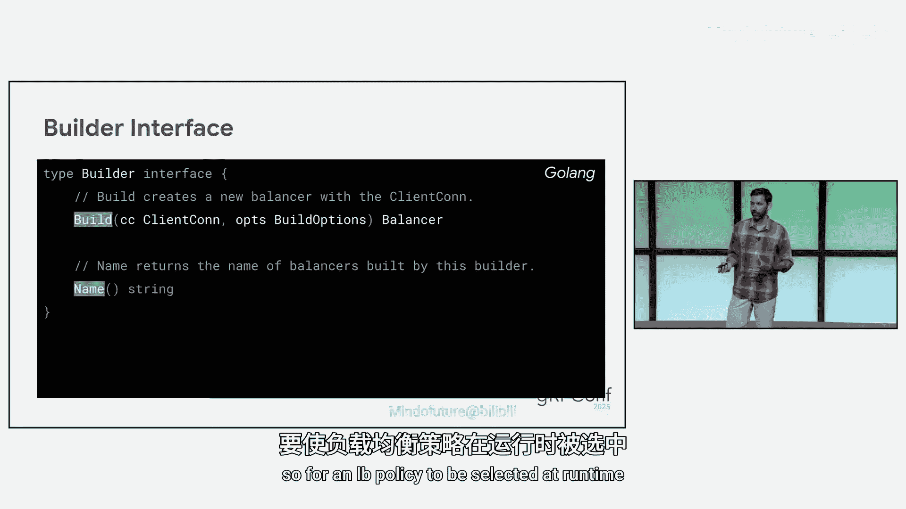

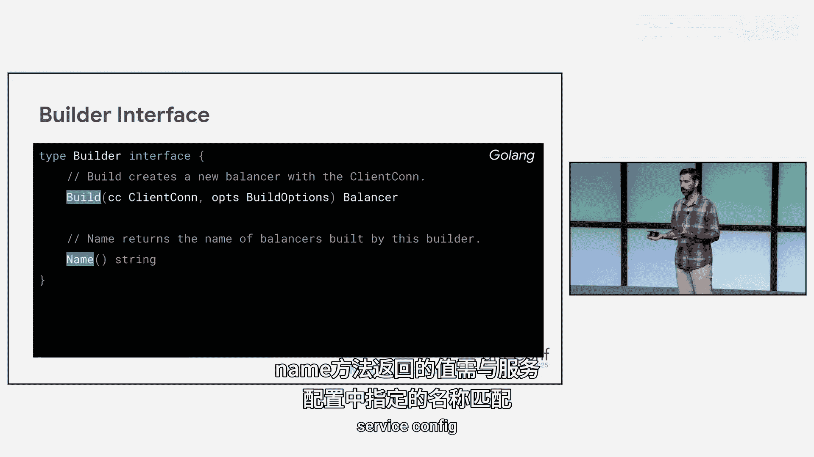

子通道在其生命周期中会经历不同的连接状态，状态转换由gRPC通道通知给LB策略。

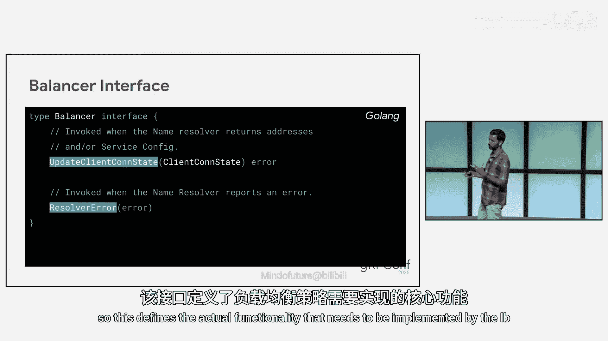

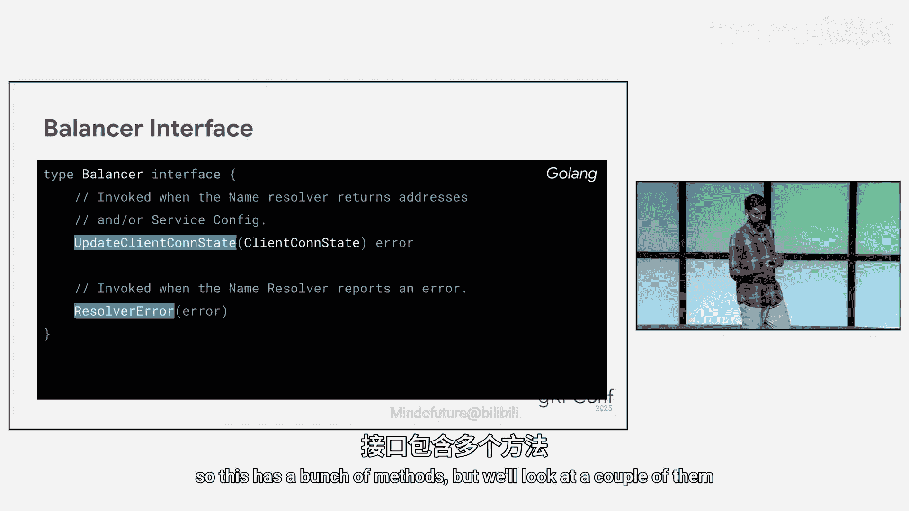

以下是子通道的状态转换流程：
1.  **IDLE**：所有子通道的初始状态。
2.  **CONNECTING**：当LB策略要求连接时进入此状态。
3.  **READY** 或 **TRANSIENT_FAILURE**：连接尝试成功则进入READY，失败则进入TRANSIENT_FAILURE。
4.  READY状态的连接失败后，会回到IDLE状态。
5.  TRANSIENT_FAILURE状态会进行退避，退避结束后回到IDLE状态。
6.  子通道在任何状态都可以被关闭，进入SHUTDOWN状态。

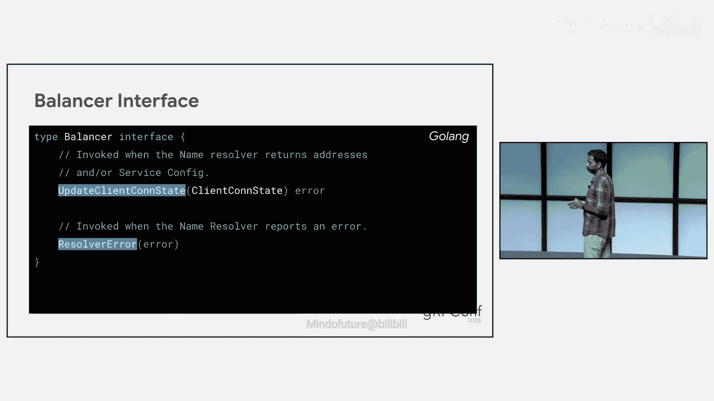

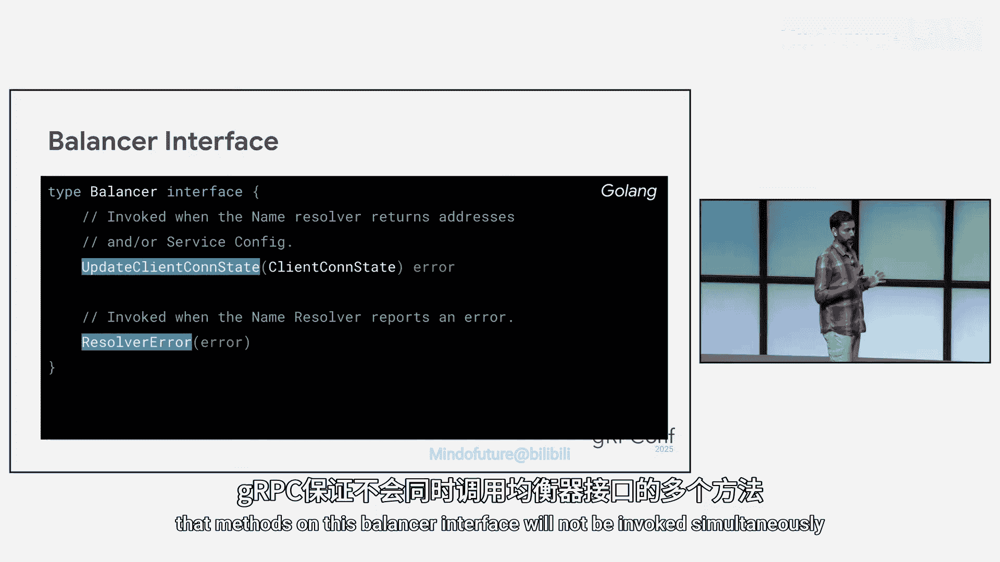

大多数LB策略会管理多个子通道，因此需要一种算法来聚合这些子通道的状态，以向通道返回一个总体状态。

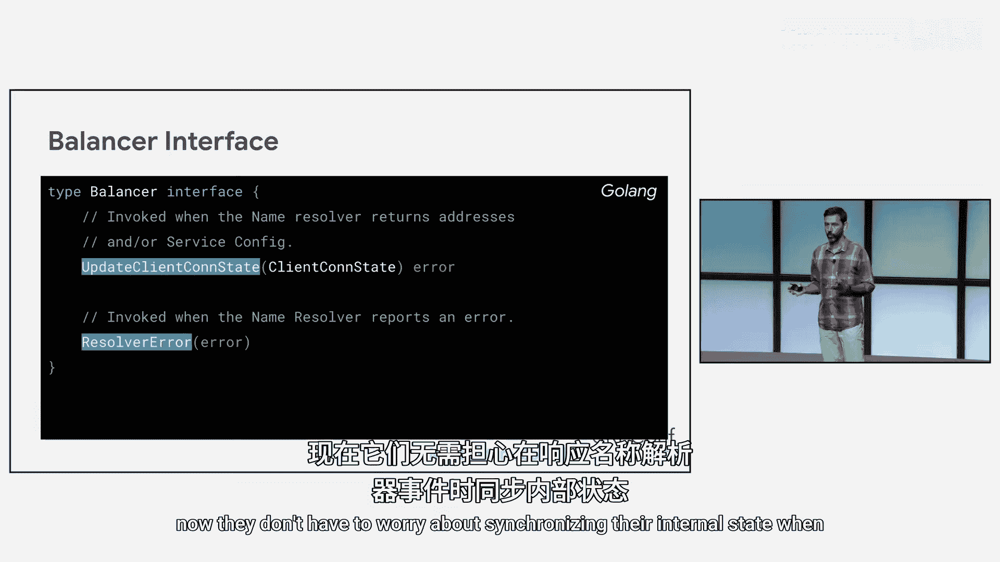

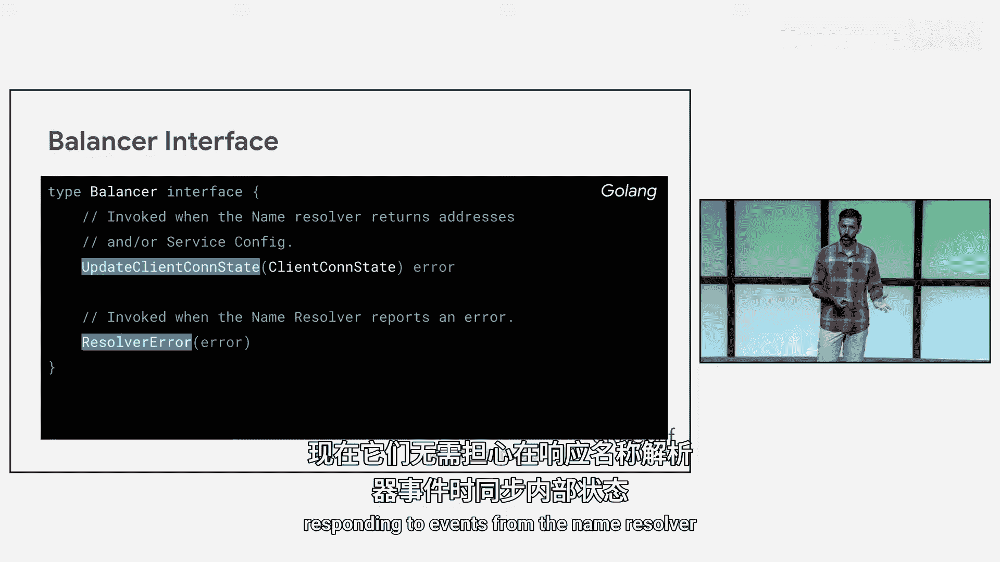

以下是gRPC中许多内置LB策略使用的常见聚合算法：
```text
if (至少有一个子通道处于 READY) {
    总体状态 = READY
} else if (至少有一个子通道处于 CONNECTING) {
    总体状态 = CONNECTING
} else if (至少有一个子通道处于 IDLE) {
    总体状态 = IDLE
} else {
    总体状态 = TRANSIENT_FAILURE
}
```
客户端应用程序可以通过gRPC客户端API查询此总体连接状态。

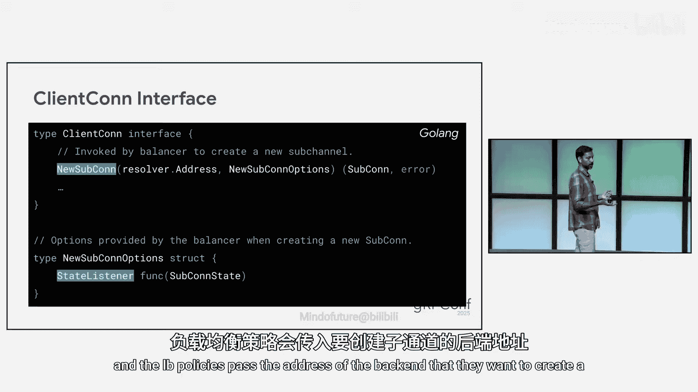

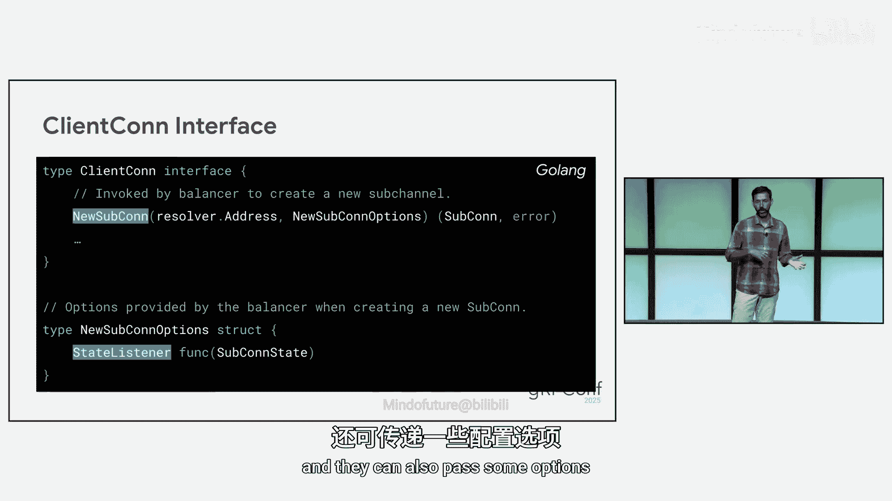

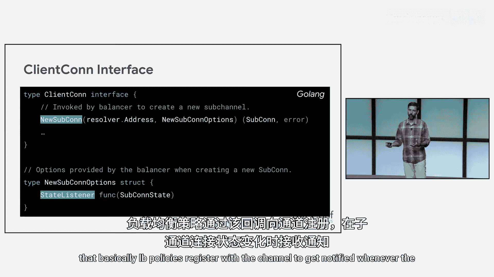

## 负载均衡策略API

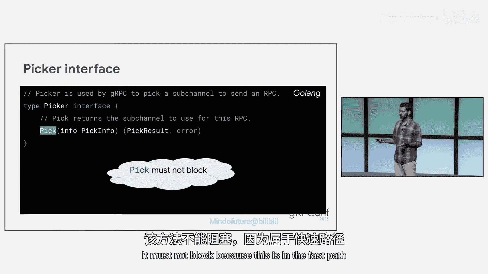

最后，让我们来看看负载均衡策略的API。需要注意的是，该API在Java和Go中是实验性的，在C++中尚未公开。

API定义了几个核心接口：

**Builder接口**
每个LB策略都需要实现此接口并在初始化时向gRPC注册。
*   `build()`：创建LB策略的新实例。
*   `name()`：返回LB策略的注册名称。运行时，此方法返回的值需要与服务配置中指定的名称匹配，该策略才会被选中。

**Balancer接口**
此接口定义了LB策略需要实现的实际功能，主要响应来自名称解析器的事件。
*   `updateClientConnState()`：当名称解析器返回新地址或服务配置时调用。LB策略可以借此关闭旧子通道、创建新子通道等。
*   `resolverError()`：当名称解析器报告错误时由gRPC调用。
gRPC保证此接口上的方法不会被同时调用，这简化了LB策略的实现。

**ClientConn接口**
此接口由gRPC客户端实现，供LB策略与gRPC通道通信。
*   `newSubConn()`：LB策略使用此函数创建新的子通道。
*   `updateState()`：LB策略使用此方法向通道报告新状态，包含通道的总体连接状态和用于RPC的Picker。


**Picker接口**
此接口用于每个RPC调用，只有一个方法`pick()`。
*   `pick()`：该方法接收RPC的相关信息（如方法名、头部元数据、超时设置等），并需要快速返回一个结果，不能阻塞。
Picker可以返回四种类型的结果之一：
    1.  **COMPLETE**：表示有一个有效的子通道可用于此RPC。
    2.  **QUEUE**：表示当前没有活跃子通道，但正在获取中。RPC会被排队，并在LB策略生成新Picker时重试。
    3.  **FAIL**：表示没有活跃子通道，且已耗尽所有后端地址。RPC将失败（除非使用了`wait_for_ready`调用选项，此时RPC会被排队重试）。
    4.  **DROP**：与FAIL类似，但即使使用了`wait_for_ready`的RPC也会失败，且重试逻辑也不会再进行任何尝试。

## 总结

本节课中我们一起学习了gRPC的负载均衡机制。我们从负载均衡的基本概念和两种实现方式（服务器端与客户端）入手，了解了gRPC如何通过插件化的负载均衡策略在客户端实现高效的流量分发。我们深入探讨了gRPC客户端架构中负载均衡的工作流程，特别是子通道的状态管理。最后，我们概述了构建自定义负载均衡策略所需的API接口。正确理解和配置负载均衡策略，对于构建高性能、高可用的gRPC服务至关重要。