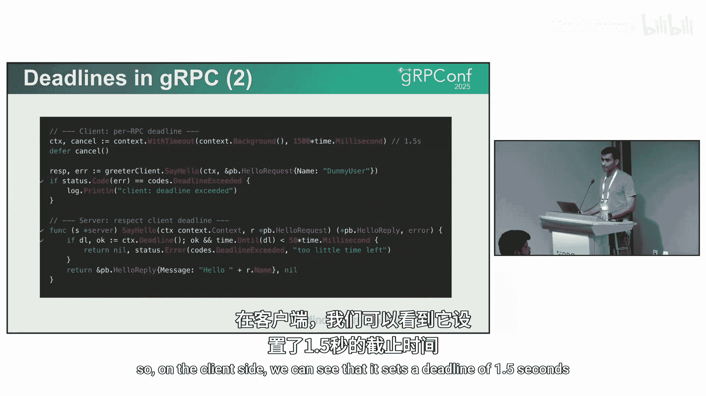
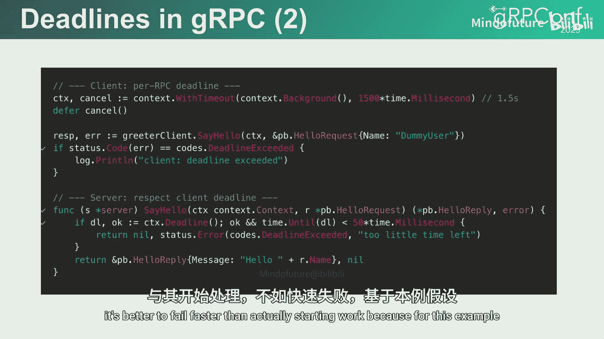
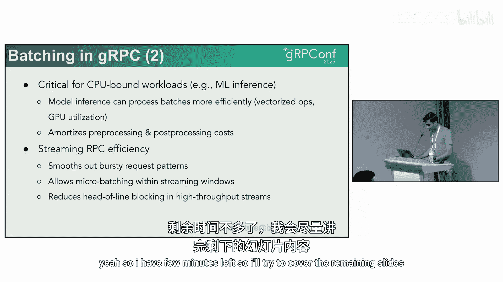
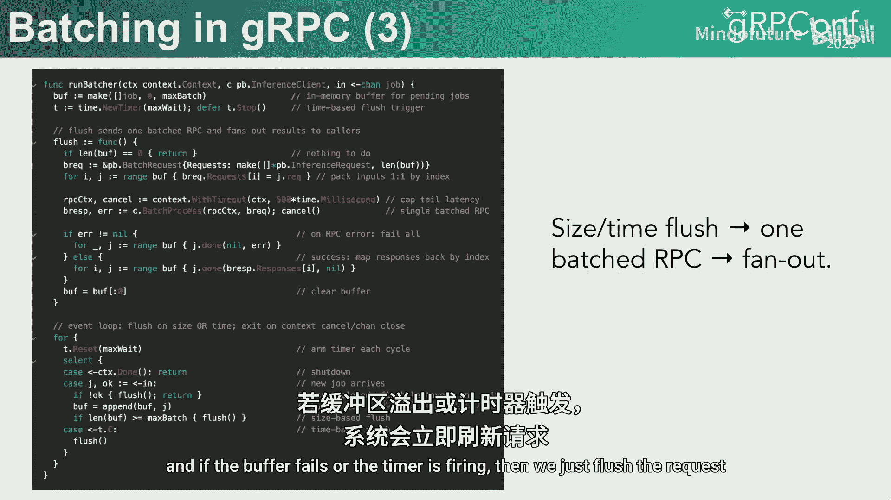

# 023：为高性能调整gRPC - 截止时间、批处理和心跳 🚀


在本节课中，我们将学习如何为生产环境中的高负载系统调优gRPC。我们将重点探讨三个关键的调优杠杆：截止时间、批处理和心跳机制。理解并正确配置这些设置，对于构建一个不仅“能用”，而且能在低延迟、高吞吐量和规模化场景下保持稳定的系统至关重要。

gRPC已成为高性能分布式系统的基石，它提供了强类型、高效的Protobuf序列化以及内置的流式支持等关键特性。然而，当系统在生产环境中大规模扩展时，一些挑战开始显现：延迟累积、重试行为不当、连接频繁创建和销毁等。通过调整截止时间、批处理和心跳设置，我们可以有效应对这些挑战。

## 截止时间 ⏱️

截止时间是gRPC最重要的配置之一，它规定了客户端在放弃请求前愿意等待的最长时间。我们可以将其视为一个“请求预算”。当客户端发起请求时，会分配一个预算（例如10秒），这个预算会在整个服务调用链中被消耗。一旦预算耗尽，调用将被取消，并返回上下文截止时间超时错误。

一个关键点是，截止时间会向下游服务传递。在一个多层服务调用链中，每一跳看到的剩余时间都会更短。如果调用链很深，最下游的服务可能几乎没有时间来完成实际工作。

### 配置截止时间

在客户端，我们可以设置一个截止时间。如果服务器未能在规定时间内响应，客户端将收到截止时间超时错误。

```go
// 客户端设置1.5秒的截止时间
ctx, cancel := context.WithTimeout(context.Background(), 1500*time.Millisecond)
defer cancel()
response, err := client.SomeRPC(ctx, request)
```

在服务器端，一个最佳实践是进行“快速失败”检查。如果剩余时间已经不足以完成有意义的操作，服务器应直接返回错误，而不是开始工作，以避免浪费资源。





```go
// 服务器端检查剩余时间
if time.Until(ctx.Deadline()) < 50*time.Millisecond {
    // 剩余时间不足50毫秒，快速失败
    return status.Error(codes.DeadlineExceeded, "not enough time left")
}
// 继续处理请求
```

截止时间确保了系统行为的可预测性，并为整个服务调用链提供了一致的时间预算。它也与重试行为紧密相关，我们接下来会看到。

### 截止时间与重试的协调

当截止时间到期时，gRPC不会重试该调用，这是合理的，因为客户端已经放弃了。然而，在配置截止时间和重试策略时，需要注意以下几点：

*   **过短的截止时间与多次重试**：如果客户端设置了很短的截止时间，却允许多次重试，那么所有重试最终都可能失败，这是没有意义的。
*   **过长的截止时间**：如果设置了很长的截止时间，重试请求会不断堆积，给服务增加不必要的负载。
*   **截止时间不匹配**：一个常见问题是上游服务设置的截止时间比下游服务长。例如，客户端设置10秒，但下游服务只强制执行2秒。这会导致上游客户端不断重试，而下游服务因时间不足无法处理，最终白白消耗CPU和内存。

### 处理超时精度损失与重试放大

gRPC通过一个相对时间值的头部（`grpc-timeout`）来传递剩余时间。这个值在穿越代理、边车、负载均衡器等中间件时，可能会因计算和舍入而损失精度。每个中间件微小的舍入误差累积起来，可能导致到达后端时剩余时间所剩无几。

**解决方案**：
1.  在服务间传递绝对截止时间戳，并在每一跳重新计算相对超时值。
2.  将超时值钳制在一个安全的最小值，防止舍入误差使其变为零。

另一个问题是**重试和对冲请求的放大效应**。如果端到端截止时间很长，但每次尝试的超时很短，客户端会进行大量快速失败的重试，浪费资源。对冲请求（同时发送多个相同请求副本）也可能在剩余时间不足时淹没下游服务。

**解决方案**：
1.  为每次尝试设置合理的、充足的超时预算。
2.  限制最大重试次数。
3.  在启用对冲请求前，检查剩余时间是否至少大于一次请求往返的中位延迟时间。如果不够，则不应发起对冲请求。

上一节我们详细探讨了截止时间的作用及其与重试的复杂交互。接下来，我们看看如何通过批处理来提升系统效率。

## 批处理 📦

批处理的概念很简单：不是在每个项目到达时立即发起一个RPC请求，而是在客户端维护一个微小的队列，将多个请求捆绑在一起，一次性发送。服务器处理这个批量请求后，返回一个包含所有结果的响应。

批处理在以下两个方面带来显著收益：

1.  **CPU路径优化**：Protobuf编码/解码、对象分配、头部传递等操作都需要时间。批处理使得这些固定成本只需支付一次，而不是为每个请求支付，从而让CPU能更专注于实际计算工作。
2.  **网络路径优化**：更少的往返次数意味着更少的请求/响应头部、更少的控制流事件。对于中间的网络设备和服务器来说，网络拥塞和 chatter 会减少，尾部延迟也会得到改善。

批处理通过在客户端引入一个微小的队列延迟作为代价，换取了整体性能的大幅提升。

### 批处理的应用场景

批处理对于**CPU密集型工作负载**尤其重要。例如，在CPU上进行机器学习推理时，与其一次推送一个样本通过模型，不如将一批样本（如16或64个）组合在一起。这样，内核可以运行向量化操作，更充分地利用计算资源，实现高吞吐量。

对于**流式流量**，消息通常不是均匀到达的，而是可能突发性地到来。如果每个消息都作为一个独立的RPC发送，系统可能会被大量的小调用淹没。使用微批次（micro-batching）可以创建一个时间或大小窗口来聚合消息。

### 实现批处理

以下是实现批处理的一个简单策略示例。我们维护一个缓冲区来收集任务，每个任务包含请求负载和一个用于返回结果的回调函数。触发批量发送可以基于两个条件：
*   **基于大小**：当缓冲区的任务数量达到阈值（如64个）时触发。
*   **基于时间**：设置一个定时器（如每10毫秒），时间到则发送当前缓冲区中的所有任务。

当批量请求被刷新（发送）时，我们构建一个包含所有请求的单一RPC调用。如果RPC调用失败，则批量中所有任务都失败；如果成功，则通过回调函数将各自的响应返回给每个调用者。

通过批处理，我们显著减少了系统开销。然而，要保持高性能，稳定的网络连接也至关重要。下一节，我们将讨论如何使用心跳机制来维持连接健康。

## 心跳机制 ❤️



心跳机制就像是系统的早期预警系统。它可以帮助我们检测网络故障、空闲连接断开、移动设备休眠等问题。同时，它对于保持**网络地址转换（NAT）设备和负载均衡器的连接映射表**处于活跃状态至关重要。

负载均衡器或NAT设备会维护一个客户端与服务器之间的连接映射表。表中的每个条目都有一个空闲超时（例如60秒）。如果在此期间没有数据包流动，设备会认为连接已死亡并将其从表中删除。

### 配置心跳



通过配置心跳，客户端会定期（例如每45秒）发送一个小的HTTP/2 PING帧，并期望收到一个ACK确认。负载均衡器会将此PING视为有效流量，从而重置其空闲计时器，保持连接映射的温暖。

在gRPC中调优心跳设置时，首要原则是使其与实际网络路径的特性对齐。

1.  **对齐超时时间**：了解网络中NAT、负载均衡器或代理的空闲超时设置（例如60秒）。将客户端的心跳间隔设置为这个最短空闲超时的70%到80%（例如45秒），并设置一个合理的超时窗口。
2.  **避免惊群效应**：如果成千上万的客户端都在精确的45秒发送心跳，会导致下游服务被瞬间的流量脉冲冲击。可以引入一个小的随机抖动（例如±15%），让心跳请求在时间上更加分散。
3.  **优先使用gRPC内置心跳**：gRPC提供了内置的HTTP/2 PING机制，它比操作系统级别的TCP Keepalive更轻量、更精确。如果两者都用，应避免将它们设置为相同的频率，以免相互干扰。

### 服务器端防护措施

在服务器端，应对心跳行为实施防护措施，防止客户端滥用或错误配置。

*   **设置最小PING间隔**：拒绝过于频繁的心跳请求。
*   **谨慎允许无流心跳**：`permit-without-stream` 设置应默认关闭。这意味着客户端不应该在完全空闲的连接上发送心跳。对于控制平面、长连接订阅者或移动网络等需要长期保持空闲连接的特殊情况可以例外。
*   **发送GOAWAY信号**：如果客户端违反了心跳策略，服务器可以发送HTTP/2的GOAWAY帧，告知客户端连接因策略不符而关闭，客户端应使用正确设置重新连接。
*   **动态调优**：在某些场景下（如手机切换网络），可以动态缩短心跳间隔，以便更快地检测到路径中断并重建连接。

## 总结 📝

本节课我们一起学习了三个关键的gRPC性能调优技术。

首先，我们探讨了**截止时间**，它作为请求的全局预算，对于协调重试行为、防止资源浪费和确保系统稳定性至关重要。关键在于设置合理的端到端和每次尝试的预算，并注意上下游服务的截止时间匹配。

其次，我们介绍了**批处理**，它通过将多个请求聚合发送，显著降低了CPU和网络开销，尤其适用于CPU密集型工作负载和流式数据传输场景。实现时可以采用基于大小或基于时间的触发策略。

最后，我们讲解了**心跳机制**，它是维持连接健康、防止NAT/负载均衡器超时断开的有效工具。配置时需要与网络基础设施的超时设置对齐，并添加抖动避免惊群效应，同时在服务器端实施必要的防护策略。


正确理解和应用截止时间、批处理和心跳，能够帮助你的gRPC服务从“可以运行”提升到“高性能、高稳定、可扩展”的生产级水准。