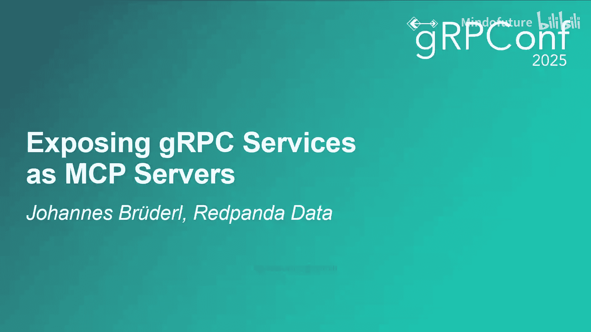
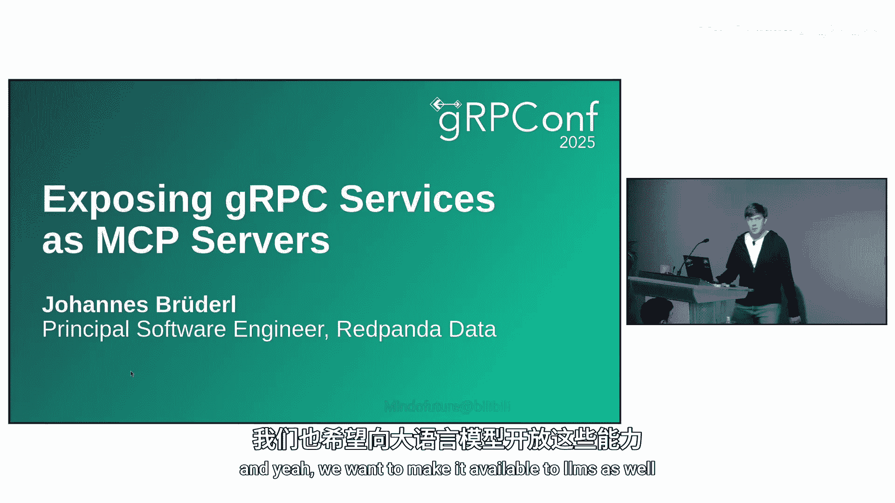
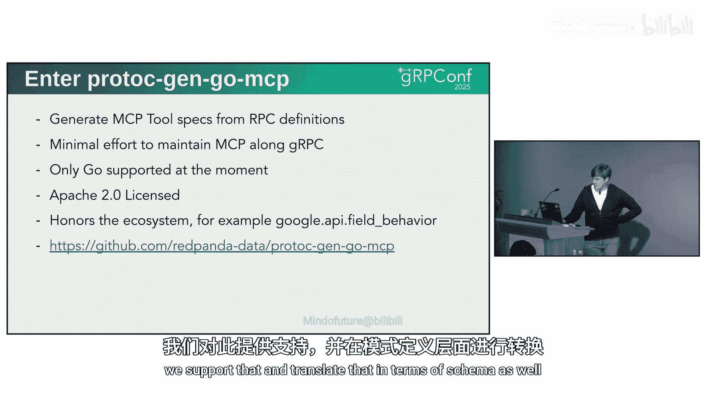
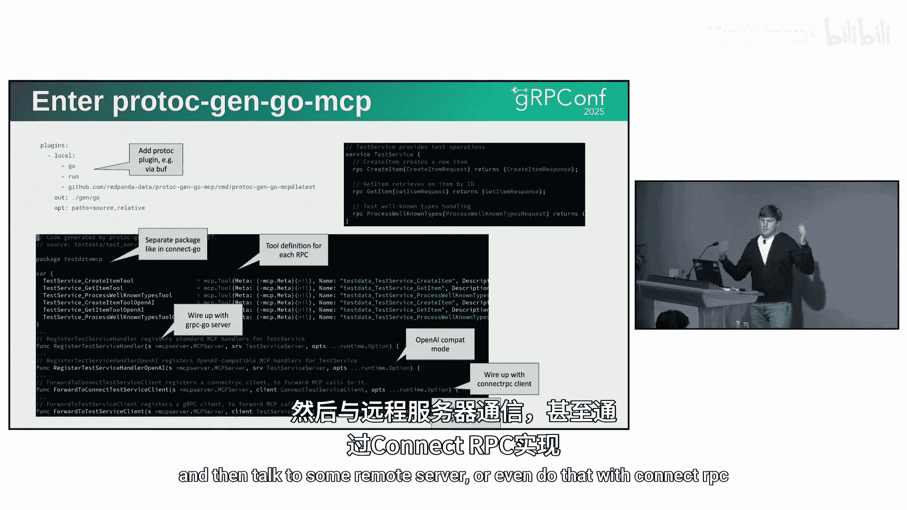
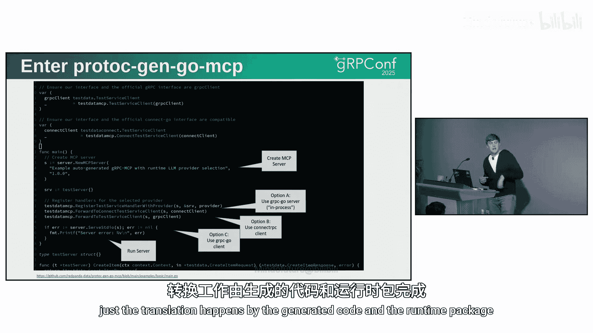
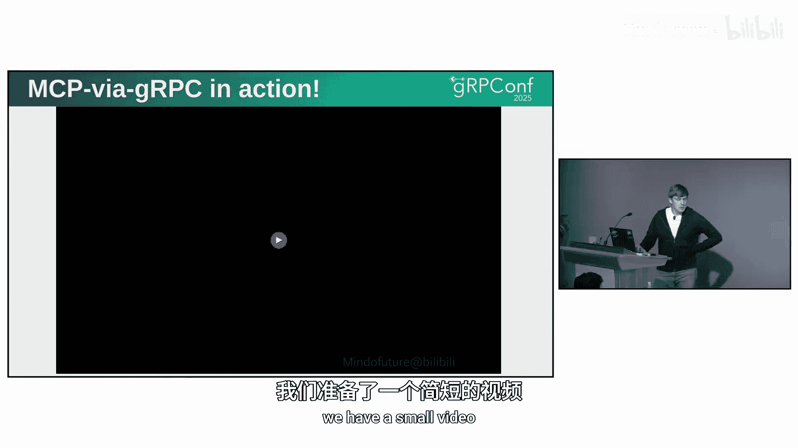
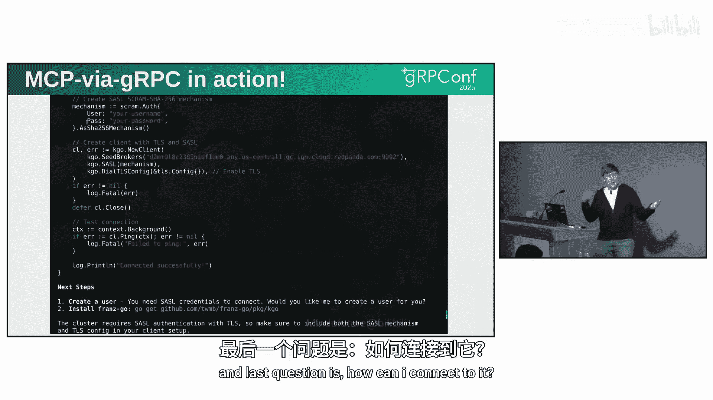
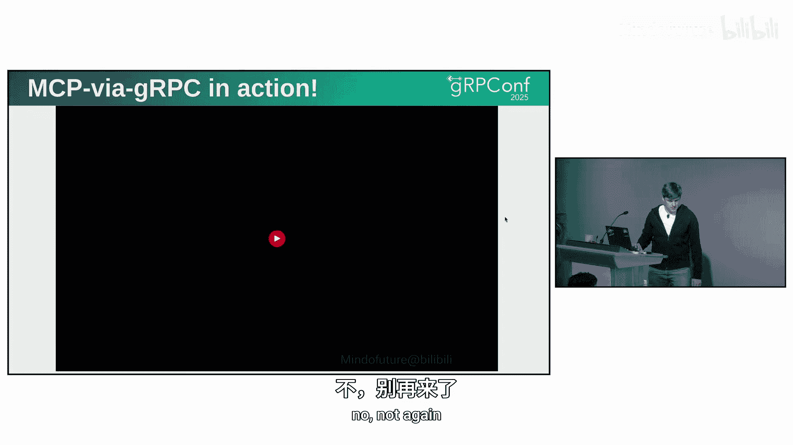
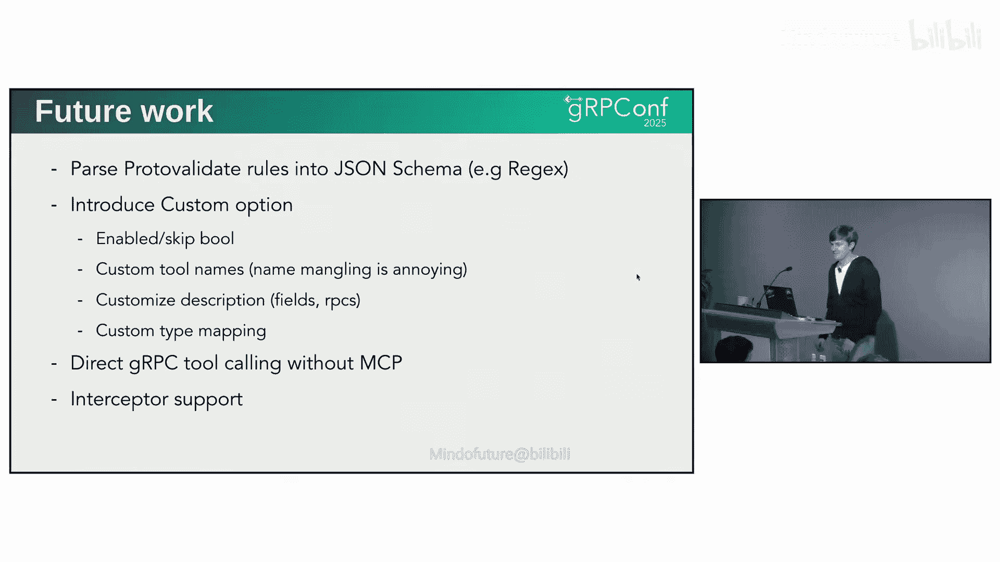

# 024：将gRPC服务作为MCP服务器暴露

## 概述
在本节课中，我们将学习如何将现有的gRPC服务暴露为MCP服务器，以便大型语言模型能够调用这些服务。我们将深入探讨MCP协议的工作原理、gRPC在此场景中的优势，并介绍一个名为`protoc-gen-go-mcp`的工具，它能自动从Protobuf定义生成MCP工具规范，从而简化集成过程。

## MCP协议简介与工作原理

上一节我们介绍了课程概述，本节中我们来看看什么是MCP以及它为何有用。

MCP是一个开放协议，它标准化了应用程序如何向大型语言模型提供上下文并执行操作。标准化是MCP的核心价值之一。

大型语言模型仅了解其训练数据和当前上下文窗口中的信息。它们本身无法执行搜索网络、调用API或操作系统命令等操作。像Cursor和Claude这类应用之所以能实现这些功能，依赖于“工具调用”机制。

工具调用的本质是函数调用。其工作流程如下：
1.  你有一个实际的功能实现，例如`get_current_temperature`。
2.  你有一个描述该功能的JSON Schema，定义了字段类型等信息。
3.  你将用户提示（例如“伦敦的天气如何？”）以及所有可用工具的定义发送给LLM。
4.  LLM决定是否需要调用工具来回答问题。如果需要，它会返回一个工具调用请求。
5.  你的应用程序执行该工具调用，并将结果返回给LLM。
6.  LLM根据工具返回的结果，生成最终的回答给用户。

这个过程可以在不使用MCP的情况下实现。MCP的价值在于它提供了一个标准化的、可插拔的客户端-服务器架构。它定义了模式、传输协议，并解决了打包和分发问题，使得SaaS供应商可以轻松地将其服务提供给LLM使用。

目前MCP支持两种传输方式：标准I/O（类似于LSP，通过生成子进程进行通信）和HTTP/1。社区也期待未来能支持gRPC传输。

## gRPC在MCP集成中的优势

了解了MCP的基本原理后，我们来看看gRPC如何在这个生态中发挥作用。

将gRPC集成到MCP中有几个显著优势：
*   **保持Protobuf的权威性**：Protobuf拥有庞大的生态系统和丰富的工具链。通过从Protobuf定义生成MCP规范，我们可以复用现有的API定义和工具，无需为MCP维护另一套API副本。
*   **保障API质量**：高质量的API对于LLM的稳定调用至关重要。gRPC及其相关最佳实践（如Google的AIP规范）为构建结构良好、语义清晰的API提供了坚实基础，包括资源导向设计、错误处理、增量更新等。
*   **避免重复工作**：自动生成工具可以节省大量手动维护MCP接口的时间和精力，实现“一次定义，多处使用”。

## 使用protoc-gen-go-mcp生成MCP工具

上一节我们探讨了gRPC的优势，本节中我们将介绍一个具体的实现工具。

`protoc-gen-go-mcp`是一个Protobuf编译器插件，它可以从gRPC服务定义自动生成MCP工具规范。目前它主要支持Go语言。

其工作原理非常简单。你只需要在Protobuf编译命令中引入这个插件。例如，对于一个简单的测试服务定义，插件会生成一个新的Go包，其中包含：
*   为每个gRPC方法生成的MCP工具定义。
*   一系列用于注册这些工具到MCP服务器的函数。

生成的代码风格类似于gRPC-Gateway，你需要将你的gRPC处理器与生成的MCP工具进行连接。工具包中还包含一个运行时包来处理实际的转换工作。

你可以选择两种集成方式：
1.  **进程内处理**：直接将MCP服务器与你本地的gRPC处理器连接。
2.  **客户端转发**：让MCP服务器作为一个客户端，将接收到的请求转发给远程的gRPC服务器（甚至可以通过Connect-RPC）。

在你的应用程序主函数中，你只需要启动MCP服务器，注册生成的工具，然后启动服务即可。所有的协议转换都由生成的代码和运行时库自动完成。

## 注意事项与LLM兼容性

成功生成工具后，我们还需要注意一些实践中的挑战，特别是与不同LLM的兼容性问题。

虽然LLM的API大体相似，但在JSON Schema的支持细节上存在差异，这可能导致问题：
*   **`oneOf`/`anyOf`支持**：Claude几乎支持所有JSON Schema特性，但OpenAI的API不完全支持`oneOf`。我们通常通过添加提示性注释（如“请只选择其中一项”）作为变通方案。
*   **必填字段**：OpenAI要求所有字段都必须标记为`required`。为了表示可选字段，我们需要将类型定义为该类型与`null`的联合类型。
*   **动态映射**：OpenAI不支持`map`类型。替代方案是使用键值对数组。
*   **递归模式与嵌套深度**：复杂的递归模式可能不被支持，有时需要回退到字符串类型。OpenAI对嵌套深度也有限制（最多6层），对于更深的嵌套结构需要截断处理。

**最关键的一点是：提供丰富的错误信息至关重要。** LLM对低质量的API容忍度更低，容易产生困惑或错误行为。务必遵循gRPC最佳实践，进行严格的输入验证，并充分利用gRPC的错误详情机制来提供清晰的错误反馈。

## 未来展望

最后，让我们看看这个领域还有哪些可以改进和发展的方向。

`protoc-gen-go-mcp`工具和整个gRPC-MCP集成方案仍在演进中，未来可能的工作包括：
*   **集成Proto Validate**：将Protobuf验证规则（如正则表达式约束）提升并转换到生成的JSON Schema中。
*   **支持自定义选项**：允许开发者通过Protobuf自定义选项来跳过某些RPC、指定自定义的工具名称或描述，以提供更灵活的集成控制。
*   **直接gRPC工具调用**：探索不经过MCP协议，直接在AI代理等场景中进行gRPC工具调用的可能性，这可以减少一层间接性。
*   **拦截器支持**：解决在通过转发模式调用远程处理器时，gRPC拦截器无法生效的问题。

## 总结
本节课中我们一起学习了如何将gRPC服务暴露为MCP服务器。我们首先了解了MCP协议如何通过标准化工具调用来扩展LLM的能力，然后探讨了利用现有gRPC API和Protobuf生态来构建高质量MCP集成的优势。通过`protoc-gen-go-mcp`工具，我们可以自动从Protobuf定义生成MCP规范，极大地简化了集成工作。同时，我们也注意到了在不同LLM提供商之间保持兼容性所面临的挑战，并强调了提供高质量API和错误处理的重要性。随着工具和协议的不断成熟，gRPC与MCP的结合将为构建强大的、由AI驱动的应用接口提供坚实的基础。