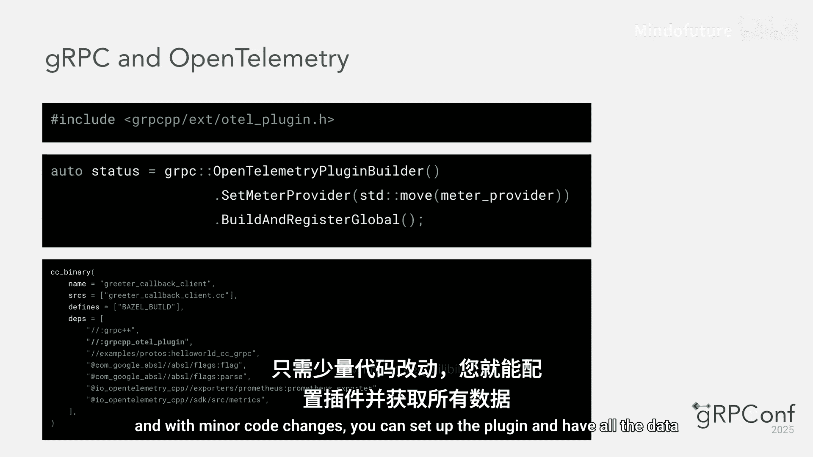
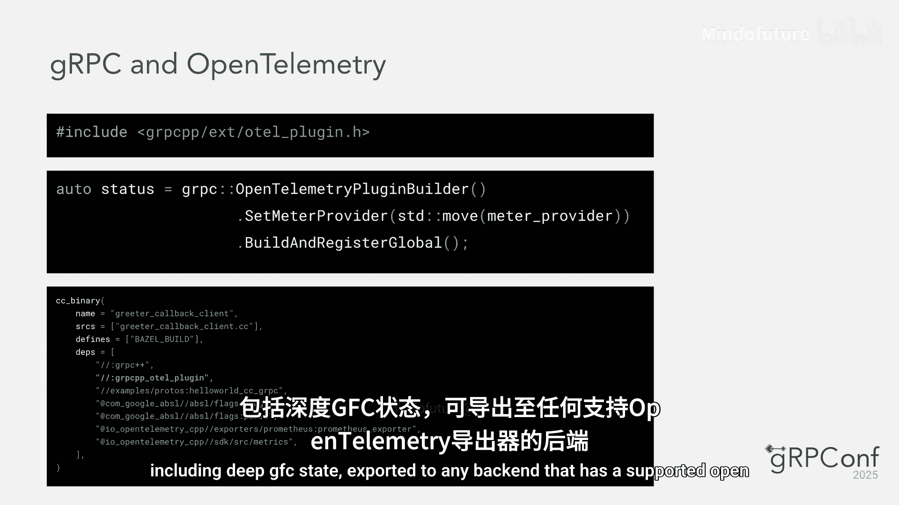
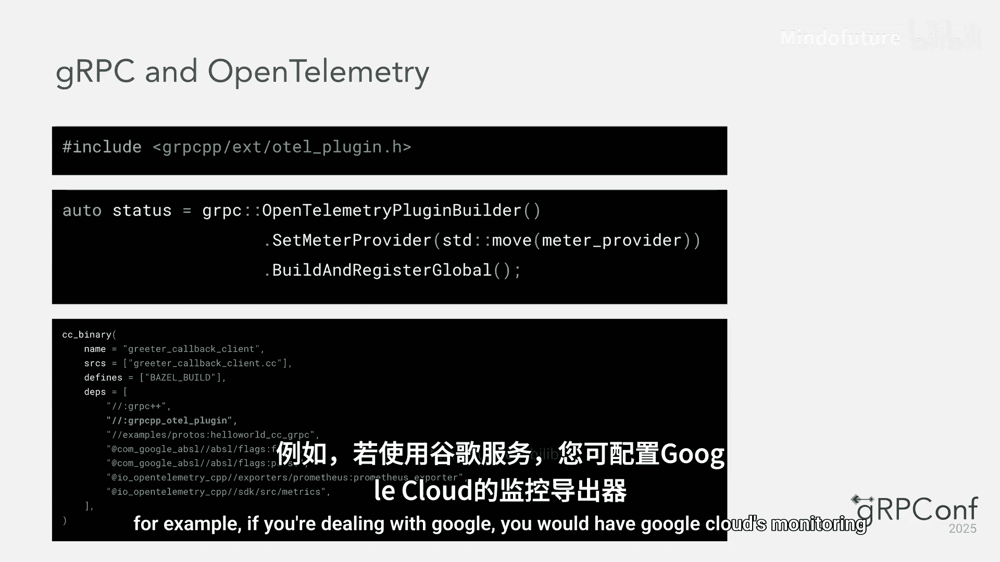
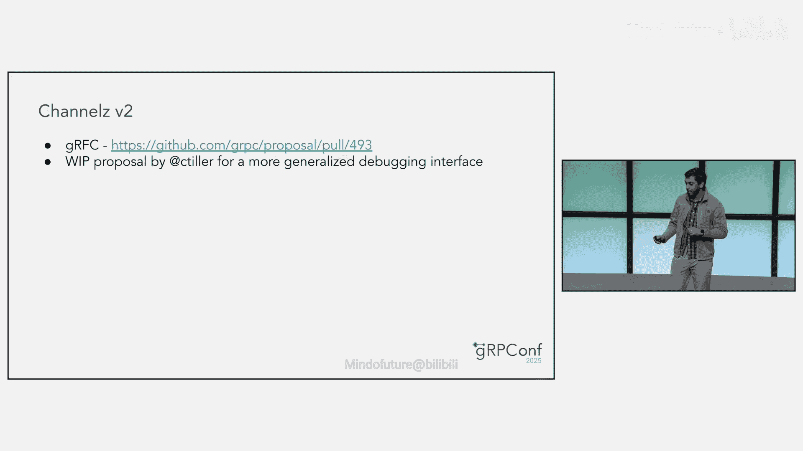
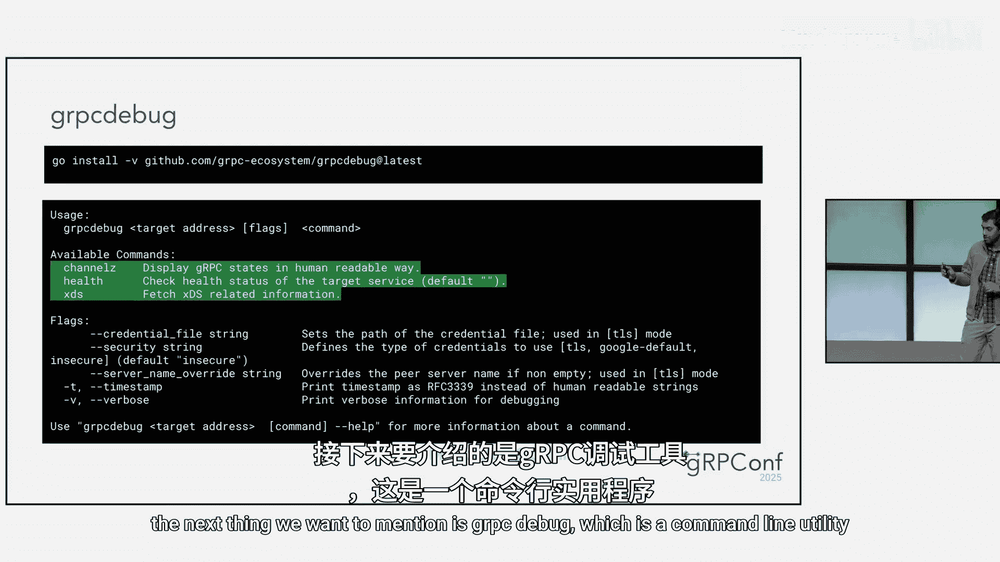
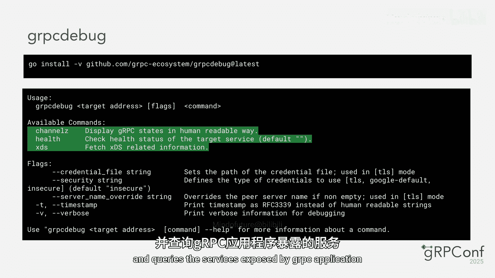
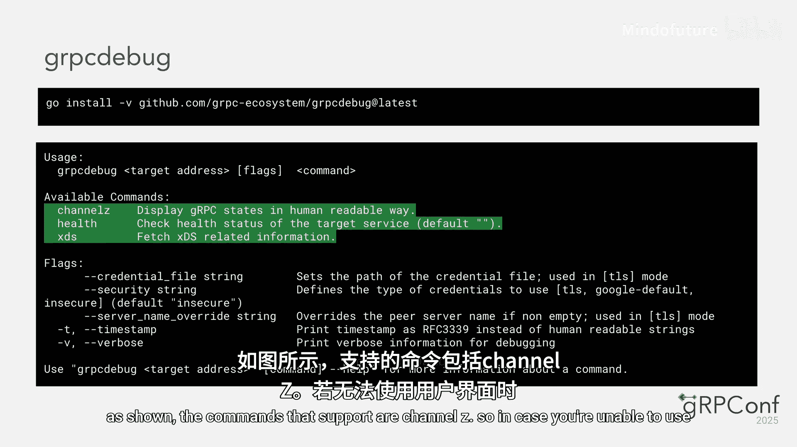
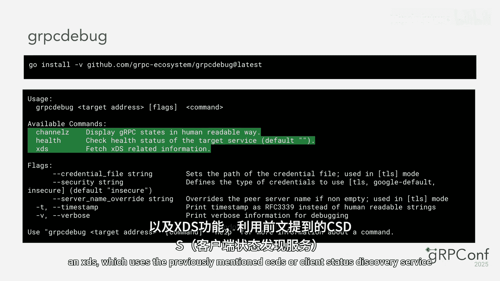
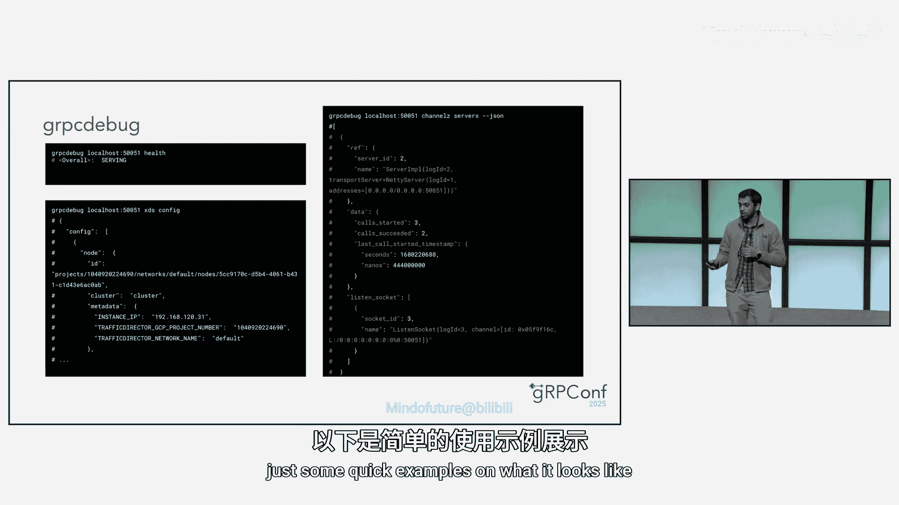
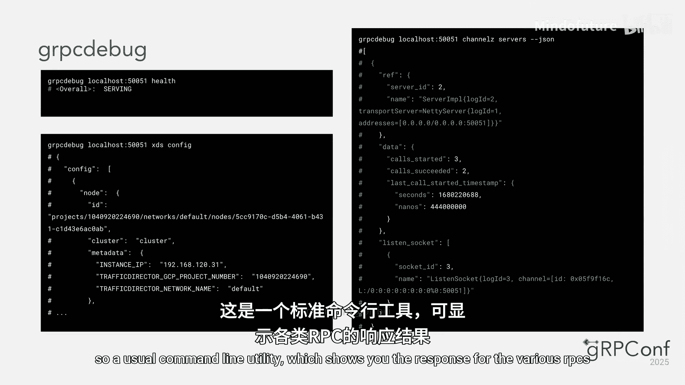

# 025：全面指南

在本教程中，我们将系统性地学习gRPC在过去一年中在可观测性方面取得的最新进展。我们将重点介绍与OpenTelemetry的深度集成，并概览生态系统中的其他关键工具，帮助你构建更透明、更易维护的分布式系统。

## 与OpenTelemetry的集成

上一节我们概述了课程内容，本节中我们来看看gRPC与OpenTelemetry集成的核心。OpenTelemetry是一个开源的观测性框架，是OpenCensus和OpenTracing的继任者。

通过手动修改代码配置插件，你可以将所有数据，包括深入的gRPC状态，导出到任何支持OpenTelemetry导出器的后端。例如，如果你使用Google Cloud，可以设置Google Cloud Monitoring或Tracing导出器来展示所有观测性数据。

熟悉OpenTelemetry的人会知道，OpenTelemetry有自己的RPC语义约定。当我们开始支持gRPC的OpenTelemetry时，维护者认为这些约定过于通用，不够具体。任何RPC系统都可能有其独特的细微差别，这些理想情况下需要通过指标来捕获。为了满足gRPC的需求，我们需要能够定义适用于gRPC的指标和追踪。因此，我们使用了gRFC（gRPC的RFC版本）来定义gRPC的OpenTelemetry插件将如何工作，并且已经实现了一系列指标和追踪。我们仍在与OpenTelemetry社区持续合作，并探讨gRPC帮助开发OpenTelemetry RPC语义约定的可能性。

这样做的考虑是，我们或许能够为RPC系统提供一些开箱即用的观测性，因此未来可能会有某种兼容性方案。

## 新增功能：OpenTelemetry追踪

现在，让我们开始介绍新内容：OpenTelemetry追踪。我们目前还没有用户友好的指南，但gRFC已可供感兴趣的人查阅。

简而言之，这为我们提供了大量关于请求在分布式系统环境中生命周期内发生的信息。通常，会采样少量请求（例如万分之一到十万分之一）。对于每个采样请求，追踪帮助你获得一个树状结构，其中包含代表独立任务的各个跨度。例如，一个用户请求到达服务器，服务器进一步向其他服务发出请求，你将能够在同一追踪中看到新的RPC，以及显示事件发生时间的时间图。

此前，我们已批准了用于OpenTelemetry追踪的gRFC。在过去的一年里，我们已在Java、C++和Go中实现了它，但它目前仍处于实验阶段。我们正在努力完善细节，进行跨语言互操作性测试，以确保其按预期工作，然后才会宣布其稳定，希望很快能实现。

我们现在还在C++中实现了TCP追踪。除了之前的出站消息事件外，我们现在还能看到四个事件，它们显示TCP数据包何时传递给内核、内核何时调度发送消息系统调用、数据包实际发送的时间以及被确认的时间。此外，我们还获得了一些统计数据，例如：
*   **交付速率**
*   **最小RTT**
*   **重传**
*   **拥塞**

我们通过随发送消息系统调用向下发送控制消息来实现这一点，以告知内核我们对这些时间戳感兴趣。

我们在Google内部的调试工作中非常成功地使用了此功能，以确定是否遇到网络问题，或者反过来，排除网络故障作为高延迟的原因。目前，实现此功能的机制仅在Linux内核上的C++中可用，但未来我们或许能够将其添加到其他语言中。

## 深入指标世界

上一节我们介绍了追踪，本节中我们来看看指标的世界。与gRPC中的许多事物一样，指标也是一个不断发展的领域。

但在讨论“是什么”之前，让我们先谈谈“为什么”。我们为什么首先要关心指标？可以这样想：指标是我们的服务彼此交流的方式。它们是理解gRPC应用程序健康状况和性能的基础。它们为我们提供了监控和优化客户端与服务器之间实际发生情况所需的可见性，帮助我们定位性能瓶颈。这也充当了一个早期预警系统，允许我们通过跟踪延迟和错误率等指标，在问题影响服务之前主动发现问题。归根结底，使用指标是构建更好、更可扩展、更可靠、真正值得信赖的应用程序的基石。

今天，我们将尝试分享gRPC中通过OpenTelemetry可用的指标的全貌。

以下是现有的一些客户端指标。当你查看本幻灯片上的客户端指标时，可能会发现两个看起来很相似的指标：“每次尝试”和“每次调用”。问它们之间的区别是什么是一个很好的问题。

答案实际上突显了我们选择引入自己的指标语义，而不是使用标准OpenTelemetry语义的关键原因。为了理解原因，我们来分解一下。在gRPC中，你在客户端应用程序中进行的单次调用实际上可能导致向服务器进行多次尝试，尤其是在使用重试或对冲等功能时。这引出了一个自然的问题：为什么服务器没有“每次尝试”的指标？原因是，“尝试”这个概念本质上是客户端的故事。客户端是包含“哎呀，失败了，让我再试一次”逻辑的组件。从服务器的角度来看，这些尝试中的每一次，即使是重试，看起来都像是一个全新的独立请求。服务器的工作只是处理它收到的每个传入请求，因此其指标旨在反映这种“每次请求”的现实。

## 新增指标详解

现在，让我们转换话题，谈谈我们一直在添加的一些新指标。我们一直在忙于推出一系列新指标，以便更清晰地展示你的gRPC应用程序正在做什么。

首先是关于重试和对冲的指标。如果你以前使用过OpenCensus，这可能会看起来很熟悉。我们引入了一些强大的功能，现在你可以在新的OpenTelemetry实现中跟踪重试、对冲甚至它们之间的延迟。

我们上次提到了WRR和xDS，我很高兴地说，WRR指标已在核心、Java和Go中实现，而xDS指标已在C++和Java中实现。

接下来是新的子通道指标。这是连接可见性方面的一大改进。与之前被替代的“Pick First”指标相比，旧的指标有些令人困惑，因为即使没有明确配置为负载均衡策略，子通道指标也会显示为“Pick First”。此外，使用那些指标无法获取实际的断开连接错误。现在，你可以判断断开连接的原因，例如套接字错误、连接超时等，这为调试提供了更清晰的视图。

现在，我想重点介绍两个我特别兴奋的新增功能。

第一是这些异常检测指标。这是我们Dropbox的朋友们做出的一个很棒的贡献。它是社区如何让gRPC可观测性对每个人变得更好的完美范例。所以，向他们致以巨大的感谢。

第二是这个新的可选标签：`grpclb_backend_service`。那么它具体是做什么的呢？它保存了你正在调用的后端服务的名称。如果你有一个客户端与许多不同的后端通信，这个标签就是救星。它让你可以轻松地按服务切分和深入分析指标，从而准确查看每个服务的情况。

需要快速提醒的是，我们正在努力将这些新指标引入到所有gRPC语言中。但它们可能还没有全部到位。我们正在逐步推出它们，因此最好查看你所用语言的文档，以了解当前可用的内容。

## 指标的未来展望

那么，指标的下一个发展方向是什么？我们想要更深入，直达传输层本身。我们正在为一些新的TCP级别指标制定提案，这些指标将帮助你理解网络上实际发生的情况。目前，如果你遇到棘手的网络问题，可能会感觉有点像黑盒。这些新指标旨在照亮那里。例如，我们计划添加诸如：
*   **TCP RTT**：为你提供网络延迟的最佳情况视图。
*   **TCP 交付速率**：显示你获得的实际数据吞吐量。

而这里才是真正强大的地方：用于数据包、重传数据包甚至虚假重传的指标。这将为你提供数据包级别发生情况的超级详细细分，用于诊断那些间歇性的、难以发现的网络问题。

现在我想明确一点：这些仍处于提案阶段，所以你还不能直接使用它们。可以将此视为对我们前进方向的一次预览。

## 生态系统中的补充工具

以上是我们过去一年在OpenTelemetry方面所做的所有工作。现在，让我们看看生态系统中其他一些工具，以补充我们从指标和追踪中获得的观测性。

让我们来谈谈一个非常方便的工具：gRPC二进制日志记录。本质上，它是一个允许你以二进制格式记录RPC的功能。这非常有用，有几个关键原因。

首先，它对于故障排除非常有用。当你试图调试一个棘手的问题时，这些日志为你提供了请求、响应和状态的完美记录，帮助你找到问题的根本原因。你还可以通过分析生产环境中的真实流量模式，将这些日志用于负载测试，以查看你的服务表现如何。

但你能做的最强大的事情之一是重放RPC。想象一下，从生产环境捕获日志，然后在开发环境中重放完全相同的操作序列。这是重现和修复错误的绝佳方式。

设置它非常简单。你只需要设置一个环境变量，通常是类似 `GRPC_BINARY_LOG_CONFIG` 的东西，具体取决于你使用的语言。在该配置中，你可以非常具体地告诉它要记录哪些服务和方法，甚至可以设置消息大小的限制。

现在，你可能会想到安全性。这是一个很好的问题。我们设计二进制日志记录时就考虑了安全性。日志格式有意将元数据（如头部）与实际消息负载分开。这使得设置过滤器来控制记录的内容变得更加容易，从而避免意外泄露密码或加密密钥等敏感数据。

接下来，让我们看看社区提供的一个很棒的工具：`grpcurl`。简单来说，`grpcurl` 是一个命令行工具，让你可以直接与gRPC服务器交互。这个名字几乎就说明了它的用途：它是用于gRPC的curl。这意味着你可以直接从终端发送gRPC请求并获取响应。

我想提一下，虽然 `grpcurl` 不是由核心gRPC团队官方维护的工具，但它对你的开发工作流非常有用。

首先，它能极大地加速测试和调试。你可以快速向端点发送一个RPC，并查看确切的服务器响应，而无需编写任何客户端代码。它对于API探索也非常棒。如果你的服务器启用了反射，你可以直接将 `grpcurl` 指向它并询问：“嘿，你有什么服务和方法？”它甚至会显示请求和响应的确切模式。最后，由于它是一个命令行工具，它非常适合脚本编写。你可以轻松地将其集成到shell脚本中，用于自动化测试或健康检查等任务。

## 管理服务与调试工具

接下来是Channelz。我假设你们中的许多人已经熟悉这个工具。它包含两个服务：Channelz和CSDS。这两个服务都可以添加到服务器中，如屏幕上的示例所示。一旦这些服务开始运行，你就可以像往常一样使用RPC调用它们。

具体来说，Channelz提供关于通道、子通道、服务器套接字等信息。它会回答诸如“我的通道当前状态如何？”、“给我我的通道或子通道上的所有最近事件”或“如果我的RPC调用失败，特定子通道是否出了问题？”等问题。

此外，为了简化操作，作为gRPC生态系统的一部分，我们有一个辅助UI工具，可以为你获取数据并以易于理解的格式呈现数据。这些图像来自上面链接的博客本身，这是一份由Eshaan编写的非常有用的指南，展示了如何使用Channelz和UI工具。

我们还有一个进行中的Channelz V2的gRFC，Richard之前也提到过。其目标是使Channelz更加通用，以便各种节点之间的关系更加松散，并且我们可以记录更多类型，而不仅仅是服务器、通道和套接字。但请注意，这仍在进行中，所以请关注gRFC的进展。

我们想提到的下一个工具是 `grpcdebug`，这是一个命令行实用程序，允许你查询正在运行gRPC的进程。它的工作方式是充当一个gRPC客户端，查询由gRPC应用程序公开的服务。它支持的命令包括Channelz（如果你无法使用UI，可以使用这个）、健康检查（使用健康检查服务，因此你可以检查服务器是否正在服务）以及XDS（使用前面提到的CSDS或客户端状态发现服务）。因此，如果你有一个支持XDS的gRPC应用程序正在运行，你可以使用它来检查各种XDS资源的状态并获取配置的转储。

## 总结与展望

以上是目前我们在生态系统中拥有的所有工具。我们认为它们还没有达到最终形态。随着我们继续使用gRPC，我们会遇到不足之处，并尝试改进可观测性以解决这些问题。我们非常高兴能够与社区互动，获取反馈和想法。

作为对所讨论内容的快速总结，这是我们短期（想象几个季度内）要完成的路线图：
*   **附加指标**：包括实现前面讨论的TCP级别指标，并将新的子通道指标和异常检测指标推广到更多语言，包括C++、Go和Java。
*   **追踪稳定化**：完成跨语言互操作性测试等工作，使追踪功能稳定。
*   **延迟分析工具**：这是一个在C++（以及Go）中的性能分析工具，帮助你可视化和分析gRPC程序的延迟，并以被诸如Perfetto等工具识别的格式输出数据。这已经在一定程度上实现了，但目前获取数据的方式对用户还不够友好，因此这方面的工作正在进行中。

在本教程中，我们一起学习了gRPC可观测性的最新进展。我们从与OpenTelemetry的深度集成开始，涵盖了新的追踪功能、丰富的指标集（包括客户端尝试、子通道、异常检测等），以及像二进制日志、`grpcurl`、Channelz和`grpcdebug`这样的生态系统工具。这些工具共同为你提供了监控、调试和优化gRPC应用程序所需的全面视角。请记住，这是一个持续发展的领域，社区反馈对于塑造未来功能至关重要。