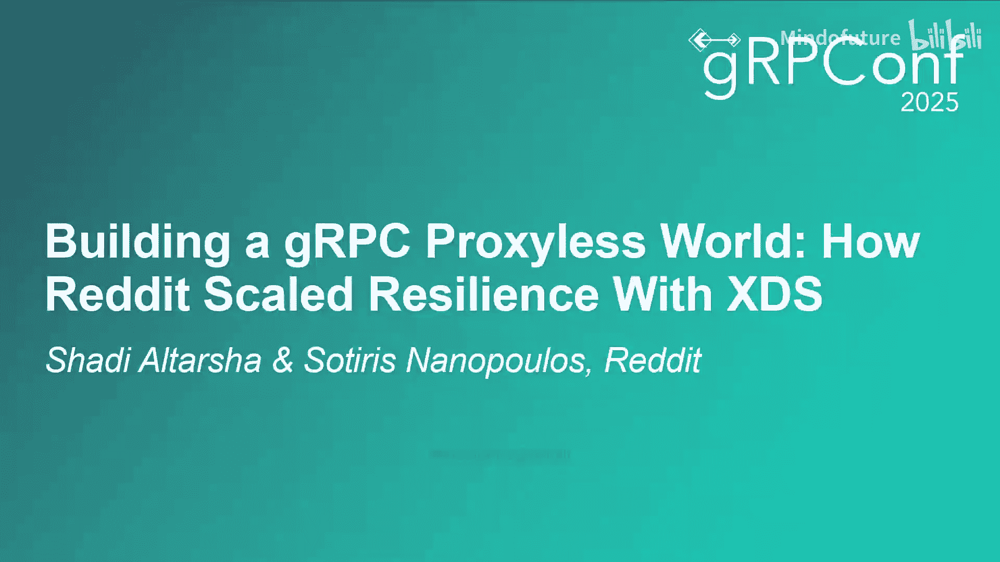
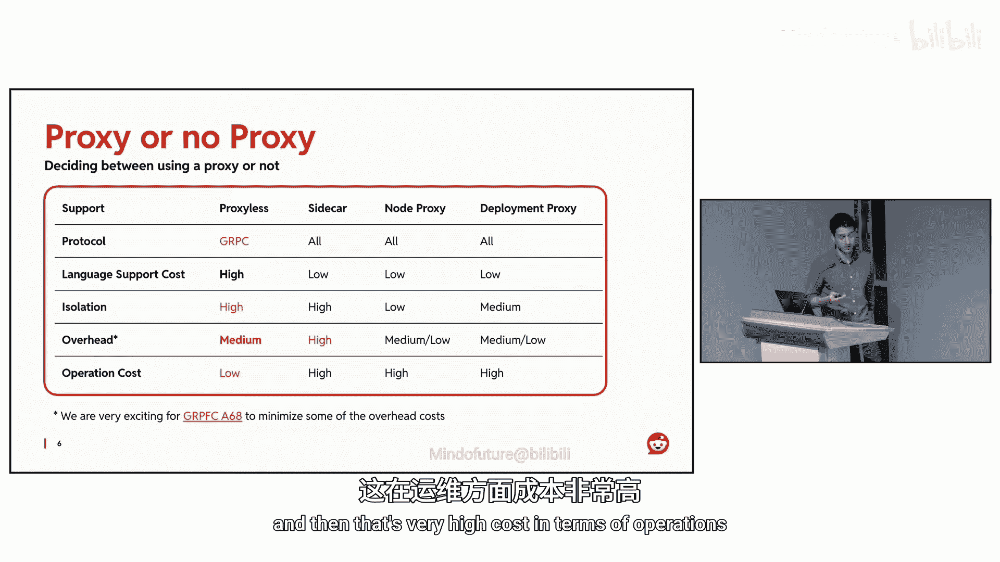
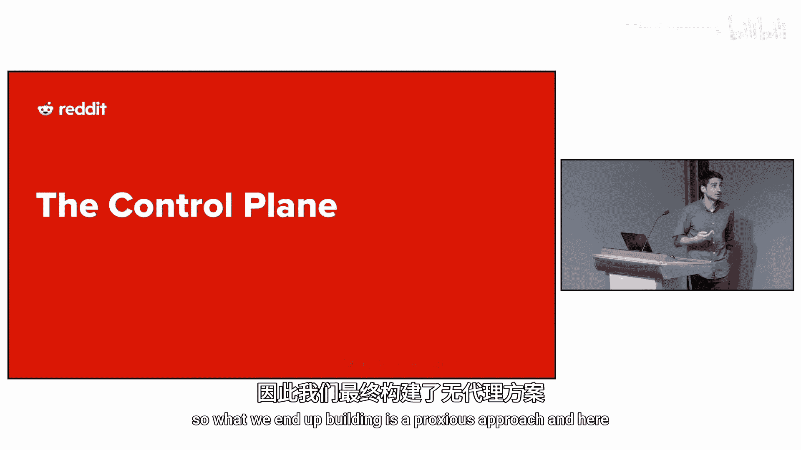
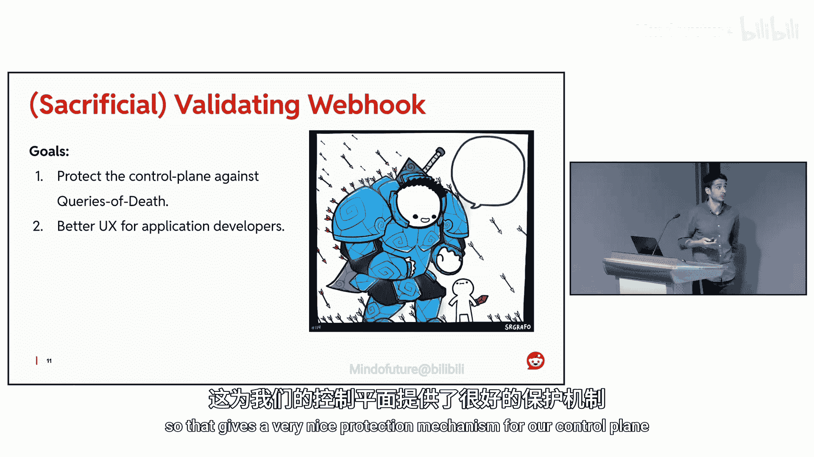
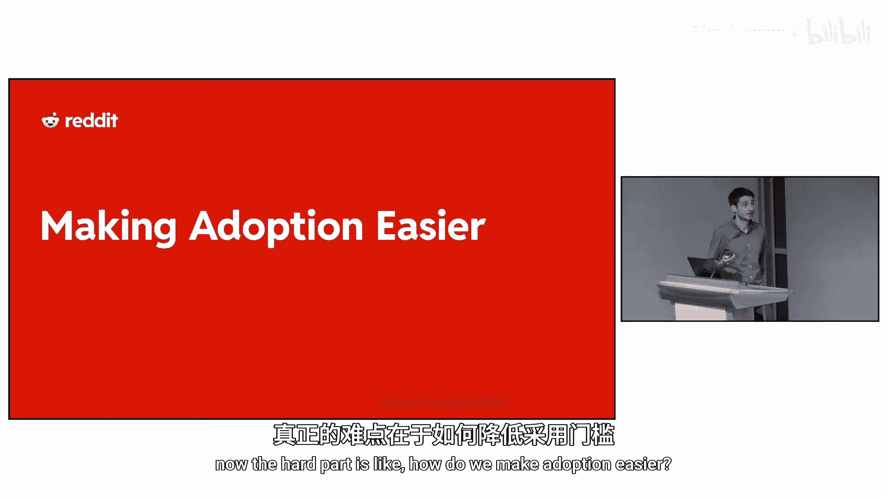
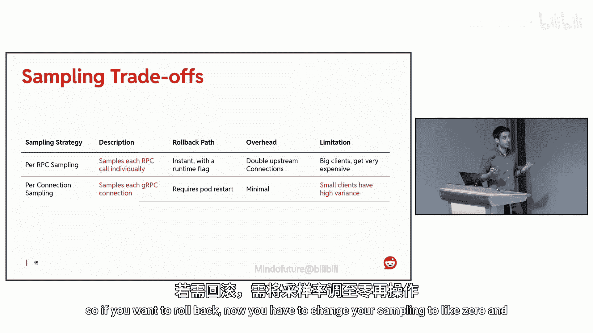
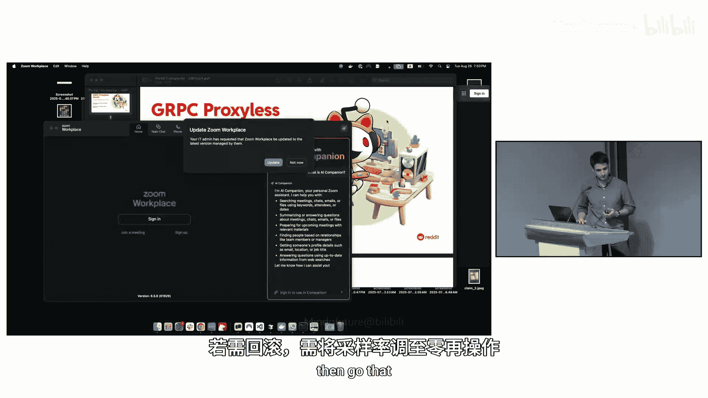
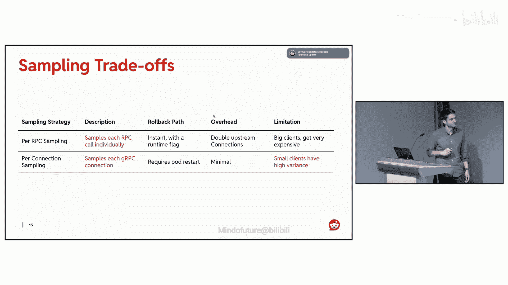
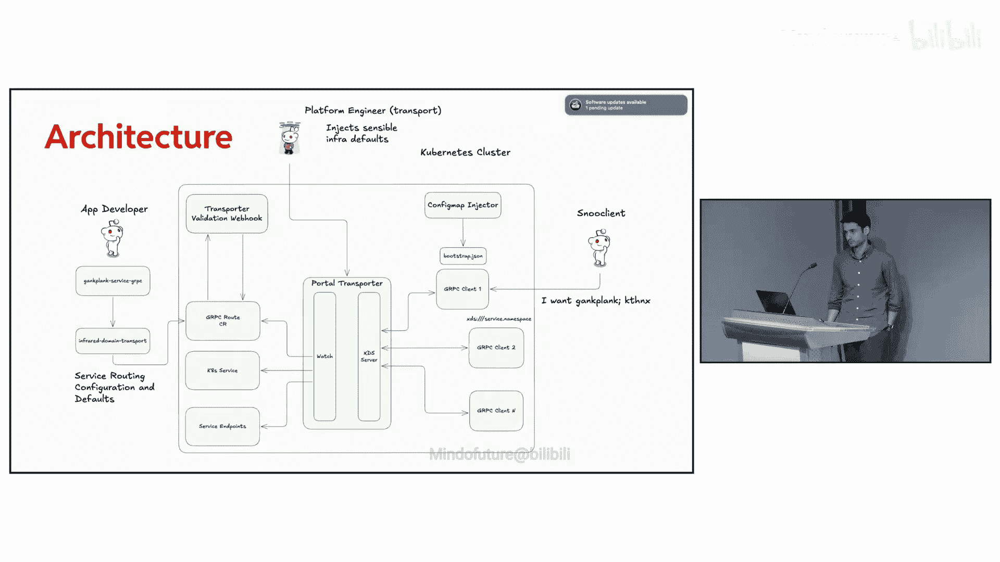

# 026：Reddit如何扩展弹性服务发现



在本节课中，我们将学习Reddit如何构建一个不依赖传统代理的、基于XDS（通用数据平面API）的现代服务发现系统。我们将探讨其架构决策、核心组件以及如何实现平滑迁移。

## 概述

Reddit是一个大型网站，用户在此聚集交流、搜索社区并寻找他们关心的内容。为了支撑如此庞大的规模，Reddit的技术栈广泛使用了Kubernetes和gRPC，每天处理数百亿次请求。

随着“World Reddit”项目的推进，Reddit需要在全球范围内建立更多集群和区域，这使得原有的、基于Kubernetes DNS的简单服务发现抽象开始变得难以维护。服务所有者需要手动管理跨集群调用，这带来了巨大的复杂性和操作负担。

## 从Kubernetes服务发现开始

在深入探讨XDS服务发现之前，我们先回顾一下Kubernetes原生的服务发现机制是如何工作的。

在Kubernetes中，**Pod**是计算的基本单位，由**Deployment**管理。**Service**为这些Pod提供网络抽象和负载均衡。Kubernetes通过其DNS解析器为服务提供DNS地址。例如，运行在`service-foo`命名空间中的服务，其DNS地址为`service-foo.namespace.svc.cluster.local`。

根据服务的配置，DNS解析可能返回服务的集群IP（一个虚拟IP），也可能直接返回后端Pod的IP列表（无头服务）。

**公式示例：Kubernetes服务DNS解析**
```
# 服务DNS记录
<service-name>.<namespace>.svc.cluster.local

# 解析结果示例（集群IP模式）
-> 10.96.123.456

# 解析结果示例（无头服务模式）
-> 10.244.1.10
-> 10.244.2.20
-> 10.244.3.30
```

这种机制在初期简单易用。但随着Reddit规模扩大和集群数量增多，其局限性开始显现：服务调用方需要明确知道目标服务是在同一集群内（使用集群本地DNS）还是在不同集群（需要使用其他集群的地址）。随着基础设施的演进和服务迁移，这种手动管理变得异常复杂。

此外，为了优化利用率和性能，服务的客户端和服务器端还需要手动管理许多细节，例如无头服务、Pod生命周期等。不同的服务可能有不同的负载均衡策略需求，而我们不希望为此修改所有客户端代码。

## 架构决策：代理 vs. 无代理

为了解决上述问题，我们首先需要决定是采用代理方案还是无代理方案。以下是我们的决策考量，这些标准也适用于其他类似场景。

如果采用代理方案（例如使用Envoy），其优势在于对gRPC的良好支持，并且能够支持更多种类的协议。然而，代理方案也存在显著挑战：

1.  **语言支持成本高**：如果Reddit未来想使用小众编程语言，需要为其提供C-core库支持，成本较高。而进程外代理可以支持所有语言。
2.  **隔离性**：在大型系统中，隔离性是重要考量。无代理方案中，应用运行在自己的进程中，问题易于排查。引入代理（无论是节点级还是边车代理）会引入一个共享资源，多个应用可能竞争同一代理资源。
3.  **开销**：无代理方案开销极低。引入代理意味着需要运行多个代理实例，这会消耗大量计算资源。
4.  **运维成本**：应用开发者习惯于查看自己应用的日志和指标。无代理方案对此非常直观。引入代理后，基础设施团队需要额外构建仪表盘和运维流程来区分问题是出在代理还是上游服务，这带来了很高的运维成本。

基于以上权衡，我们最终选择了构建一个**无代理（Proxy-less）**的解决方案，将服务发现逻辑直接集成到gRPC客户端中。





## 核心架构：控制平面

我们构建的控制平面非常简单，包含三个核心组件。其中，执行服务发现的XDS控制平面是核心，但它的实现相对标准，已有许多开源方案。因此，我们将重点介绍另外两个更具创新性的组件：**验证准入Webhook**和**配置映射注入器**。

以下是控制平面的架构图，它清晰地展示了各组件的关系：


### 1. XDS控制平面

这是一个简单的Kubernetes控制器，它监听来自Gateway API项目的gRPC路由（`GRPCRoute`）、端点切片（`EndpointSlice`）和服务（`Service`）资源。控制器根据这些信息创建XDS配置快照（Snapshot），并通过XDS协议将其发布给gRPC客户端。

**代码示例：控制器核心逻辑（概念性）**
```go
// 伪代码，展示控制器如何监听资源并生成快照
for {
    select {
    case event := <-grpcRouteWatcher:
        updateRouteConfig(event)
    case event := <-endpointSliceWatcher:
        updateEndpointConfig(event)
    case event := <-serviceWatcher:
        updateClusterConfig(event)
    }
    // 生成新的XDS快照
    snapshot := generateSnapshot()
    // 将快照分发给所有连接的客户端
    xdsServer.pushSnapshotToClients(snapshot)
}
```

### 2. 配置映射注入器

使用gRPC的XDS实现时，客户端需要一个引导文件（`bootstrap.json`）来配置初始的XDS服务器地址。这带来了一个挑战：我们希望能够在**不修改客户端代码**的情况下，动态改变客户端连接的XDS服务器地址。例如，当某个客户端变得非常庞大时，我们可能希望将其隔离到专用的控制平面实例（惩罚箱），或者避免单点故障。

为了实现这个目标，我们构建了名为**配置映射注入器**的控制器。它针对Kubernetes命名空间工作，自动创建一个包含引导文件的ConfigMap。这个引导文件由控制器动态生成，因为它可以访问Kubernetes控制平面，从而智能地填充所需值（如XDS服务器地址）。

应用Pod只需要加载这个ConfigMap即可。这为平台团队提供了独立运营的能力，并且即使注入器出现故障，ConfigMap仍然存在，客户端可以回退到一个已知可用的静态配置。

### 3. 验证准入Webhook

在Kubernetes世界中，验证准入Webhook通常被API服务器用来提供更好的用户体验：如果用户即将创建的资源被控制平面视为无效，Webhook会拒绝该请求。



我们除此之外，还创新性地利用验证准入Webhook来**保护我们的控制平面免受“死亡查询”攻击**。试想，如果一个聪明的用户创建了一个我们未曾预料到、无法正确解析的`GRPCRoute`资源，这可能会导致我们的控制平面崩溃（段错误）。



我们的验证准入Webhook运行着与控制平面**相同的逻辑**，并回答相同的问题：“我能否使用这个`GRPCRoute`来构建一个有效的XDS快照？” 如果不能，或者这个操作因为我们的bug而导致Webhook崩溃，那么用户将无法再创建新的配置，但**关键的控制平面服务仍然保持运行**。这为我们的控制平面提供了一个非常优雅的保护机制。

## 实现平滑迁移与可观测性

构建系统是相对容易的部分，而如何让业务方更容易地采纳和使用新系统才是真正的挑战。以下是我们在提升可观测性和推动迁移方面所做的关键工作。

### 客户端可观测性

我们非常感谢gRPC Go社区，他们提供了我们所需的大部分指标。我们最终构建并暴露了gRPC客户端指标，这对于了解客户端视角下的控制平面状态非常有用。

此外，我们使用自定义指标和链路追踪来更好地理解数据路径。随着网络对应用开发者变得更加透明（他们无需关心服务在哪个集群），我们提供了更强的可观测性，以便他们在调试时能够清晰地了解数据实际经过的路径。

### 管理端点

我们利用了客户端发现服务（CDS）的管理端点。这允许我们连接到任何客户端，查询其当前的XDS配置状态。同时，我们在控制平面也提供了类似的管理端点，用于展示其当前感知的全局状态。这在调试配置错误时是终极真相来源。

### 采样客户端：渐进式迁移与回滚

本次迁移的一个主要目标是**渐进式**和**易于回滚**。为此，我们构建了一个采样客户端，允许任何gRPC调用选择是使用我们构建的XDS寻址，还是回退到默认的DNS解析。

采样策略看似简单，但需要根据底层gRPC实现和服务的规模进行权衡。主要有两种方式：







1.  **按RPC采样**：每个RPC调用可以独立选择走XDS路径还是DNS路径。优点是控制粒度细，回滚可以瞬间完成。缺点是开销大，因为客户端需要维护两套连接池，意味着双倍的连接开销，对于大型服务成本很高。
2.  **按连接采样**：在建立连接时决定是建立XDS连接还是DNS连接。缺点是，如果需要回滚（比如将采样率调为0），可能需要重启Pod，因为连接通常在启动时建立并长期复用。这种方式开销较小。


下图展示了采样策略的权衡：


## 性能优化与问答精粹

在系统运行过程中，我们针对性能和一些技术细节进行了优化，并在社区问答中分享了经验。

### 增量更新与资源隔离



gRPC目前仅支持**全量状态推送**，而不支持增量更新（Delta XDS）。虽然我们很希望实现增量更新（因为它可能更简单），但当前的全量模式工作良好。

为了提升效率，我们在控制平面侧将端点（Endpoints）的配置快照与其他资源（如路由和集群）的快照分开。因为端点的变化非常频繁，而其他资源相对稳定。这样，我们可以更高效地管理更新。

### 更新抖动控制

为了避免在端点发生剧烈变化时“轰炸”客户端，我们实施了更新批处理。控制平面有一个收集窗口（例如5-10秒），在此期间收集端点的更新，然后一次性发送给客户端。这个值目前是手动选取的，与我们之前DNS缓存的TTL设置保持一致，未来可能会根据实际情况调整。

## 总结

在本节课中，我们一起学习了Reddit如何构建一个无代理的、基于XDS的现代服务发现系统。我们从Kubernetes原生服务发现的局限性出发，探讨了代理与无代理架构的权衡，并最终详细介绍了Reddit自研控制平面的三大核心组件：XDS控制平面、配置映射注入器和验证准入Webhook。我们还了解了如何通过增强可观测性、提供管理接口和实现采样客户端来推动系统的平滑迁移与安全运维。这套架构帮助Reddit在全球化扩展中，实现了更弹性、更透明和更易管理的服务通信。