# 001：用C语言从零编写PING程序


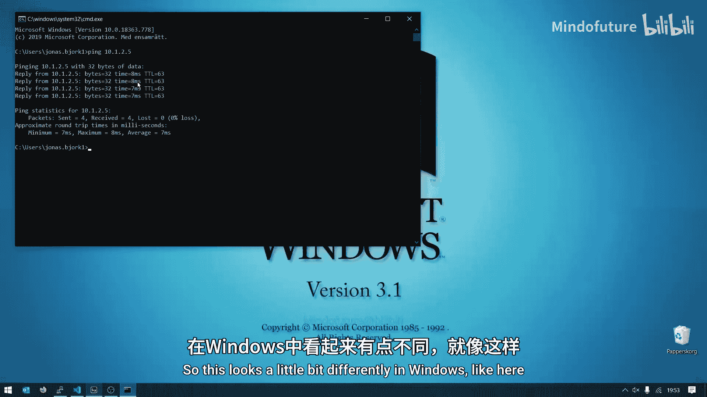

## 概述 📖

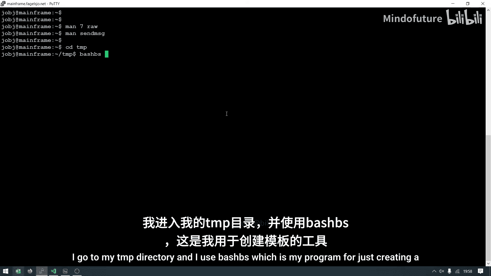


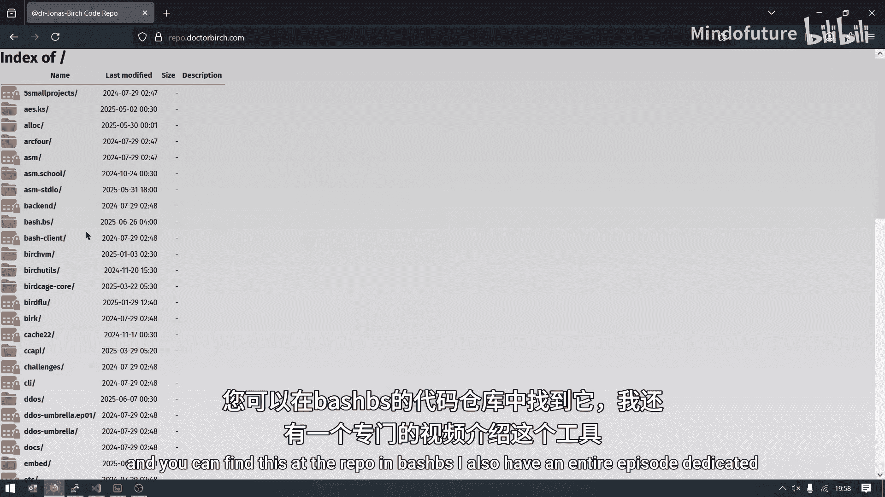

在本节课中，我们将要学习如何使用C语言从零开始编写一个PING程序。PING是一个用于测试网络连接的工具，它通过发送一个数据包到目标计算机并等待其回复，来验证两台计算机之间的网络是否通畅。我们将从理解ICMP协议开始，逐步构建我们自己的PING工具。

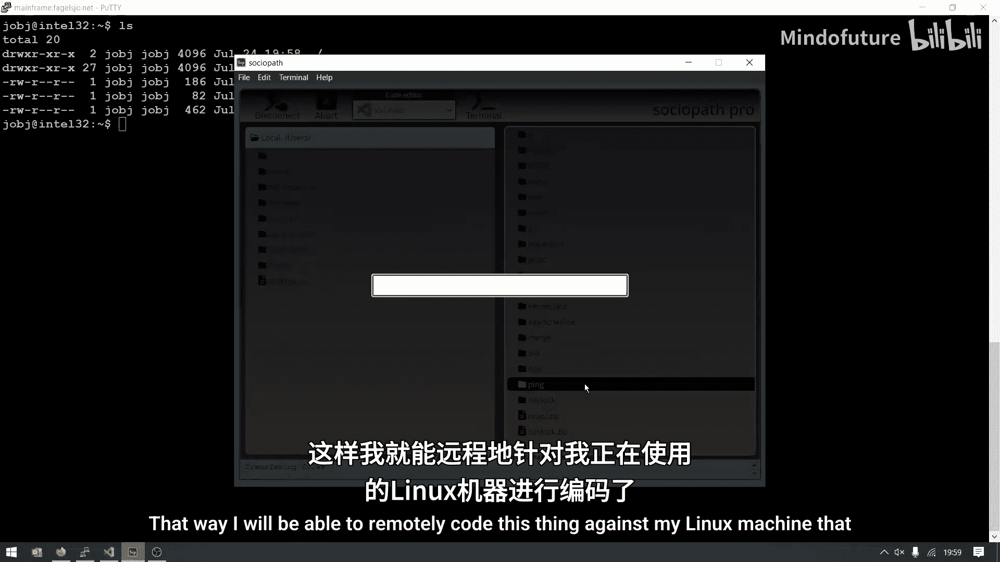

## ICMP协议与PING原理 🔍

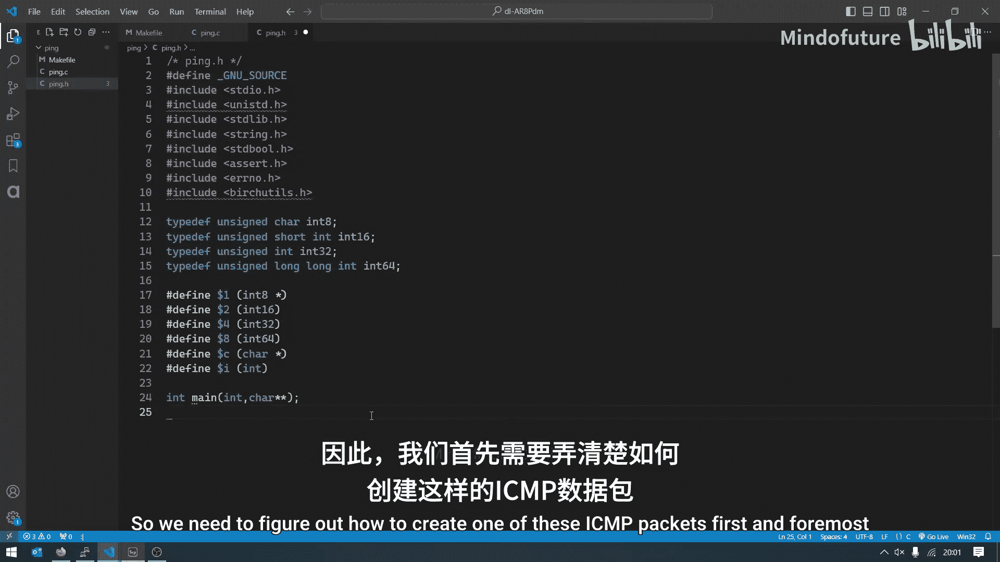

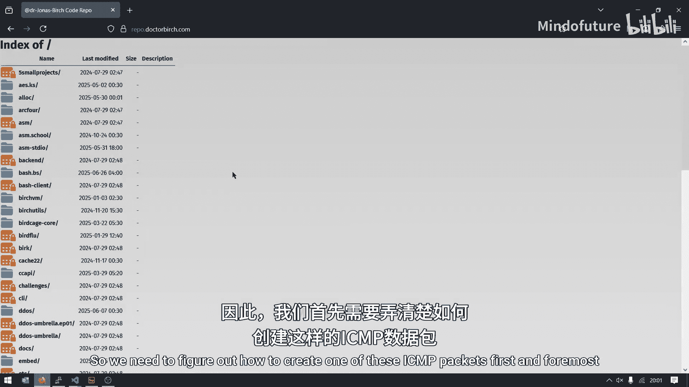


上一节我们介绍了PING程序的基本概念。本节中我们来看看PING程序背后的核心协议——ICMP。

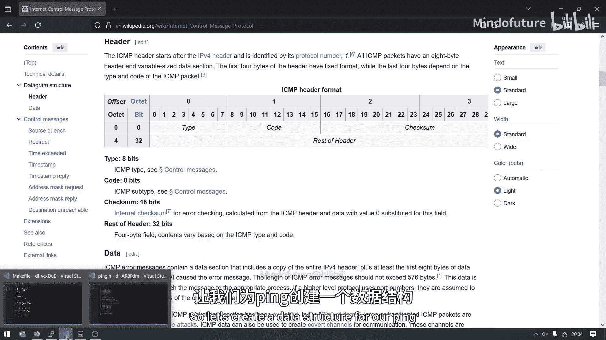


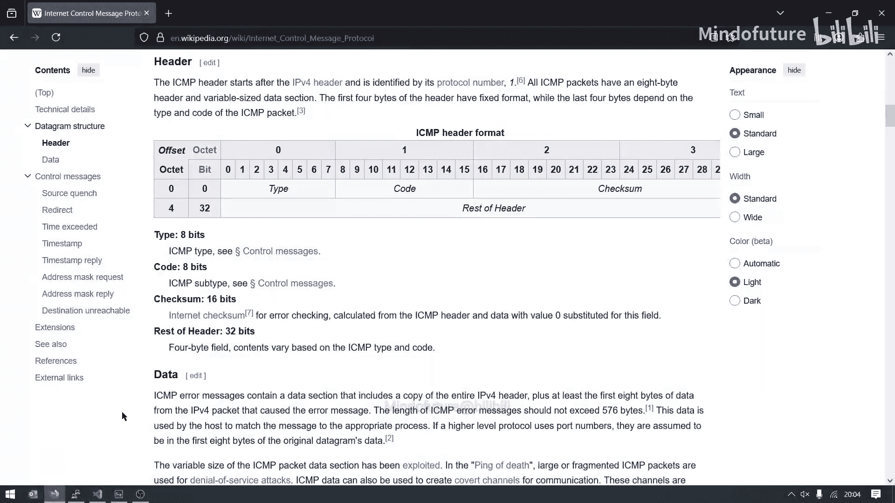

PING程序使用ICMP协议。它发送一个类型为8的ICMP数据包，即“回显请求”。如果目标主机在线且网络通畅，它会回复一个类型为0的ICMP数据包，即“回显应答”。通过这个过程，我们可以测试网络连接。


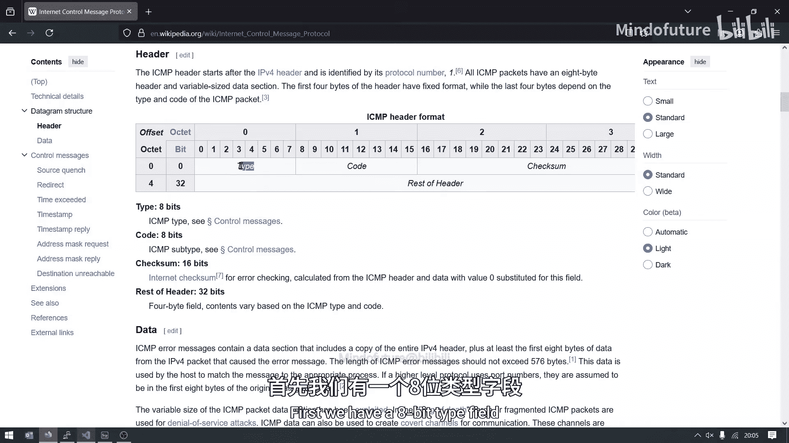

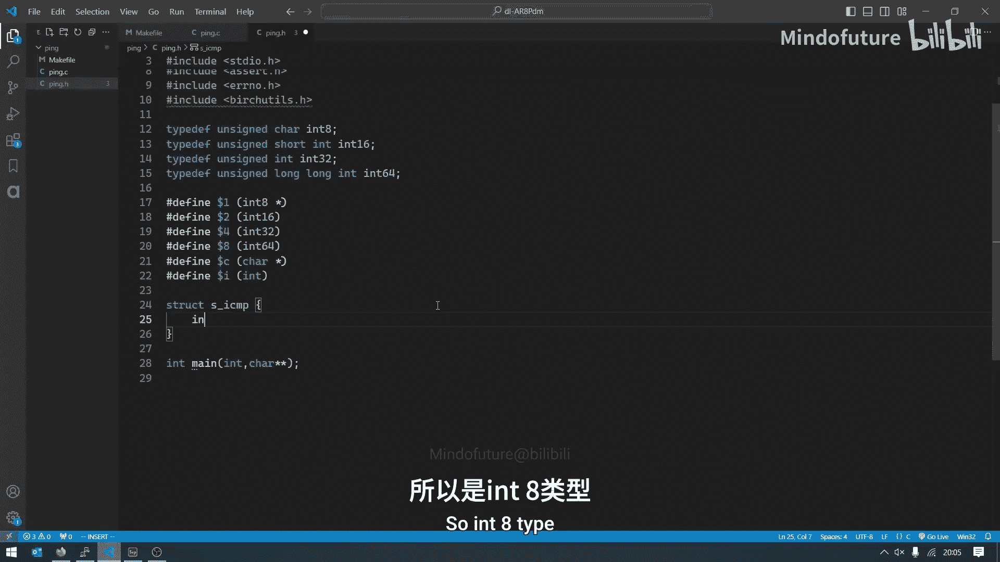

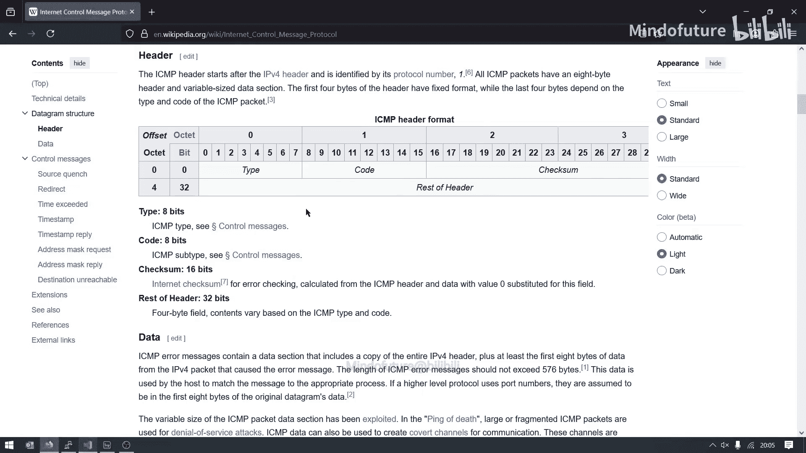

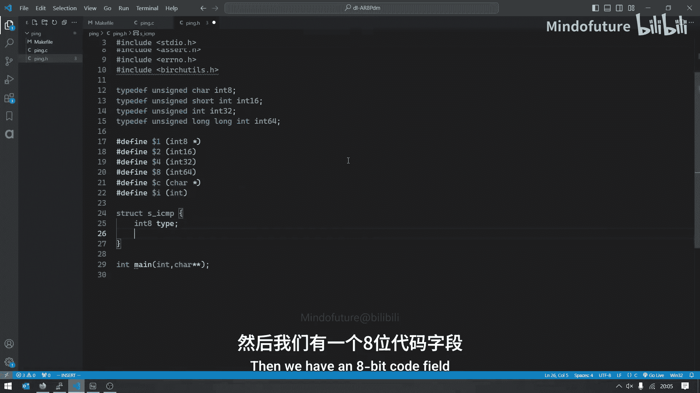

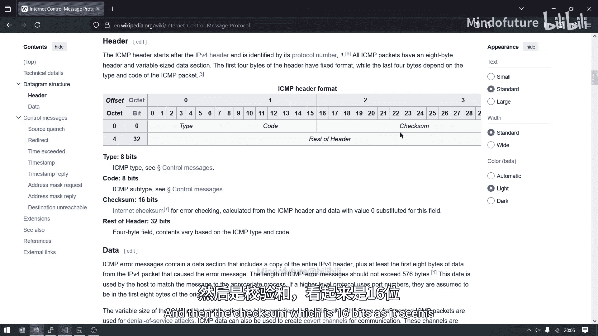

一个ICMP数据包的基本结构如下：
*   **类型**：8位字段，用于标识ICMP消息的类型。
*   **代码**：8位字段，通常为0。
*   **校验和**：16位字段，用于验证数据在传输过程中是否损坏。
*   **数据**：可变长度的数据部分。

以下是ICMP数据包结构的代码表示：
```c
struct icmp {
    uint8_t type;
    uint8_t code;
    uint16_t checksum;
    uint8_t data[];
} __attribute__((packed));
```
`__attribute__((packed))` 确保编译器不对结构体进行内存对齐，使其大小与网络数据包格式完全一致。

## 创建ICMP数据包结构 🛠️

理解了ICMP数据包的结构后，我们需要在代码中定义它。我们将创建两个结构体：一个用于逻辑表示，另一个用于生成最终的原始字节流。

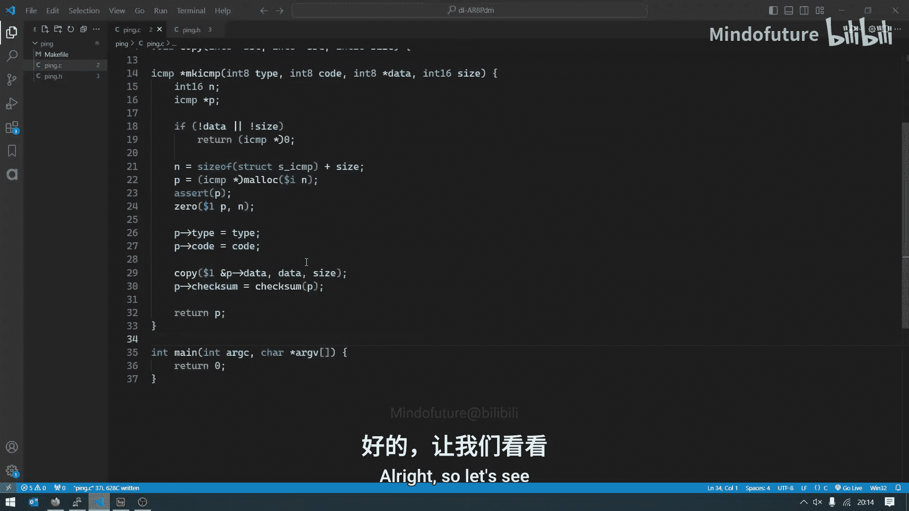


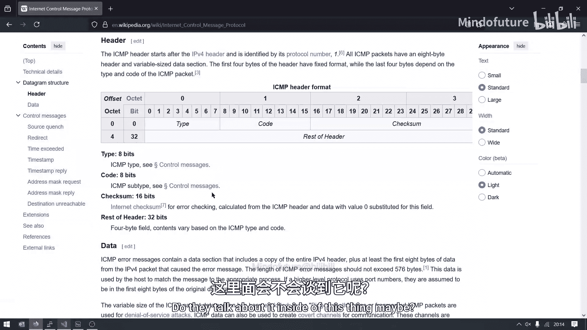


以下是核心数据结构的定义：
```c
// ICMP数据包类型枚举
enum icmp_type {
    ICMP_TYPE_UNASSIGNED,
    ICMP_TYPE_ECHO,
    ICMP_TYPE_ECHO_REPLY
};

// 逻辑ICMP数据包结构
struct icmp_packet {
    enum icmp_type kind;
    uint16_t size;
    const uint8_t *data;
};

// 原始ICMP数据包结构（对应网络字节格式）
struct raw_icmp {
    uint8_t type;
    uint8_t code;
    uint16_t checksum;
    uint8_t data[];
} __attribute__((packed));
```

## 实现ICMP数据包构造函数 🧱

有了数据结构，我们需要一个函数来创建ICMP数据包对象。这个函数负责分配内存并初始化数据包。

以下是创建ICMP数据包的函数：
```c
struct icmp_packet* make_icmp(enum icmp_type kind, const uint8_t *data, uint16_t size) {
    if (!data || size == 0) {
        return (struct icmp_packet*)0; // 返回空指针表示错误
    }
    struct icmp_packet *packet = malloc(sizeof(struct icmp_packet));
    assert(packet); // 确保内存分配成功
    zero(packet, sizeof(struct icmp_packet)); // 清零结构体
    packet->kind = kind;
    packet->size = size;
    packet->data = data;
    return packet;
}
```

## 计算ICMP校验和 🧮

校验和是网络数据包中用于验证数据完整性的关键部分。对于ICMP，我们需要计算整个数据包（包括头部和数据）的16位反码和。

以下是计算校验和的算法步骤：
1.  将数据包内容视为一系列16位整数。
2.  将这些整数相加（使用32位累加器以处理进位）。
3.  将累加结果的高16位（进位）加到低16位上。
4.  对最终的和取反码（按位取反），得到校验和。

以下是校验和计算函数的实现：
```c
uint16_t checksum(const uint8_t *packet, uint16_t size) {
    uint32_t accumulator = 0;
    const uint16_t *p = (const uint16_t*)packet;
    // 将所有16位字相加
    for (uint16_t n = size; n > 1; n -= 2) {
        accumulator += *p++;
    }
    // 处理可能的奇数长度字节（填充0）
    if (n == 1) {
        accumulator += *(const uint8_t*)p;
    }
    // 将进位（高16位）加到结果（低16位）上
    accumulator = (accumulator >> 16) + (accumulator & 0xFFFF);
    accumulator += (accumulator >> 16);
    // 返回反码
    return (uint16_t)(~accumulator);
}
```


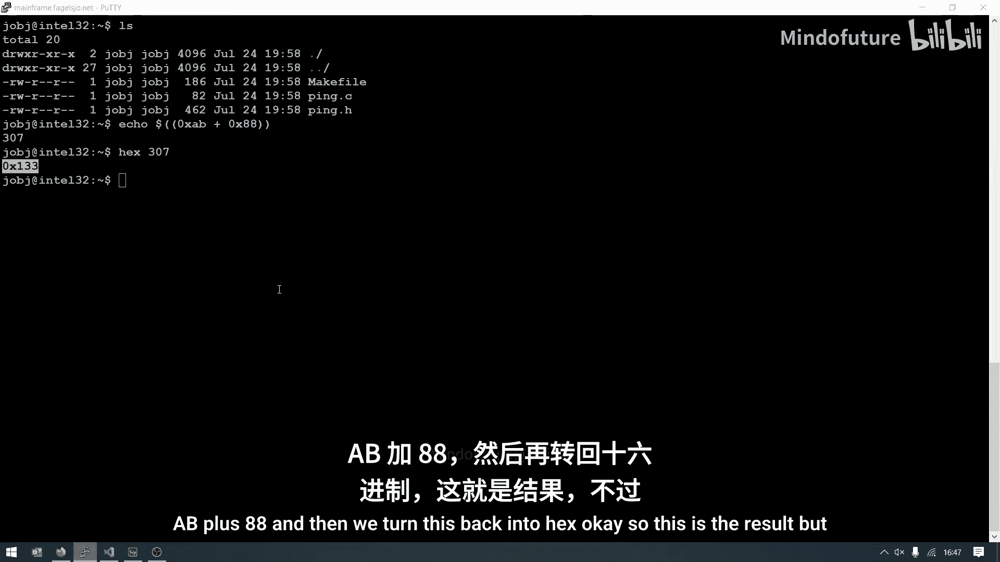

## 将逻辑包转换为原始字节流 ⚙️

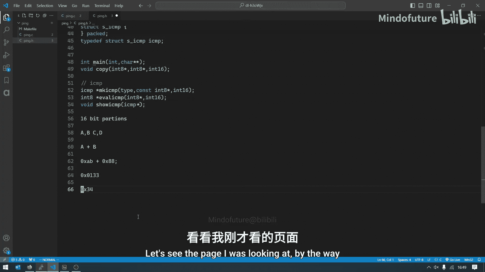

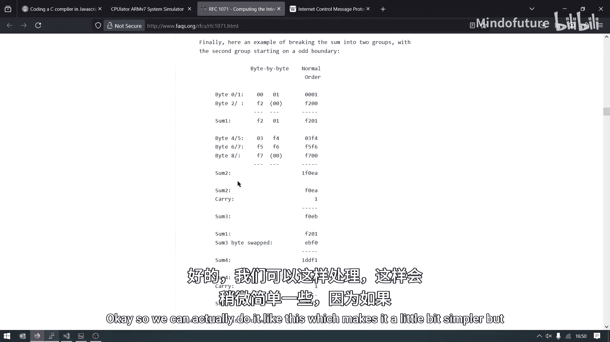


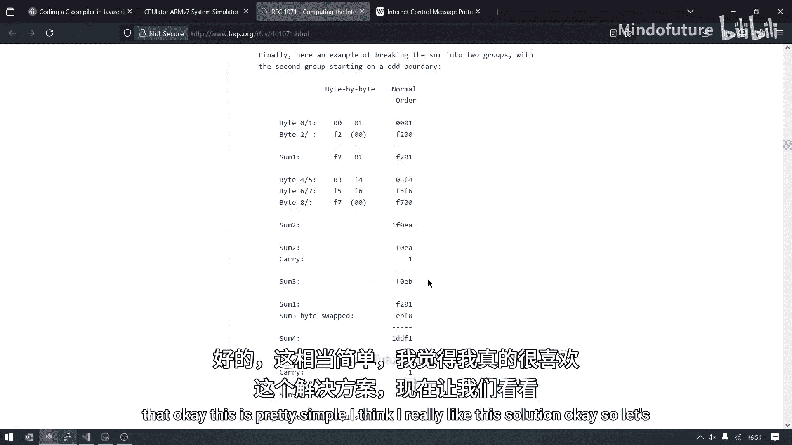

最后一步是将我们创建的逻辑`icmp_packet`结构体转换为可以发送到网络上的原始字节序列。这个过程包括填充`raw_icmp`结构体、复制数据以及计算并填入校验和。

以下是转换函数的核心逻辑：
```c
uint8_t* eval_icmp(const struct icmp_packet *packet) {
    if (!packet || !packet->data) return (uint8_t*)0;
    struct raw_icmp raw;
    // 根据包类型设置头部字段
    switch(packet->kind) {
        case ICMP_TYPE_ECHO:
            raw.type = 8; raw.code = 0; break;
        case ICMP_TYPE_ECHO_REPLY:
            raw.type = 0; raw.code = 0; break;
        default:
            return (uint8_t*)0;
    }
    raw.checksum = 0; // 先置零，计算后再填充
    // 分配内存并复制数据
    uint16_t total_size = sizeof(struct raw_icmp) + packet->size;
    uint8_t *raw_bytes = malloc(total_size);
    assert(raw_bytes);
    zero(raw_bytes, total_size);
    copy(raw_bytes, &raw, sizeof(struct raw_icmp));
    copy(raw_bytes + sizeof(struct raw_icmp), packet->data, packet->size);
    // 计算并设置校验和
    uint16_t cs = checksum(raw_bytes, total_size);
    ((struct raw_icmp*)raw_bytes)->checksum = cs;
    return raw_bytes;
}
```

## 测试我们的ICMP构建器 ✅

现在，让我们编写一个简单的测试程序来验证我们构建的ICMP数据包是否正确。

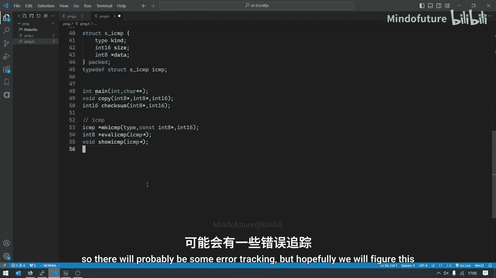

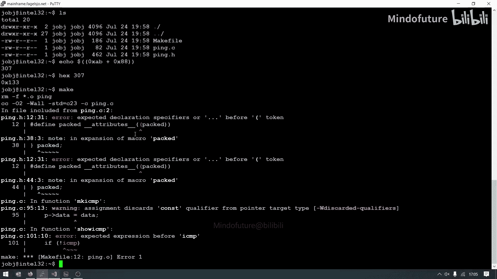

以下是测试代码：
```c
int main() {
    // 1. 创建测试数据
    uint8_t *data = malloc(6); // "Hello" + 空字符
    assert(data);
    zero(data, 6);
    copy(data, "Hello", 5);
    // 2. 创建ICMP回显请求包
    struct icmp_packet *packet = make_icmp(ICMP_TYPE_ECHO, data, 5);
    show_icmp(packet); // 显示包信息
    // 3. 转换为原始字节
    uint8_t *raw = eval_icmp(packet);
    assert(raw);
    // 4. 以十六进制形式打印原始字节，便于分析
    print_hex(raw, sizeof(struct raw_icmp) + 5);
    // 5. 清理内存
    free(data);
    free(packet);
    free(raw);
    return 0;
}
```
运行此测试，如果输出显示类型为8（回显请求），并包含一个计算出的校验和以及数据“Hello”的十六进制表示，则说明我们的ICMP数据包构建器工作正常。

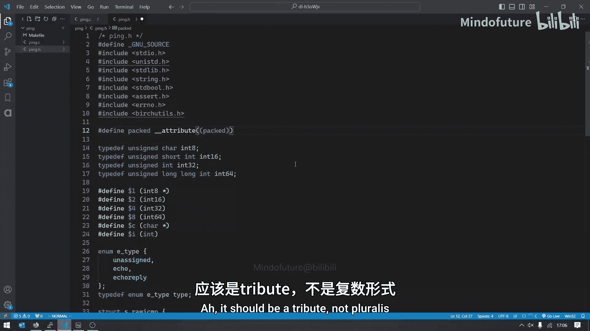

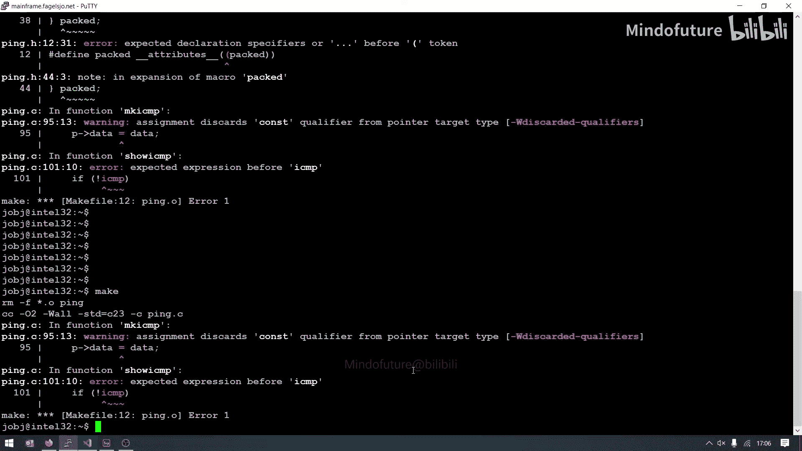

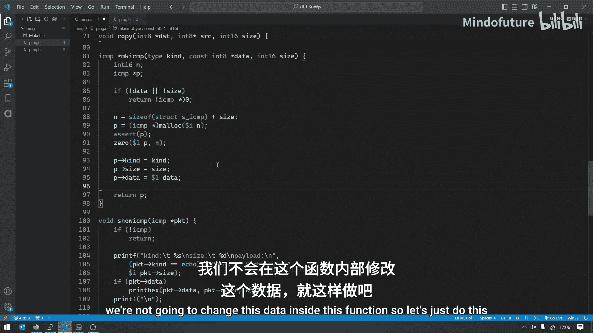

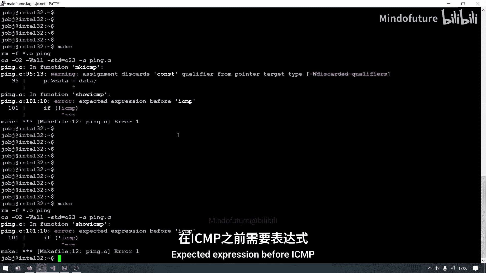

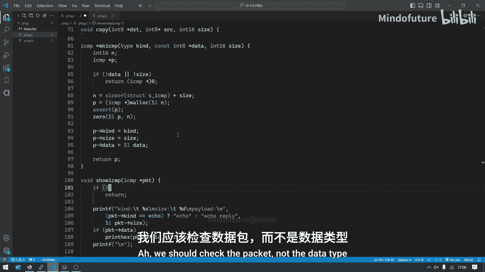

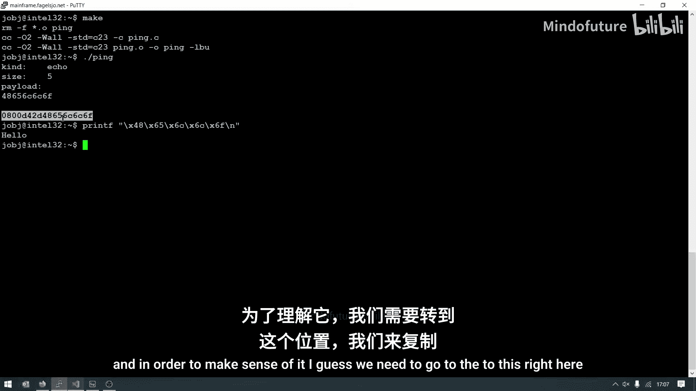

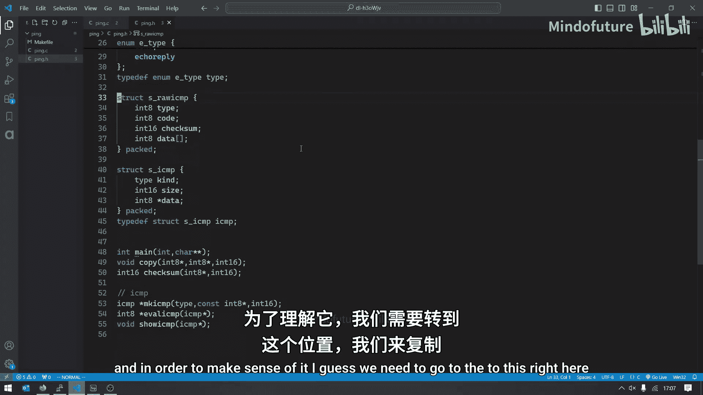

## 总结 🎯

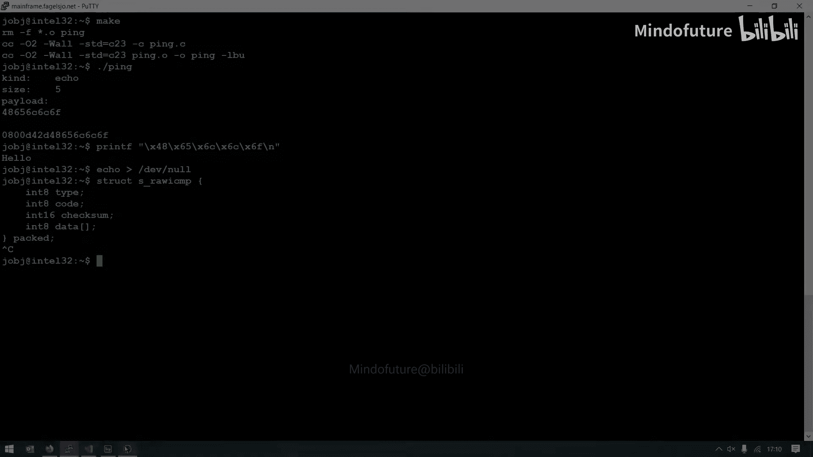

本节课中我们一起学习了PING程序的基础——ICMP协议，并动手实现了ICMP数据包的构建。我们定义了数据结构，编写了构造函数、校验和算法以及将逻辑包转换为网络字节流的函数。虽然我们还没有实际发送和接收数据包，但已经为网络通信打下了坚实的基础。在下一节课中，我们将学习如何使用原始套接字来发送这个ICMP数据包并接收回复，从而完成我们的PING程序。