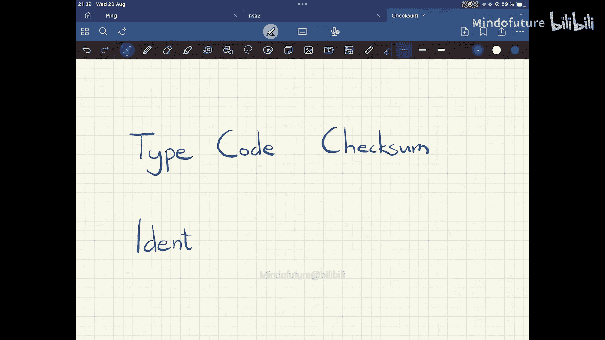
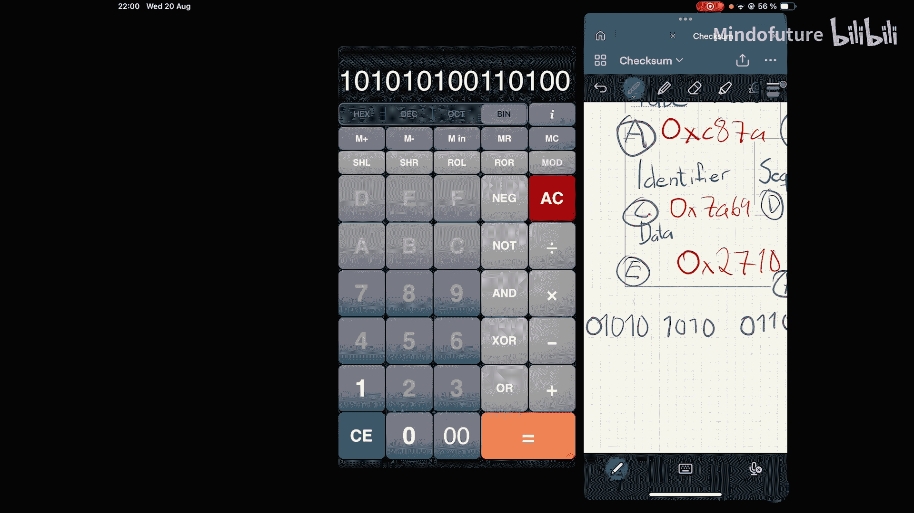
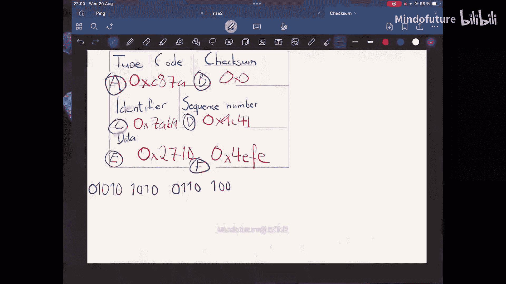
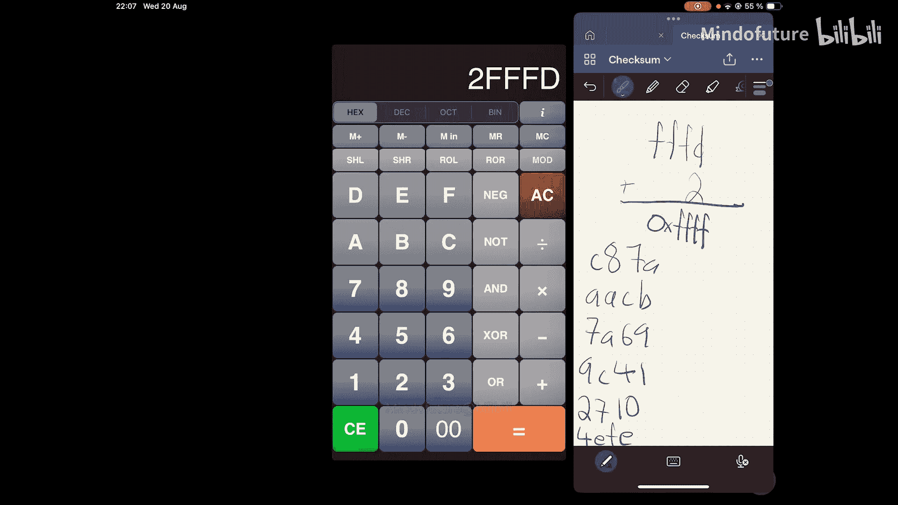

# 004：计算互联网校验和 🔢




在本节课中，我们将深入学习互联网校验和的计算方法。校验和是网络协议（如ICMP、IP、TCP、UDP）中用于验证数据完整性的关键机制。我们将通过一个具体的ICMP数据包示例，手把手演示如何从零开始计算校验和。

## 构建示例数据包 📦

上一节我们介绍了校验和的基本概念，本节中我们来看看如何具体计算。首先，我们需要一个示例数据包作为计算对象。这里我们构建一个简化的ICMP数据包结构，它包含以下几个字段：

*   **类型 (Type)**: 假设为 `200` (十进制)
*   **代码 (Code)**: 假设为 `122` (十进制)
*   **校验和 (Checksum)**: 初始设为 `0`
*   **标识符 (Identifier)**: 假设为 `31337` (十进制)
*   **序列号 (Sequence Number)**: 假设为 `40001` (十进制)
*   **数据 (Data)**: 假设为32位数据，分为两个16位数：`10000` 和 `20222` (十进制)

在计算校验和时，我们总是**假设校验和字段为0**，待计算完成后再填入正确值。

## 转换为十六进制 🔄

为了便于计算，我们首先将所有十进制数转换为十六进制数。以下是转换后的结果，每个字段都被视为一个16位的数：

*   类型 (200) + 代码 (122): **`0xCA7A`**
*   校验和 (0): **`0x0000`**
*   标识符 (31337): **`0x7A69`**
*   序列号 (40001): **`0x9C41`**
*   数据第一部分 (10000): **`0x2710`**
*   数据第二部分 (20222): **`0x4EFE`**

为了方便后续步骤，我们为这些16位数分配标签：
*   A = `0xCA7A`
*   B = `0x0000`
*   C = `0x7A69`
*   D = `0x9C41`
*   E = `0x2710`
*   F = `0x4EFE`

## 计算一补数和 (One’s Complement Sum) ➕

校验和的核心是计算“一补数和”。这听起来复杂，但操作很简单：我们将所有16位数相加，并对溢出部分进行特殊处理。

以下是计算步骤：

1.  将所有数字相加：`A + B + C + D + E + F`
2.  计算过程如下：
    ```
    0xCA7A
  + 0x0000
  ---------
    0xCA7A
  + 0x7A69
  ---------
    0x144E3 (此处产生溢出，我们暂时保留)
  + 0x9C41
  ---------
    0x1E124 (再次产生溢出)
  + 0x2710
  ---------
    0x20834
  + 0x4EFE
  ---------
    0x25732
    ```
    最终得到结果 `0x25732`，这是一个17位的数（超过16位）。

3.  处理溢出：将高位的溢出值（`0x2`）加回到结果的低16位（`0x5732`）上。
    ```
    0x5732
  + 0x0002
  ---------
    0x5734
    ```
    这样，我们得到了一补数和：**`0x5734`**。

**一补数和的计算公式**可以概括为：将所有16位字段相加，然后将结果中任何超出16位的进位（溢出）加回到结果的低16位上，重复此过程直到没有进位为止。

## 取反得到最终校验和 🔁

得到一补数和后，我们需要对其进行“取反”操作，即计算其二进制的一补数（One’s Complement）。这意味着将每一位二进制数翻转：`0`变成`1`，`1`变成`0`。

1.  将 `0x5734` 转换为二进制：
    ```
    0101 0111 0011 0100
    ```
2.  对每一位取反：
    ```
    1010 1000 1100 1011
    ```
3.  将取反后的二进制数转换回十六进制：
    ```
    0xA8CB
    ```

因此，我们计算出的最终校验和为：**`0xA8CB`**。现在，我们可以将这个值填回数据包的校验和字段。

## 验证校验和 ✅





如何验证我们的计算是否正确呢？校验和的巧妙之处在于验证非常简单。如果我们用计算出的校验和（`0xA8CB`）替换掉数据包中的0，然后**重新对所有16位字段（包括新的校验和）执行一次相同的“一补数和”计算**，结果应该是一个特殊的值。

让我们验证一下：
将所有字段（A, `0xA8CB`, C, D, E, F）相加并进行一补数和计算。

```
0xCA7A (A)
+ 0xA8CB (Checksum)
+ 0x7A69 (C)
+ 0x9C41 (D)
+ 0x2710 (E)
+ 0x4EFE (F)
```

按照前述步骤计算，最终结果将是 **`0xFFFF`**（即所有16位都是1）。这是因为校验和的设计使得数据包所有部分（包括校验和本身）的一补数和等于全1。

**验证公式**：`Sum of all 16-bit fields (including checksum) = 0xFFFF`

如果计算结果为 `0xFFFF`，则证明数据包在传输过程中没有出错，校验和计算正确。



## 总结 📝

本节课中我们一起学习了互联网校验和的完整计算流程：
1.  **准备数据**：构建数据包，并将校验和字段初始化为0。
2.  **转换格式**：将所有字段转换为十六进制的16位数。
3.  **计算一补数和**：将所有16位数相加，并将产生的任何进位加回结果的低16位。
4.  **取反**：对一补数和进行二进制取反操作，得到最终的校验和值。
5.  **验证**：将计算出的校验和代入数据包，重新计算所有字段的一补数和，结果应为 `0xFFFF`。

这种校验和方法因其计算简单、验证方便，被广泛应用于IP、ICMP、TCP、UDP等多种网络协议中，是保证数据完整性的基石。