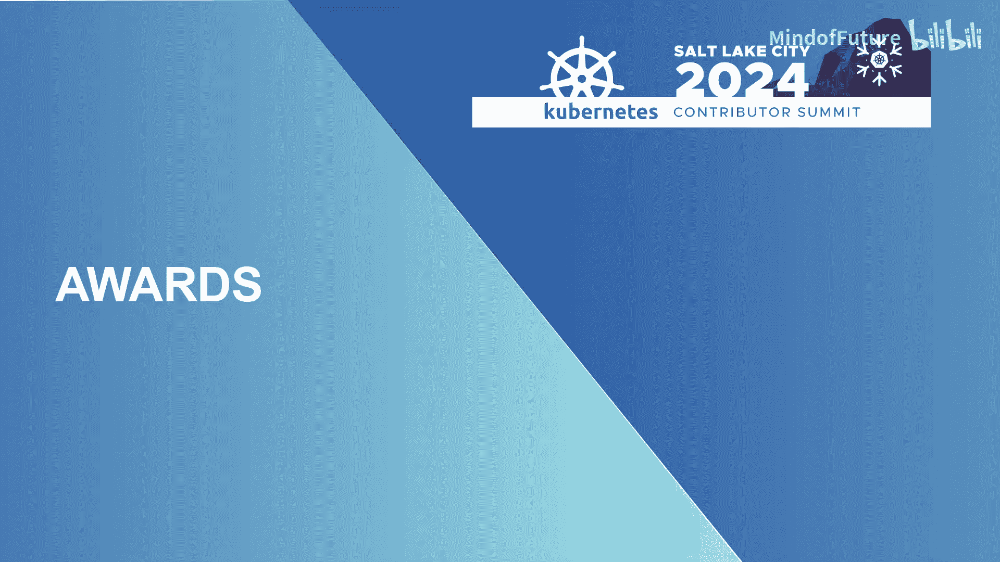
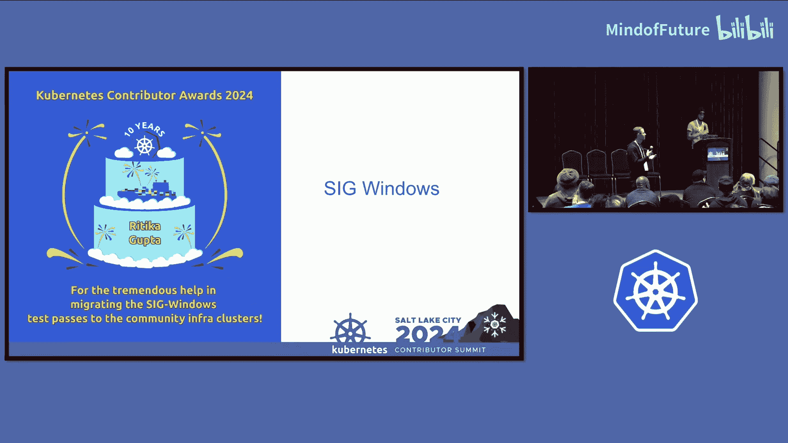

# 001：奖项与表彰 🏆

在本节课中，我们将学习Kubernetes 2024北美贡献者峰会的奖项颁发环节。我们将了解项目如何感谢核心组织者，并表彰在过去一年中为各个特别兴趣小组做出杰出贡献的开发者们。

## 特别致谢 🙏

在开始颁发奖项之前，我们首先要感谢一位特别的人物，她多年来在组织历届贡献者峰会方面提供了巨大帮助。

感谢来自CNCF（云原生计算基金会）的**Pri Prine**。她负责从CNCF的角度组织所有这些活动，并耐心处理我们所有的疑问和请求。虽然她未来将不再属于Kubernetes核心团队，因为她将在Linux基金会承担其他职责，但我们仍想为她过去组织的所有活动表达谢意。

Josh特意准备了一份礼物。这是一个特别的Kubernetes纪念杯，你无法在其他地方获得，只能从George这里得到。同时，还有一个需要你自己组装的、由550块乐高积木构成的Kubernetes标志。我们期待看到成品。

## 杰出贡献者表彰 🎉

现在，我们将继续表彰那些多年来，尤其是过去一年中，在Kubernetes项目中做出杰出贡献的人们。我们将从SIG API Machinery开始。

以下是获得表彰的贡献者名单，我们对可能读错的姓名表示歉意。

### SIG API Machinery
*   **Lucas**：感谢你的工作。
*   **Stephen Heyward**：感谢你所做的一切。这掌声是给你的。

### SIG CLI
*   **Ma Zuk**

### SIG Cluster Lifecycle
*   **Fan Boa Bofa**
*   **Christian Schlaughter**
*   **Max Gotier**

### SIG Contributor Experience
*   **Arvin Parek**
*   **Jason Bragen Brugenza**
*   **Mario**
*   **Noah Kviitz**
*   **Cip Kennabar**
*   **S arm We it**

### SIG Docs
*   **Abigail McCarthy**
*   **Tipesh Gt**

### SIG Auth
*   **Ivonne Valdeez**

### SIG Architecture
*   **Can Sang**
*   **Weiffu**

### SIG Instrumentation
*   **Katherine Fang**
*   **Man Ruger**

### SIG Intro
*   **Ricky Zowsky**
*   **Marco Binch**

### SIG Multicluster
*   **Mike Morris**

### SIG Network
*   **Chuan Tian**
*   **Damen awar**
*   **Maade**
*   **Dave Prataovsky**

### SIG Node
*   **Peter Hunt**
*   **Francesco Romanmani**

### SIG Release
*   **Meha Belodia**
*   **Wayom Yaov**

### SIG Scalability
*   **Harsh Kuna**
*   **Praique Georgia**
*   **Justin Santa Barbara**

### SIG Scheduling
*   **Shengchn**

### SIG Security
*   **And Chaman Chapathy**
*   **Ayla Dbury**

### SIG Storage
*   **Bafathanan**
*   **Rawa Shah**

### SIG Windows
*   **Ratiika Gupta**

---

本节课中，我们一起学习了Kubernetes贡献者峰会的表彰环节。我们看到了项目对核心组织者的衷心感谢，也认识了许多在API Machinery、CLI、集群生命周期、文档、安全、网络等各个特别兴趣小组中辛勤付出的杰出贡献者。正是这些社区成员的共同努力，驱动着Kubernetes项目不断向前发展。