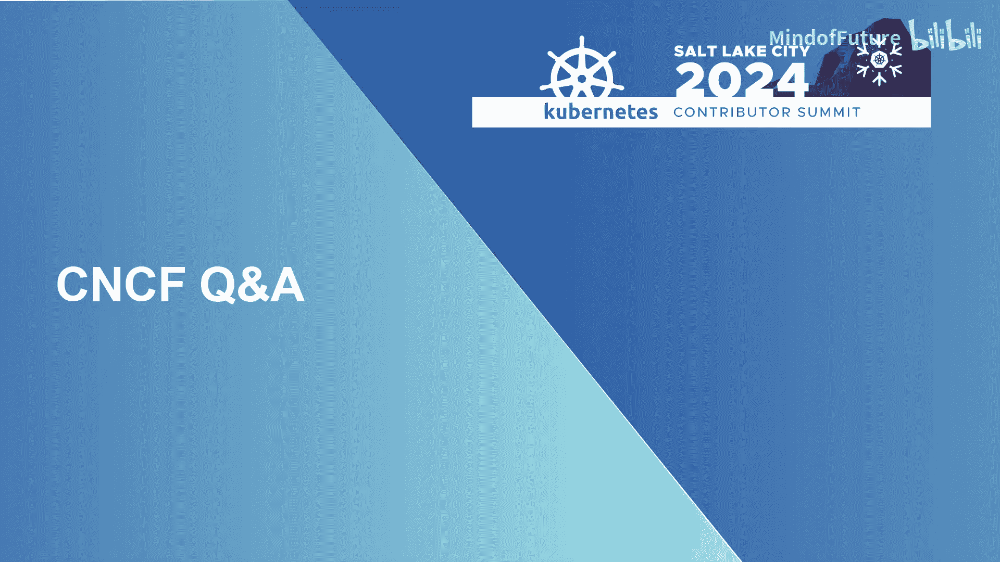
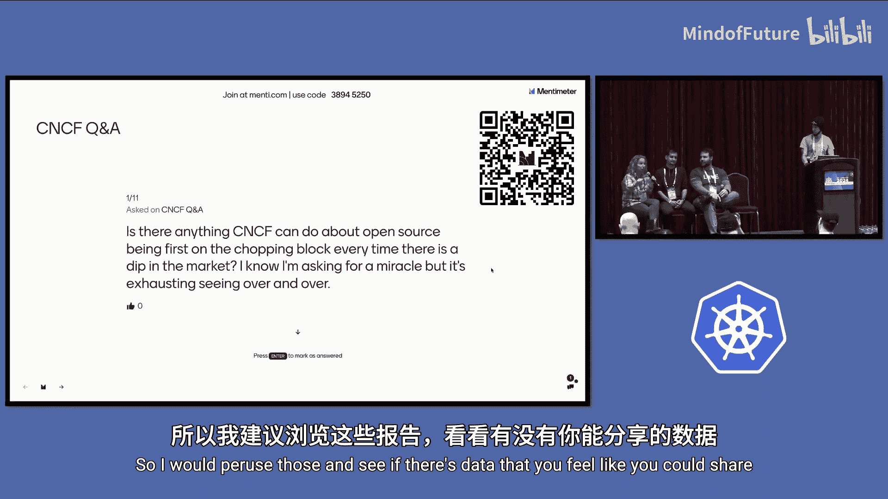
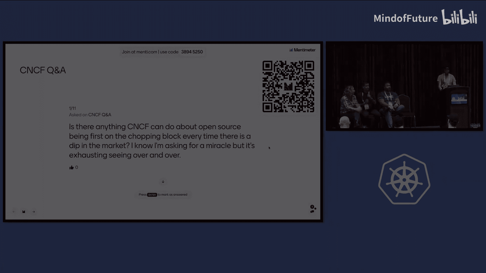

# 002：CNCF问答环节

在本节课程中，我们将一起回顾2024年Kubernetes北美贡献者峰会上，CNCF（云原生计算基金会）核心成员与社区进行的问答交流。内容涵盖了项目维护、社区发展、活动规划等多个方面，旨在帮助初学者了解CNCF的运作和社区关心的核心议题。

## 自我介绍

首先，让我们认识一下参与本次问答的CNCF核心成员。

*   **Jeffrey Sica (Gfi)**：CNCF项目负责人。自2018年起成为Kubernetes贡献者，并曾负责运营贡献者峰会数年。他的工作是确保CNCF旗下的各个项目顺利运行、感到满意。
*   **Taylor Dolezal**：CNCF生态系统负责人。他的工作重点是服务最终用户，即那些将CNCF项目应用于自身业务平台的企业（如Adobe、Apple），了解他们的独特需求。
*   **Angela Brown**：Linux基金会活动高级副总裁兼总经理。她的团队负责管理与CNCF项目相关的各类活动，包括KubeCon等大型会议。

## 核心议题讨论

上一节我们认识了CNCF的团队成员，本节中我们来看看社区提出的具体问题以及官方的回应。

### 如何修复不同项目间的维护者信息同步问题？

这是一个关于项目治理的基础问题。核心挑战在于“维护者”的定义在不同项目间不统一（例如，有些项目将所有贡献者列为维护者并赋予投票权，而Kubernetes则严格限定），导致CNCF内部在管理权限（如邮件列表、投票权）时遇到困难。

**可能的解决方案探讨：**
*   要求每个项目在其社区仓库中维护一个标准化的 `YAML` 文件来定义维护者。
*   利用 **LFX（Linux基金会身份平台）** 来关联GitHub账号和邮箱，从而同步信息，但此方案可能略显笨重。
*   未来可能引入基于项目成熟度（毕业、孵化、沙箱）的**加权投票机制**，让像Kubernetes这样的大型项目在集体决策中拥有相应权重。

### TOC（技术监督委员会）的任命机制会优化吗？

简短的回答是：**是的，有计划**。TOC正在讨论优化方案，目标是增加由社区选举产生的TOC成员比例，减少由GB（理事会）直接任命的成员数量。具体方案将由TOC自行公布。

### 2025年，在支持项目和维护者方面，最令人期待的计划是什么？

团队成员分享了他们关注的重点：

*   **举办维护者峰会**：尽管存在不同意见，但这对项目与社区健康有益。
*   **展示社区健康与投资回报率（ROI）**：通过数据量化开源项目的价值，帮助企业决策者理解并增加对开源的投入。公式可简单理解为：**ROI = (项目产生的价值) / (投入的成本)**。
*   **利用LFX洞察数据**：更好地获取和分析社区数据，了解不同终端用户的需求差异。
*   **活动拓展与支持**：包括将KubeDay Japan升级为KubeCon Japan、继续举办KubeCon China和KubeCon India、并加大对KCD（Kubernetes社区日）的财务与组织支持。

### 如何让Kubernetes贡献者社区与最终用户（End Users）更好地协作？

与最终用户协作的主要挑战是时间，因为他们主要精力在其主营业务上。以下是改进方向：

*   **降低参与门槛**：项目维护者应思考如何更清晰地展示新功能（Alpha/Beta/GA），让终端用户能轻松评估和升级。
*   **加强双向反馈**：终端用户团体计划在2025年加强与项目的直接沟通，与TOC合作，建立有效的反馈闭环。
*   **关注重要公告**：在KubeCon主题演讲中可能会有相关进展发布。

### 2025年所有的KubeCon都会举办维护者峰会吗？

**是的**。但规模会因地区而异。例如，KubeCon India可能只有一个与大会同期举行的单轨峰会，而KubeCon Europe则计划设立包括Kubernetes专属轨道在内的多个轨道。

### 能否在KubeCon参会者胸牌上直接打印GitHub账号？

**可以**。这是一个被多次提及的需求。由于欧洲KubeCon的注册尚未开放，可以直接将此需求反馈给活动团队以添加该字段。

### 是否有计划将CNCF会员资格与为项目提供开发资源绑定？

这个问题**已被讨论过，但目前没有具体计划**。这属于CNCF理事会（GB）的决策范畴，需要由GB代表提出并投票决定，而非CNCF工作人员能直接推动。

### 对于考虑申请CNCF沙箱的项目，有指导计划吗？

目前**没有正式的导师计划**，但正在积极筹备中。

**现有支持：**
*   项目可以直接联系CNCF项目团队（如Jeffrey, Daniel, Bob）进行咨询。
*   TOC计划在未来的维护者峰会和项目展馆中举办研讨会，指导项目如何晋级以及申请沙箱的注意事项。

**寻求帮助**：如果您有维护者峰会相关的问题，也可以联系峰会主席或在Slack中提问。

### 如果想在韩国举办KubeCon，如何启动？

举办大型活动需要评估市场需求和财务可持续性。

**当前步骤：**
1.  **市场测试**：2025年将在韩国举办一场包含CNCF轨道的开源峰会（Open Source Summit），以测试当地社区的参与度和公司支持意愿。
2.  **社区与资金**：通常需要本地社区的热情参与以及本地公司（或潜在会员）在赞助、派遣参会者等方面的支持。
3.  **已有基础**：2025年韩国也将举办KCD（Kubernetes社区日），这是培育本地社区的重要一步。

**历史参考**：像KubeCon Japan的成立，就离不开本地社区贡献和会员公司的大力支持。

### CNCF是否有计划解决项目及Kubernetes中的维护者流失问题？

这是一个复杂的问题，**没有单一的解决方案**，需要多管齐下。

**现有及计划中的举措：**
*   **导师计划**：如LFX Mentorship、Google Summer of Code，旨在吸引新人。
*   **终端用户引入**：举办工作坊，引导终端用户公司的员工参与贡献。
*   **项目自身努力**：项目需要审视自身，改善文档、设立“影子”项目等，降低新人参与门槛。
*   **社群支持**：建立同期学员社群，让新人在学习过程中能相互支持。
*   **寻求导师**：鼓励现有维护者担任导师，这是扩大维护者队伍的关键。
*   **社区重建**：CNCF有专员（如George）帮助陷入困境的项目重建社区和成长路径。

**数据参考**：过去的“新贡献者工作坊”后期效果不佳，部分原因是有人仅为获取免费参会资格而注册。而**线上贡献者导向**和**LFX导师计划**数据显示，约40-50%的学员在项目结束后会继续贡献，长期来看有助于培养新的维护者。

### 开源项目为何总是在经济下行时首当其冲被削减预算？CNCF能做什么？

这确实是一个令人疲惫的循环。核心在于向企业决策者**证明开源项目的价值（ROI）**。

**CNCF的努力方向：**
*   **量化与沟通价值**：通过收集数据和案例，更有效地向企业传达开源技术的商业价值。
*   **分享成功故事**：通过“Humans of Cloud Native”等项目， spotlight展示开源如何改变个人和组织。
*   **提供弹药**：鼓励社区分享在内部说服财务团队时遇到的困难，CNCF可以协助提供相应的数据或报告。
*   **互助网络**：CNCF内部存在非正式的“职位推荐网络”，会尽力帮助失业的维护者寻找新机会。
*   **利用行业报告**：建议参考**Linux基金会研究部门（LF Research）** 发布的报告，其中包含基于大量调查的数据，可用于内部游说。

## 总结

本节课中我们一起学习了CNCF在2024年Kubernetes贡献者峰会上与社区交流的核心内容。我们了解到CNCF正在积极应对项目治理、社区增长、活动全球化以及维护者可持续发展等多方面的挑战。关键要点包括：通过标准化和工具（如LFX）改善项目管理；通过数据量化ROI来保障开源投入；通过多元化的活动（KubeCon, KCD）和项目（导师计划、工作坊）来培育全球社区；并始终强调社区成员与CNCF团队保持开放沟通的重要性。对于初学者而言，这是一个了解大型开源基金会如何运作以及社区如何共同解决问题的绝佳窗口。