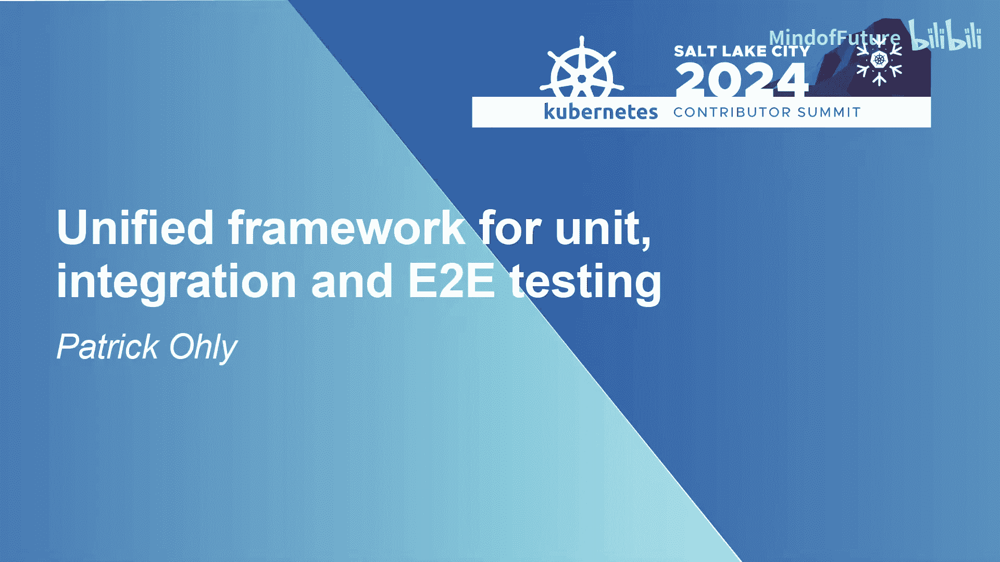
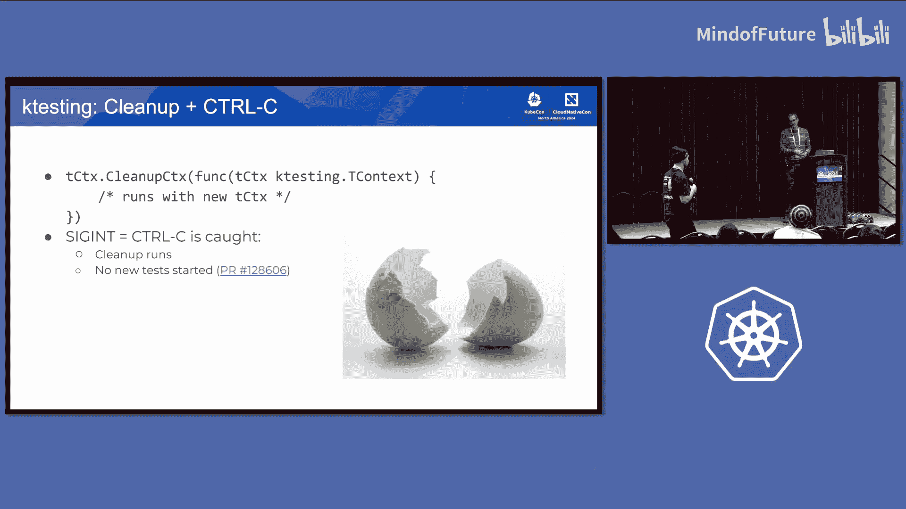

# 003：单元、集成与端到端测试的统一框架

在本节课中，我们将探讨 Kubernetes 测试框架的现状，并深入了解一个旨在统一单元测试、集成测试和端到端测试编写体验的新项目：KTesting。我们将分析现有框架的差异，介绍 KTesting 的设计理念与核心功能，并讨论其潜在价值与面临的挑战。

## 概述：为何需要统一的测试框架？

我的名字是 Patrick Oh。我在英特尔工作，负责 Kubernetes 的多个领域。其中之一是尝试在测试框架方面为 SIG Testing 提供帮助，主要围绕端到端测试。Kubernetes 中还有其他需要维护的测试辅助工具，我是负责这部分 Kubernetes 代码的维护者之一。

我反复问自己的一个问题是：为什么我们没有为 Kubernetes 中的所有测试提供一个统一的框架？我们有单元测试，用于测试底层的独立包。我们有集成测试，处理与 API 服务器交互的事务。我们还有用于完整集群的端到端测试。为什么所有这些测试都使用不同的框架？

## 历史背景与现状

当我进行一些调查时，我发现了端到端测试框架原作者 Daniel Smith 的一条九年前的评论。他说：“最终目标是将此（端到端框架）与集成测试框架合并。” 然而，自那以后，什么也没有发生。

乍一看，合并是有道理的。因为端到端测试和集成测试非常相似。在这两种情况下，我们都有客户端连接到 API 服务器，进行一些更改，检查预期结果是否发生，然后将其视为测试成功。那么，为什么我们要为编写这些非常相似的测试准备不同的代码片段？我们能为此做些什么吗？是否有技术原因导致此事未完成？或许是因为没有人关心？在这次分享中，我试图与大家一起探讨我们是否可以改变这一现状。

第一个答案很简单：它们之所以不同，是因为历史原因。单元测试和集成测试基于 Go 语言的 `go test` 基础设施。一个大型的 Go 测试单元也用于集成测试，只是我们有一些启动 API 服务器的样板代码，但归根结底，它是普通的 `go test`。而对于端到端测试，当时决定需要更复杂的东西，因此引入了 Ginkgo 作为编写端到端测试的框架。

这导致了我们今天仍然面临的情况：对于做同样的事情，我们拥有不同的 API，具体取决于它是集成测试还是端到端测试。因此我的想法是：如果我们为两者提供相同的 API，只是后台实现不同，会怎样？我们能否改变所有辅助包，让它们使用这个通用 API，并在两种场景下工作？KTesting 正是为此而生。它是一个抽象层。

## 框架对比：Ginkgo 与 Go Test

为了理解 KTesting 需要做什么，我们首先比较 Ginkgo 和 `go test`。记住，我们讨论的是框架，这可能是一个非常有争议的话题。让我们保持友好，专注于解决问题。

以下是两种框架在关键特性上的对比：

### 测试注册与发现
两种测试框架都需要一种方式来找出应该测试什么，即哪些测试存在。

*   **Ginkgo**：使用 `Context` 和 `It` 等 API 调用来分组和定义测试。
*   **Go Test**：依赖编译器的内置支持。你只需定义一个以 `Test` 开头的特定签名的函数。在函数内部，你可以有子测试。

一个相关的区别是，我们可以在 Ginkgo 中标记测试，并广泛使用它来选择测试。在 `go test` 中我们没有这样的机制。我们只能测试整个包，但无法在特定场景下运行特定测试。

### 构建与并行性
*   **Ginkgo**：一个目录定义整个测试二进制文件，并引入包含测试定义的其他包。最终结果是一个单一的二进制文件。并行性通过多个进程实现，每个进程在任何时候都运行一个测试。
*   **Go Test**：必须为每个包分发多个不同的测试二进制文件。并行性通过多个 Goroutine 实现，它们可能并行运行。

### 日志输出
这对于每个测试的日志记录至关重要。

*   **Ginkgo**：标准输出/标准错误中的输出可以被捕获为每个测试的输出。这通过 `GinkgoWriter` 等 API 实现。
*   **Go Test**：标准输出/标准错误在所有当前运行的测试之间共享。我们没有一个内置的机制来获取每个测试的输出。我们有一个自定义的 `T.Logf` 函数用于每个测试输出，但你必须使用这个特定的调用。

### 失败报告
报告失败的方式也不同。

*   **Ginkgo**：有一个 `Fail` 调用，接收一个字符串（可以是多行），它被捕获为当前运行测试的失败原因，并立即中止测试。Ginkgo 中没有记录多个测试失败的概念。
*   **Go Test**：`Error` 或 `Fatal` 与记录某些内容然后中止测试没有太大区别。测试作者有责任确保失败原因在更大的测试输出中显而易见。

### 超时处理
*   **Ginkgo**：非常复杂。可以设置套件超时、每个测试的超时。运行的测试会获得一个关联了超时的 `context.Context`。
*   **Go Test**：我们基本上必须自己编写超时逻辑。我们可以获得每个套件的超时，但如果超时触发，它会终止整个进程。

### 延迟清理
*   **Ginkgo**：有 `DeferCleanup`。即使测试本身失败，它也能确保清理代码运行，并且清理操作有独立的超时。
*   **Go Test**：有 `T.Cleanup` API。但重要的区别是，如果套件超时或手动中止，它不会运行。

### 其他特性
两者都支持特性，但 API 不同：
*   **堆栈跟踪**：Ginkgo 将堆栈跟踪附加到失败信息中；`go test` 你只得到一行。
*   **标记辅助函数**：两者都允许将辅助函数标记为 `Helper`，以便在回溯堆栈时跳过它们。
*   **进度报告（Ginkgo 特有）**：一个非常有用的功能。如果你向端到端测试二进制文件发送 `SIGUSR1` 信号，它将触发进度报告，显示当前正在运行的测试、它在轮询什么等信息。这对于本地调试非常有用。

## 引入 KTesting

上一节我们比较了现有框架的差异，本节我们来看看旨在统一这些差异的解决方案：KTesting。

KTesting 最初是为了解决每个测试的日志记录问题而开始的。作为 SIG Instrumentation 中上下文日志记录工作的一部分，其价值主张之一是我们可以拥有一个与上下文关联的记录器。在集成测试的上下文中，当 `klog` 查看该上下文时，它会提取记录器，并且该记录器可以通过我之前介绍的 `T.Logf` 函数输出。

KTesting 正是这样做的。它实现了一个记录器，接收我们在 Kubernetes 中进行的正常日志调用，并以更接近 `klog` 的格式输出。它旨在相当灵活，但你必须自己设置和配置命令行参数。

在 Kubernetes 内部，我们在 `kubernetes/test/utils/ktesting` 下有一个更“固执己见”的变体。它自动添加了常见的 `-v`、`-vmodule` 命令行标志。另一个好处是它修改了 Gomega 如何格式化对象，使其输出更易读。

### KTesting 的统一 API

KTesting 有趣的部分在于它如何扩展以实现统一的 API。这部分更具实验性。

我设定的目标是：
1.  编写一个辅助包和抽象 API，以便我们可以在端到端测试和集成测试中重用所有其他代码。
2.  为集成测试实现 Ginkgo 中已有的进度报告、超时处理等优秀功能。

我不想改变测试的注册方式。集成测试将继续使用 `go test`，端到端测试将继续使用 Ginkgo。我们只是为编写测试逻辑提供一个统一的抽象层。

当前状态是，对于集成测试，这些功能已经合并到 Kubernetes 中。对于 Ginkgo，有一个待处理的 PR。

### 核心概念：TContext 接口

KTesting 统一 API 的核心是 `TContext` 接口。我对此感到恼火，因为当我处理一个集成测试时，我不得不通过多层函数传递 4 或 5 个参数，最终才能做某事。这促使我决定需要一个单一的测试上下文参数来代表所有这些事物。

`TContext` 是一个抽象接口。它同时实现了 `context.Context` 接口和类似于 Go 定义的 `testing.T` 接口的东西。你可以在测试开始时通过调用 `ktesting.Init` 设置它一次。然后，你可以像使用 `testing.T` 实例一样使用它，也可以从中获取记录器、进行上下文日志记录等。

它抽象了清理操作，结合了 Ginkgo 的 `DeferCleanup` 和 Go 的 `T.Cleanup`。你获得一个新的、专为清理操作构建的上下文，并具有关联的超时。

它还为集成测试添加了信号处理。如果你中止测试，KTesting 会捕获它，取消当前正在进行的上下文，但仍会运行清理，不会留下混乱。

对于超时，它考虑了 `testing.T` 中的截止时间，并自动取消。如果测试返回，它会自动取消该上下文。

在输出方面，除了每个测试的日志记录，我还试图让失败原因更明显。例如，调用 `Error` 时会添加一个错误前缀。

关于断言，KTesting 的一个决定是它不打算取代 Testify 或 Gomega。它只内置了一个断言函数：`ExpectNoError`，因为这在我们的整个代码库中太常见了。

进度报告也已实现。它使用与 Ginkgo 相同的 `SIGUSR1` 信号。如果你在集成测试中使用 Gomega 的 `Eventually`，它会给你相同的信息。

## 讨论：挑战与未来方向

我们已经介绍了 KTesting 的技术实现，本节我们来探讨围绕它的一些讨论、挑战以及可能的未来发展路径。

### 设计决策与不确定性

有些概念我还不确定。例如 `WithStep`，它用于检测你的源代码，以便你知道测试的执行路径。这需要测试作者主动使用，他们可能会忘记。我的想法是，这很有用，因为当失败发生在调用链深处时，你会确切知道是如何到达那里的。

另一个讨论点是错误处理模式。传统上，我们编写通用的、可重用的函数，这些函数返回一个错误，然后在顶层的测试中检查错误。但有了 KTesting，我们可以在底层（在辅助函数内部）直接中止，因为 KTesting 可以创建一个记录失败但不立即中止的测试上下文，然后调用者可以检查是否记录了任何失败。这是一种不同的编写测试的方式，我不确定哪种更好。

### 潜在优势与实施顾虑

如果我们就此向前推进，我们可以做几件事：
1.  **减少重叠代码**：为创建对象、等待 Pod 等常见操作提供一个统一的辅助包，减少 Kubernetes 中的整体代码量。
2.  **将 KTesting 移至 staging 仓库**：目前它位于内部包中，无法被 staging 仓库中的集成测试使用。移至 staging 意味着更强烈的维护承诺。
3.  **改善开发者体验**：统一的 API 和良好的辅助包将使为 Kubernetes 编写新功能测试的新贡献者更容易上手。

然而，也存在反对这样做的理由：
*   **代码变动**：重写现有测试会引入风险，可能会在未注意到的情况下破坏测试。
*   **维护负担**：就像修复 Lint 问题一样，大规模重写测试的审查成本和潜在风险可能超过其收益。现有的测试是有效的，重写它们更多是“锦上添花”而非必需。
*   **采用与教育**：需要确保所有 SIG 的评审者和批准者都理解并执行新的测试编写规则，否则新贡献者可能会复制旧的模式。

### 扩展功能设想

我们可以基于 KTesting 构建更强大的辅助功能，例如：
*   **从 YAML 创建对象**：这是非常常见的操作。
*   **测试失败时的对象转储**：在清理过程中，将相关对象（如 Pod、节点状态）转储到日志文件，以便于调试。
*   **事件收集**：连接和收集事件。
*   **快照测试**：这可能有助于迁移旧测试，通过比较快照来确保行为不变。

要实现这些，很可能需要成立一个包含不同用户的工作组，而不仅仅是 SIG Testing 内部的项目，以确保其设计能满足广泛需求并被采纳。

## 总结与行动呼吁

本节课中，我们一起探讨了 Kubernetes 中测试框架割裂的历史与现状，深入了解了旨在提供统一 API 的 KTesting 项目。我们比较了 Ginkgo 和 `go test` 的差异，介绍了 KTesting 的核心设计——特别是 `TContext` 接口，并讨论了统一测试框架带来的潜在好处（如代码复用、体验改善）与面临的挑战（如代码变动、教育成本）。

KTesting 在集成测试方面的一些改进（如上下文日志记录、更好的输出）已经可用。是否要更广泛地推进统一 API 和重写辅助包，需要社区更广泛的讨论和共识。

**如果你对此感兴趣并愿意参与**，请通过 Slack 或电子邮件联系我。我需要与 SIG Testing 沟通，获得他们的支持。如果有足够的鼓励和帮助，我可以尝试推动建立相关的工作组或合作机制。最终目标是让编写 Kubernetes 测试对所有人来说都变得更好、更简单。