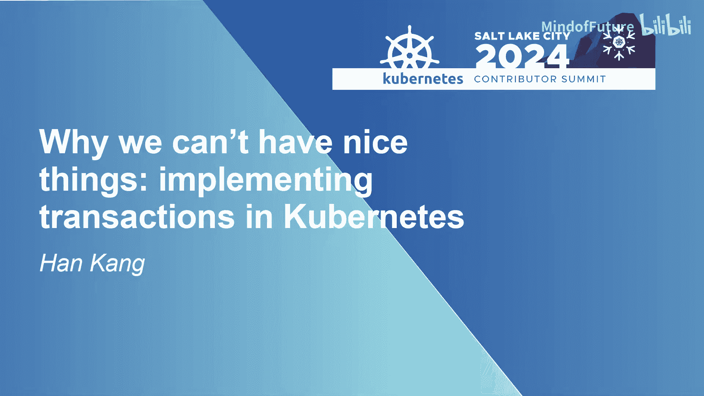
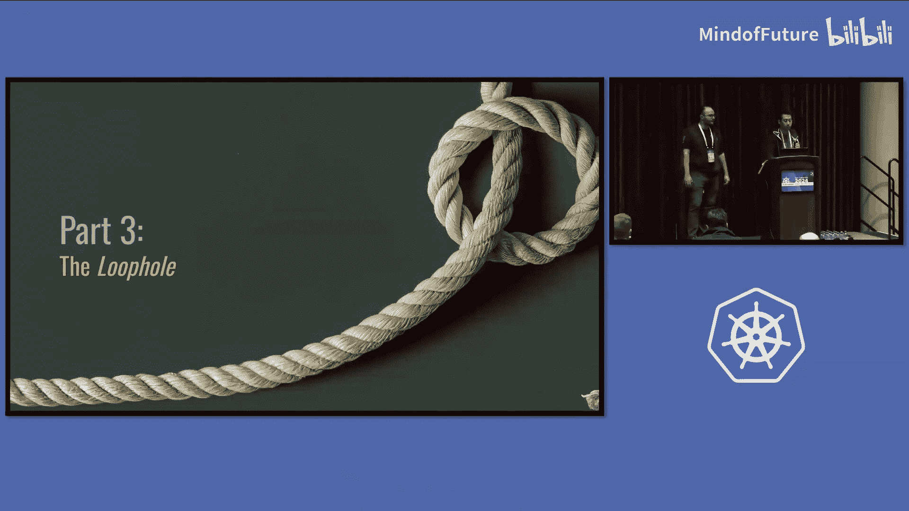
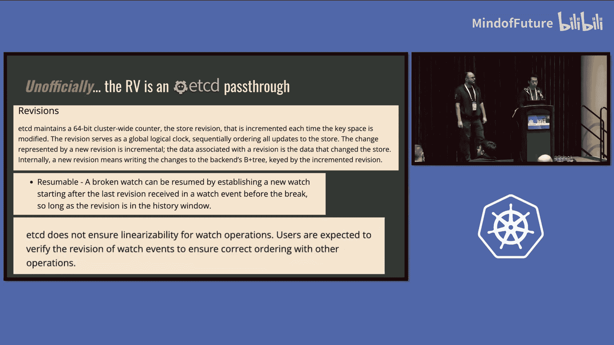
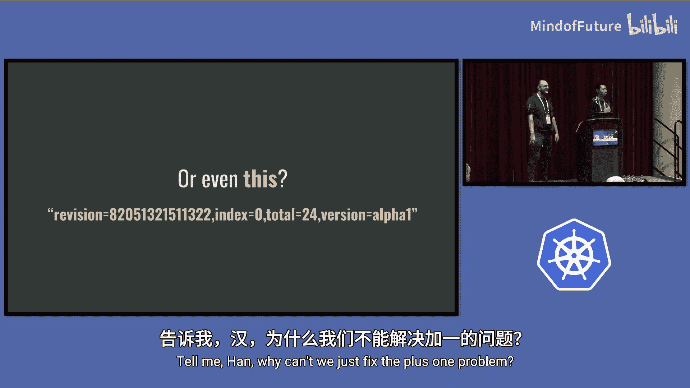

# 004：在 Kubernetes 中实现事务

## 概述
在本节课中，我们将探讨为何当前的 Kubernetes 架构难以支持事务和批量写入操作。我们将从 Kubernetes 的核心协议——List-Watch 协议入手，分析其设计约束，并讨论这些约束如何阻碍了事务功能的实现。最后，我们会探索一些潜在的解决方案和变通方法。

---

## 历史背景与协议约束

上一节我们介绍了课程主题，本节中我们来看看 Kubernetes 独特的设计背景。Kubernetes 与大多数数据库或存储系统不同，它优化了控制器查看和响应集群状态的能力。这导致了独特的访问模式，需要使用不同的协议，即 List-Watch 协议。

该协议的核心是，控制器无需持续列出（List）资源来感知变化，而是可以先获取当前状态快照，然后订阅（Watch）后续的所有变更历史。这个设计对系统能力施加了许多约束。

让我们具体看看 Watch 协议。在 Kubernetes 中，Watch 总是从一个 List 请求开始。你可以请求单个对象、某个命名空间或整个资源类型。响应中将包含一个状态快照，以及一个附加的**资源版本**。

这个资源版本代表了生成响应时最新的数据版本。随后，你可以使用这个资源版本来开启一个 Watch 流，接收一系列事件（创建、更新、删除等），每个事件也会附带一个资源版本，以便你了解进度。

出于性能考虑，Kubernetes 支持所谓的“书签”事件，它可以在没有实际变更时提供进度更新，这样在连接中断后，你不必从头开始重新同步。

这个协议本身并不复杂，也非 Kubernetes 独有。例如，在 etcd 中，其工作方式有细微差别：
*   使用 `Range` 请求替代 `List`，这要求 Kubernetes 中所有可列出的对象必须处于一个连续的键范围内。
*   返回的是 `revision` 而非 `resource version`，Kubernetes 的 resource version 与 etcd 的 revision 是一一映射的。
*   Watch 响应可以包含**多个事件**的批次，而 Kubernetes 每个响应只包含一个事件。
*   使用进度通知而非书签。

以下是两者在批处理支持上的关键差异：

在 etcd 中，它完全支持多对象事务。你可以一次性更新多个对象（如果支持子键，甚至可以是同一个对象的不同部分），并将它们作为一个原子事务提交到磁盘，从而获得成倍的吞吐量提升。其 Watch 响应可以包含共享同一 revision 的多个对象变更。

然而，在 Kubernetes 中，**不存在原子性**。虽然它提供了一些批处理支持（如删除集合），但这只是一个“承诺”或“假象”，底层实际上是通过多个独立的事务处理的。Kubernetes 的批处理操作会产生多个拥有不同资源版本的对象。

---

## 为何 Kubernetes Watch 协议排斥原子批处理

上一节我们对比了协议差异，本节中我们来看看这为何成为实现事务的根本障碍。关键在于 Kubernetes Watch 事件的格式。

在 Kubernetes 中，**每个 Watch 事件只能包含一个对象**。这一点并非广为人知，但它直接导致我们无法让多个对象共享同一个资源版本，否则会破坏协议的有效性。

我们可以通过反证法来证明这一点：
1.  **假设**：我们可以让多个对象共享同一个资源版本（即实现了原子批写入）。
2.  **场景**：有 5 个对象在一次批处理中被创建，它们共享同一个 RV。一个控制器正在通过 Watch 流观察这些事件。
3.  **问题**：控制器收到了第一个对象的创建事件，然后网络连接断开。
4.  **协议行为**：根据协议，控制器会使用最后观察到的 RV 重新初始化 Watch。API 服务器内部会将这个 RV 解析并**加 1**，然后从新的位置开始推送事件。
5.  **矛盾**：由于 5 个对象共享同一个 RV，API 服务器加 1 后，会直接跳过剩下的 4 个对象。控制器将永远无法观察到它们，导致状态不一致，协议失效。

因此，最初的假设不成立。Kubernetes 在设计 Watch 事件时，将其限制为单个对象，这在标准 API 设计中可能是一个失误（本应使用列表结构），导致我们现在被“卡住”了。

---

## 探索潜在的解决方案：操作资源版本

既然无法轻易改变协议，我们能否找到一些“漏洞”或变通方法呢？本节中我们来看看资源版本这个关键字段的潜力。

官方的立场是：**资源版本应该被视为不透明的字符串**。客户端不应假设其格式或顺序，只需将它最后看到的 RV 原样传回即可。这为我们在底层进行修改留下了空间。

实际上，RV 目前是 etcd revision 的直通，是一个 64 位整数。在 etcd 中，**客户端负责递增 revision**。Kubernetes 社区将其声明为“不透明”，正是为了保留未来安全地修改其格式的权利。

那么，我们可以如何修改 RV 来支持批处理呢？以下是一些设想：

1.  **添加批次索引**：给定一个基础 RV，我们可以为批处理中的每个对象附加一个索引。
    *   **公式**：`RV_final = BaseRV + Index`
    *   这样，每个对象都有唯一的 RV，避免了“加 1 跳过”的问题。
2.  **位分割**：将 RV 的二进制位分割，一部分存储基础版本，一部分存储索引。
    *   **公式**：`RV_final = (BaseRV << N) | Index`
    *   同样能保证唯一性和顺序。
3.  **结构化字符串**：采用更灵活的、版本化的字符串格式。
    *   **代码示例**：`"v2:<base_revision>:<index>:<checksum>"`
    *   这为未来添加更多元数据提供了扩展性。

**引入新 RV 格式的挑战**：
*   需要非常谨慎地引入，因为会存在新旧两种 RV 格式。
*   可以采用渐进式方案：在多个 Kubernetes 版本中同时支持读取新旧格式，然后逐步切换到只写入新格式。

然而，仅仅修改 RV 格式并不足以实现 10 倍的写入吞吐量提升，因为我们仍然在写入完整的对象数据。要获得显著性能提升，可能还需要考虑将对象的 `spec`、`status` 和 `metadata` 作为独立部分存储到 etcd 中。

---

## 总结与问答环节

本节课中我们一起学习了 Kubernetes 难以实现事务和原子批处理的核心原因。根本障碍在于 **List-Watch 协议中每个事件只包含单个对象**的设计，这导致多个对象无法共享同一资源版本，从而无法实现原子性。

我们探讨了通过修改“不透明”的资源版本格式来绕过此限制的可能性，例如添加批次索引。但这仅是解决方案的一部分，要大幅提升写入吞吐量，可能还需要结合对象数据拆分等优化。

**核心结论**：Kubernetes 目前可能不需要完整的事务支持，但**批量写入**无疑是未来值得追求的特性。

---

### 听众问答精选

以下是现场听众提出的一些问题及讲者的回答：

**问题1：你提到的批量写入需求，主要是为了优化控制器同时创建大量 Pod 的场景吗？**

> 这涉及两个方面：一是原子性需求，确保一组操作要么全部成功要么全部失败；二是提升吞吐量。要提升吞吐量，就需要减小写入对象的大小，并能够批量写入。此外，我们可能还需要更高效的 Watch 响应，例如流式传输差异而非完整对象。

**问题2：能否将 RV 的灵活字符串格式用作向量时钟，以聚合多个 API 服务器的响应？**

> 你描述的场景更像一个构建在 Kubernetes 之上的多集群概念或读穿透代理。这可能需要专门的控制器来实现，并非 Kubernetes 内部直接支持的功能。

**问题3：如果我们不把 RV 声明为不透明字符串，而是明确它是一个整数，会不会让事情更简单？**

> 如果 RV 是明确的整数，我们就失去了灵活修改它的能力，会被完全绑定到 etcd 的全局 revision 上。将其声明为不透明字符串的初衷，正是为了保留这种未来变更的灵活性。对于像存储版本迁移器这类我们完全控制代码的内部组件，我们可以处理更结构化的 RV。

**问题4：为什么 API 服务器内部一定要对 RV “加 1”？为什么不直接使用给定的 RV，即使可能返回重复事件，至少能保证不跳过任何事件？**

> 这涉及到协议保证。当前协议保证 Watch 流中**没有重复事件**。如果取消“加 1”逻辑，允许返回重复 RV，那么每个客户端都必须自己处理去重，这相当于改变了协议约定。要求每个客户端都实现去重逻辑，可能比在服务器端维持“加 1”逻辑更复杂且容易出错。可以说，最初保证“无重复”本身可能就是一个设计上的权衡。