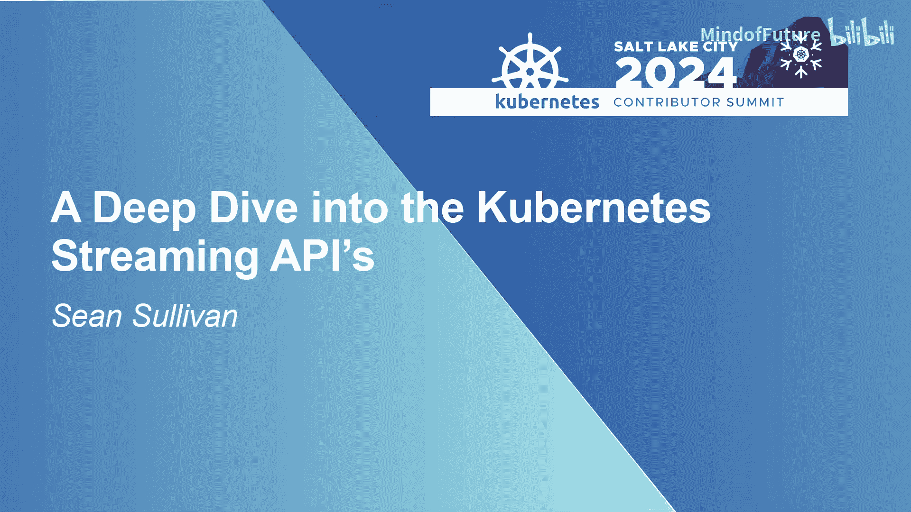
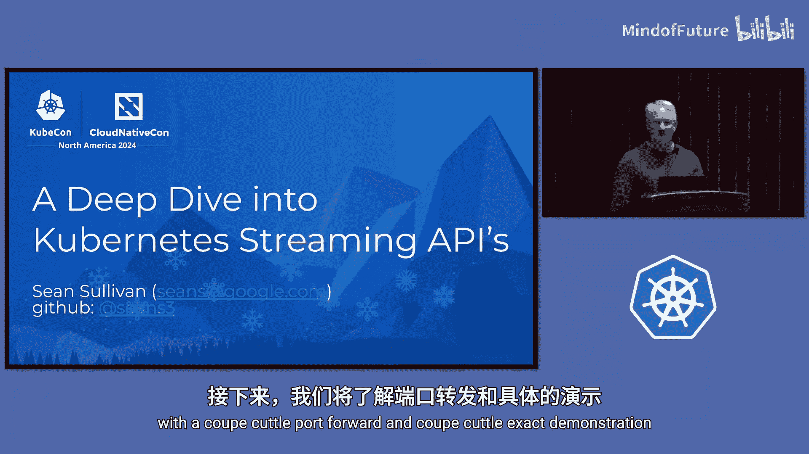
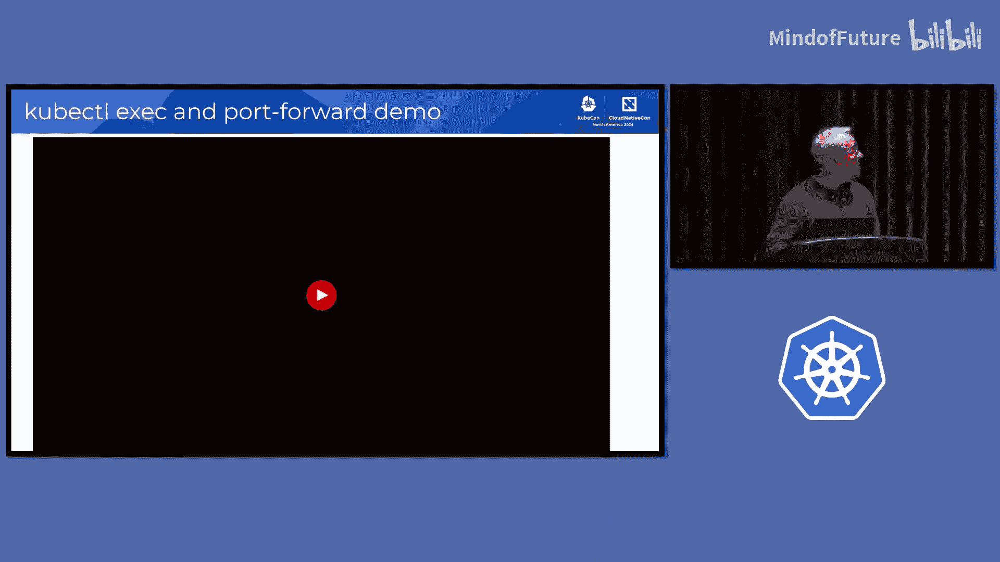
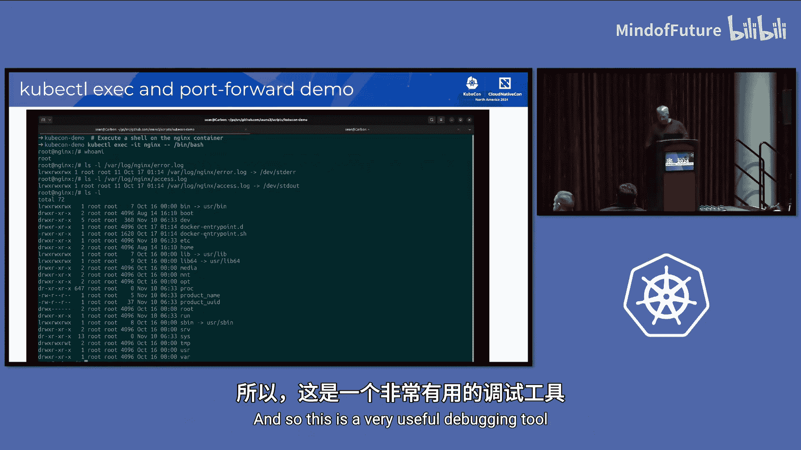
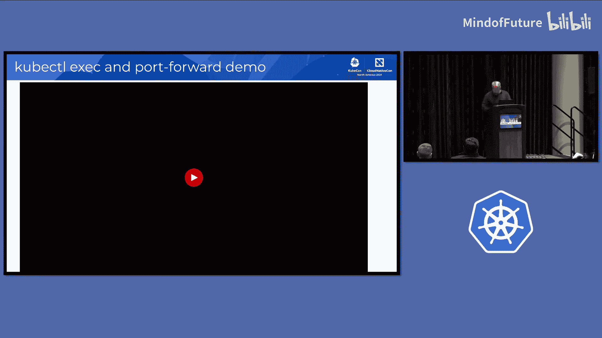
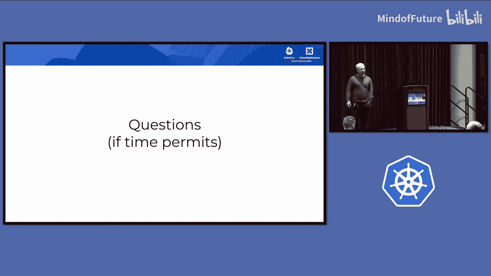
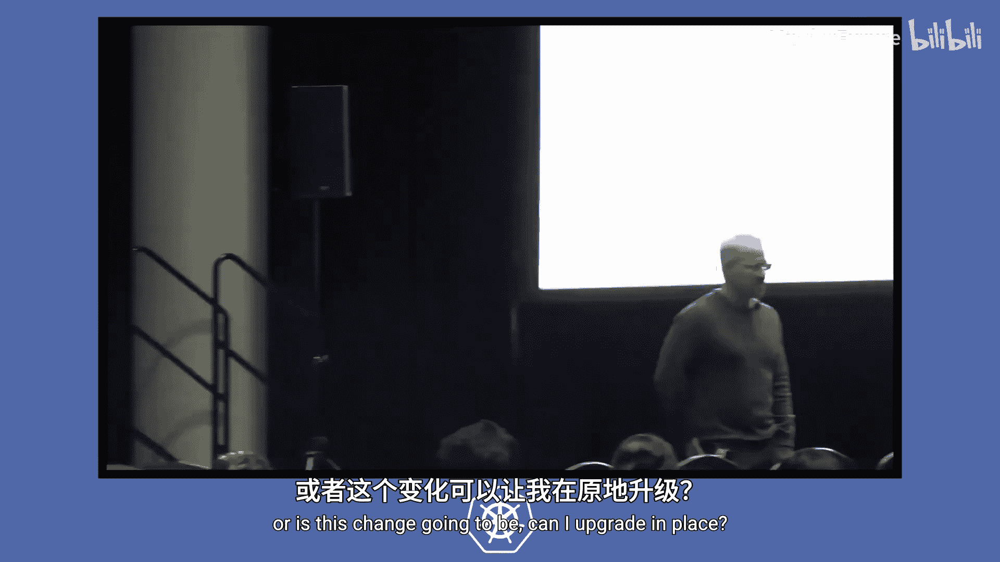
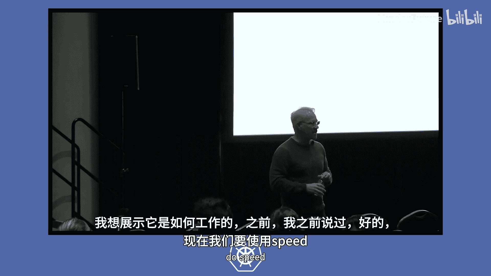
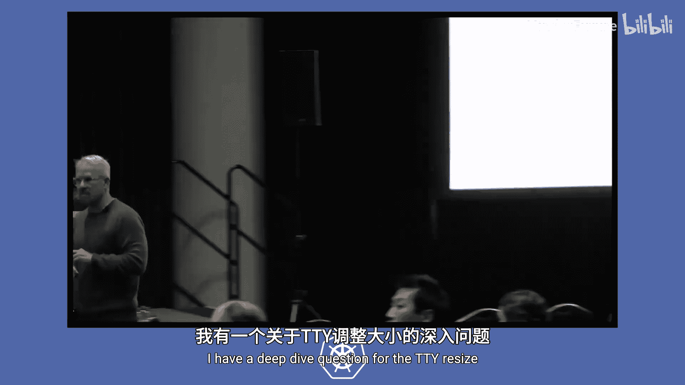

# 005：Kubernetes 流式 API 深度解析 🚀

在本节课中，我们将深入探讨 Kubernetes 中的流式 API。我们将了解它们是什么、为什么需要它们、它们与标准 HTTP REST API 的区别，以及 Kubernetes 社区如何从传统的 SPDY 协议迁移到更现代的 WebSocket 协议。通过具体的命令演示和原理剖析，你将理解 `kubectl exec` 和 `kubectl port-forward` 等命令背后的工作机制。

---

我是 Sean Sullivan。

我们直接进入演示环节，通过 `kubectl port-forward` 和 `kubectl exec` 命令来展示核心内容。

## 演示环节

首先，我将展示客户端和服务器的版本信息，以及集群中运行的工作负载，以便了解这个特定集群的配置情况。我们的集群中运行着一个 Nginx 工作负载。

我们将查看的第一个命令是 `kubectl port-forward`。

当我们运行 `kubectl port-forward` 命令时，我们正在客户端和集群内的 Nginx 之间创建一个长久的流式连接。通过这个命令，我们将指定本地端口以及 Nginx 在集群内监听的端口。

我将以详细模式运行此命令，以便查看此命令的请求头信息。你可以看到，我们指定了感兴趣的特定子协议。客户端请求的协议是 `portforward.k8s.io`。然后，将与 Nginx 进程进行握手，以确定双方同意的具体子协议。如果成功，服务器将返回 `101 Switching Protocols`。现在，我们的本地客户端与集群中运行的 Nginx 进程之间就建立了一个长久的流式连接。

在另一个终端中，我们将运行一个 `curl` 命令来请求 Nginx 的主页。我们通过访问本地端口 8080 来实现，该请求将通过刚才建立的流式连接转发到 Nginx。你可以看到，我们成功从 Nginx 获取了主页。

接下来，我们继续看 `exec` 命令。我们先做一个非常简单的示例：在 Nginx 进程上运行 `date` 命令。

我设置了详细级别为 7，这样我们就能再次看到大量的头信息。这里需要指出的不仅是端点，我们还可以通过查询参数指定要运行的命令、目标容器以及我们需要的通道（标准输出和标准错误）。在请求头中，我们声明支持多个版本的子协议（这是远程命令子协议，稍后会详细说明）。响应是 `101 Switching Protocols`。很好，你可以在最后看到返回的标准输出中显示了日期。

下面是一个更复杂的示例，展示当我们创建这个流式命令时，可以通过标准输入通道发送数据，并在标准输出通道接收数据。我们将通过标准输入通道发送 50 MB 的 `kubectl` 二进制文件，在 Nginx 端简单地 `cat` 它，然后通过标准输出通道发送回来，最后重定向到一个临时文件中。我们将验证这个庞大的数据块是否原样返回。

现在，我们正在查看这个 `kubectl exec` 命令。我们必须使用 `-i` 标志，因为我们使用了标准输入通道，并将其输出重定向到临时目录下的 `kubectl` 文件。操作完成后，让我们检查一下接收到的文件，它看起来大小相同。我们再用 `diff` 命令确认一下发送给 Nginx 并接收回来的数据是否完全相同，结果确实相同。

最后，让我们执行一个 shell。这是一个非常有用的调试工具，我们可以通过它跳转到 Nginx Pod 本身。当我们运行 `bash` 时，我以什么身份运行？我是 root。我可以在那里查看错误日志、访问日志，并进行各种检查。这是一个非常有用的调试工具。

---

## 流式 API 的本质

那么，是什么让这些特定的 API 与众不同？我们刚才看到的这两个命令是流式命令。这意味着什么？它与 HTTP 有何不同？

我们大多数人都知道 Kubernetes 暴露了一个 HTTP REST API。但有些人可能不太熟悉的是，实际上有一小部分 API 最终会升级为流式连接。我们刚刚就练习了其中的几个命令。

我们都非常熟悉 HTTP。但为什么我们需要流式命令？基本上是因为 HTTP 作为一种请求-响应协议，其固有的缺陷不足以满足我们在集群中与特定工作负载上的 shell 进行交互的需求。

以下是流式协议或流式动态的一些特性，这些特性使得它在某些情况下比 HTTP REST 更有用：
*   **低延迟与低带宽**：对于 HTTP，每个请求和响应都可能带有显著的开销头信息。而在流式协议中，我们通常用很少的元数据对二进制数据进行帧封装。
*   **双向性与任意端点发起**：在流式连接中，任何一端都可以发起数据消息的传输，并且通信是双向的。

我认为最能说明这些流式 API 必要性的例子就是与容器内 shell 的交互。如果必须通过请求和响应的方式来实现这种交互，那将是不可能的。

---

## 如何建立流式连接？

我们从一个 HTTP 请求开始。这是一个尝试执行 `exec` 时的请求简化版。

我们有几个额外的请求头。我们会声明希望升级连接，并且我们的流式协议将是 `spdy/3.1`。这些是此客户端支持的特定子协议，并且是优先级顺序（例如，`v4` 表示我们优先选择 `v4` 而非 `v3`）。稍后我会解释什么是子协议。

握手成功后，HTTP 响应将返回 `101 Switching Protocols`，表示升级成功。我们发送的两个特定头信息会原样返回给我们，同时还有协商好的子协议（在这个例子中是远程命令的 `v4` 版本）。

---

## 什么是子协议？

子协议定义了流式消息负载中的**内容**。它们是版本化的。Kubernetes 定义了两个子协议：

1.  **远程命令**：用于以下三个命令：`kubectl exec`、`kubectl cp` 和 `kubectl attach`。`kubectl cp` 实际上是通过 `exec` 端点实现的，因此它与 `exec` 类似。`attach` 是附加到一个正在运行的进程。这三个命令都利用完全相同的远程命令协议，最新版本是 **v5**。
2.  **端口转发**：支持 `kubectl port-forward` 命令，最新版本是 **v2**。

那么，我们的远程命令子协议里具体有什么？我们正在**多路复用**多达五个数据通道：
*   **标准输入**、**标准输出**和**标准错误**：这很直接，要与集群中的命令交互，我们需要这三个通道。
*   **终端调整大小事件**：在后续版本中添加，用于处理 TTY 大小变化。
*   **错误通道**：在后续版本中添加，允许我们获取进程的退出代码。

这些数据通道都通过同一个已建立的流式连接进行传输，在该连接上多路复用，然后在另一端解复用，并连接到容器运行时中的进程。

对于端口转发，有一点需要在此说明：在我们的远程命令示例中，子协议里的通道数量是**静态**的。最多可以是 5 个，但一旦在开始时协商好，数量就固定不变，不是动态的。而对于端口转发子协议，通道数量是**动态**的。当我们运行 `kubectl port-forward` 命令建立长连接后，可能在其他终端发起 `curl` 连接。每个这样的转发命令都会有两个通道：一个数据通道和一个错误通道。这些并发通道的数量可以是无限的（显然受资源限制）。如果我们同时运行 1000 个 `curl` 命令，那么就会有 2000 个通道。这实际上带来了一些挑战，也促使我们最终为 WebSocket 协议采用了不同的处理方式，这一点我稍后会讲到。

---

## 流式连接的端到端路径

这张图旨在说明这些流式连接（流式 API）的端到端特性。它们实际上涉及集群中的许多组件：
*   从客户端（通常是 `kubectl`）开始。
*   客户端与 API 服务器通信，API 服务器通常只是代理这个特定的请求和升级。
*   API 服务器将请求代理到目标节点上的 **Kubelet**。
*   Kubelet 然后通过**容器运行时接口** 代理到**容器运行时**本身。

因此，我们从客户端开始，经过 API 服务器，到达特定节点上的 Kubelet，然后在节点上通过 Unix 套接字与容器运行时通信。当我们讨论流式 API 时，会涉及相当多的组件。

---

## 为什么我们现在要讨论这个？

这些流式 API 已经存在多年，为什么我们现在要讨论它们？因为我们最近刚刚将流式协议从 **SPDY** 迁移到了 **WebSocket**。

从 Kubernetes **1.31 版本**开始，根据 KEP-4006 的定义，上述四个命令的默认流式协议现在将是 **WebSocket**。如果服务器或容器运行时不支持 WebSocket，它将回退到 SPDY。但默认情况下，我们将尝试建立 WebSocket 连接升级。

---

## 为什么要进行这次迁移？

这是一项相当庞大的工程，实际上始于多年前，我们最近才达到可以发布的状态。原因如下：
*   **SPDY 已被弃用超过八年**，并且从未成为标准。这导致即使我们控制了集群内的所有元素，客户端和 API 服务器之间也可能存在一些中间件（如网关、代理、负载均衡器）不理解这个过时的协议。
*   因此，任何使用网关的用户都可能需要使用更现代的流式协议，即 **WebSocket**。

然而，需要注意的是，我们**只修改了从客户端到 API 服务器这一段**的流式协议。我们为这两个子协议在 API 服务器中实现了代理，用于在 WebSocket 和 SPDY 之间进行转换或隧道传输。
*   对于远程命令，有一个**流式转换器代理**。
*   对于端口转发，由于存在动态数量的通道，为了避免拖垮 API 服务器，我们的设计需要一个**隧道代理**。

因此，**SPDY 在集群内部仍然是通信协议**。我们这样做是因为我们见过类似的动态：如果我们更改了容器运行时的协议，就必须修复所有容器运行时的实现，而历史上这曾多次失败。我们决定，如果只改变客户端到 API 服务器这一段，就能获得 99% 的收益，同时保持集群其余部分的工作方式不变。我们确实打算最终将 WebSocket 协议贯穿整个系统，但目前从客户端到 API 服务器这一段是第一步。

这张更新后的图展示了集群现在的样子，API 服务器内部的紫色部分代表了转换或隧道代理，它们将 WebSocket 转换回集群内部使用的 SPDY。

---

## 总结与资源

本节课中，我们一起学习了 Kubernetes 流式 API 的核心概念。我们了解了它们为何对于 `kubectl exec` 和 `kubectl port-forward` 等交互式命令至关重要，探讨了其双向、低开销的特性，并追溯了从 SPDY 协议迁移到 WebSocket 协议的技术演进与原因。关键点在于，这次迁移主要改善了客户端到 API 服务器之间的兼容性与现代性，而集群内部通信仍暂时保持 SPDY 以确保稳定性。

以下是一些非常有用的资源链接，如果你计划更深入地研究这个主题：
*   我特别想指出 Sasha Grentu 的一篇博客文章，它深入探讨了我简略提及的节点上的流式处理部分，即 Kubelet 通过容器运行时到容器之间的过程。这个过程相当复杂。
*   如果你真的对与节点本身相关的流式处理感兴趣，并想了解更多，Sasha 写的另一篇关于“容器运行时接口流式处理详解”的博客文章会非常有用。

看起来我们还剩大约五分钟时间。有什么问题吗？

**问**：我可能有个简单的问题，关于我想尝试做的事情。流式处理如何涵盖 `watch`？或者至少 `watch` 的状态。它们有何不同？
**答**：`watch` 与我们现在讨论的流式 API 无关。`watch` 更像是一种 HTTP 流，我们不使用 SPDY 或 WebSocket 来实现 `watch`。它是一个完全不同的实现，因为它是单向流而不是双向流。HTTP 确实支持流式传输，但它仍然在请求-响应的总体范式内。因此它适用于 HTTP。而如果你要与容器内的 shell 交互，那就不适合请求-响应模式，它需要双向连接。实际上，我对 `watch` 不是专家。`watch` 仍然是 HTTP，对吗？我们并没有使用……（讨论转向关于实现强一致性缓存可能需要双向流式协议，以及这可能需要像 WebSocket 这样的现代协议，而不是 SPDY）。

**问**：我关心的是从一个 Kubernetes 集群版本升级到另一个版本。如果我当前是 1.30 或 1.31，这个变更会强制我重新安装和迁移吗？还是可以原地升级？
**答**：这是个很好的问题。这对你来说应该是透明的。你可能有一个旧的 `kubectl` 客户端，它不会请求 WebSocket 升级，而是请求之前的 SPDY 升级，这一切都将继续工作。另一种版本偏差可能是你有一个较新的 `kubectl` 客户端和一个较旧的服务器。如果服务器不理解 WebSocket，客户端将回退到 SPDY。因此，升级应该是可行的。如果你有 1.30 的客户端和 1.31 的服务器，或者两者都是 1.31，那么它们都会使用 WebSocket。作为集群操作员或 `kubectl` 用户，你不需要做任何额外的事情。谢谢。

**问**：我有一个关于 TTY 调整大小通道的深入问题。为什么在远程命令中我们需要它？
**答**：这是因为最后一个运行 shell 的例子。如果你的客户端上的 shell 改变了大小，你可能需要将这个信息传达给进程，因为它认为自己有一个特定的终端尺寸。是的，这是一个深入的问题。这是在远程命令协议 **v4** 中引入的。而 **v5** 是我们刚刚引入的版本，我们必须引入它是因为在服务器端，我们没有正确处理标准输入。没有半关闭信号来表明标准输入通道已结束，因此会导致挂起。我们最近实现了这个半关闭信号，以表明标准输入何时完成。

