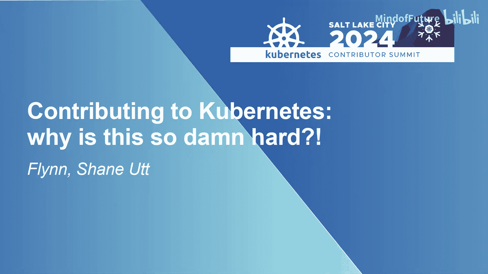
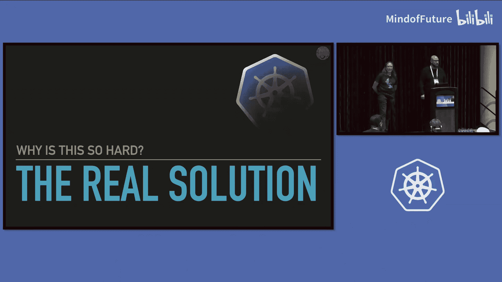

# 006：为什么贡献如此困难？🚀

在本节课中，我们将探讨向Kubernetes项目贡献代码时面临的挑战。我们将分析当前贡献流程中的主要问题，特别是围绕CRD（自定义资源定义）和增强提案流程的难点，并讨论一些潜在的改进方向。

---

## 问题根源：扩展性的困境

上一节我们介绍了本次讨论的背景，本节中我们来看看核心问题。我们认为，Kubernetes当前面临的根本问题在于，项目在交付其所需的扩展性方面遇到了困难。

需要明确的是，这是一个普遍的计算问题，并非Kubernetes独有。目前，即使是官方功能也倾向于使用CRD来实现，而非直接集成到核心代码中。例如，Gateway API、网络策略和多网络项目都是SIG-Network内部使用CRD构建的示例。

然而，CRD目前并非一等公民的体验。它们存在技术挑战，包括生命周期管理、版本控制和升级等问题。更严重的是，管理这些CRD的责任长期以来主要落在了集群操作员身上，在最坏的情况下，甚至落在了本不应处理这些问题的最终用户身上。

作为一个项目，我们尚未能提供必要的支持和指导来妥善处理这些问题。尽管如此，对于大多数贡献者来说，使用CRD仍然是主要的、甚至是唯一的可行路径。而如果你想直接向核心代码贡献，这个过程将异常艰难且耗时漫长，对于社区新成员尤其如此。

即使你成功走完了流程，你所构建的功能也可能需要数年时间才能在集群中可用，这段时间足以让贡献者不再从事相关工作或更换工作。最终，我们看到项目，特别是通过扩展性，并未真正满足社区的需求，而社区又迫切希望实质性地参与Kubernetes的建设。

---

## CRD API面临的具体挑战

上一节我们概述了扩展性的宏观问题，本节中我们来看看CRD API面临的具体技术和管理难题。

平台本身对管理CRD API只提供了非常有限的支持。这导致最终用户往往需要自行安装依赖CRD的项目，使得平台和用户陷入了一种“CRD的狂野西部”状态。用户可能知道需要使用某个依赖这些API的项目，但无法保证其使用的平台会支持它。

这使得项目难以依赖扩展API，进而导致用户难以依赖这些项目。另一个问题是，当多个项目尝试使用同一个扩展API时，会产生大量摩擦。例如，Linkerd和Traefik这两个CNCF项目都曾尝试使用Gateway API。由于它们无法依赖平台来处理此事，两者都尝试随项目一起发布所需的Gateway API CRD，并且发布了不兼容的版本。

这曾导致用户需要手动修改Traefik的Helm chart才能解决问题。更复杂的情况是，假设你决定不再运行Traefik和Linkerd，转而使用Envoy Gateway和Istio。当你卸载Traefik和Linkerd时，是否应该同时卸载Gateway API的CRD？如果卸载，API服务器将静默地删除基于这些CRD的所有资源，而不会发出警告或确认，这可能会破坏集群中所有用户的环境。

类似的情况也出现在平台层面，各平台不得不重复投入大量精力来管理这些CRD，有时还会被旧版本卡住。此外，实验性功能的支持也存在问题。设计和实现API的最佳方式之一是通过实验和反馈，但Kubernetes对破坏性变更的支持并不完善。

官方推荐的破坏性变更方法是使用CRD转换Webhook，但包括SIG API Machinery在内的各方都建议不要使用转换Webhook。这导致我们陷入了一种推荐的设计范式：必须成为完美的API设计者，并且永远不要更改任何东西。

---

## 增强提案流程的现状与挑战

上一节我们讨论了CRD的技术债，本节中我们来看看贡献流程本身——增强提案流程。

增强提案流程（不仅指KEP，也包括Gateway API使用的GEP等）以缓慢和痛苦著称。流程中包含大量复杂的文档和晦涩的规则，实际走完流程可能令人生畏，对于新成员更是如此。

我们对KEP进行了一些数据分析。目前，被放弃的KEP数量似乎超过了已稳定或已被拒绝的KEP数量。在这里，“放弃”意味着至少一年内看不到任何进展。将一个KEP推进到稳定状态平均需要大约一年半甚至更长时间。

有趣的是，被放弃的KEP所花费的时间似乎并不少太多，这意味着即使是将一个KEP推进到放弃状态，似乎也需要付出巨大的努力，而且最终也没有人正式宣布“我们不再研究这个了”。

当然，我们必须提到动态资源分配（DRA）。这是一个有趣的例外，它是一个试图影响核心的扩展机制，在某些情况下也会与CRD产生纠葛。人们可能认为，由于DRA需要同时触及这两个领域，它会遭受双重困难，但实际情况似乎并非如此。尽管围绕DRA流程存在一些质疑，但它实际上证明了事情是可以做成的。

---

## 子项目中的困境实例

上一节我们审视了核心流程，本节中我们来看看在具体子项目中，这些挑战是如何体现的。

我们讨论的许多问题都源于我们在Gateway API工作中的经验。然而，我们也参与并积极投身于其他遇到类似困难的子项目。

例如，SIG-Network中的多网络项目（旨在让一个Pod拥有多个网络）在通过KEP流程方面举步维艰，其KEP在近乎被放弃的状态下停留了大约两年。该项目已决定尝试另一条路线——使用CRD，但在这方面也遇到了一些困难。会议仍在进行，项目仍在推进，但过程充满挑战。

去年年底到今年，有一个名为Kubernetes网络接口（KNI，或称Kubernetes网络重构）的项目。它最初试图向Kubernetes添加原生网络API。它也经历了类似的痛苦，无法通过KEP流程，最终项目虽然没有被放弃，但基本上处于暂停状态。

此外，还有Kubernetes网络策略工作组（NPWG）。尽管其名称如此，但它并非Kubernetes内部的官方工作组，尽管它已经存在了七年。它之所以保持在外，部分原因正是由于在Kubernetes中贡献和进行实验所面临的这些挑战。在外面操作更容易。

最后，不得不提的是Kube-Proxy下一代（KPNG）项目。这个项目对我个人意义重大，我在其中结交了许多朋友，也获得了许多灵感。不幸的是，由于贡献问题和其中的摩擦，这个社区逐渐消散了。能量并未完全消失，一些人将精力转移到了SIG-Network的其他地方，但这并不是一个圆满的结局。它成为了SIG-Network第一个正式关闭的子项目。

---

## 潜在的解决方案与改进方向

上一节我们看到了问题在各个层面的体现，本节中我们来看看一些潜在的解决思路。

我们将针对之前讨论的领域（如CRD、增强流程等）来探讨解决方案。让我们从CRD开始。

一个显而易见的起点是：在CRD流程中，我们可以尝试做一件激进的事情——教导人们什么做法是有效的，以及更重要的是，什么做法是无效的。这样，当一个新项目尝试使用扩展API和CRD流程时，就不必从零开始。这项工作正在进行中，SIG-Network内部正在制定《API扩展最佳实践指南》。

另一件可以为CRD做的事情是改进CRD验证。这不是指应用CRD时发生的验证，而是指我们很容易对新的CRD版本做出会破坏现有对象的更改。我们可以自动检查这类问题，也可以自动化其他检查，以便在更改新版本的定义时，提前发现错误，避免伤害用户。

此外，OpenShift CRD模式检查器正在进行相关工作，SIG API Machinery正在考虑将其作为API服务器的插件。另外，我们认为应该做的事情是：生态系统中有Go之外的其他语言。当我们定义CRD时，通常将其定义为Go结构体，这意味着其中包含一些惯用法。对于使用Rust等其他语言的开发者来说，如果能不必从Go反向推导这些惯用法就能有效使用CRD，那将是非常好的。

---

## 构建更好的平台管理与社区流程

上一节我们探讨了CRD的技术改进，本节中我们来看看如何在平台管理和社区流程层面进行优化。

我们需要为平台提供一种有效的方式来管理扩展。目前，这取决于集群操作员，或者更糟的情况下，取决于用户。他们可能需要进行升级和管理，在最坏的情况下，还需要决定是否删除CRD。我们希望情况不是这样。

我们认为，最终需要为平台提供一种标准且一致的方式来为其用户管理这些扩展API。这将让用户能够以与核心API相同的方式依赖扩展API。重要的警告是：我们需要确保保护开发者进行实验的能力。因此，无论我们最终做什么，都需要为此创造一个安全的空间。

总结一下，鉴于我们拥有官方的扩展API（例如Gateway API就是一个官方API），我们实际上应该将它们视为官方的。我们应该托管它们、编目它们、验证它们并测试它们。也许我们可以有一个“Kubernetes扩展”目录，平台构建者可以基于此构建工具，用户在不同平台间获得一致的体验，项目也知道这些事物是如何构建的。

CRD是我们今天试图交付内容的方式，因为这是目前向Kubernetes贡献的最佳途径。但增强流程仍然需要一些精简。即使对于最终要交付的CRD，我们仍然需要走增强流程。不幸的是，增强流程就是文档，因此改进它要从文档开始。

我们正在制定API扩展最佳实践指南，SIG-Network的相关工作旨在为新人尽可能简化流程。但最终，我们需要作为一个社区，直接教导人们如何有效地入门，并为他们取得成功做好准备。这可能不仅仅是一堵文档墙，而是需要通过社区会议或Slack等方式进行口头交流。

---

## 总结：以人为本，共同改变

在Gateway API中，我们一直在口头分享一个关于“倡导者、盟友和引导者”的概念。这基本上是将人置于流程之前。其核心理念是：不要用“去读文档吧”之类的话淹没新人，而是告诉他们一个框架，让他们可以尝试看看是否能构建一个增强功能。

倡导者是推动事物前进的角色，可以不止一人。盟友是支持它的利益相关者，他们可能不像倡导者那样冲在前面，但最终他们是任何成果的有意义的贡献者。引导者是维护者，他们需要帮助你达到目标，最终让你弄清楚所有文档，但这不应成为你入门的障碍。

如果你能做到这一点并找到盟友，你就会找到前进的道路。重要的是，如果你尝试这个过程，或者你主动联系却找不到任何人，这可能意味着现在不是推进那个增强功能的好时机，这本身也是一种有价值的反馈。

我们讨论的所有内容都是容易的部分。困难的部分是改变社区对扩展性的关注，使其成为优先事项。这需要我们所有人的共同努力，需要这里的每一个人，需要社区的每一个人。

---

本节课中，我们一起学习了向Kubernetes贡献时面临的主要挑战，包括CRD管理、增强流程的复杂性以及在子项目中的具体困境。我们也探讨了从技术改进、流程优化到社区文化转变等多个层面的潜在解决方案。改变是困难的，但通过社区的集体努力，我们可以让Kubernetes的贡献体验变得更好。