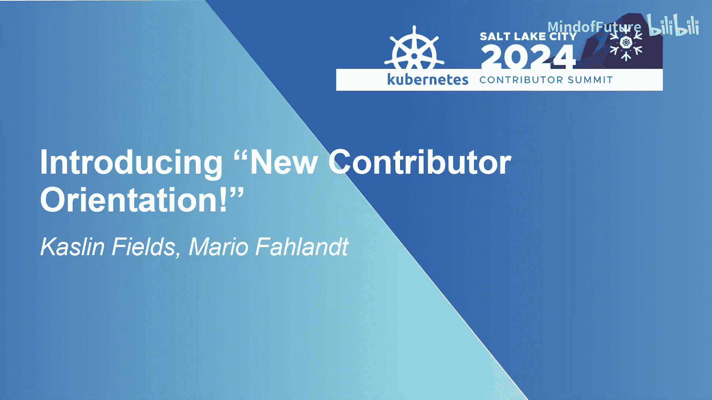
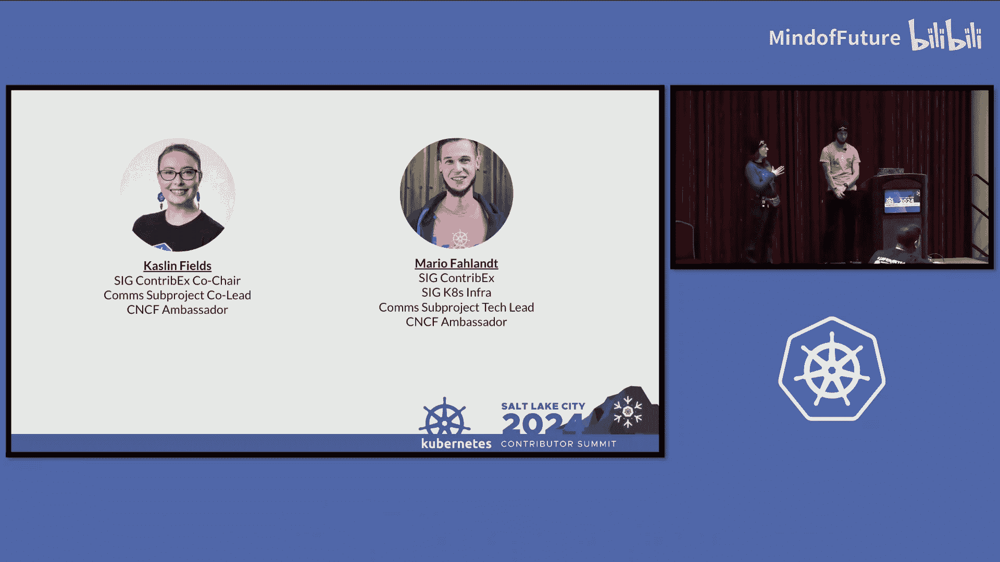
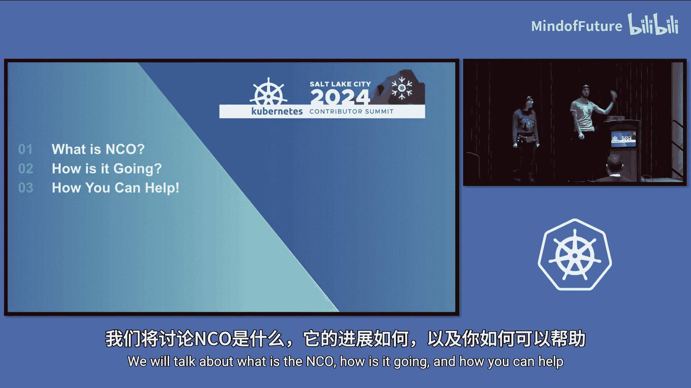
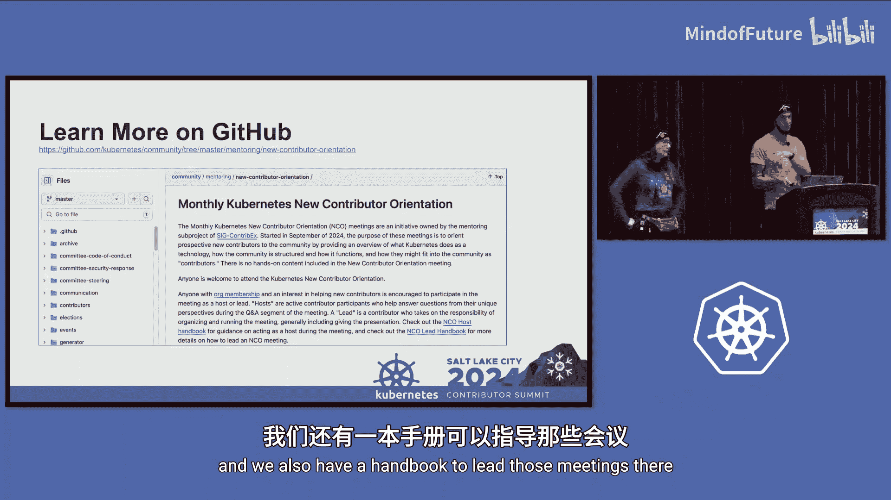
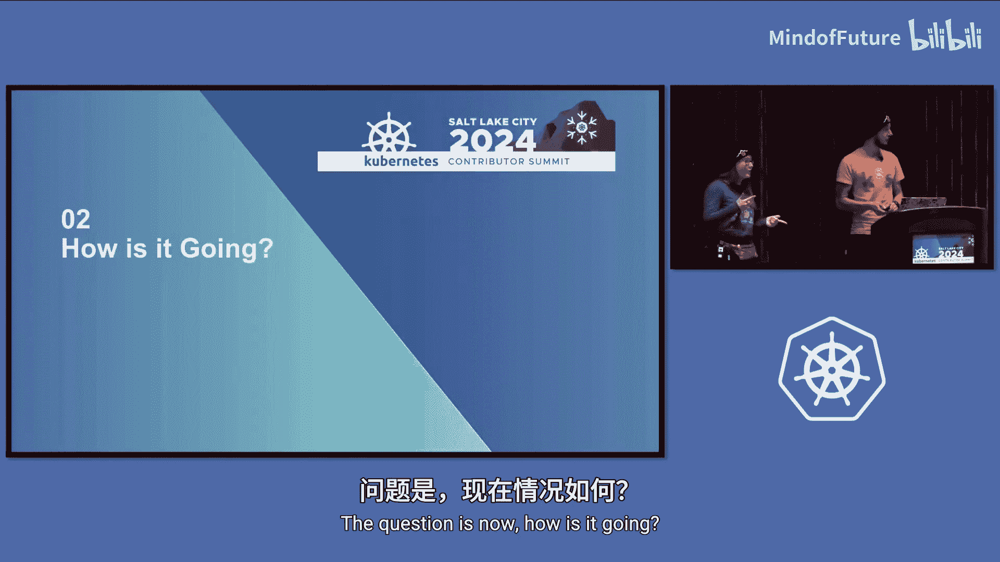
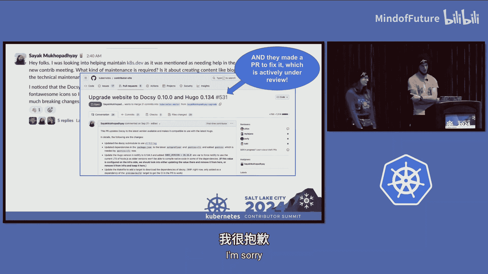
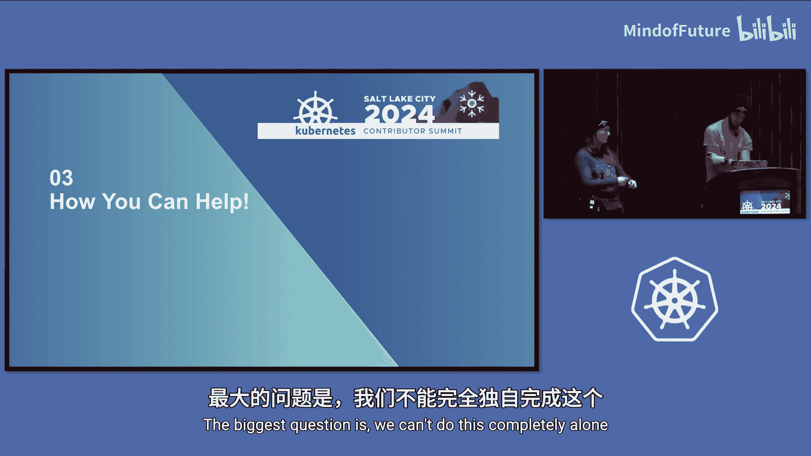
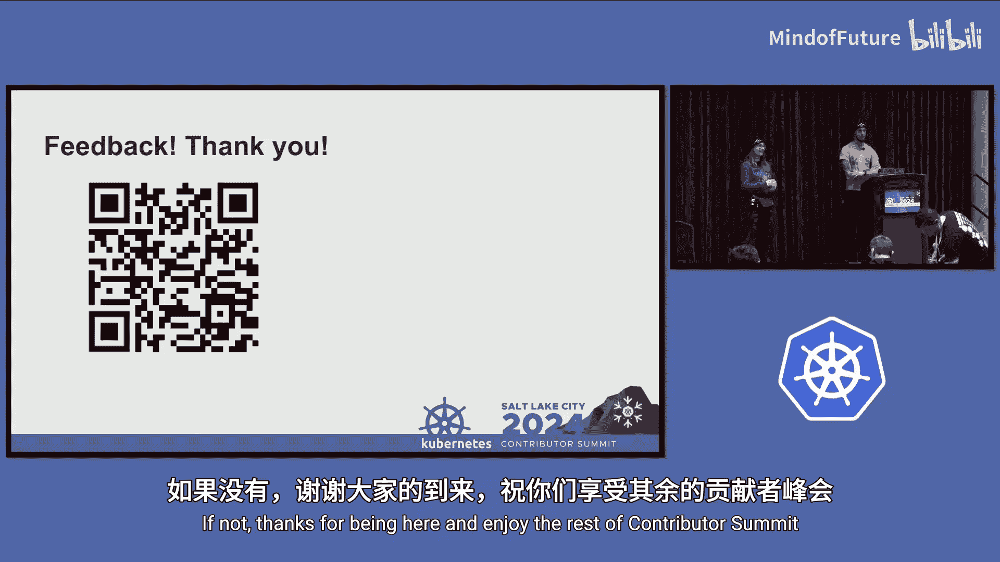

# 007：新贡献者引导计划介绍 🎯

在本节课中，我们将学习 Kubernetes 社区推出的“新贡献者引导计划”。这是一个旨在帮助新人快速了解社区结构、明确参与路径的定期线上活动。我们将详细介绍该计划的内容、运作方式、初步成效以及社区成员如何参与其中。

## 什么是新贡献者引导计划？🤔

上一节我们介绍了课程主题，本节中我们来看看该计划的具体定义。

新贡献者引导计划是一项由“贡献者体验特别兴趣小组”及其下属的“导师子项目”发起的新举措。其核心目标是通过为新人提供简要概述，引导他们融入社区。概述内容包括 Kubernetes 的功能、社区的组织结构以及新人如何找到自己的定位。

## 计划如何运作？🔄

了解了计划的目标后，本节中我们来看看它的具体运作形式。

该计划每月举办一次线上会议。会议时间固定在每月的第三个星期二，但为了照顾全球不同时区的参与者，会在两个不同时间段各举办一场：一场对欧洲、中东、非洲地区友好，另一场对美洲地区友好。每场会议时长为一小时，其中包含40分钟的演示和20分钟的问答环节。所有会议都会被录制并发布到 YouTube 上，供后续参考。

以下是会议的核心内容结构：
*   **欢迎与介绍**：会议开场。
*   **Kubernetes 简介**：讲解 Kubernetes 技术的基本功能。
*   **社区结构**：介绍特别兴趣小组、子项目、指导委员会以及 CNCF 基金会。
*   **贡献者含义**：解释在不同群体中“贡献者”的具体含义，涵盖审查者、批准者等角色以及贡献者阶梯概念。
*   **如何开始贡献**：强调融入社区、认识成员的重要性，建议通过加入 SIG 而非仅仅认领单个问题来开始。
*   **当前工作机会**：分享各 SIG 提供的活跃工作任务。
*   **贡献常见陷阱**：分享来自资深贡献者的建议，帮助新人避开起步阶段的常见问题。
*   **问答环节**：核心部分，用于解答参与者的具体疑问。

该计划并非动手实践工作坊，而是纯粹的引导性会议。演示内容基本固定，以确保信息一致性和可重复性。所有相关材料，包括演示文稿和会议主持手册，都已整理在“导师子项目”的社区仓库中。

## 计划进展如何？📈

前面我们介绍了计划的形式与内容，本节中我们来看看它目前的实施情况与收获。

计划已成功举办数次会议，并取得了一些积极进展和关键认知。

**1. 参会情况**：通过社交媒体（如 Twitter 和 LinkedIn）进行宣传能显著提升参与度。例如，经过宣传的会议有57人参加，而未宣传的会议则人数较少。
**2. 关键收获**：
    *   **多元视角的价值**：邀请不同背景的贡献者在会议上分享自身经历，能更有效地解答各类问题，帮助新人找到共鸣。
    *   **日历邀请的可见性**：需要持续优化会议日历邀请的发布渠道，确保新人能够轻松找到并加入会议。
    *   **“良好首发问题”陷阱**：许多新人认领标有 `good-first-issue` 的问题后，常因不熟悉 GitHub 工作流或与评审沟通受阻而无法完成，导致问题被长期占用。这需要社区层面共同寻找更好的新人参与方式。
**3. 成功案例**：已有参会者在会后主动帮助其他新人，或申请使用会议材料进行本地推广。更有一位参会者直接针对社区网站的一个长期遗留问题提交了具体的修复提案。

## 社区如何提供帮助？🤝

我们已经看到了该计划的初步成效和需求，本节将探讨社区成员，特别是各小组的领导者，如何提供支持。

计划的成功离不开整个社区的参与。以下是几种主要的帮助方式：

**1. 提供“常青”任务**：我们需要各 SIG 和子项目的领导者思考并提供“常青项目”。这类项目具有以下特点：
    *   小组长期需要。
    *   任务定义清晰。
    *   新人无需深厚背景即可上手。
    *   对小组有实际价值。

例如：整理会议记录、参与发布团队、为社区博客撰写文章等。

**2. 参与会议**：欢迎有经验的贡献者加入会议，分享你的故事，并回答与新人们兴趣领域相关的具体技术问题。

**3. 主持会议**：会议内容已标准化并配有详细脚本。社区成员可以学习如何主持，并直接运行会议。

**4. 提供反馈**：我们设有反馈表单，欢迎对计划提出改进建议。同时，我们也开放讨论如何长期追踪参与者的贡献轨迹，以评估计划效果。

## 总结与展望 🌟

本节课中我们一起学习了 Kubernetes 新贡献者引导计划。该计划通过固定的月度线上会议，为新人系统化地介绍社区全貌、贡献路径和潜在机会。它不是一个工作坊，而是一个低门槛的引导和问答平台。计划的成功依赖于社区的广泛参与，包括提供明确的任务、分享经验以及共同思考如何优化新人加入流程。我们鼓励所有社区成员关注并参与其中，共同降低贡献门槛，壮大 Kubernetes 社区。