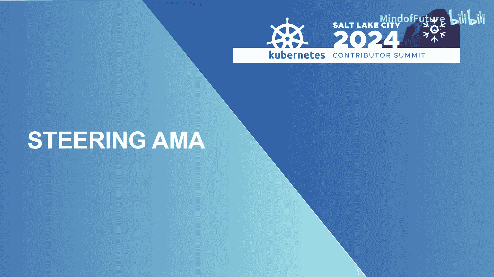
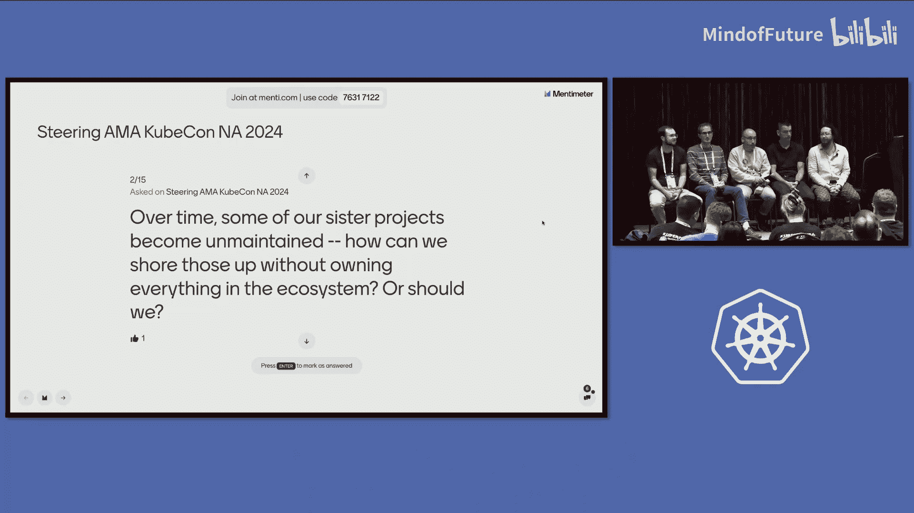

# 008：Steering AMA 教程

## 概述
在本节课程中，我们将学习 Kubernetes 指导委员会（Steering Committee）的成员介绍、核心职责、面临的挑战以及对项目未来的展望。我们将通过整理 2024 年北美 Kubernetes 贡献者峰会的 AMA（Ask Me Anything）环节内容，了解指导委员会如何运作，以及他们如何与社区协作来治理这个庞大的开源项目。

---

## 章节 1：指导委员会成员介绍 👥

首先，让我们认识一下参与本次 AMA 的 Kubernetes 指导委员会成员。

以下是各位成员的自我介绍：

*   **Benjamin Elder (Beny)**：自 2017 年起全职参与 Kubernetes 项目，2015 年夏季曾参与 kube-proxy 的开发。主要活跃于 SIG Testing、Release 等小组，负责基础设施、构建等“元”项目相关工作。对项目和社区充满热情。
*   **Patrick Woody**：参与 Kubernetes 相关工作约五年，最初在 SIG Storage 社区学习如何提交 PR。后续参与了测试、日志记录等工作，并主导了“动态资源分配”功能的开发。一年前当选为指导委员会成员，致力于为新贡献者创造良好的入门体验。
*   **Antonio Ojea**：于 2019 年加入社区，与 Benjamin 一同在 `kind` 项目上工作。活跃于测试和网络领域，经常与测试失败相关的问题打交道。目前很高兴能在指导委员会中与大家共事。
*   **Maciej Szulik**：在社区已有约十年时间，自 2014 年底开始参与。主要活跃于与控制器相关的领域，最初在 SIG Cluster Lifecycle 贡献。去年与 Patrick、Stephen 一同当选。近期名字也出现在 PRR（生产就绪评审）批准中，已达到 `approver` 级别。
*   **Stephen Augustus**：工程总监，在 Kubernetes 的多个领域都有参与。喜欢横向的 SIG（特别兴趣小组），最初从 SIG Docs 开始，曾担任 SIG Azure 和 SIG PM 的联合主席，并参与了 KEP（Kubernetes 增强提案）流程的创建。目前是 SIG Release 的联合主席之一，创建了发布工程子项目，并管理发布工程工具团队。现在也花费大量时间在 Open SSF、OpenAPI 倡议等项目上。

---

## 章节 2：指导委员会的职责是什么？🎯

上一节我们介绍了委员会成员，本节中我们来看看指导委员会的核心职责。

指导委员会的主要职责是**确保项目整体健康运行，并将具体领域的决策权委托给相应的特别兴趣小组**。他们的工作重点在于处理那些“漏网之鱼”或需要特殊关注、权责不明确的事务。

以下是指导委员会的一些关键职责：

*   **资源与财务监督**：对项目资源拥有最终管理权，确保财务方面正常运转，项目能够持续运行。他们管理着签名密钥和文档空间。
*   **项目声明审批**：当项目需要对外发布声明时（例如在 Kubernetes 官网上显示的横幅），通常需要指导委员会批准，以确保信息与社区共识一致。
*   **治理与架构**：审查治理结构的变更，确立各个治理小组（SIG、工作组、委员会）的职责范围，并确保它们之间没有冲突。当出现新的、没有明确归属的问题时，指导委员会需要决定如何处理。
*   **联络与代表**：与 CNCF（云原生计算基金会）联络，协调项目所需的资源（如基础设施）和请求。Kubernetes 项目在 CNCF 理事会中拥有一个独特的席位，该席位由指导委员会任命，通常由现任或前任委员会成员担任，代表项目发声。
*   **处理敏感事务**：指导委员会、行为准则委员会和安全响应委员会是三个被授权处理可能无法立即公开的敏感事务的委员会。例如，处理贡献者的签证支持请求就属于这类工作。

一个具体的例子是创建 **SIG K8s-infra**。过去，项目通过一个名为 `kubernetes/funding` 的仓库接收基础设施相关的资金请求。指导委员会发现这类请求越来越多，且大多与基础设施相关，因此决定成立一个专门的治理小组（即 SIG K8s-infra）来管理基础设施请求和成本。

---

## 章节 3：项目采纳与治理框架 🔄

上一节我们了解了指导委员会的日常职责，本节中我们来看看他们如何处理项目生态中的治理问题，特别是如何采纳外部项目。

社区有一个既定的流程，用于处理**新项目**捐赠到 Kubernetes 旗下。然而，对于**现有成熟项目**的采纳（如 etcd），情况则更为特殊，需要与项目现有维护者进行大量沟通。

以 **SIG etcd** 的成立为例，这是一个非常独特的案例。etcd 作为 Kubernetes 的“大脑”，其健康状况对整个生态系统至关重要。指导委员会与 etcd 的维护者进行了深入沟通，最终决定以成立一个独立 SIG 的方式将其纳入，这既给予了 etcd 一定的自治权，又使其能获得 Kubernetes 项目内部的支持结构。

对于大多数情况，项目通常会被提名由某个现有的 SIG 赞助，作为其子项目。没有一个放之四海而皆准的完整框架来应对所有现有项目的采纳问题。

**对于社区成员的建议**：如果你认为某个项目应该被 Kubernetes 采纳，最佳路径是：
1.  **首先与相关领域的 SIG 讨论**。SIG 最了解该领域，也通常知晓生态中的其他项目。
2.  向 SIG 介绍项目，阐述利弊以及采纳的提议。
3.  只有在与 SIG 沟通遇到障碍时，才需要将问题升级到指导委员会。

指导委员会在审查所有治理小组的章程时，通常能对项目归属有一个初步判断。当前的一个挑战是，如何让**新来者**更容易地找到正确的沟通路径（即“我应该去找哪个 SIG？”）。简化这个信息收集流程是未来可以改进的方向。

同时，社区也需要考虑**项目的可持续性**。SIG 的维护者已经非常繁忙，不能无条件地接纳所有新项目。必须确保新项目有明确的维护计划和社区支持，避免产生无人维护的“僵尸项目”。

---

## 章节 4：如何成为指导委员会成员？ 🏃

上一节讨论了项目治理，本节我们关注个人发展：如何准备并参选指导委员会成员。

指导委员会成员**不能**公开支持或提名特定候选人。但是，他们以及所有社区成员都可以为潜在候选人提供建议和支持。

**给潜在候选人的建议**：
*   **主动沟通**：如果你对角色有疑问（如职责、时间投入、要求），最好的方式是直接联系任何一位现任指导委员会成员。他们通常愿意通过 Slack、Zoom 等方式进行私下交流。
*   **借鉴历史经验**：与**往届指导委员会成员**交流同样宝贵。他们能提供关于角色挑战和所需准备的不同视角。
*   **积累跨领域经验**：参与**横向的、跨项目的 SIG**（如 SIG Contributor Experience、SIG Release、SIG Testing）是极佳的准备方式。在这些小组中，你会与来自项目各个部分的人合作，处理影响整个社区的问题，这不仅能为你积累经验，也能提升你在社区中的知名度。
*   **解决跨领域问题**：不要只专注于自己工作相关的特性开发。尝试去发现并解决那些影响多个 SIG 的“大而多汁”的跨领域问题。这种经历能极大地锻炼你的全局观和领导力。
*   **建立广泛连接**：努力认识社区中不同 SIG 的人。广泛的人脉和跨 SIG 的沟通对于理解整个项目和未来担任领导角色至关重要。

现任成员指出，近年来，来自 SIG Contributor Experience 和 SIG Release 的成员在指导委员会中占有相当比例，这可能是因为这些小组在引导新人、建立贡献者阶梯方面做得非常出色。

---

## 章节 5：2024年的挑战与未来展望 🔮

上一节我们探讨了个人成长路径，本节我们将目光投向项目整体，看看指导委员会在2024年面临的主要挑战以及对未来的思考。

**2024年已解决/进行中的挑战**：
*   **选举时间冲突**：指导委员会选举和《行为准则》委员会选举时间过于接近，导致有人可能同时参选或需要退出一个以加入另一个。解决方案是将《行为准则》委员会选举推迟到2025年2月，让新当选的指导委员有时间熟悉工作。
*   **维护者名单与TOC投票权**：Kubernetes 在 CNCF 技术监督委员会（TOC）的开发者代表席位投票权目前仅限指导委员会成员。为了增加 Kubernetes 在 TOC 中的代表性，正在推动将**所有 SIG 的主席和技术负责人**添加为 CNCF 官方认可的“维护者”，从而获得投票权。这需要收集并提交这些领导者的联系信息。
*   **年度报告**：简化后的年度报告流程仍有部分 SIG 和工作组未能按时完成。这些数据对于展示项目工作和贡献者成果非常重要，需要各小组领导积极配合。

**Kubernetes 的未来**：
指导委员会更关注**项目和社区的可持续性**，而非具体的技术方向（技术方向由各 SIG 主导）。

未来的核心挑战与目标包括：
*   **以人为本**：项目成功的关键在于人。需要关注维护者倦怠、知识传承、人员流动（如换工作）对领导力的影响。鼓励维护者尽可能记录上下文，制定贡献者阶梯和继任计划。
*   **平衡稳定与创新**：用户既要求“稳定、可升级”，又希望引入新功能（如 AI/加速器支持、非统一内存访问调度）。项目需要在引入严格的流程（如 KEP、PRR）以确保稳定性的同时，避免流程过于繁琐而吓退贡献者。目标是找到既能保证质量又不制造过多摩擦的平衡点。
*   **应对技术演进**：需要适应硬件和软件世界的变化，例如 AI 工作负载、新型处理器等，同时确保核心体验的稳定。
*   **成本控制**：项目基础设施成本（主要来自云服务商捐赠）高达数百万美元/年，且持续增长。社区需要更审慎地评估新需求，优化现有工作负载和测试效率（如减少“flake”测试），确保长期财务可持续性。
*   **处理“弃用”项目**：随着时间推移，一些兄弟项目可能变得无人维护。社区需要思考如何在不“大包大揽”的情况下为这些项目提供支持，或者制定项目“失败”或归档的计划。SIG Architecture 旗下的代码组织小组正在积极研究相关课题。

关于 `.io` 域名可能被移除的问题，指导委员会认为这不是迫在眉睫的危机，但有预案，例如将用户流量逐步迁移到备用的 `.dev` 域名上。

---

## 总结
本节课中，我们一起学习了 Kubernetes 指导委员会在 2024 年贡献者峰会 AMA 环节分享的核心内容。我们认识了委员会成员，了解了他们作为项目“守门人”和“协调者”的职责，包括资源管理、治理架构维护和敏感事务处理。我们探讨了社区采纳外部项目的复杂性和最佳实践，以及个人如何通过积累跨领域经验、解决全局性问题来为参选指导委员会做准备。最后，我们审视了项目当前在可持续性、成本控制、平衡稳定与创新方面面临的挑战，并展望了 Kubernetes 未来需要以“人”为本，持续适应技术生态变化的发展方向。指导委员会的工作重心在于确保这个由人驱动的庞大开源项目能够健康、稳定地持续运行。