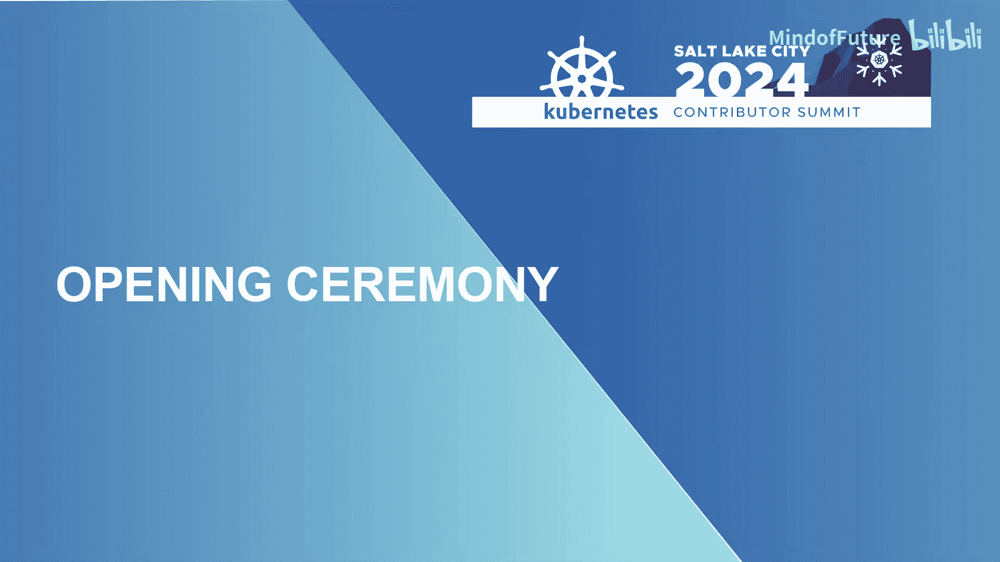
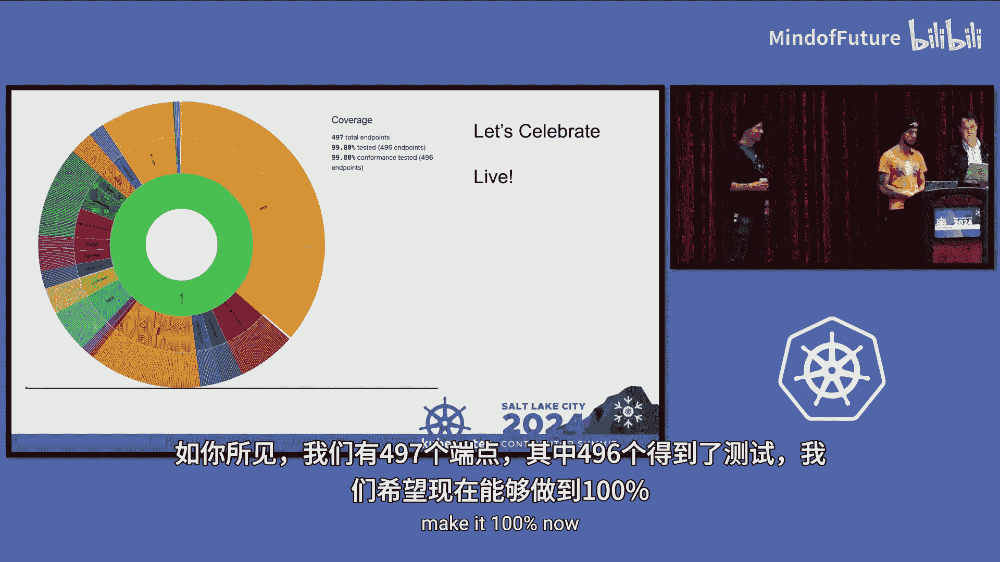
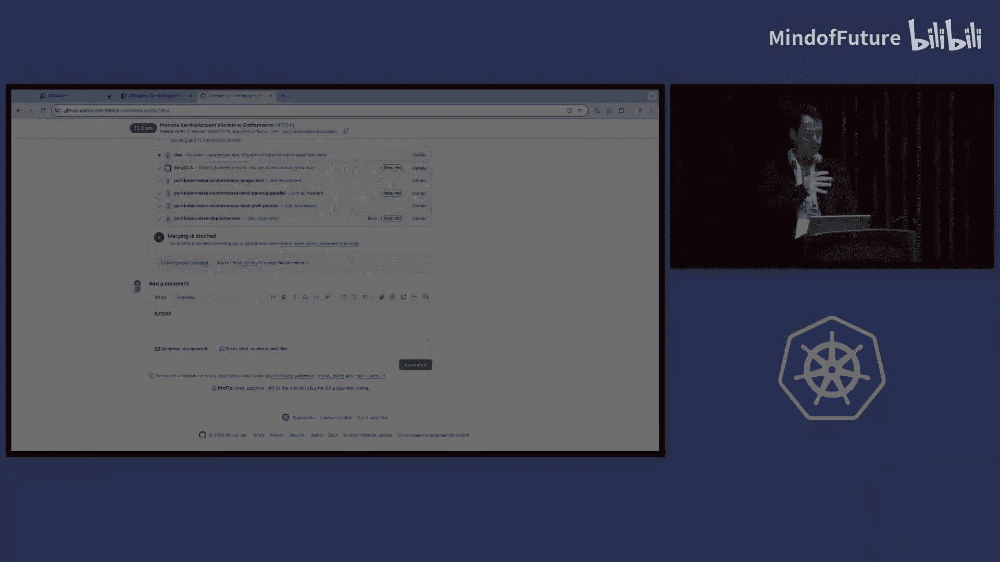
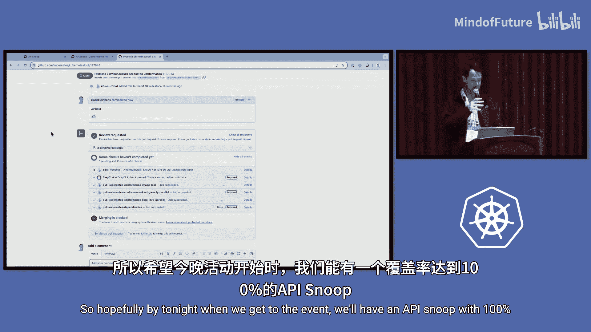

# 009：开幕式教程

在本教程中，我们将学习2024年北美Kubernetes贡献者峰会开幕式的核心内容。我们将了解活动的基本规则、日程安排、重要公告以及一个具有里程碑意义的社区成就。

## 欢迎与行为准则

欢迎来到2024年在盐湖城举行的Kubernetes贡献者峰会。

最重要的一点是，请注意我们有一套行为准则，要求每个人彼此友好相待。

我们不希望发生任何不愉快的事情。如果确实发生了问题，可以联系我们的行为准则团队。

我们也有CNCF办公室，即CNCF行为准则办公室。如果您需要联系他们，可以前往大厅这一侧的房间252B。

如果出现任何问题，请直接联系我们中的任何一位，或直接前往行为准则办公室。

## 特殊日期与志愿者致谢

今天是一个特殊的日子。特别是对于身处美国的各位，如果您还不知道，今天是美国的退伍军人节。

我们向那些做出牺牲的人们致敬，不仅是在美国，也包括其他地方的人们，感谢他们为保障安全所做的贡献。感谢你们的付出。

在活动期间，如果您需要任何帮助或有任何问题，请寻找戴着这些帽子的人员。

同时，感谢所有的志愿者和峰会工作人员，因为没有他们，这次活动就不可能举办。谢谢大家。

## 日程安排与社交活动

以下是日程安排。如果有人错过了，非会议环节将在255房间举行，沿着大厅走然后在左边。我们还有一个单独的Dock Print房间，位置会稍远一点，同样在左侧。

今晚我们有社交活动。社交活动将于下午6点在Fllanker举行。

根据我的方向感，它是在那个方向，我认为是西北方向。无论如何，请查看地图或使用谷歌地图。它离得不远，但需要走一小段路。天气会有点凉，请确保带上保暖衣物。

这一点非常重要：请携带年龄身份证明文件。

特别是对于非美国公民，只有护照簿有效。请带上您的护照簿。他们会检查，如果您没带，将无法入场。请带上您的护照，不是我的，是您的。

## 餐饮与后续环节更新

还有一个更新是，所有的食品和饮料将在255B房间供应。

在房间的后部。您需要去找一下，但它就在那里。

此外，在这之后，我们将进行指导委员会问答环节。

我们将进行“求助呼喊”环节。因为我们错过了一些需要呼喊的人，我们将基本按照去年在芝加哥的方式进行，所以请排好队，上前说出您的项目是否需要帮助或支持。

下午在这个房间将有CNCF问答环节。

下午同样在这个房间还将举行颁奖典礼，并且我们会拍摄合影。

我们可能会在这个斜坡上拍摄合影。当您出去时，在左侧的这个斜坡上，我们将在那里拍照。

但由于我们都会参加颁奖典礼，我们会在之后带大家一起去拍照。

## 重要通告与反馈收集

别忘了，还将有Kub见面会。

这次见面会将于周四午餐时间在项目展馆举行。

我们非常高兴尽可能多的各位能加入我们，以便有可能招募到新的贡献者。

同时，衷心感谢今年提交的所有T恤设计，以及所有参与设计的人员。我们只选择了一件，因为我们只能印制一件T恤。

您也会在255房间看到它，那里陈列了所有的T恤设计。

我们也希望收集一些关于贡献者峰会的反馈，也许你们中的一些人还没有听说。我们将继续举办贡献者峰会，但这将成为维护者峰会的一部分，今年将从印度开始，然后继续在伦敦举办。

因此我们也会询问，如果您对伦敦的维护者峰会有任何特殊要求或想法，希望我们如何安排，请告诉我们。这对我们来说变化不大，但会减轻我们的压力，因为我们不再需要单独运营这个活动了。

说到注册，印度维护者峰会的注册已经开放。如果您计划参加在印度举行的KubeCon，您就有资格在那里注册并参加维护者峰会。

同样，伦敦KubeCon维护者峰会的提案征集也已开放。

好消息是，如果您被选为维护者峰会的演讲者，您将获得一张完整的KubeCon通行证。

## 里程碑成就：API Snoop测试覆盖率

现在，我想请Rihan上台，因为我们有一个特别的环节。

我想大多数人都注意到了。这就是API Snoop，这是我们一致性测试的测试覆盖率情况。

如您所见，我们有497个端点，其中496个已通过测试。我们希望使其达到100%。

能够站在这里是一种荣幸。看看我们的图表，过去10年里这个社区取得的惊人进展。

抱歉，我有点激动了。这真的非常令人兴奋。

非常感谢所有为此付出努力的人。我特别想提到最后那个PR的所有者，Stephen Howardwood，感谢他所做的出色工作，还有II团队、Bpiakker、China Woodman，以及Kubernetes安全架构中所有帮助合并这些PR的人们。

感谢你们在我不断“骚扰”你们时的耐心。

那么，让我们开始吧。让我们倒计时。3…2…1…

好的，众所周知，这不会只花五分钟。所以希望到今晚活动时，我们将看到一个覆盖率达到100%的API Snoop。

---

**本节课总结**

在本节课中，我们一起学习了2024年Kubernetes贡献者峰会开幕式的要点。我们了解了活动的行为准则、日程安排、餐饮位置和重要的社交活动注意事项。会议还宣布了贡献者峰会未来将并入维护者峰会的计划，并鼓励社区提供反馈。最后，我们共同见证并庆祝了Kubernetes API一致性测试覆盖率接近100%这一社区努力的重大里程碑，体现了协作与持续改进的精神。