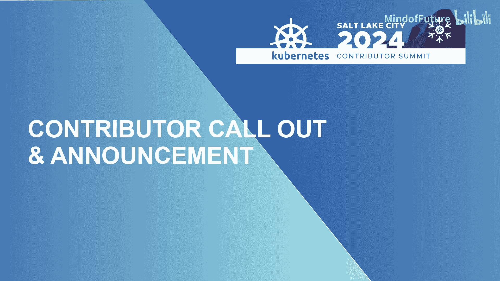

# 010：Kubernetes贡献者峰会（2024北美）-p10-贡献者招募与公告

在本节课中，我们将学习Kubernetes社区中多个特别兴趣小组（SIG）和子项目的当前状况与贡献机会。多个项目维护者将介绍他们急需帮助的领域，从代码开发、文档本地化到社区运营和安全响应等。无论你是经验丰富的贡献者还是希望入门的新手，都能找到参与的方式。

---

## 贡献者招募：各项目急需帮助的领域

以下是来自不同SIG和子项目代表的发言，他们各自阐述了项目当前面临的挑战和急需帮助的具体方面。

### SIG Testing - Pro项目

我们目前在资金和运营方面取得了很大成功，但项目工具本身的代码，即我们运行所有CI的载体，主要由一位非常活跃的维护者支撑，其他贡献者几乎都已离开。SIG Testing的其他成员手头也有很多事情。我们迫切需要更多人积极参与这个项目，特别是来自Kubernetes项目的成员。虽然有一些来自Kubernetes外部用途的用户参与，但我们缺乏足够多的、来自Kubernetes社区并思考Kubernetes如何使用该项目的代表，以确保我们为运行CI而孵化的项目仍能满足我们自身的需求。如果你感兴趣，请在会后或SIG会议间歇与我交流。

### SIG Contributor Experience - 新贡献者引导与社区运营

我是SIG Contributor Experience的Kasn，我们有一个新的贡献者引导计划，本次峰会之后我们有一个专门的会议来介绍它。我和Mario将告诉你这个计划是什么，以及你们所有人如何提供帮助。我们特别需要SIG负责人、维护者以及任何能够帮助新贡献者融入社区的贡献者的帮助，我们将在会议上详细介绍更多信息。

此外，在社区运营子项目中，我们希望在明年开展一些社交媒体方面的工作。我们现在有很多社交媒体账号，我们正在努力确保我们有可持续的策略和工作，以及学习如何开展这项工作的人员。请来帮助我们运营社交媒体。如果你曾想尝试博客写作，我们也有相关计划。在导师计划方面，我们有一位新的导师子项目负责人。如果你想通过担任导师来帮助新贡献者参与，请参与导师子项目正在进行的工作。

### SIG Architecture - 代码组织与评审

我是SIG Architecture的John。我们非常需要帮助的方面包括代码组织、生产就绪性评审和API评审。我们在Bridget（她之前在这里）的带领下有一个影子计划，她已承诺参与下一个周期。我们还有其他一些人参与。这是一个了解整个项目全貌的好方法。你会与很多人交流，虽然他们可能不喜欢你，但你至少能接触到社区。实际上，你能学到项目中正在发生的很多事情。我们这个小团队会审视整个发布周期中的所有增强功能，这非常酷。

此外，我也参与了设备管理工作组。我们有很多人参与其中，稍后我们有一个线下会议，如果你想了解更多关于我们在那里做什么的信息，可以参加。我们在那个领域有太多工作要做，绝对需要更多人加入并做出贡献。

### SIG Docs - 文档本地化

我是SIG Docs的Soco，目前是SIG Docs本地化子项目的负责人之一。我在此呼吁为Kubernetes文档的本地化提供一些帮助。我们实际上有许多本地化团队来领导每种语言的本地化工作，目前有超过10个团队。但我们需要更多贡献者为每种语言提供帮助，以及能够领导团队本身的人。如果你对文档本地化感兴趣，请来找我，或者你可以分享给你的朋友，如果他们也对本地化文档以及为Kubernetes做贡献感兴趣的话。我认为本地化项目和这些团队是开启他们首次贡献的绝佳场所。作为SIG本地化项目的负责人，我努力将新贡献者带入我们的Kubernetes社区，并推动他们进入其他SIG，使他们能够成为我们整个Kubernetes社区的新贡献者。

### SIG Network - Gateway API

我是Gateway API子项目和SIG Network的Shane。我们在去年的KubeCon芝加哥大会上宣布了正式发布（GA），但我们仍处于一个相当大的增长期，我们需要帮助和反馈。特别是我们目前在Slack的SIG Network Gateway API频道中有一项正在进行的调查，我们希望人们填写。我们对用户体验以及介于其间的所有事情的反馈特别感兴趣。所以，如果你一直在考虑使用Gateway API，或者已经在使用它，你的反馈将非常有帮助。

### API评审

我没有数据支持，但我还是要断言：阻碍你的增强提案（CAP）被合并的首要障碍是API评审。有多少人提交过CAP并遇到了“哦，我需要找一位API评审员，我需要获得他们的时间”这种情况？今天在座的API评审员有多少？有资格进行API评审的人。1，2，3。Michelle之前在这里。有4位，因为只有我们4个人。所以，如果你的CAP需要API评审，你必须通过我们中的一位才能让它进入。让我告诉你，过去几周有点疯狂。所以这是我的恳求。如果你是项目的成员，并且已经参与了一段时间，你见过API，使用过API，并且可能想帮助评审其他人的API设计，我们确实需要帮助。我们越能分散这项工作，情况就会越好。这有点像一段旅程。所以，如果你感兴趣，来和我们中的一位谈谈，我们会很乐意帮助你入门。

### SIG Release - 发布工程

大家好，我以SIG Release联合主席的身份再次发言。很多人认为SIG Release只是发布团队，我们实际上有两个子项目。其中之一是发布工程，该项目负责处理所有发布工程工具，这些工具实际上在每个周期点击按钮来发布Kubernetes。我们正在积极寻找对开发这些工具感兴趣的人。有一群人拥有Kubernetes发布经理的头衔，我们一直在努力构建更多的贡献者阶梯。所以，如果你有发布工程背景，如果你曾是SRE、生产工程、DevOps等，并且对发布Kubernetes感兴趣，请来和我们谈谈。

### SIG Testing - Hyrophone项目

我是Hyrophone项目的维护者Ricky，我们是SIG Testing下的一个较新的项目子项目。我们正在努力使Kubernetes的合规性和测试变得更加容易。我们正在寻找更广泛的采用以及在你们平台上的测试，以帮助我们找出差距和可以改进的地方。任何反馈都非常欢迎。

### kubectl插件管理器

大家好。你们知道kubectl有一个插件管理器吗？好的。猜猜那个插件管理器上分发了多少个插件？800？5？太多了。好的。实际上是275个。我认为开源中有很多插件。猜猜有多少人在评审这些插件及其更新？是的，只有一个人。那就是我。我真的忙不过来。所以我们正在尝试围绕插件管理建立一些流程。我们也在尝试做v1版本。你知道，如果我们能做到的话。同样的旧代码已经运行了很多年，运行得很好。但我们想要一个稳定、愉快的API。我们想要，你知道，让项目处于一个成功的状态。所以，是的，时间。

### 安全响应委员会

嘿，大家好。你们知道Kubernetes有CVE吗？不是我们，对吧，我们是完美的。所以，是的，我们有一个安全响应委员会，目前大约有8名成员，大多来自不同的公司，许多是社区的资深成员，我们正在寻求帮助。就像其他待命一样，我们也有待命安排。因此，我们委员会的每个人都有每周的待命任务。所以我们正在寻找对CVE充满热情并愿意与社区（如其他SIG的维护者）以及SIG Release合作，以分类安全漏洞的人。所以请来加入我们。

### Ingress NGINX与Gateway API实现

大家好。我的名字是James Strong。我是Ingress NGINX的维护者之一，这是每个人最喜欢的Ingress控制器。我将开始做一些事情，这会让我的公司变得更有趣。有多少人有机会从头开始做一些事情？有多少人想要这个机会？没有，有几个，谢谢Tim。对于Ingress NGINX，我们实际上要开始Gateway API的实现。我为此感谢所有在那里的支持者。所以我们即将开始那个实现。下周开始，所以如果你想开始参与，我们已经与SIG Network和Gateway API社区进行了很多讨论。所以，是的，我们需要帮助来完成这件事，并且是从头开始。我们将进行很多对话，编写很多代码，并尝试修复那些CVE和安全问题。但要努力避免重蹈过去的覆辙。总之，谢谢。

---

本节课中我们一起学习了Kubernetes社区中多个关键领域对贡献者的迫切需求。从核心的测试框架、API设计评审、发布工程，到社区运营、文档本地化、插件生态和安全响应，每个环节都欢迎并需要社区的参与。无论你的专长是编码、文档、运营还是安全，都能在Kubernetes找到贡献力量、提升技能并影响项目发展的机会。