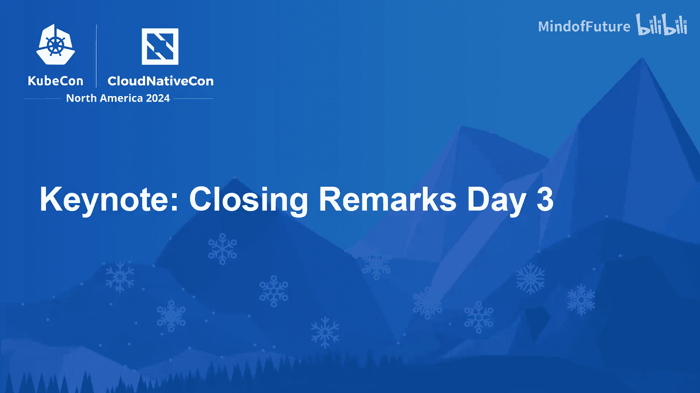
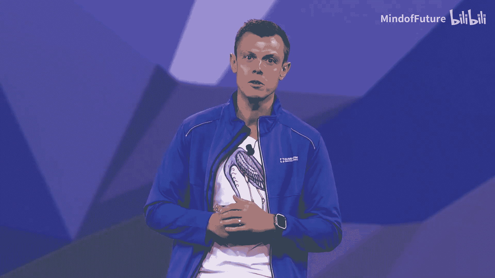
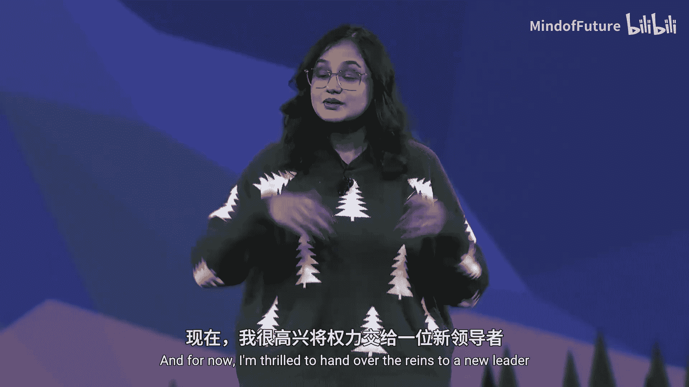
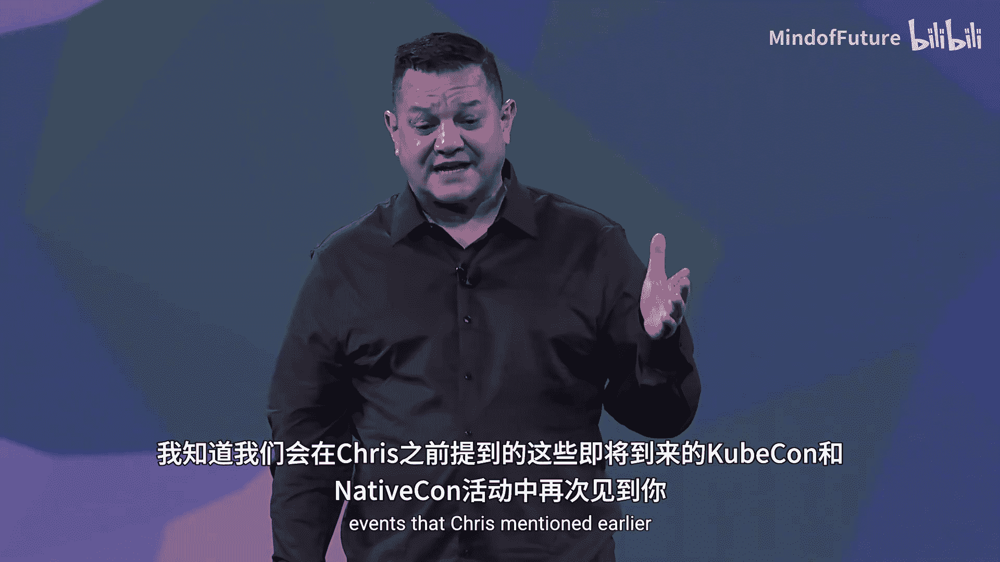

# 002：闭幕致辞

在本节课中，我们将学习KubeCon+云原生峰会2024闭幕致辞的核心内容。我们将了解会议的重要提醒、对贡献者的感谢以及未来的展望。

---

在恢复分组讨论会之前，我需要提醒大家几件重要的事情。

以下是关于活动安排的重要提醒。

*   解决方案展示区将于今天下午2:30关闭。
*   请务必在此之前访问我们的赞助商展位。
*   别忘了在云原生角商店领取免费的T恤。

---

上一节我们介绍了会议的重要安排，本节中我们来看看对个人的特别致谢。

我谨向所有人表示衷心的感谢。但首先，我想花点时间感谢我尊敬的联合主席Nikkita。

这是她最后一次担任KubeCon云原生大会的联合主席。我想请大家为她为本次活动做出的宝贵贡献，送上应得的掌声。

感谢大家。非常感谢你们给我这个绝佳的机会。担任这个角色让我度过了非常愉快的时光。我相信在未来的KubeCon+云原生大会上，我们还会再见。现在，我很高兴将接力棒交给新的领导者，而这一次，我将继续在场边为大家加油。

---

感谢Nikkita的贡献后，我们来看看对合作伙伴的感谢以及对未来的展望。

Nikkita，我真的很享受与你共事的时光，你对社区产生了如此巨大的积极影响。Casper和我都会想念你。我期待与我们下一任联合主席在我们热爱的这些精彩活动中合作。

我知道我们会在Chris之前提到的即将到来的KubeCon活动中再次见到你。

期待在这些活动中再次与大家相见。我们衷心感谢大家参加我们的主题演讲。再次感谢所有让本次活动成为可能的演讲者和赞助商。祝大家会议最后一天愉快，我们期待下一次再会。

谢谢大家。

---

本节课中我们一起学习了KubeCon+云原生峰会2024闭幕致辞的主要内容。我们回顾了重要的会议提醒，表达了对离任联合主席Nikkita的感谢与祝福，并展望了未来的社区活动。这标志着本次大会正式环节的结束。