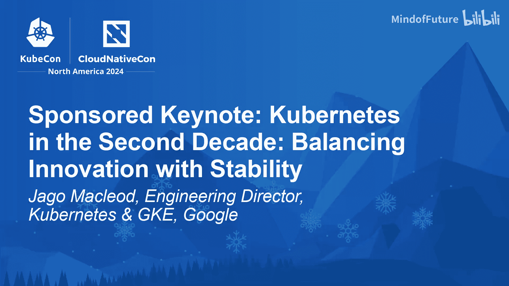
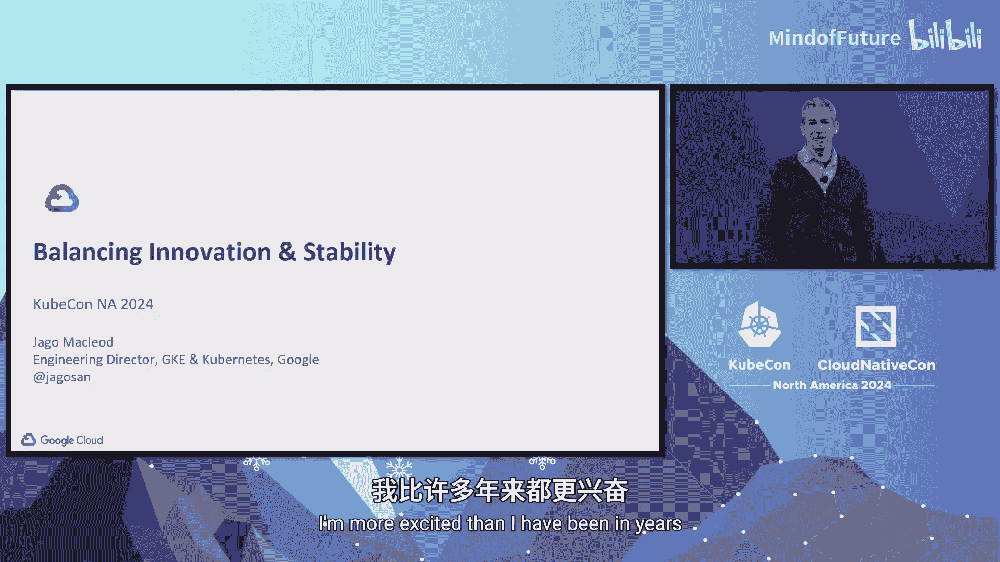

# 005：平衡创新与稳定

## 概述
在本节课中，我们将探讨Kubernetes进入第二个十年所面临的挑战与机遇。我们将分析其如何平衡创新与稳定性，以适应新的技术浪潮，特别是生成式AI带来的变革。课程将围绕三个核心故事展开：稳定性保障、硬件关系重构以及向框架编排器的演进。

---

## 章节一：Kubernetes的演进曲线与转折点

上一节我们概述了课程内容，本节中我们来看看Kubernetes的发展轨迹如何被重新定义。

直到大约一年半前，我们认为Kubernetes遵循着一条典型的创新采用曲线。早期采用者率先在生产环境中运行Kubernetes，随后越来越多的人开始运行更多关键任务负载。我们逐渐形成了一种节奏，即随着时间的推移，系统变得更加安全和稳定。

采用曲线与消耗曲线并不匹配。随着在曲线上移动，消耗会不断增加。当然，几年前出现了转折点，即ChatGPT和生成式AI时代的到来。

这对我们来说相当震惊。我们所有关于消耗的模型都失效了。因此，我们注意到存在两条截然不同且叠加的采用曲线。这两条曲线可能不成比例，因为第二条曲线要陡峭得多。

我们一直在努力探索如何满足这两类用户的需求。你可能在本次大会上已经看到了这种张力：如果第一天是关于AI，那么第二天就是关于安全。

你或许还记得那条消耗曲线。它现在变得陡峭得多。因此，我们制定了一个使命。

---

## 章节二：核心使命与三大故事

上一节我们看到了发展曲线的变化，本节中我们将了解为此制定的核心使命和三大发展方向。

我们的使命本质上是确保开源Kubernetes及其生态系统的未来。这部分至关重要。为了下一个十年，通过满足下一个万亿核心小时的需求。

这个数字很有趣，因为它关乎全球大部分计算资源。我们提出了三个故事来凝聚共识。

以下是三个核心发展方向：

1.  **稳定性**：最根本的是稳定性。我们必须在稳定性与其他两个方向的创新之间取得平衡。
2.  **硬件关系**：关于重新定义Kubernetes与底层硬件的关系。最初，节点只有CPU和内存。你可以拥有更多或更少，但基本上节点就是节点。而现在，存在高度专业化的硬件，这些硬件可能在你所在的区域不可用。
3.  **框架编排**：关于成为一个框架编排器，而不仅仅是工作负载或容器编排器。

---

## 章节三：规模化可靠性

上一节我们介绍了三大发展方向，本节中我们首先深入探讨第一个方向：稳定性与规模化可靠性。

在这巨大的规模下，可靠性至关重要。你可能已经注意到本周我们宣布支持在单个Kubernetes集群中管理**65000个节点**。这是一个巨大的飞跃。

下一个重点是升级可靠性。所有这些创新只有在能够带动现有用户群时才有意义，碎片化在许多项目中是一个现实问题。我们必须确保客户能够安全、可靠地升级，甚至能够回滚。

---

## 章节四：重构硬件关系

上一节我们讨论了规模化可靠性，本节中我们来看看第二个故事：重新定义与硬件的关系。

大约一年半前，人们是在克服Kubernetes的局限下取得成功的。过去几天大会上我们讨论的许多工作，比如动态资源分配（DRA）以及与底层加速器的协作，都是为了使其在不同硬件类型之间更加动态和一致。

---

## 章节五：迈向框架编排器

上一节我们探讨了硬件关系的演进，本节中我们聚焦于第三个故事：成为框架编排器。

在左侧，你会看到我们的平台管理员角色Charlie。他对于数据科学家和数据工程师在新型工作负载上使用像Slurm和Ray这样的框架感到有些困惑。

幸运的是，Kubernetes多年来已经演变为支持各种工作负载。我们正在与开源社区紧密合作，确保Kubernetes支持这些新型框架。

这一切背后的核心理念是创建一个**一致的操作模型**，使得最终用户能够在他们所有的业务部门中采用这些框架，并提供一致的操作体验。同时，提供一种一致的方式来使用随时间推移而出现和可用的底层硬件。

这是Kubernetes长期以来做得非常出色的一点。我们期待下一个阶段。

---

## 章节六：总结与展望

再次强调，这些重叠、叠加的机遇在职业生涯中并不多见。我们在谷歌经常谈论要尊重机遇，而这正是我们非常尊重并全力投入的一个。

我们正在加倍投入Kubernetes。我们认为你也应该如此。

迫不及待想看看我们在下一个十年会创造什么。保重，谢谢。

## 总结
本节课中，我们一起学习了Kubernetes在第二个十年面临的挑战，即如何平衡陡峭的AI创新曲线与对稳定性的核心需求。我们探讨了其通过确保规模化可靠性、重构与异构硬件的关系以及演变为框架编排器来应对这些挑战的三大战略方向。Kubernetes正致力于为下一个万亿核心小时提供稳定、灵活且一致的操作体验。