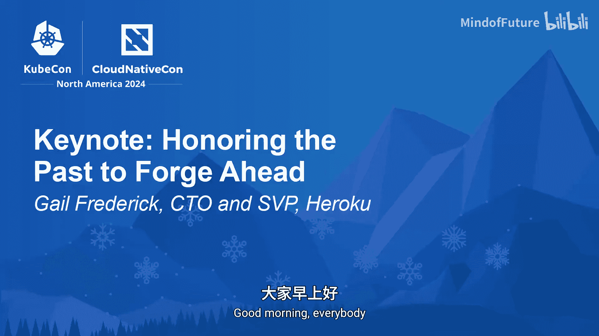

# 006：回顾过去，展望未来——Heroku CTO Gail Frederick的分享

在本节课中，我们将回顾Heroku联合创始人提出的“十二要素应用”宣言，探讨其在现代云原生环境下的演变与现代化需求。我们将了解其核心原则、当前面临的挑战，以及Heroku如何携手社区将其开源以共同更新这份经典指南。

大家好。

我很高兴能在这里，为这充满技术与社区精神的一周画上句号。

在Heroku，我们是构建者、开发者和工程师。

我们的工作是展望未来。但有时，回顾与反思过往的道路会有所帮助。

这能帮助我们规划前进的方向。让我分享一个故事。

在21世纪初，还没有容器，也没有Kubernetes。

这个社区也尚未存在。那是云的早期阶段。

我们都在摸索如何迈向云端。

更不用说如何以最佳方式在云中交付和扩展应用。

Heroku的联合创始人Adam Wiggins等人撰写了一份宣言。这份宣言就是“十二要素应用”。

它定义了云中应用开发的理想实践，旨在最小化脆弱性、可持续地增长并减少摩擦。

凭借其清晰、可操作的建议，“十二要素”成为了我们行业讨论最佳实践的共享词汇。

令我惊讶的是，这份宣言在13年后依然具有强大的生命力。

以上就是那十二个要素。现在，如果我们快进到今天，自2011年以来，一切都发生了巨大变化。

Heroku已在云端部署并运行了数百万个应用。云已成为应用开发的默认模式。

云原生是一场大规模的运动，今天在座的各位就是明证。

云建立在开源之上，而Kubernetes已成为云的操作系统。

那么，这对于“十二要素”最初的构想意味着什么？是时候对“十二要素”进行现代化了。

在Heroku，我们知道没有比与开源社区中的你们合作更好的方式了。

因此，在本周的KubeCon上，我们宣布“十二要素”现在是一个开源项目。

我在这里诚挚地邀请你们参与这个项目。

我们希望与大家一同对“十二要素”进行一次深思熟虑的更新。

以下是“十二要素”开源项目的首批维护者。

非常感谢AWS、Google Cloud、IBM和Intuit加入Heroku和Salesforce，共同踏上这段旅程。

“十二要素”需要你们所有人，无论是构建者还是运维者。

你们拥有大规模运行应用的经验，我们想了解哪些要素仍然适用，哪些需要更新。

我们确实需要共同完善这些最佳实践。

那么，为什么现在是更新“十二要素”的正确时机？自2011年以来，技术格局发生了翻天覆地的变化，我们编写代码的方式也截然不同，甚至在过去的两年里，随着生成式AI的兴起也是如此。

作为开发者，我们知道我们现在是将整个应用系统部署到云端，而不再仅仅是单个应用。

以下是我们计划在“十二要素”中开始着手更新的方向。

首先，宣言除了日志之外，没有提及可观测性。

我们知道现代应用需要一个健全的可观测性方案。

其次，配置中的机密信息，尤其是凭证，是一个安全噩梦。

因此，我们希望引入服务身份的标准。

再者，正如我所说，没有人只部署一个应用。因此，应用团队需要管理一组“十二要素”应用的最佳实践，以及何时将单个应用拆分为多个的指导原则。

请加入我们，这是GitHub上项目仓库的链接，这里还有一个二维码，方便您加入我们的Discord社区。

我非常激动，“十二要素”已于本周开源。谢谢大家，祝大家大会愉快。

---

**本节课总结**

本节课中，我们一起学习了“十二要素应用”宣言的历史背景及其对云原生应用开发的深远影响。我们探讨了随着技术演进，特别是容器、Kubernetes和云原生成为主流后，这份经典指南面临的现代化挑战。最后，我们了解了Heroku联合多家科技公司将其开源，并邀请社区共同参与更新，重点关注**可观测性**、**服务身份管理**和**多应用系统治理**等现代议题。这标志着经典开发原则将与时俱进，在开源协作中焕发新的生命力。