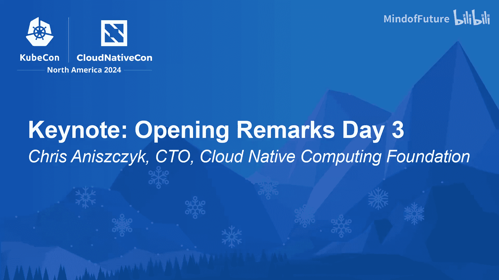

# 007：KubeCon 2024 开幕致辞与社区动态解读

在本节课中，我们将学习 KubeCon + 云原生峰会 2024 开幕致辞的核心内容，了解云原生计算基金会（CNCF）的最新动态、社区合作、技术捐赠以及未来的发展规划。

---

## 社区合作与资源贡献

上一节我们介绍了课程概述，本节中我们来看看 CNCF 社区如何获得外部支持。

CNCF 社区非常幸运，有许多组织贡献人员和资源，以确保我们的项目能在各种不同的环境中运行，例如不同的云平台和本地系统。

今天，我们将首先介绍一个新组织，它正在为 CNCF 贡献特殊资源，以确保我们的项目拥有更多支持。接下来，有请来自 Akamai 的 Ari 介绍他们的举措。

大家好。在过去十年中，开发者被迫在两个不利选项间做出选择：要么接受大型云的复杂性、高昂成本和供应商锁定，要么从头开始构建一切，从而浪费宝贵时间。

这就像代码本身一样，曾是一个非此即彼的二元选择。直到本周，我们做出了一个不同的选择。我们宣布推出 **Akamai 应用平台**。

我们创建了一个平台，它平衡了云的简易性和开源的控制力。该平台构建于 **Kubernetes** 之上，确保大规模工作负载的真正可移植性，赋予企业在云环境间自由迁移应用的能力。

这种自由带来了更高的成本效益和对供应商锁定的防护。应用平台使用开源技术简化部署，加速价值实现，并确保灵活性。开发者只需点击一下，即可部署预配置的上游 CNCF 项目，涵盖从 CI/CD 到可观测性再到安全的各个领域。

一系列“黄金 PaaS 模板”目录简化了开发者构建和部署应用的方式。这是 Akamai 对开源和 CNCF 社区承诺的例证。我们为员工能作为技术咨询小组联合主席参与，以及开发者积极为帮助企业扩展应用的项目做贡献而感到自豪。

我们还承诺提供一百万美元，以帮助项目扩展其运营。这包括像 **Flux** 这样的项目。Akamai 已为 Flux 社区做出了上游贡献，并正投资将 Flux 认证为 Akamai 云上的官方赞助平台。

既然微软已宣布 **Hyperlite**，我们非常兴奋能在我们的平台上试用它，并看看社区的反应。

如果您尚未使用过 Akamai 云，或者您之前了解过 Linode 并想看看 Akamai 如何投资扩展我们的云平台，推出了像应用平台这样令人兴奋的新产品，那么我鼓励您注册免费账户并尝试一下。但想了解更多关于 Flux 的信息，我想请出 Anda。

---

## 项目进展与社区认可

上一节我们看到了企业的资源贡献，本节中我们来看看具体项目的进展和社区认可。

非常感谢 Akamai 为社区和 Flux 项目提供的惊人资源捐赠。听到 Akamai 使用 Flux 的消息真是太棒了，而且他们并非个例。如今，Flux 几乎支持所有云平台和本地平台。

我们很高兴 Flux 背后的社区势头得到了认可，并已作为孵化级项目被 CNCF 接纳。对社区而言，这意味着我们首次能够部署一个完整的生产环境，包括操作系统，全部使用 CNCF 技术。

Flux 与 CNCF 天然契合，因为它专为容器设计，并秉承云原生原则，如**不可变性**和**声明式配置**。但世界并非静止不动，我们也在不断前进。我们正在演进 Flux，使用户能够定制它，以适应下一代工作负载。

还记得汉堡王的“我选我味”活动吗？这就是我们对 Flux 采取的方法。通过**系统扩展**，您可以在基础操作系统镜像之上构建自己选择的层，以简化集群 API 工作节点镜像的创建，或支持部署新的工作负载类型，例如 **WebAssembly**。现在我将交给 Rita Zhang，让她为我们更多介绍这类工作负载。

---

## 新兴技术：安全与性能的平衡

上一节我们了解了 Flux 的演进，本节中我们来看看如何在新兴技术中平衡安全与性能。

谢谢 Anda。你说得完全正确。我们希望在云原生工作中运行 WebAssembly 和许多其他新技术，同时仍确保它们安全运行。虚拟机长期以来一直是云原生基础设施的基石，被广泛信任用于安全分离主机和客户机环境。

但对于事件驱动场景和轻量级无服务器应用，传统的虚拟机启动速度太慢。那么，我们如何在安全运行应用的同时减少这种延迟呢？为此，我们引入 **Hyperlite**。

Hyperlite 是一个 Rust 库，旨在让开发者能够利用 KVM 或 Hyper-V 在微虚拟机中运行不受信任的代码，而无需加载完整的操作系统。这些虚拟机可以在微秒级时间内创建。

在这个演示中，我们有一个应用在虚拟机和主机之间进行顺序调用，然后将值从主机返回给客户机。Hyperlite 为每次调用创建一个新的微虚拟机，平均每次请求仅需 **900 微秒**。请注意，是微秒，不到 1 毫秒。

最后，我非常激动地宣布，今天我们刚刚提交了一个拉取请求，将 Hyperlite 作为沙箱项目捐赠给 CNCF。我们邀请大家查看、探索它。我迫不及待想看到大家在各自项目中利用 Hyperlite 的创新方式。

---

## 全球社区扩展与教育计划

上一节我们探讨了新兴技术，本节中我们来看看 CNCF 如何扩展其全球社区并推动教育。

谢谢 Rita。我们社区的一个有趣之处在于其规模非常庞大。Kubernetes 今年将满十岁，它实际上是继 33 岁的 Linux 之后，开源贡献活跃度第二高的项目。它确实发展得非常迅速。

我们的社区极其庞大且全球化。我们在世界各地举办 KubeCon，与全球各地的人们会面，并努力让他们接受云原生技术的培训并跟上发展速度。

作为此的一部分，我们编写了一份出色的报告，庆祝 Kubernetes 十周年，采访了用户和维护者，分享他们在过去十年左右如何从 Kubernetes 中受益。您可以查看这份我们精心编写的报告，扫描那个小小的二维码获取完整详情。

正如我提到的，这确实是全球最大的开源社区之一，覆盖 193 个国家，拥有超过 25 万名贡献者。我基本上从 CNCF 成立之初就担任此职，曾到世界各个地方旅行。

我最喜欢的一次旅行是去尼日利亚的拉各斯，会见我们在那里的非洲社区成员。这绝对是一次有趣的经历，见到了那里的一些大使，了解了当地的情况。我深受鼓舞，认为我们可以利用我所感受到的所有热情在那里做更多事情。

因此，我很高兴介绍我们正在启动的一项新合作，并想请出来自 Andela 的 Ross 谈谈我们为确保云原生持续全球化所做的努力。

谢谢 Chris。非洲是一个年轻的大陆，拥有增长最快的市场。许多人渴望获得 Kubernetes 和其他云原生技术的认证，但成本一直令人望而却步。

另一方面，当客户向我们提交职位需求时，其中 90% 的请求都希望应聘者具备 Kubernetes 技能。对 Kubernetes 的需求非常强劲。

因此，我们联系了 CNCF，询问他们是否愿意与我们合作开展一个学习计划。我们非常激动地宣布，CNCF 和 Andela 将为 20,000 到 30,000 名非洲开发者提供 KCSA 和 CKAD 培训和认证，该计划将于 2025 年启动。这将扩展 Kubernetes 和其他云原生技术的覆盖范围。

谢谢 Ross。我真的很兴奋，正如我之前提到的，我们在非洲有一个不断增长的社区，实际上即将举办 KCD Ghana 活动，我们在那里大约有 800 名社区成员，并且规模在持续增长。因此，我鼓励大家利用这个计划，继续让云原生全球化。

---

## 新认证与学术合作计划

上一节我们看到了面向非洲的教育计划，本节中我们来看看 CNCF 推出的新认证和学术合作项目。

在正式开启今天更多内容之前，我再宣布几件事。CNCF 一直致力于培训更多开发者掌握云原生技能，历史上我们显然主要关注 Kubernetes，因为那是我们的第一个项目，也是许多初始资源的投入方向。

但随着 CNCF 发展到超过 200 个项目，我们还有其他非常庞大的社区，例如 Prometheus、Envoy、OpenTelemetry 等。因此，最近我们投入了大量资源，推出新的培训和认证，以满足那些希望学习 Kubernetes 之外技能的人们的需求。

我很高兴地宣布，我们今天推出了几项新认证：我们有了 **Backstage**（我认为是全球最大的开源 IDP）的新 **Backstage Associate** 考试；我们有了 **OpenTelemetry** 认证考试（它是 CNCF 中仅次于 Kubernetes 的第二大项目）；我们还有 **Kyverno** 认证，目前处于测试阶段。

我们正在持续开发，以确保人们能够获得相关技能。对此我感到非常兴奋。

我们还有一些新的云原生计划。我相信许多人都知道，第一天大会有一个很大的平台工程主题。我们正努力与社区合作，因为我发现平台工程是一个有些模糊的话题，根据你交谈的公司或个人的不同，对其含义可能有不同的看法。

那么 CNCF 最擅长做什么呢？我们把人们聚集在一起，共同协作并改进事物。因此，我们将共同努力创建一个新的 **Certified Cloud Platform Associate** 认证，以帮助从云的角度定义平台工程本质上是什么。

如果您有兴趣参与并帮助塑造这个计划，这里有一些二维码。此外，我们还在测试版形式下启动了一个 **学术认证计划**。

我经常有幸访问世界各地的大学和学术机构，有时从公司那里听到的主要抱怨是，学生没有接受过适当的开源软件培训，或者不了解云原生。

我们的目标是与大学合作，帮助他们采用以云原生为重点的课程，真正为在校学生做好准备，赋予他们所需的扎实技能，以便在开始职业生涯时能够发挥作用。请查看该计划，目前处于测试阶段。

另外，每届 KubeCon 我们都会为参会者提供培训折扣。请查看相关信息，您会收到邮件。我不需要在这上面花太多时间，我知道我的营销团队会讨厌我这样说。

我真正感到兴奋的是，我们是一个全球社区，我们正在新的地方举办 KubeCon。这是我们首次在印度举办 KubeCon，几周后将在德里举行，时间是 12 月 11 日至 12 日。非常令人兴奋。请加入我们，我们将有一支很棒的团队在那里。

我不得不说，希望你们在未来几周内订票，因为它预计将售罄。我对此感到非常兴奋。显然，我们下一届 KubeCon Europe 将在伦敦举行，时间为 4 月 1 日至 4 日，非常期待。提案征集开放至 11 月 24 日，请在那里提交演讲。预计这将成为我们有史以来规模最大的 KubeCon。

---

## 未来活动规划与社区调查

上一节我们介绍了新的认证和学术计划，本节中我们来看看 CNCF 未来的全球活动安排。

那么 2025 年，我们将举办一些 KubeCon。我提前告诉大家这些，以便你们可以标记日历。我们将有 KubeCon London。KubeCon China 将于 6 月 10 日至 11 日在香港举行。KubeCon India 2025，我们的第二届，将于 8 月在**海得拉巴**举行。

我知道有些人对德里感到失望，我们会像往常一样更换城市，下一个是海得拉巴。然后，明年北美的 KubeCon 将在**亚特兰大**举行，时间是 11 月 10 日或 11 日，这是我最喜欢的小城市之一，希望在那里见到大家。

最后，我们正在合并我们的安全活动。以前，OpenSSF 也有其安全活动，我们将把这些合并成一个新的 **Open Source Security Con**，该活动将于明年在 KubeCon Atlanta 首次亮相。

另一件要开始总结的事情是，我们收到了来自世界各地举办新的 KCD（Kubernetes Community Days）的许多请求。我很高兴地宣布，我们将把 KubeCon 活动扩展到一个新的世界区域。

明年我们将首次举办 **KubeCon Japan**，时间是 6 月 16 日至 18 日。Kubernetes 社区中有不少动漫爱好者，我相信他们会对此感到非常兴奋。希望明年能在日本见到大家。我们在日本有一个出色的云原生社区。

其他提醒：2026 年，KubeCon 已经变得如此庞大，以至于我们必须提前更久预订场地。2026 年的 KubeCon Europe 将回到**阿姆斯特丹**，时间是 3 月 23 日至 26 日。我喜欢 RAI 会议中心，它将回到那个同样美丽、阳光明媚的会议中心。

然后，2026 年北美的 KubeCon 将在**洛杉矶**举行，时间是 10 月 26 日至 29 日。请标记好你们的日历，我们将回到那里。

最后，作为收尾，我们每年都会进行这项年度调查，希望从大家那里获得反馈，了解你们正在使用 CNCF 中的哪些项目，面临哪些挑战。请扫描那个二维码填写，大约需要 15 分钟。我们将在明年初与所有人分享这些结果。

虽然有点超时，但我真诚地感谢所有来到这里并信任我们，让我们传授一些云原生知识的人。我真的希望你们觉得这个活动值得再次参加。从我个人帮助组织这个活动的角度来看，我真正希望人们做的就是学到新东西，交到几个朋友。

如果你们做到了，我会感到非常高兴，我认为这就是 KubeCon 的全部意义。谢谢大家的参与，我们将继续推进大会议程。谢谢大家，让我们开始吧。

---

本节课中我们一起学习了 KubeCon 2024 开幕致辞的要点，涵盖了社区合作（如 Akamai 的资源捐赠）、项目进展（Flux 进入孵化、Hyperlite 捐赠）、全球扩展（非洲培训计划、日本新增 KubeCon）、教育认证（Backstage、OpenTelemetry 等新认证）以及未来的全球活动规划。这些动态共同描绘了 CNCF 社区持续增长、技术演进和全球化协作的生动图景。