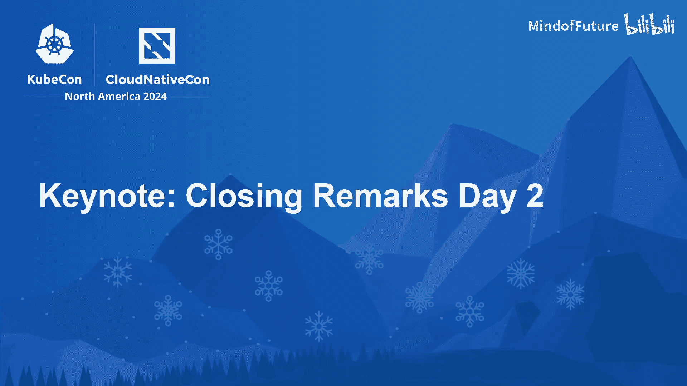
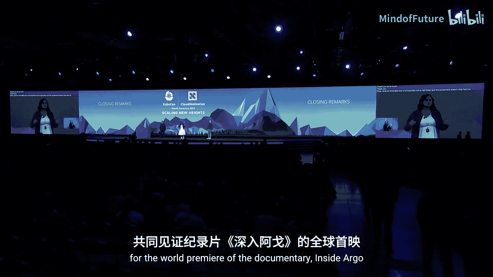
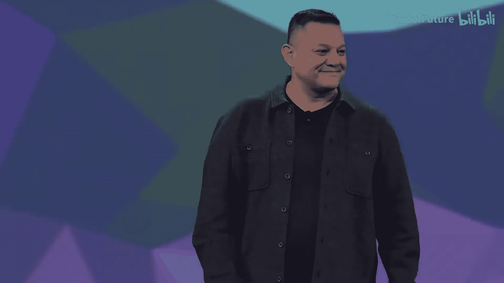

# 010：闭幕致辞

在本节课中，我们将学习KubeCon+云原生峰会2024闭幕致辞的核心内容，了解会议的重要公告与后续活动安排。

---

今天的会议日程非常精彩。

精彩并未就此结束。请务必在分组会议结束后，加入我们观看纪录片《In Argo》的全球首映。具体时间、地点及其他详情请访问 `checkca.do.com` 查询。

同时，请于下午4点加入项目展馆，共同庆祝我们最新毕业的项目。

此外，我们非常高兴地宣布，首个由Google Cloud赞助的DEI社区中心在KubeCon CloudNativeCon亮相。该中心旨在为会议上代表性不足的参会者提供熟悉的面孔和支持。

😊

分组会议将于上午11点再次开始。希望您在KubeCon CloudNativeCon的第二天过得愉快。

明天，我们将迎来最后一轮主题演讲，期待与您再见。

---

本节课中，我们一起学习了KubeCon+云原生峰会2024闭幕致辞的主要内容，包括后续的纪录片首映、项目庆祝活动、新设立的DEI社区中心以及第二天的会议安排。这些信息帮助参会者更好地规划行程并参与社区活动。