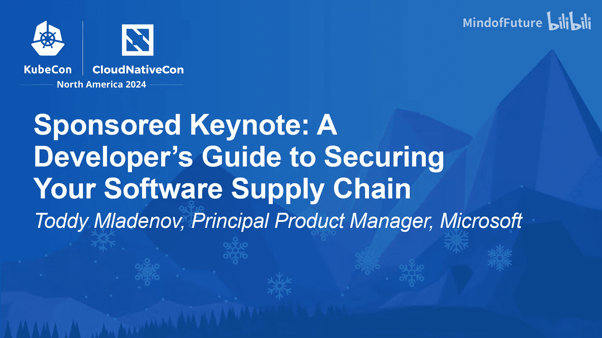
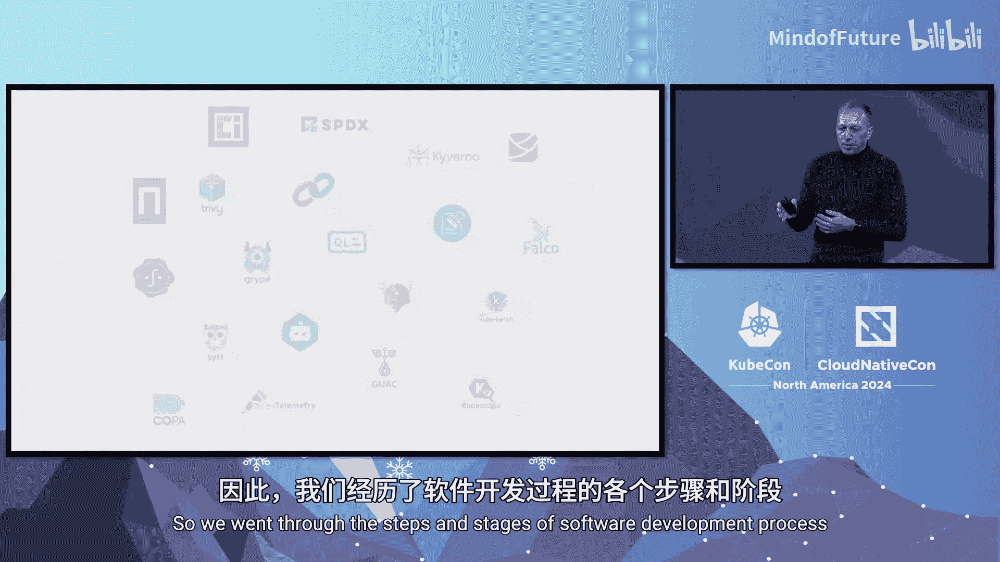

# 013：开发者软件供应链安全指南

在本教程中，我们将学习如何为云原生应用构建一个安全的软件供应链。我们将从理解风险开始，逐步介绍在软件开发的各个阶段（获取、构建、部署、运行）可以采取的安全措施和工具，最后强调可观测性和行业最佳实践的重要性。

## 为什么需要关注软件供应链安全？🔐

如果你关注网络安全新闻，你会看到许多相关报道。过去几年发生了几起最突出的软件供应链攻击事件。虽然许多攻击仍以经济利益为驱动，但被重点报道的那些往往具有最恶意的意图。

我们需要问自己的问题是：为什么攻击者认为此类攻击会成功？

## 软件开发的典型流程与风险 🚧

让我们看看作为开发者，将应用从源代码部署到生产环境的典型步骤。

今天，我们通常会去 Docker Hub 等镜像仓库寻找基础镜像。我们会去公共包管理器选择库来辅助开发。但最终的结果是，我们完全无法控制的镜像和库被包含在我们的构建中。更糟糕的是，我们有时会直接将它们部署到生产集群。

这正是攻击者希望我们做的，但我们可以让他们更难成功。

## 构建安全供应链的阶段性策略 🛡️

在微软，我们从不同阶段审视软件供应链的安全。

### 第一阶段：安全获取组件

第一步是获取能帮助我们加速开发过程的代码片段和组件。这些可能来自开源软件、供应商 SDK，甚至是内部二进制文件。

但在获取这些组件之前，我们需要确保它们来自可信的来源。

以下是确保来源可信的关键措施：
*   使用 **Notary Project** 和 **Sigstore** 等签名技术，验证任何软件供应链制品的真实性和完整性。
*   但仅有签名是不够的，身份也可能被泄露。因此，我们应该构建一个内部已批准制品的目录，不允许随意从互联网拉取。
*   使用符合 **OCI** 规范的注册中心（如 Azure Container Registry）不仅能存储容器镜像，还能存储任何我们想要的供应链制品。更重要的是，我们可以添加元数据来驱动供应链工作流。

例如，在微软，我们使用 SBOM（软件物料清单）元数据来标注容器镜像。如果镜像已过时，我们就不允许使用它们。我们还可以扫描镜像中的漏洞和恶意软件，或生成 SBOM。我们甚至可以使用 **Project Copacetic** 在上游项目提供更新之前，每日为镜像打补丁。

### 第二阶段：安全构建应用

现在，是时候构建我们的应用程序并将所有部分组合在一起了。

但仅仅构建二进制文件是不够的。我们应该生成 **SBOM**，这不仅是因为政府要求，我们也需要养成生成其他证明（如不可变的构建来源证明）的习惯。

在构建之前，我们应该确保使用 **CodeQL** 等工具扫描代码，并管理我们所依赖的组件。

你知道吗？**Dependabot** 现在可以更新 Dockerfile、Helm Chart 和 Kubernetes 部署文件中的镜像引用。你可以在 Azure DevOps 中尝试一下。

### 第三阶段：安全部署应用

我们的应用程序已准备好部署。但我们如何确保遵循良好的部署实践，并将合规的工作负载部署到集群中呢？

使用 **OPA Gatekeeper** 与 **Ratify** 或 **Kyverno** 等准入控制器，可以确保我们的工作负载从一开始就是合规的。

### 第四阶段：运行时安全与可观测性

最后，我们的应用程序开始运行。拥有一种在运行时发现错误配置或可疑活动的方法，对于应用程序的安全至关重要。

**Falco**、**KubeEye** 和 **Kube-Bench** 等工具可以帮助我们保持集群安全并符合安全基准。

不过，还有更多可做的。我们在其他领域讨论可观测性，却很少讨论软件供应链的可观测性。我们需要对供应链中发生的事情有端到端的可见性，以确保其安全。

上周，**OpenTelemetry** 宣布将增加观测 CI/CD 流水线的能力。这是一个如何将可观测性“左移”的绝佳例子。

我们听说过 **GUAC**。微软与 GUAC 社区合作，使开发者能够构建依赖关系图并理解其应用程序的构成。

我们还应该使用 **SLSA** 等行业框架，以确保在整个开发过程中遵循最佳实践。并且不要忘记实施零信任方法，确保我们只信任来自前一阶段的软件制品。

## 总结与行动号召 🚀

我们回顾了软件开发生命周期的各个步骤和阶段，看到了许多可供选择的项目。

这可能看起来令人望而生畏，但这不应阻止我们迈出第一步来保护我们的供应链。

如果你想了解如何集成其中一些工具，以便在你的供应链中获得流畅的体验，欢迎来 Azure 展台。我们可以为你演示，或者就此进行交流。

你也可以使用屏幕上的链接，了解更多关于微软如何思考保护软件供应链的信息。

如果你想改进任何这些工具的使用体验，只需选择一个并加入其社区。这里有几个我们推荐你关注的项目。

所以，行动起来，迈出第一步，保护你的软件供应链。

本节课中，我们一起学习了软件供应链安全的重要性、在开发各阶段（获取、构建、部署、运行）的关键安全实践与工具（如 Sigstore、SBOM、准入控制器、运行时安全工具），以及通过可观测性（如 OpenTelemetry、GUAC）和行业框架（如 SLSA）实现端到端安全的方法。记住，安全是一个持续的过程，从今天开始迈出第一步至关重要。