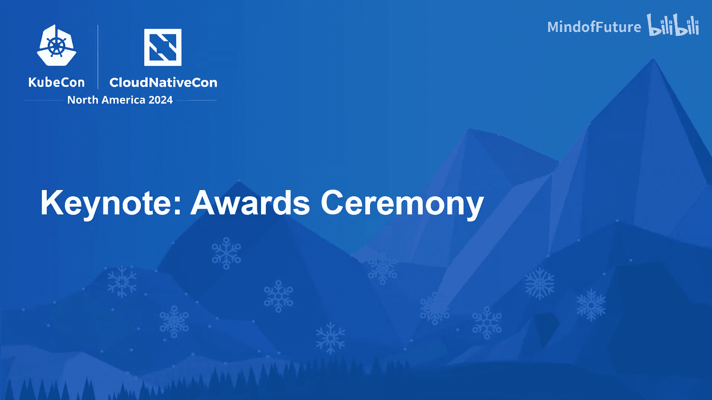
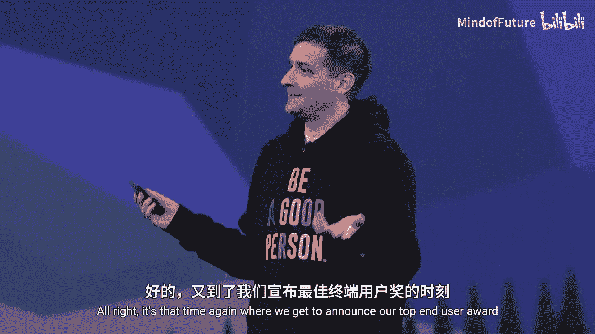
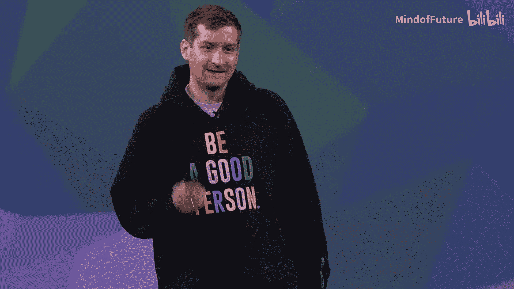
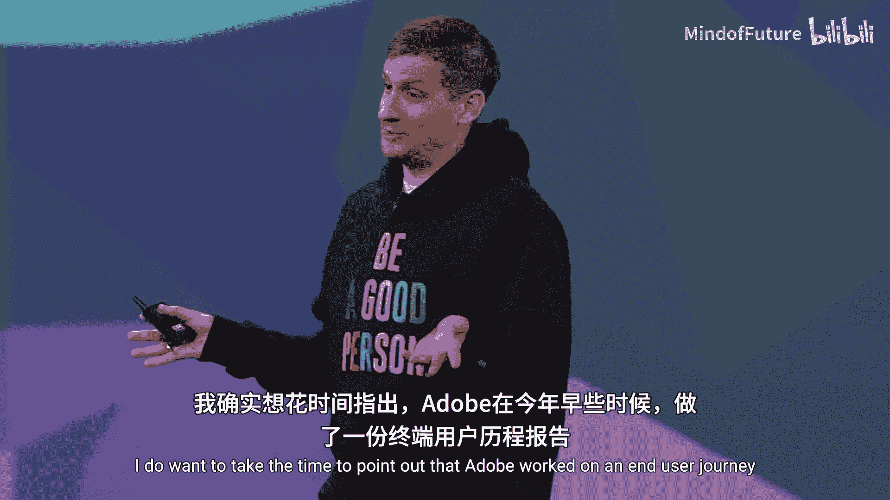

# 016：KubeCon 2024 颁奖典礼 🏆

在本节课中，我们将一起回顾 KubeCon + 云原生峰会 2024 颁奖典礼的核心内容。我们将了解年度杰出终端用户奖的得主，并认识那些在 CNCF 社区中做出卓越贡献的个人。课程将重点介绍奖项类别、获奖者及其贡献，帮助你理解开源社区如何认可和激励贡献者。

---

## 宣布年度杰出终端用户奖

现在，是时候宣布我们的年度杰出终端用户奖了。

这些奖项的评选依据是，我们的社区提交的、作为 CNCF 成员的组织的贡献及其所做的事情。

在本次 KubeCon 之前，我们通过提交流程选出了三家终端用户。

### 获奖者名单

以下是本次奖项的获奖者名单。

*   **第三名：Reddit**
    *   该平台支持数百万日活跃用户。
    *   每月处理数十亿次页面浏览量。
    *   他们为我们提供了宝贵的见解，例如关于 Piday 服务中断事件的分享，既包括遇到的问题，也包括成功的经验。
    *   非常感谢 Reddit 成为一个分享、学习和欢笑的优秀平台。

*   **第二名：Capital One**
    *   它是首批完全迁移到云端的美国主要银行之一。
    *   为我们贡献了像 Cloud Custodian 这样的项目，提供了在生态系统中保持整洁的方法。

*   **第一名：Adobe**
    *   该公司远不止让我们能够打印 PDF 文件。
    *   它在我们的社区中一直扮演着出色的角色。
    *   Adobe 的使命是通过数字体验帮助世界改变世界。
    *   其开发者平台团队致力于帮助 Adobe 的开发人员更快地编写更好的软件。
    *   CNCF 社区提供的工具、专业知识和能力是他们服务开发者的核心。
    *   例如，Kubernetes、Argo、Backstage、Prometheus、Otel、Envoy 等技术是他们实现使命的基础。
    *   Adobe 团队已向 CNCF 社区贡献了超过 5000 次提交，涉及 70 多位开发者和 46 个不同的项目。

Adobe 在今年早些时候还制作了一份终端用户历程报告，并于夏季发布。这份报告更多地讲述了组织为何加入 CNCF、他们在开源领域做什么以及背后的意图。

---

## 社区贡献者奖项

接下来，我们将目光转向社区贡献者奖项，这是为了表彰那些在社区中超越常规职责、做出突出贡献的个人。

CNCF 拥有全球最大的开源社区之一，拥有超过 25 万名贡献者，为 200 多个项目做出贡献。社区本身是 CNCF 最重要、最有价值的“项目”。

### 主要奖项类别

以下是本年度的主要社区贡献者奖项类别。

*   **顶级维护者奖**
    *   维护者是 CNCF 项目的生命线，他们辛勤工作在各类项目上。
    *   本年度的获奖者由现有维护者投票选出。
    *   **获奖者：Joe Stringer**

*   **顶级文档贡献者奖**
    *   开源不仅仅是代码，优秀的文档对于项目至关重要。
    *   今年我们新增了此奖项，并亲切地称之为“Aureem Ipsom 奖”。
    *   **获奖者：Kumming 和 Haifeng Yao**

*   **技术咨询小组贡献奖**
    *   CNCF 设有技术咨询小组，专注于存储、网络、贡献者战略等特定领域。
    *   此奖项旨在表彰 TAG 中的杰出贡献者。
    *   **获奖者：Nancy To**

*   **“劈柴挑水”奖**
    *   此奖项旨在表彰在项目中从事幕后基础工作的贡献者，例如改进构建时间、优化基础设施等。
    *   **获奖者：Stean Schinsky, Ali O, James Sperin, Prianka Sago, Sania Pananvara, William Roso**

*   **“迁移与提升”特别奖**
    *   这是一个一次性的特别奖项，旨在表彰多年来为 Kubernetes 项目基础设施做出巨大努力的团队。他们确保了社区管理和运行的构建过程，并改进了二进制分发的 CDN，使其能在多提供商上运行。
    *   **获奖者：Tim Hawkin, Erin Cririckenberg, Ben Elder, Arno Dis, Man Alili, Rickysdiski, Michelle Shepherderson, Coryelske, Tque Marco, Justin Santao, Barbara Cobaagner, Caleb Woodwine, Hpie, Linus Arvar**

*   **终身成就奖**
    *   今年是 Kubernetes 十周年和 CNCF 九周年，因此首次设立了此奖项，以表彰长期在社区中产生巨大影响的贡献者。
    *   **获奖者：Tim Hawkin**
        *   他在 Kubernetes 和 CNCF 领域产生了巨大的影响。
        *   他感谢社区中数百名共同维护者、SIG 负责人和项目运营者。
        *   他认为正是成千上万的贡献者让这个项目充满活力与卓越。

---

## 总结与展望

本节课中，我们一起学习了 KubeCon 2024 颁奖典礼的主要内容。

我们首先了解了年度杰出终端用户奖，获奖者 Reddit、Capital One 和 Adobe 都展示了如何利用云原生技术处理大规模业务并积极回馈社区。接着，我们回顾了多项社区贡献者奖项，从顶级维护者到终身成就奖，这些奖项全面认可了代码贡献、文档工作、基础设施维护及长期领导力等不同维度的卓越贡献。

这些奖项和获奖者的故事共同印证了 CNCF 社区的核心精神：协作、共享与持续创新。正是每一位贡献者的付出，共同构筑了这个充满活力的生态系统。期待在未来的 KubeCon 上看到更多精彩的成就和贡献。