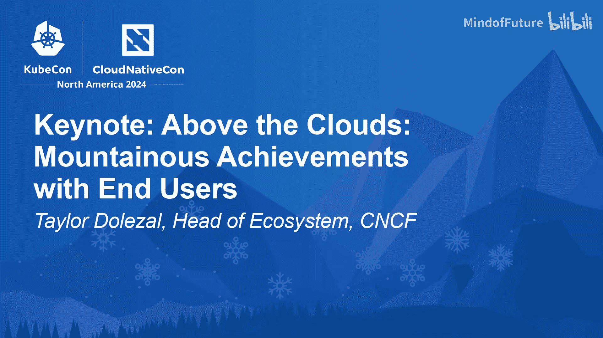

# 018：与最终用户共创高峰——Taylor Dolezal

## 概述

在本节课中，我们将跟随Taylor Dolezal在KubeCon+云原生峰会2024上的演讲，探讨最终用户如何与云原生生态系统共同成长，克服挑战，并了解CNCF最终用户技术咨询委员会（TAB）为支持这一旅程所推出的新工具和倡议。

---

## 置身云端之上

盐湖城，一个海拔如此之高以至于我们客观上置身于云端之上的地方。

我们的视角变得“元”化，因为我们正在俯瞰我们生态系统中发生的精彩事情。

我注意到这里有点冷，当我走过走廊时，我发现人们穿的衣服层数比OSI模型还多。那是七层。

这是一个网络笑话。好了，跟我回到篝火旁，暖和一下。今天，我想讲几个故事。我想问你们几个问题，然后我们会讲到更多的故事。

## 你的第一座“山”是什么？

如果你有机会看看这座城市的天际线，你会看到一些山脉。这很难被忽视。当你看着那些山，并真正让它触动你时，它会触及你的内心深处。如此巨大的事物。

也许你是那种看着顶峰并说“我想攀登它，我想去冒险”的人。但当你思考如何真正实现它时，这不是一件十分钟就能完成的事情，它需要计划，可能需要带水，需要合适的工具，可能不想独自前往。

今天我的第一个问题是：**在这个生态系统中，你的第一座“山”是什么？**

是你今天正面临的吗？是你目前工作中正在经历的吗？你正在试图解决一个可能没有明确答案的问题吗？

我的第一座“山”，毫无疑问，是Kubernetes。我当时在克利夫兰的医疗保健行业工作，进行容器化，试图在Ruby on Rails或Go中做出正确的决定。这并不简单。这是一次相当艰难的攀登。

当我查看科技新闻，听到所有关于编排工具和运行时的争论时，我很幸运，因为我有一个非常擅长沟通的团队。但我们总是想知道，我们是否遵循了最佳实践？我们做对了吗？

直到我参加了一次线下聚会，第一次亲眼看到Kubernetes，我才明白过来。在我准备这些幻灯片时，我才意识到，我第一次听说Kubernetes实际上是在一艘船上。所以如果这不是一个预兆，我不知道什么才是。它永远在我的职业生涯中掀起了波澜。

找到答案的感觉很好。但是，当你试图攀登生活中的那些山峰时，即使你能看到远处的顶峰，当你身处其中时，真正重要的是下一步。在艰难、污垢、岩石、冰雪中，总是下一步。如果不试图了解周围的环境，可能很难看清下一步是什么。

## 共同攀登：CNCF的角色与挑战

在CNCF，基金会为我们提供了一个地方，让我们能够分享在攀登过程中发现的所有知识。

在本次KubeCon之前，我们提出了一些关于差距的问题。我们想了解什么仍然困难，哪里存在摩擦，这个生态系统中正在发生什么，我们面临的共同痛点是什么。

人们提到的最大的问题之一是**安全性**。仅仅拥有那些可用的功能和特性是不够的。这是一个关于配置的对话。几年前有效的方法，随着我们规模的扩大，不再继续有效。

**复杂性**是另一个问题，试图弄清楚这种互操作性，所有这些工具，如何将它们拼接在一起，以及如何将它们应用到你的组织和团队中所有的工作环境中。

现在，如果你一直关注CNCF全景图，那里有很多工具，有很多项目。但试图找出哪个是正确的，以及如何将它们分层组合在一起，同样可能很困难。

当你试图攀登一座山时，你可能会使用地图和指南针，这些东西可以在下一步没有意义时帮助你引导旅程。

知识是我们都能亲身体验的礼物，但它的真正价值在于我们能够广泛地彼此分享，进行批判性的对话，并真正探索这些事情。所以我的下一个问题是：**我们如何一起登顶？**

## 新工具：CNCF技术雷达回归

有个惊喜给你。经过三年的等待，我们有了另一个工具来帮助你理清你的全景图和旅程。

**我们带回了CNCF技术雷达**。我很兴奋。是的。在这个版本中，我们涵盖了多集群工作负载、AI/ML批处理。我在这里放了一些亮点，请，请，请拍照，查看一下。我想听听你的想法。我想听听在我们探索这一切时，还有哪些其他的陷阱和我们可以接下来关注的事情。

## 登顶之后：更多道路与资源

当你到达顶峰时，鼓舞人心、有趣、也许有点可怕的真相是，那仅仅意味着有更多的顶峰。在路的尽头，总有更多的路要走。

我们为你准备了东西，比如案例研究、数据、研究、教育、培训。有很多东西可以看。

接下来，我想邀请我们的最终用户TAB主席和副主席分享更多惊喜，关于他们为你准备的东西，以帮助你应对你正在穿越的这些“山峰”。

## 最终用户TAB的使命与工作

大家好，早上好，你们好吗？希望大家都过得很好。感谢大家今天加入KubeCon的第二天。我是Aza Sharma，我担任最终用户技术咨询委员会（也称为TAB）的主席。我非常高兴今天能和Heri一起与大家交流。

大家好，我是来自Intuit的Henry Blakeles，我是TAB的副主席。我们很高兴今天分享我们一直在做的工作，以加强最终用户与CNCF生态系统之间的联系。

最终用户TAB代表了CNCF生态系统中企业用户的声音。我们是一群来自不同行业组织的技术领导者，都积极使用云原生技术。

我们的使命是倡导最终用户的需求，并从最终用户的角度为CNCF社区提供技术指导。我们与TSC、项目维护者和更广泛的CNCF社区密切合作。

今年，在我们启动TAB的工作时，我们围绕三个工作组组织了我们的工作，这三个工作组专门致力于：
*   收集和发布参考架构。
*   为最终用户建立项目健康可见性的重要准则。
*   从最终用户那里获取项目反馈。

## 工作组成果展示

许多最终用户面临的一个挑战是如何驾驭复杂的云原生全景图，并将其转化为可以在生产环境中运行的东西。因此，我们有一个由Sergio Pejon和Gar Hens领导的工作组，创建了一个包含真实世界生产实现和用例的中心。这是一个最终用户可以找到参考架构、最佳实践、技巧和窍门的地方，了解其他公司在类似情况下什么有效、什么无效。

我想再谈谈项目健康可见性以及我们在那里所做的工作。我们一直与TOC密切合作，评估项目健康状况，并了解他们在进行评估时认为重要的参数。其次是制定对最终用户重要的指标并记录下来，我们关注的一些指标领域包括发布稳定性和节奏、文档质量、生产就绪度指标（这对我们所有人都很重要）以及安全响应。我们还与LF团队合作，他们正在开发项目健康记分卡的指标工具链。

TAB正在做的另一件事是增加最终用户和维护者之间的协作。我们有一个由Chad Bowdoin和Joseph Sandoval领导的工作组，一直在努力为最终用户和我们的项目之间创建更结构化的反馈渠道。我们致力于实施标准化的反馈模板，这将有助于我们在项目和最终用户之间建立可操作的、建设性的反馈。这将帮助我们建立更强大、互利的最终用户与维护者协作。

## 2024年成就与未来展望

我想重申我们在2024年真正取得的成就，我们为此感到自豪，因为你知道，我们今年最初是作为一个团队聚集在一起的，并且有一个优秀的团队一起工作。

我们已经确定参考架构对我们所有的最终用户都有价值，并且我们非常自豪地收到了来自Alis以及Adobe的贡献。如果你在寻找它们，我们稍后会分享URL。

我们取得良好进展的第二个领域是通过LFF Insights集成增强了项目健康可见性。

最后但同样重要的是，对我们来说非常重要的是让更多最终用户参与进来，增加最终用户在技术讨论中的参与度。

是的，我们今年做了很多令人兴奋的事情。我们有很多非常好的最终用户在这一年里帮助了我们，但我们希望你们中的更多人加入我们。有多种方式可以加入对话并帮助最终用户社区：你可以参与工作组；你可以与我们合作，将你的参考架构提交到中心；还有参与最终用户反馈会议等其他方式。

所以，请通过屏幕上闪过的二维码让我们知道你有兴趣。我点得太快了，但我们稍后会再次显示二维码。

我想，随着我们进入2025年，今年只剩下大约一个半月了，我们将继续致力于扩大参考架构的覆盖范围，我们将推出新的项目健康指标，所以请留意那些。我们还将致力于扩展最终用户反馈计划。同样，我们将围绕这些以及与TOC的技术协作发布博客文章和公告，并继续更多地与项目维护者互动。

最后但同样重要的是，这也是我们今年的主要重点，将继续致力于增长和持续增长最终用户的参与度。

好的，二维码又出现了。请拍照并加入对话。请加入工作组参与。如果你有一个与CNCF全景图任何部分相关的参考架构想要贡献，请不要害羞，给我们你的反馈。

谢谢大家。

---

## 总结

本节课中，我们一起学习了：
1.  **将云原生旅程比作登山**：强调了规划、工具和协作的重要性。
2.  **识别共同挑战**：**安全性**和**复杂性**是当前生态系统中的主要痛点。
3.  **利用CNCF资源**：基金会提供了分享知识和经验的平台。
4.  **引入新工具**：**CNCF技术雷达**的回归，旨在帮助用户导航技术选择。
5.  **最终用户TAB的核心作用**：作为最终用户与项目维护者之间的桥梁，致力于：
    *   建立**参考架构**中心。
    *   定义对最终用户重要的**项目健康指标**。
    *   创建**结构化反馈渠道**。
6.  **呼吁参与**：鼓励更多最终用户加入TAB的工作组，贡献经验，共同塑造云原生生态系统的未来。

通过分享故事、提出问题并提供实用的新资源和倡议，本次演讲强调了社区协作对于克服挑战、共同攀登云原生“高峰”的关键作用。