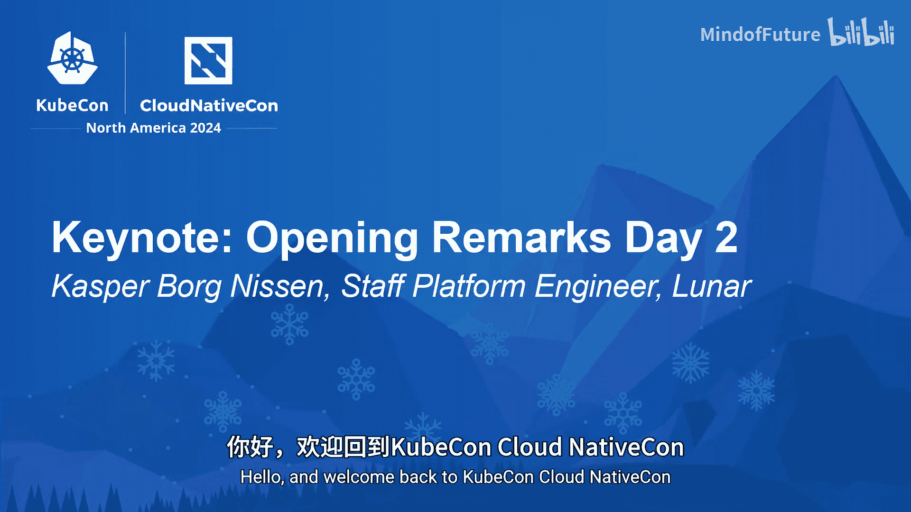
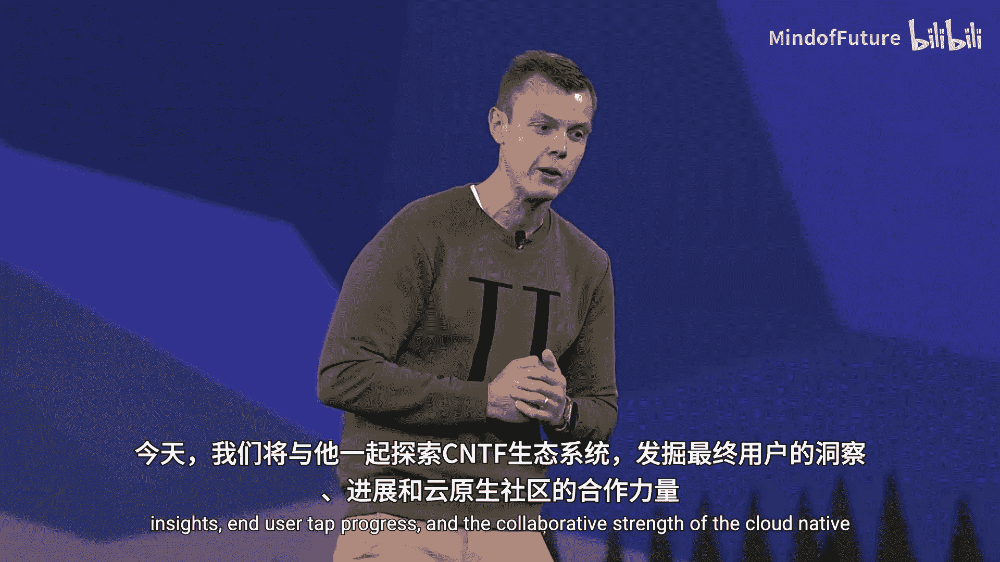
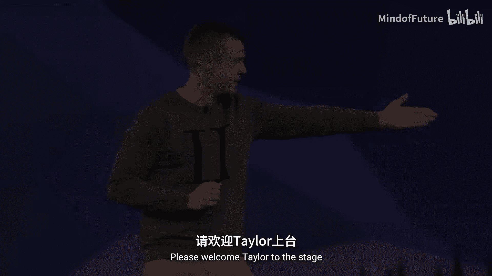

# 019：第二天开场致辞

在本节中，我们将回顾KubeCon+云原生峰会第二天的开场环节，了解当天的核心议程与首位主讲嘉宾。

大家好，欢迎回到KubeCon+云原生峰会。

希望大家在昨晚的Kube Crawl和云原生派对上玩得开心。

想必各位已经迫不及待地想要开始我们下一系列精彩的主题演讲了。

那么，今天我们将再次启程。

在此，我很荣幸地向大家介绍今天的第一位主题演讲嘉宾。

他是生态系统负责人兼首席基金官Taylor Doolittle。

今天，他将带领我们一同探索CNCF生态系统，揭示最终用户的洞察、最终用户的进展以及云原生社区的协作力量。

让我们热烈欢迎Taylor上台。

在本节中，我们共同开启了KubeCon+云原生峰会第二天的议程，并介绍了首位主讲嘉宾Taylor Doolittle及其即将分享的关于CNCF生态系统的深度洞察。接下来的环节将深入探讨社区协作与用户实践。