# 021：从版本1到5的经验教训 🎓

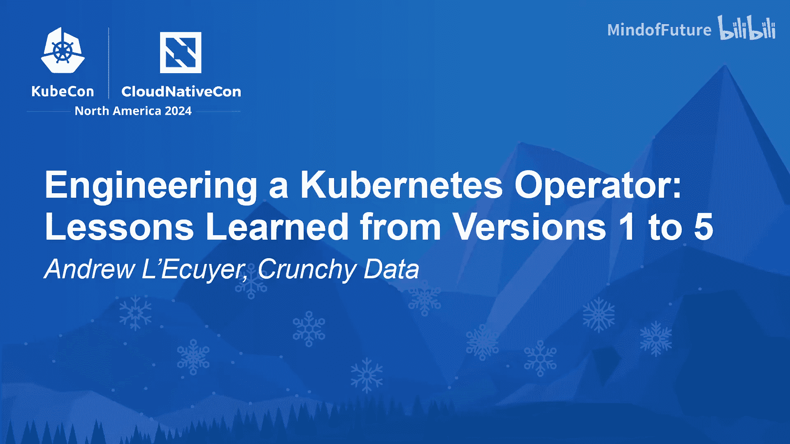

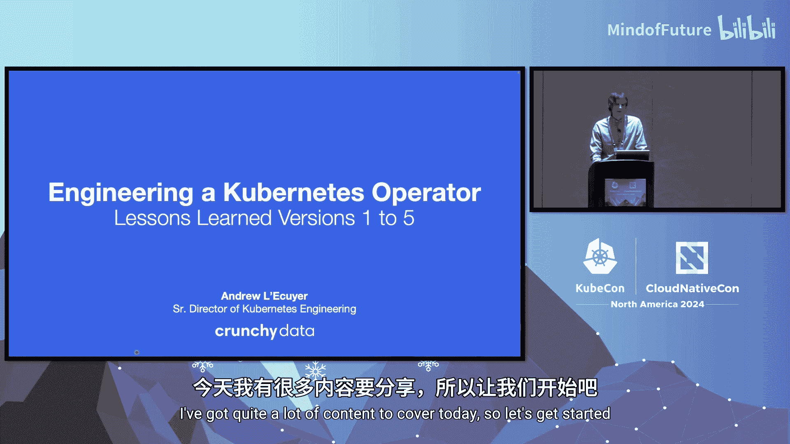

在本教程中，我们将学习如何构建一个健壮的 Kubernetes Operator，特别是针对像 PostgreSQL 这样的有状态应用。我们将通过 Crunchy Data 在开发其 PostgreSQL Operator（PGO）五个版本过程中积累的经验，重点探讨高可用性、升级和灾难恢复这三个核心架构领域。我们将了解如何利用社区成熟方案、平衡自动化与风险，并构建一个既能应对故障又能预防故障的系统。

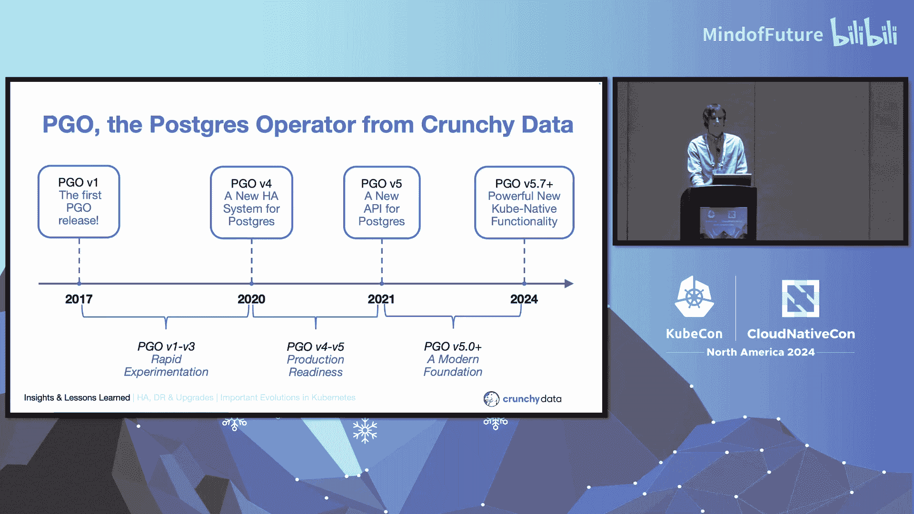

---

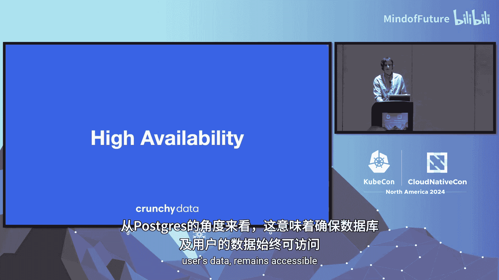

## 高可用性：架构演进与最佳实践 🛡️

上一节我们概述了本课程的核心内容，本节中我们来看看如何为 Operator 及其管理的应用设计高可用性。

任何应用在运行过程中都可能遇到故障或崩溃。通过使应用具备高可用性，我们确保其持续可用，这意味着在问题发生时能快速恢复，甚至更好的是从一开始就预防问题的发生。对于 PostgreSQL 而言，这意味着确保数据库以及用户的数据始终可访问。

在 Operator 的早期阶段，我们意识到需要考虑两种类型的高可用性：Operator 自身的可用性和数据库的可用性。我们确定数据库的可用性是最高优先级。

### 早期架构的挑战

在 PGO 的 1 到 3 版本中，我们在 Operator 内部构建了一个自定义的 PostgreSQL 高可用解决方案。Operator 负责通过利用 Kubernetes 的能力（如就绪探针）来确保数据库可用，例如在主数据库崩溃时提升一个副本。

然而，这个架构存在明显问题：
1.  **单点故障**：只有一个 PGO 实例，如果它宕机，我们将失去所有 PostgreSQL 数据库的高可用能力。
2.  **事件处理瓶颈**：所有 Operator 都使用队列机制来捕获和响应 Kubernetes 集群中的事件。如果多个数据库同时崩溃，它们将不得不排队等待处理，这对于需要快速恢复的数据库来说是灾难性的。

随着用户开始大规模部署 PostgreSQL，这些裂缝逐渐扩大。我们认识到需要一个新解决方案来支持大规模部署。

### 向成熟社区方案演进

在 PGO V4 中，我们转向了 PostgreSQL 生态系统中一个久经考验的解决方案：**Patroni**。这提供了所需的去中心化架构，以缓解我们原始架构在规模操作时出现的问题。

与此同时，Operator 生态系统的发展使得 Operator 自身的高可用变得简单。通过切换到 **controller-runtime** 项目（一套用于构建 Kubernetes Operator 的库），添加高可用性减少为一项配置更改。

**核心经验**：PostgreSQL 和 Kubernetes 生态系统的发展，特别是 Patroni 和 controller-runtime 项目，是实现 Operator 和数据库所需高可用解决方案的关键。

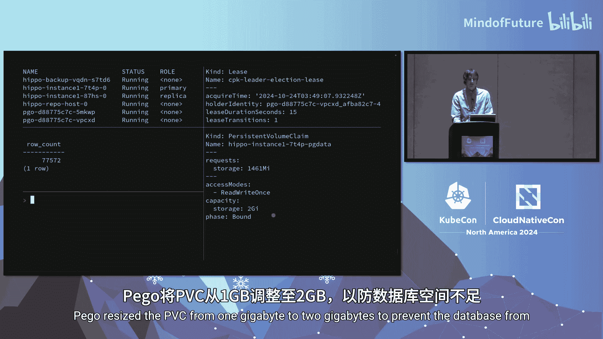

### 预防优于应对

我们学到的另一个重要经验是强调预防而非仅仅准备。虽然我们希望对故障有所准备，但更好的是一开始就防止故障发生。

通过利用 **Kubernetes 卷扩展能力**，我们可以防止管理数据库时最常见的错误之一：存储空间耗尽。这是一个在故障发生前就将其预防的绝佳例子。

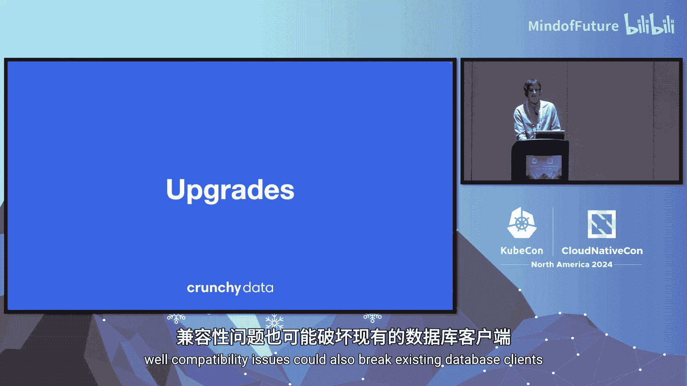

**公式/代码示例**：虽然 Kubernetes 自动扩展 PVC 的细节由存储驱动，但概念上，Operator 可以监视 PVC 的使用情况，并在达到阈值时调用 Kubernetes API 进行扩展。
```yaml
# 概念性示例：Operator 检测到 PVC 使用率 > 80% 后执行的补丁操作
kubectl patch pvc my-postgres-pvc -p '{"spec": {"resources": {"requests": {"storage": "2Gi"}}}}'
```

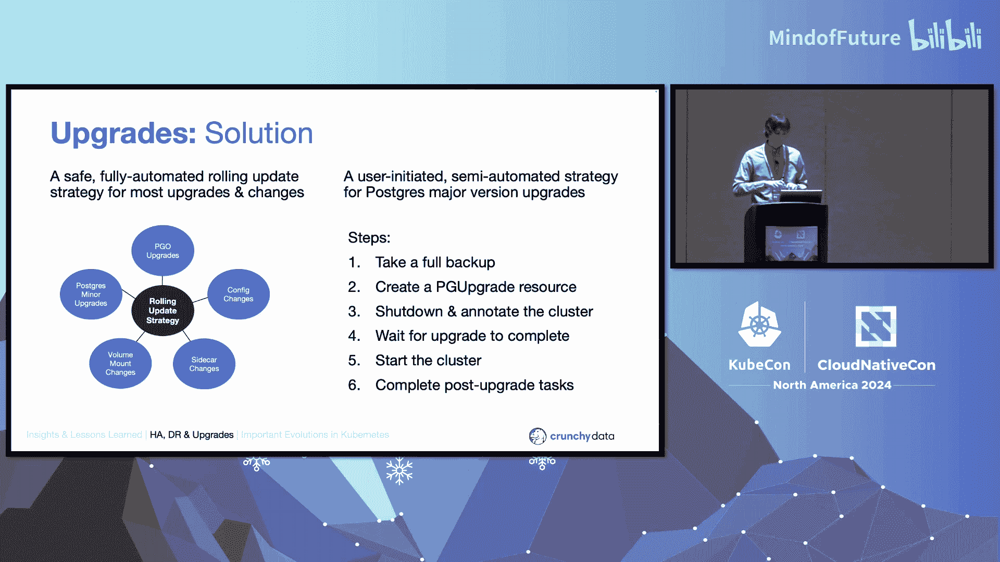

---

## 升级策略：自动化与风险控制 🔄

上一节我们探讨了如何确保系统持续可用，本节中我们将看看如何安全地对系统进行升级，包括 PostgreSQL 和 Operator 本身。

升级包括 PostgreSQL 的主版本和次版本升级，以及 Operator 的主次版本升级。在 PGO 1 到 3 版本中，Operator 并未直接处理升级，这是一个手动过程。在 Patroni 处理了数据库高可用性后，我们腾出了开发时间来专注于新功能。

### 自动化滚动更新

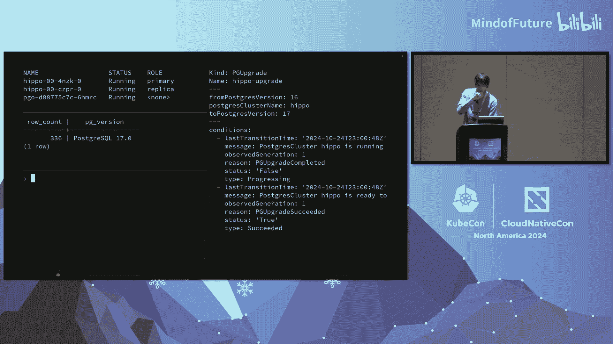

我们实现了一个完全自动化的滚动更新策略，可以推出 PostgreSQL 次版本升级。对于 PGO 自身，通过避免在我们的 API 中引入破坏性变更，PGO 升级也可以通过相同的策略推出。

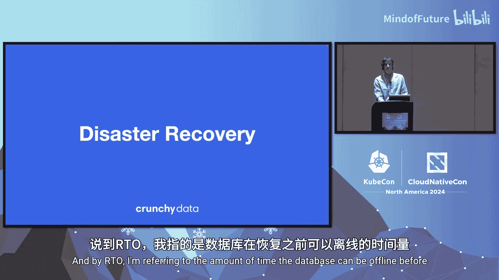

然而，PostgreSQL 的主版本升级则不同。使用无效的升级配置或镜像可能导致严重的停机时间，而兼容性问题也可能破坏现有的数据库客户端。

### 平衡自动化与用户控制

在审视各类升级时，我们必须确定在哪些场景下适合完全自动化升级，在哪些场景下适合让 Operator 引导用户完成升级。

以下是 PGO 采用的两种策略：

1.  **完全自动化的滚动更新流程**：处理用户日常需要应用的大部分变更。
    *   Operator 自身升级。
    *   PostgreSQL 重新配置和更新到新的次版本。
    *   修改 PostgreSQL 数据库的 Pod 规约（例如，添加自定义边车）。

2.  **PostgreSQL 主版本升级流程**：使用 API 中的 **状态（Status）** 和 **条件（Conditions）** 来引导用户完成升级步骤，并提供足够的透明度，使用户能够自行自动化该过程。

**核心经验**：
*   **管理升级自动化的风险**：仅在风险可控时进行自动化。
*   **赋能用户**：当我们无法完全自动化时，使用状态和条件来赋能用户，让他们能够编排和自动化升级过程。

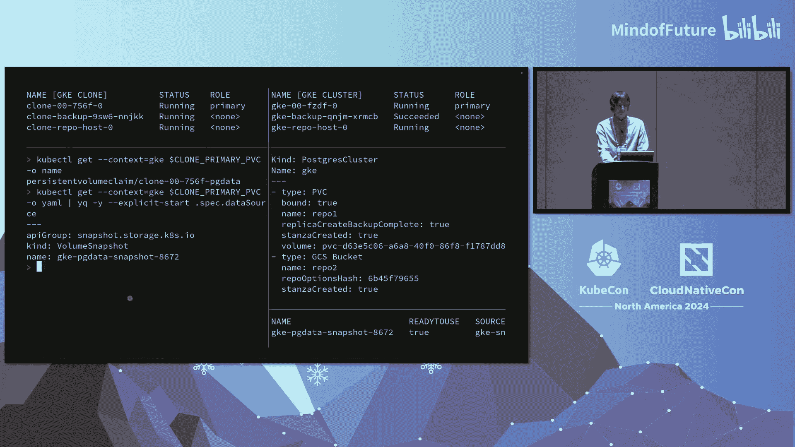

**代码示例**：主版本升级 API 的状态字段可能如下所示：
```yaml
status:
  conditions:
  - type: UpgradePending
    status: "True"
    reason: ClusterNotShutDown
    message: "PostgreSQL cluster must be shut down to proceed."
  - type: Progressing
    status: "False"
    message: "Upgrade has not started."
```


---

## 灾难恢复：聚焦恢复与数据流动性 🚀

上一节我们讨论了如何平稳升级系统，本节我们将探讨如何在灾难发生时恢复系统，并确保数据的可移动性。

任何系统都有可能在某些时候经历灾难。当灾难发生时，您需要有一个到位的流程来快速恢复。这就是灾难恢复的全部意义：建立并演练流程和技术解决方案，以确保您的关键应用持续运行。

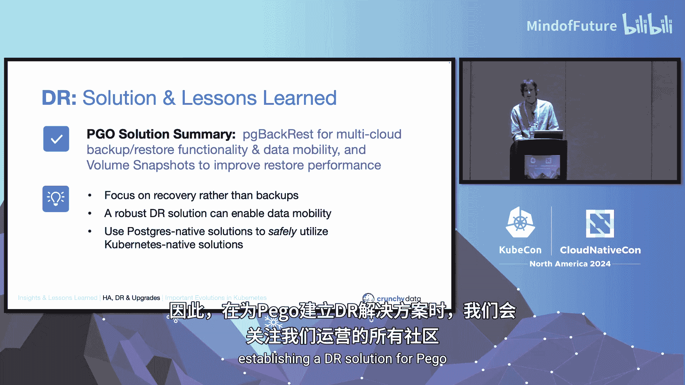


对于 PostgreSQL，这意味着确保用户和应用程序能够根据恢复时间目标（RTO）访问关键数据。RTO 指的是数据库在恢复之前可以离线的时间量。

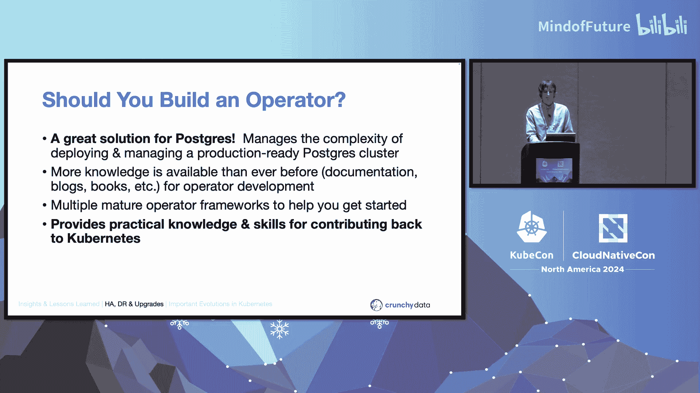

### 超越备份：聚焦恢复场景

Crunchy Data 在灾难恢复方面的经验告诉我们，一个有效的灾难恢复策略不仅仅是创建备份。真正重要的是恢复场景。换句话说，如果备份不能用于满足我们的恢复目标，那么它们的价值就很小。

### 架构选择：融合生态优势

我们面临一个重要决策：是使用 PostgreSQL 生态系统中久经考验的灾难恢复解决方案来满足我们的恢复需求，还是围绕 Kubernetes 原生能力（例如通过 Kubernetes API 创建卷快照）来构建解决方案。

我们当前的灾难恢复架构核心是 PostgreSQL 生态系统中的一个灾难恢复解决方案：**PGBackRest**。我们可以为其附加不同类型的存储来管理备份，无论是 Kubernetes 集群内的本地持久卷，还是各种类型的云存储。

**PGBackRest 与 Kubernetes 卷快照的结合**使我们能够：
1.  使用多种存储类型进行备份。
2.  轻松访问数据以创建备用集群和克隆。
3.  利用 Kubernetes 卷快照进一步减少创建克隆所需的时间。

**核心经验**：
1.  **聚焦恢复而非备份**：备份很重要，但只有当它们支持您的恢复目标时才真正有意义。
2.  **灾难恢复实现数据流动性**：通过在您需要的地方（包括跨云和 Kubernetes 集群边界）进行备份，不仅可以增加备份的冗余度，还可以在需要的地方配置所需的数据库。
3.  **利用 PostgreSQL 原生方案安全使用 Kubernetes 原生方案**：PGBackRest 和 Kubernetes 卷快照的结合使我们能够创建无损坏和其他问题的快照。

---

## 总结与最终思考 📝

在本节课中，我们一起学习了构建 Kubernetes Operator，特别是在高可用性、升级和灾难恢复方面的关键经验。

让我们回顾并总结在 PGO 中为每个领域实施的当前解决方案以及学到的宝贵经验：

**高可用性**
*   **解决方案**：使用 Patroni 实现 PostgreSQL 高可用；使用 controller-runtime 实现 Operator 高可用；使用 Kubernetes 卷扩展自动增长磁盘。
*   **经验教训**：
    1.  去中心化架构支持规模化。
    2.  克服“非我发明”综合征，拥抱社区现有方案。
    3.  预防优于应对。

**升级**
*   **解决方案**：使用安全的滚动更新策略处理配置变更、PostgreSQL 次版本升级和 PGO 升级；为 PostgreSQL 主版本升级创建新 API，使用状态和条件引导用户。
*   **经验教训**：
    1.  管理升级自动化风险，仅在风险可缓解时自动化。
    2.  当无法自动化时，使用状态和条件赋能用户进行编排和自动化。

**灾难恢复**
*   **解决方案**：使用 PGBackRest 实现多云备份、恢复功能和数据流动性；使用 Kubernetes 卷快照支持恢复时间目标。
*   **经验教训**：
    1.  聚焦恢复而非备份。
    2.  强大的灾难恢复方案能够实现数据流动性。
    3.  使用 PostgreSQL 原生方案来安全地利用 Kubernetes 原生方案。

### 关于 Operator 开发的思考

如果您正在考虑为您的应用创建 Operator，虽然没有简单的答案，但对于 PostgreSQL 来说，Operator 是一个绝佳的选择。如果您正在以我们今天讨论的某些方式努力管理应用的复杂性，或者这种复杂性正在给您的用户带来挫败感，那么 Operator 值得考虑。


由于 Operator 由与核心 Kubernetes API 相同的构建块组成，它们也提供了可应用于 Kubernetes 本身开发的实践经验和知识。自 2017 年以来，Kubernetes 已经发展成为一个适用于所有类型应用（包括有状态应用）的成熟稳定平台。现在正是构建 Operator 的最佳时机。