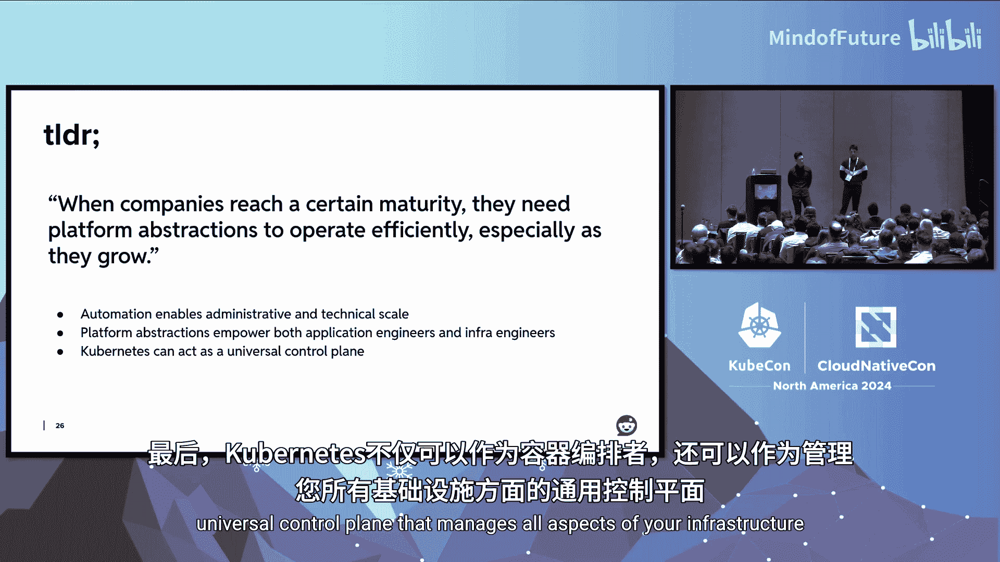

# 022：通过原则性平台抽象演进Reddit的基础设施

在本节课中，我们将回顾Reddit基础设施在过去几年中的演进历程，重点探讨如何通过基于Kubernetes控制平面的原则性平台抽象和自动化来应对挑战。我们将从2022年的状态出发，介绍构建平台所遵循的核心原则、具体实践、取得的成果以及未来的方向。

## 2022年的Reddit基础设施状态

在深入探讨解决方案之前，我们首先需要了解问题的起点。2022年，Reddit在组织内部和产品外部都经历了显著增长，这给基础设施带来了巨大压力。

我们当时正朝着IPO迈进，并开始将服务范围扩展到多区域，最终目标是实现全球扩张。此外，公司还在广告和机器学习技术栈上进行了大量投资。到2022年底，我们拥有约20个Kubernetes集群，这些集群虽然位于同一云服务商的同一区域，但各自为政，缺乏统一管理。应用工程师与基础设施工程师的比例约为7:1，大部分运维工作依赖手动和“白手套”式服务，效率低下。

## 遗留基础设施的痛点

为了理解旧有基础设施的弊端，让我们通过两个最基础的例子来审视当时工程师面临的挑战。

### 应用工程师的视角：创建命名空间

对于Reddit的每一位应用工程师来说，启动新应用的第一步通常是创建一个Kubernetes命名空间。然而，这个过程异常繁琐。

以下是当时的典型流程：
*   **选择工具**：工程师需要在Helm Chart或Kustomize文件之间做出选择，但这些工具对于非Kubernetes专家的应用工程师来说既复杂又陌生。
*   **复制粘贴**：提交的拉取请求（PR）内容大多是各处复制粘贴而来，或者是从旧配置中“抓取”的。
*   **漫长评审**：PR会进入评审队列，由于服务等级协议（SLA）的限制，这可能需要长达24小时。由于评审多是手动的，错误时常被放过，导致部署失败。
*   **自行调试**：所有这些复杂性都没有对用户抽象。如果持续集成（CI）失败，应用工程师可能需要基础设施工程师协助调试，整个过程又得重来一遍。

因此，仅仅创建一个命名空间就可能因为时区差异和流程问题耗费近一周时间。这导致了跨集群命名空间管理的巨大不一致性，我们无法理清命名空间的来源或是否仍在使用。出于安全考虑，我们不得不禁用所有对命名空间的自动化删除操作，这又导致了大量废弃资源残留，增加了成本和事故排查的难度。

### 基础设施工程师的视角：管理Kubernetes集群

上一节我们看到了应用工程师的困境，对于基础设施工程师而言，世界同样痛苦。

创建和管理一个符合Reddit标准的Kubernetes集群是一个超过100个步骤的“庞然大物”，即使是经验最丰富的工程师也需要超过30个主动小时（通常相当于一周的墙上时间）才能完成。升级集群是通过在现有控制平面节点上手动执行`kubeadm`命令完成的，这是一种危险的做法。而注销集群则根本没有标准流程，因为随着时间的推移，各个集群已经变得“特化”和“定制化”。

为什么集群会变得如此特化？一个主要原因是当时我们没有好的方法来管理整个集群舰队的配置。我们陷入的反模式是：**为每个集群复制粘贴一次配置清单**。你可以想象，这些配置会随着时间推移而逐渐漂移。有时漂移如此严重，以至于我们称这些基础设施为“闹鬼的”——意思是任何工程师都很难有信心推断集群应该如何或实际如何运行，这使得所有生命周期操作都变得极其危险。2022年3月14日的一次重大停机正是由此原因导致。

## 核心原则：什么是原则性平台抽象？

面对上述循环，我们如何破局？答案是转向**平台抽象**的概念。

*   **抽象**：指隐藏底层复杂性，将用户的关注点与底层实现的关注点分离开来。一个好的抽象标志是，它使用户无需了解底层领域知识就能理解和操作。
*   **平台**：指一个由可组合工具构成的生态系统，使用户能够在其上构建。平台的用户体验是首要关注点，它应该是安全、可靠、可扩展且没有“陷阱”的。
*   **原则性**：在这里意味着“有主见的”。我们为工具设定了特定的目标用户画像，并使用平台作者认为的最佳实践来实现。同时，“原则性”也意味着标准化，即每个问题都有且仅有一种解决方案。

我们使用**由Kubernetes控制过程支持的声明式API**来实现这些平台抽象。接口被定义为自定义资源（CRD），我们遵循标准的Kubernetes资源模型约定：期望状态在`spec`中定义，观测状态通过`status`报告。这些自定义资源会驱动Kubernetes控制器，通过将实际状态向期望状态转变来实现其API。

## 为什么选择Kubernetes控制器而非传统IaC？

你可能会问，为什么选择Kubernetes控制器，而不是传统的基础设施即代码（IaC）？这两种方法各有优劣。

传统IaC（如Terraform）的优势在于前期工程成本低，工程师编写声明式配置并选择何时应用变更，心智模型简单，且给予工程师高度的控制权。

然而，它也存在显著短板：
*   **无法建模复杂业务逻辑**：例如，难以建模“从CA机构申请TLS证书 -> 上传到AWS证书管理器 -> 附加到负载均衡器”这样的工作流。
*   **非程序化消费**：通常为人工操作设计，难以通过代码填补业务逻辑缺口。
*   **非动态行为**：无法自动续期即将过期的证书，需要手动或定时触发。
*   **“发射后不管”的驱动模式**：容易导致状态漂移，增加系统处于错误状态的风险。

我们选择Kubernetes控制器，是因为我们追求：
*   **自愈能力**：确保实际状态最终与期望状态一致。
*   **强大功能**：平台API配置表面简单，但功能强大，这要求实现者能编写任意逻辑，包括完整的生命周期管理。
*   **可编程性**：基础API可以被其他平台复用和消费。

当然，这种选择代价高昂：需要构建和维护生产级自动化代码，心智模型更复杂（持续协调过程），并且失控的自动化可能比一次糟糕的IaC应用造成更大的破坏。但总体而言，我们认为这个权衡是值得的。

## 新架构：多集群管理与统一控制平面

之前提到，跨舰队管理配置是工程师们的主要负担和复杂性的来源。如今，我们通过一种为工程师提供“单一管理面板”控制的多集群API方法解决了这个问题。

我们的舰队中有两种类型的集群：
1.  **编排集群**：作为“大脑”，决定所有其他集群的行为，并为它们生成配置。
2.  **工作负载集群**：是可替换的“牲口”，托管我们的应用程序，为公司提供大部分计算能力。它们从编排集群拉取配置。

基于此架构，我们可以构建多集群API。每个工作负载集群都由一个自定义资源支持，并被打上标签（如环境、地域、云厂商）。然后，我们使用**联邦CRD**，通过Kubernetes标签选择器来分组集群。多集群API（如`MultiClusterNamespace`）则绑定到联邦对象，以此来表达“将我的配置应用到这组集群”。

这种方法最强大的特性之一是**集群目标是动态的**。例如，如果我启动一个带有`phase=test`标签的新集群，相应的命名空间会自动在其中创建。这为工程师节省了大量时间，意味着我们可以快速部署具有明确定义属性的新集群，所有适用的配置都会自动流入，无需额外手动工作。

当然，任何集中式架构都有风险，编排集群可能成为单点故障。目前，我们通过确保**系统静态失效**来管理此风险：即使编排集群与工作负载集群之间出现网络分区，或者编排集群完全宕机，工作负载集群只是无法接收配置变更，但由于它们已经拉取了所有指令的本地副本，它们能够持续自我修复已有的状态。

## 实践案例一：全新的命名空间管理

现在，让我们回到最初的两个案例，看看新世界是怎样的。首先，我们重新审视Kubernetes命名空间这个核心需求。

现在，用户无需在Helm或Kustomize之间切换，只需创建一个名为`RedditNamespace`的自定义资源，并将其指向一组集群（联邦）。一旦应用到编排集群，每个被该联邦选中的工作负载集群都会拉取本地副本并协调它，从而创建命名空间以及所需的任意资源（如RBAC权限）。我们还可以利用这个机会与Slack、PagerDuty等第三方软件或内部部署系统集成，以创建自动告警或正确的权限。

这种设计的**简洁性和有主见性**体现在：用户无需提前知道他们需要哪些具体的Kubernetes资源。我们只提供两个选项：`operator`（读写权限）或`reader`（只读权限）。这不仅向用户抽象了复杂性，也帮助基础设施团队缩小权限范围，确保安全性和合规性。

## 实践案例二：一键式集群供应

同样地，对于Kubernetes集群的管理也发生了翻天覆地的变化。

现在，我们只需提交几个包含`RedditCluster` CR的拉取请求，就能创建Kubernetes集群。我们大量依赖Cluster API来启动控制平面。但更重要的是，CRD模型给了我们**简化接口**的机会。Cluster API功能强大，但配置项繁多。我们的简化设计强制只暴露有限的可配置项，防止集群像过去那样过度偏离并变得“闹鬼”。

此外，一旦控制平面启动，我们的自动化流程会将这个“原始”的Kubernetes集群转变为一个“Reddit化”的集群——即安装了所有托管Reddit应用所需的先决条件和依赖项。这种“一键式”供应在以前以Terraform为主的IaC方法中是极难实现的，因为它有严格的顺序要求。简化也降低了基础设施工程师在创建集群时的认知负荷。

## 赋能团队：Achilles SDK

上述两个例子是计算团队构建的初始平台抽象。但为了全面拥抱自动化未来，我们不仅希望自己构建平台抽象，更希望赋能整个基础设施组织都这样做。

于是我们构建了**Achilles SDK**。该SDK构建在controller-runtime之上，旨在让基础设施工程师能够专注于业务逻辑，而无需成为底层Kubernetes专家。

其核心特性是将整个协调循环表示为一个**有限状态机（FSM）**。在典型的controller-runtime中，你需要在一个庞大的`Reconcile`函数中编写所有逻辑，随着控制器变复杂，这个函数会变得极其复杂和庞大。我们发现，为协调逻辑定义有限的状态及其转换，使得推理、调试和扩展都变得更容易，这对于生产化至关重要。

SDK的名字“Achilles”源于希腊神话，是为了提醒我们，所构建的自动化极其强大，但若不谨慎，也可能极具破坏性，我们不想让自动化成为“阿喀琉斯之踵”。

SDK简化了与API服务器的交互接口，自动处理子资源的所有权和清理，并自动跟踪所有子资源及每个FSM状态的状态条件，这在事故排查时提供了极大的可见性。我们已经将Achilles SDK开源，希望与更广泛的生态系统分享。

## 成果与现状

我们从2022年的困境出发，如今已借助原则性平台抽象迈向了一个更好的世界。

对于应用工程师，用户体验显著提升。以命名空间为例，底层领域复杂性被隐藏，使得整个平台更具自助服务性和可扩展性。对于基础设施工程师，这降低了认知复杂性，减少了日常琐事，也因更少的人工接触点而使系统更安全。有主见的平台抽象也强制了集群和应用栈的一致性，使其更易于推理。

截至目前，开发者已能自助管理Kubernetes命名空间，在35个以上的集群中拥有超过1000个命名空间，且数量每季度都在增长。新集群的启动时间缩短到2小时以内，升级时间约1小时。我们能够在保持约10:1（应用工程师:基础设施工程师）比例的同时，应对全球扩张等更具挑战性的问题，并将更多工程时间用于主动解决问题，而非被动救火。

借助Achilles SDK，一个从未编写过控制器的人将其想法转化为最小可行产品（MVP）的时间少于两周。我们今年初仅有4个由计算团队编写的生产级Kubernetes控制器，如今已增加到12个且仍在增长，它们管理着包括集群、Ingress、Redis、Cassandra、Vault等在内的核心基础设施组件。

## 何时以及如何实施自动化？

在整个演示中，我们论证了自动化的优点，但必须明确，自动化应有充分的理由。在以下情况下，自动化可能没有意义：
*   **无模式可循**：首先要问，用例或解决方案是否已经或能够收敛？我们使用80/20启发法：如果80%的用例已统一，就很可能是自动化的目标；剩余的20%可以通过白手套流程或应急接口处理。
*   **投资回报率（ROI）不足**：考虑到构建自动化的高昂成本，主要的决策点是ROI。计算给定流程的预期成本（工程小时数 × 使用频率），然后与自动化的预估投资进行比较，判断长期是否能节省团队时间。

## 总结与核心要点

本节课我们一起学习了Reddit如何通过原则性平台抽象演进其基础设施。我们来回顾一下核心要点：

1.  **自动化带来运营效率**：它使基础设施团队能够在公司高速增长和大规模运营时期提供有效支持。
2.  **平台抽象实现关注点分离**：允许应用工程师和基础设施工程师各自专注于最擅长的工作。
3.  **Kubernetes作为通用控制平面**：Kubernetes不仅可以作为容器编排器，还可以作为管理基础设施所有方面的通用控制平面。

当公司发展到一定成熟度时，它们需要平台抽象来高效运营，尤其是在增长时期。希望Reddit的经验能为你提供有价值的见解。