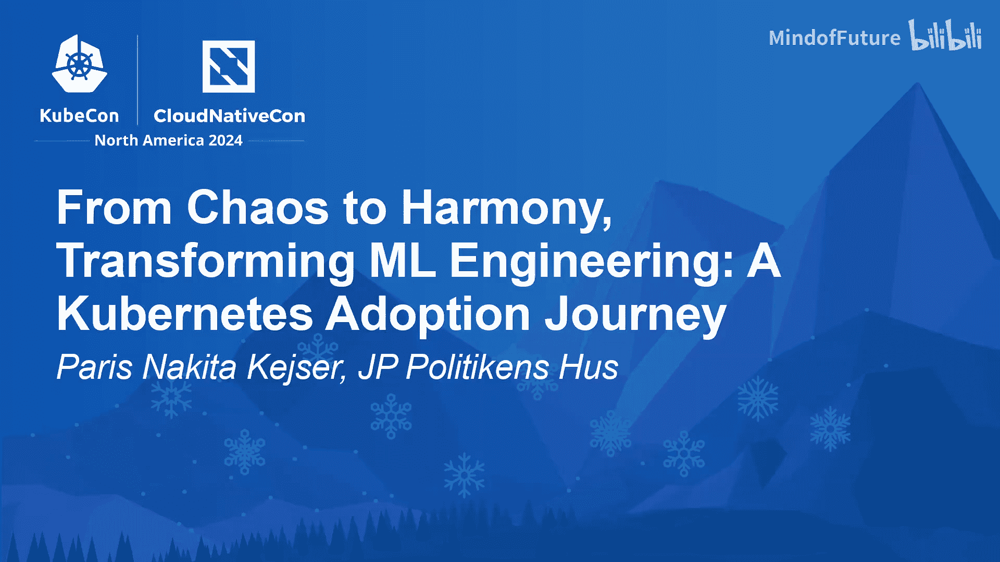
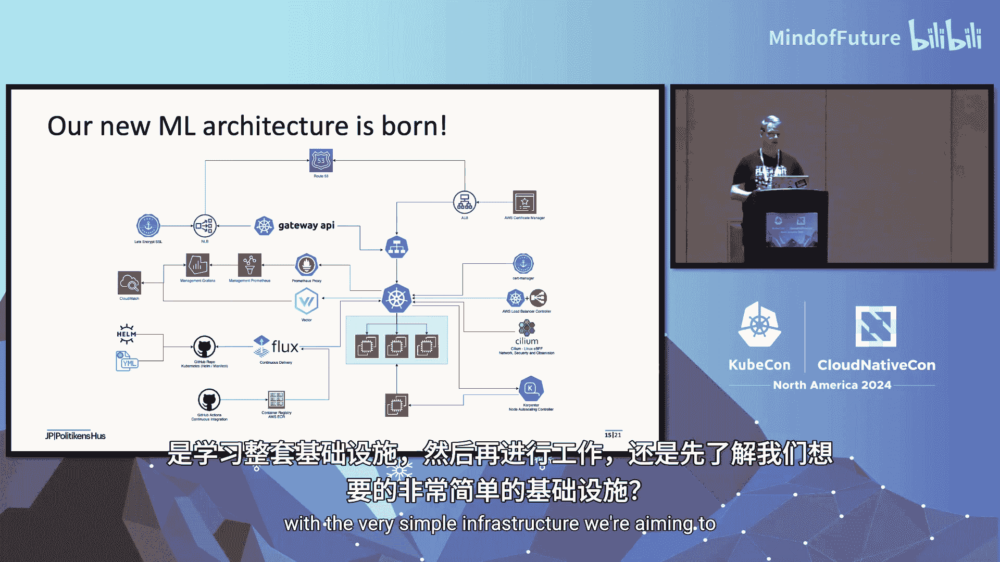
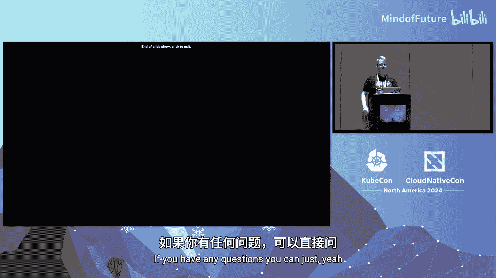

# 023：从混沌到和谐 🚀

## 概述

在本教程中，我们将跟随丹麦媒体集团JP/Politikens Hus的AI团队，学习他们如何将机器学习工程从最初的混乱状态，通过采用Kubernetes，转变为和谐、高效的工作流程。我们将重点探讨其平台演进的动机、面临的挑战、关键决策以及最终的技术栈实现。

---

## 章节 1：项目起源与初始目标 🎯

感谢各位的到来。今天我将分享我们团队以及JP/Politikens Hus媒体集团如何为AI团队引入Kubernetes的故事。

这一切始于我所在的部门，名为“Ekstra Bladet”。它是丹麦最大的新闻媒体之一，每月拥有超过150万独立读者。

在2021年2月，我们意识到需要更加专注于机器学习。同时，我们也需要构建一个平台，以便向读者提供更相关的内容。为此，我们计划构建一个定制化的推荐系统。

为了实现这一目标，我们组建了一个由4名机器学习专家组成的团队，他们将成为该平台的主要用户。此外，我们还有4名基础设施工程师，负责根据机器学习专家的需求来构建这个平台。

我们参与了丹麦的一个研究项目，因此需要这个平台能够支持不同机器学习模型的快速原型设计。该平台应能帮助我们快速测试、训练和部署模型。

由于团队规模较小，我们在项目开始前没有进行大量的前期研究。我们必须利用已有的内部知识，并以最佳方式运用这些知识。

---

## 章节 2：初始平台的设计原则与挑战 ⚙️

上一节我们介绍了项目的起源，本节中我们来看看初始平台的设计原则和随之而来的挑战。

确保平台简单易用至关重要，这样机器学习专家才能轻松地训练模型。同时，拥有一种简单的方式来自动化部署模型服务，并用新版本替换当前运行版本，也同样重要。

机器学习专家应能创建模型原型，并能够使用不同的框架，如PyTorch和TensorFlow。保持机器学习专家原有的工作流程不变非常重要，因为我们不希望被锁定在某个特定框架上。

机器学习专家应能自行设置模型训练，并选择他们希望的部署方式。确保不因基础设施团队而受阻也很关键。

由于当时我们没有测试环境，因此机器学习专家能够快速发现模型训练失败时的任何问题，这一点非常重要。我们没有几个月的时间进行前期研究，所以我们希望对机器学习平台拥有完全的控制权，并且希望速度非常快。

我们还希望节省处理潜在错误和安全风险的时间，因此决定使用托管资源。这样一来，我们的基础设施工程师可以避免“午夜惊魂”——在半睡半醒的状态下调试生产环境可不是件有趣的事。

---

## 章节 3：混沌的显现与局限性 🌀

初始平台的设计带来了一定的自由度，但混沌也随之而来。起初，我们脑海中有一个清晰的版本构想。但随着时间的推移，基础设施变得越来越复杂，越来越难以管理。

对于新团队成员来说，理解平台运行机制和使用方法变得更具挑战性。本应非常简单快速的变更部署，变成了漫长而复杂的流程，更新变得非常困难。

我们最初珍视的自由度开始逐渐消失。由于团队中只有两名基础设施工程师，我们需要更多地依赖托管资源，并接受由此带来的权衡。

我们的机器学习专家在如何训练和部署模型方面面临着严格的限制。这导致即使是小问题也可能变成需要巨大努力才能修复的挑战。

测试与模型无关的新软件也成为一个挑战。例如，如果模型训练需要某种特定软件，我们无法提供这种灵活性。

为了改变我们的机器学习平台，我们需要理解云服务商的资源、基础设施即代码以及资源之间的连接方式。在进行任何更改以避免破坏现有功能之前，必须理解平台设计和真实流程。

使用云服务商时，在选择计算资源时总会有额外开销，因为你无法精确选择所需的处理器和内存量，必须接受最符合需求的实例类型。这导致了未使用资源的浪费，从而带来更高的云成本和更多的碳排放。

---

## 章节 4：经验总结与新平台的需求 📝

我们从平台的第一版中学到了很多。机器学习专家注意到了这个平台的几个有价值之处。即使平台并不完美，它也能很好地工作。

限制机器学习专家对基础设施的访问，并设定清晰的使用平台指南，带来了巨大的帮助。它加快了工作流程，使他们能够专注于开发，而无需学习整个基础设施。

对机器学习平台拥有完全控制权是一个巨大的优势。它使我们能够快速识别和管理潜在错误，并在需要时获得基础设施团队的故障排除协助。

我们的机器学习专家欣赏所有组件（包括不同框架和编码标准）的平滑集成。这使我们能够快速行动，更快地部署模型，实现团队原型设计和更好的工作方式。

但我们需要重新思考构建机器学习平台的方式，专注于我们最需要的部分，以及在哪里可以简化流程以更好地支持机器学习专家和工程师。

我们选择基于现有平台的经验构建一个新平台，不是因为现有平台无法工作，而是因为它无法完全满足我们获得的新需求。

我们仍然需要专注于拥有一个稳定的平台，使其不需要基础设施团队投入过多关注。任何延迟都可能拖慢机器学习工作流程，这是我们无法接受的。

我们希望专注于现有机器学习平台的优势，并解决我们面临的挑战，以满足新的功能需求。我们的团队正在壮大，新的需求不断出现，我们希望拥有一个更用户友好的平台，不需要博士学位也能完成日常工作。

专注于前三点，很明显，我们的团队需要比现有平台更高的灵活性，例如更快的部署周期和更简单的部署流程。

---

## 章节 5：第二次尝试与未解决的问题 🔄

那么，我们学到了什么，并决定再试一次呢？我们解决了一些挑战，但没有解决主要问题，例如测试工具、改进软件测试、更快的部署。在 onboarding 新成员时，我们仍然遇到一些问题。

即使采用了新方法，我们仍然专注于通过继续使用托管资源来拥有一个稳定的平台。我们没有获得想要的完全灵活性，但这使得机器学习工程师和专家更容易进行日常工作。

我们未能通过让他们选择自己的工具和测试新软件来解决问题。因为我们从现有版本中采用了配置方法，所以这里没有太多改变。我们使用了 `helm` 和通用的文件配置，这要求每个开发人员都需要阅读文档（而这些文档基本上不存在）。这意味着 YAML 文件中的一个错误语法很容易导致问题。

有一天，我们得知我们将成为整个公司的完整AI部门，服务于丹麦JP/Politikens Hus媒体集团内不同公司的约1700名员工。从那天起，我们明白必须重新思考整体战略。之前在Ekstra Bladet，我们支持大约220名员工。现在我们团队增长到15人，并有责任支持1700名员工。

我们迅速理解了新形势的价值，进行了讨论，概述了当前状况，制定了后续步骤，并为团队设定了支持新现实的方向。

---

## 章节 6：关键决策：为何选择Kubernetes？🤔

是时候开始升级并重新思考一切了。我们需要问自己：我们应该再次尝试从头构建，还是应该使用市场上现有的机器学习产品？如果我们选择Kubernetes，会得到什么好处？

尝试构建和维护一个全新的机器学习平台将消耗大量额外资源，而且我们不确定是否能获得机器学习专家真正想要的自由和灵活性。因此，我们决定不再尝试这条路。

市场上有许多工具可以帮助机器学习专家。我们花了很多时间测试不同的产品，如MLflow和Metaflow。我们主要担心被供应商锁定。

为了赋予机器学习专家使用Kubernetes的自由，他们将能够访问所需的任何工具。这种方法建立了一定的信任，展示了我们如何相信他们的技能和决策，而不是强制执行严格的规则。

如果我们不得不选择一个现有的机器学习平台，我今天就不会在这里与大家分享这段旅程了。你可能会惊讶我们没有选择市场上现有的机器学习平台，原因如下。

我们比较了投入和收益，发现基于我们的测试，使用现有平台可能带来不同的挑战，而非我们期望的收益。

当我们选择现有平台时，遇到了问题：我们没有真正的控制权；收到了破坏工作流程的意外更新；机器学习专家感到沮丧；一些供应商似乎更热衷于销售企业许可证，而不是帮助社区版进行更新后的修复；由于整个过程缺乏灵活性和透明度，通常很难理解发生了什么；新员工如果不了解该应用程序，会发现很难学习如何工作，这给本已复杂的堆栈增加了更多不必要的复杂性，而这正是我们试图减少的。

我们选择Kubernetes并不是因为它更便宜，更多的是因为它提供了我们真正需要和缺失的东西。

---

## 章节 7：Kubernetes带来的变革与收益 🌟

选择Kubernetes后，我们获得了远超预期的收益，这已成为我们今天运营中非常重要的一部分。

我们获得了一种简单的方式来分配所需的资源（如处理器和内存），从而降低了成本和碳排放。我们现在可以简化开发流程，帮助他们更快地识别和修复问题。

Kubernetes允许机器学习专家尝试不同的软件和框架，而不会破坏任何正在运行的程序，从而允许他们快速测试新想法，而无需等待整个基础设施团队。

由于我们现在拥有标准化的流程和清晰的文档，我们的机器学习专家可以快速学习所需的环境。这使得入职过程非常快，帮助他们更快地开展项目，并降低了学习曲线。

通过简化流程和降低复杂性，我们的目标是让机器学习专家专注于开发和测试，而不是陷入基础设施的困境。

在我们的基础设施中使用GitOps实践，允许机器学习专家快速发布新软件，而无需担心破坏现有应用程序。轻松地从日志中部署和理解失败的原因或结果，不再令人沮丧。如果我们耗尽资源，Kubernetes会根据需要自动扩缩容。

以前，大量工作在本地完成，然后发送进行测试，接着可能等待数周才能获得其他员工的反馈，然后才能部署到生产环境。我们现在有一个流程，机器学习专家可以自行运行整个工作流程。

我们现在拥有更好的可观测性和指标，因此专家和基础设施工程师都能更快地获得反馈。借助Kubernetes，我们现在可以自由地实施零信任架构，并且感觉维护更安全的基础设施变得更加容易。

得益于GitHub PR，团队中的每个人都可以访问清单文件，这使得整个过程完全透明，符合预期。

---

## 章节 8：基于Kubernetes的技术栈详解 🛠️

是时候展示我们今天在Kubernetes上拥有的基础设施了。你可能想知道，机器学习专家是否需要在学习整个基础设施后才能开始工作？我们追求的简单基础设施是怎样的？

如图所示，我们高亮显示了机器学习专家基本上需要关注的区域，以及他们需要做什么来完成工作，仅此而已。他们需要理解Kubernetes清单的基础知识，并依赖现有的Helm Chart以供共享使用。这使他们能够随着时间的推移学习，为Kubernetes新手节省大量时间，并加快采用速度。橙色框外的所有方面都由基础设施团队管理，以确保运维工作不会干扰机器学习团队。

是时候展示我们在Kubernetes内部使用的技术栈了。与其仅仅展示简单的Logo，我将解释一下我们选择它们的原因。

以下是我们的技术栈组成：

**自动化**
我们使用Flux来完成整个GitOps流程，因此可以说Git仓库是单一事实来源。机器学习专家可以轻松地使用预制的Helm Chart完成任务，并且可以在需要时请求新的Chart。我们所有的基础设施都完全在GitHub上对团队可见。

**安全与网络**
为了提高节点和Pod之间的安全性并启用加密，我们使用了Cilium。我们也用它来管理网络策略。为了提供自动化的SSL证书，我们使用了cert-manager，它与Cilium和Gateway API良好集成。通过使用Gateway API，我们为更多选项打开了大门，包括能够与Cilium一起处理第4层网络流量，而不仅仅是默认的第7层。这通常使我们能更好地控制网络流量，并允许我们在不同Pod之间进行流量镜像（如果需要）。在AWS网络负载均衡器上，这比使用应用程序负载均衡器便宜得多，大约是3到4倍。我们使用AWS负载均衡器控制器与Cilium和Gateway API自动创建网络和应用程序负载均衡器。这是在AWS上托管时的常见方法。

**可观测性**
我们选择Prometheus来收集集群、应用程序和模型的指标。这使我们能够基于指标结果触发警报，例如训练或服务中出现错误时，或者当我们只是需要为集群增加更多资源时。我们使用Grafana作为仪表板工具，与Prometheus集成以显示重要数据，现在基础设施团队和机器学习团队都可以看到相同的指标。我们选择使用Datadog的Vector作为日志收集器，将日志从Kubernetes发送到AWS CloudWatch。市场上有其他工具可以做同样的事情，但我们发现它相对容易设置，并且允许在以后需要时更改日志端点。主要重点是确保节点更新和重启时，日志不会丢失。另一种方法是，我们需要所有机器学习专家都能读取日志，这样他们就不需要保留详细工具。为了观察网络安全性、网络和流量流，我们使用Hubble，它随Cilium一起提供。这使我们能够在启用后获得清晰的网络流量视图。

**可扩展性**
当节点资源耗尽时，我们使用Karpenter作为节点扩缩器。我们定义了一些规则，允许节点在AWS内部进行扩缩。我们通常使用Kubernetes Metrics API从系统收集指标，这些指标既可用于可观测性，也可用于扩缩目的。我们使用KEDA（Kubernetes Event-driven Autoscaling）进行Pod扩缩。我们用它来基于CPU、内存或自定义指标扩缩Pod。这表现得非常好。

---

## 章节 9：问答与总结 💎

今天是非常棒的一天。这消耗了我大量精力，所以我刚才发了条信息。我在这里相当紧张，感谢大家留在这里。如果你们有任何问题，可以随时提出。

**问：** 由于这个技术栈在AWS上，你们是否遇到过任何规模限制或配额问题？你们是如何管理的？
**答：** 我们没有遇到配额问题。当我们扩缩节点时，我们使用Karpenter。你需要将Kubernetes内的资源与AWS中的资源连接起来。我认为扩缩大约在半分钟左右完成，非常快。

哦，谢谢。

## 总结

在本教程中，我们一起学习了JP/Politikens Hus媒体集团AI团队构建机器学习平台的完整旅程。我们从项目起源和初始目标开始，经历了混沌的显现与平台局限性，总结了经验并明确了新需求。通过关键决策，我们深入探讨了为何最终选择Kubernetes作为解决方案，并详细了解了Kubernetes带来的变革性收益以及最终落地的技术栈。整个过程强调了灵活性、控制权、简化流程和团队赋能的重要性，为希望构建或转型机器学习平台的团队提供了宝贵的实践经验。