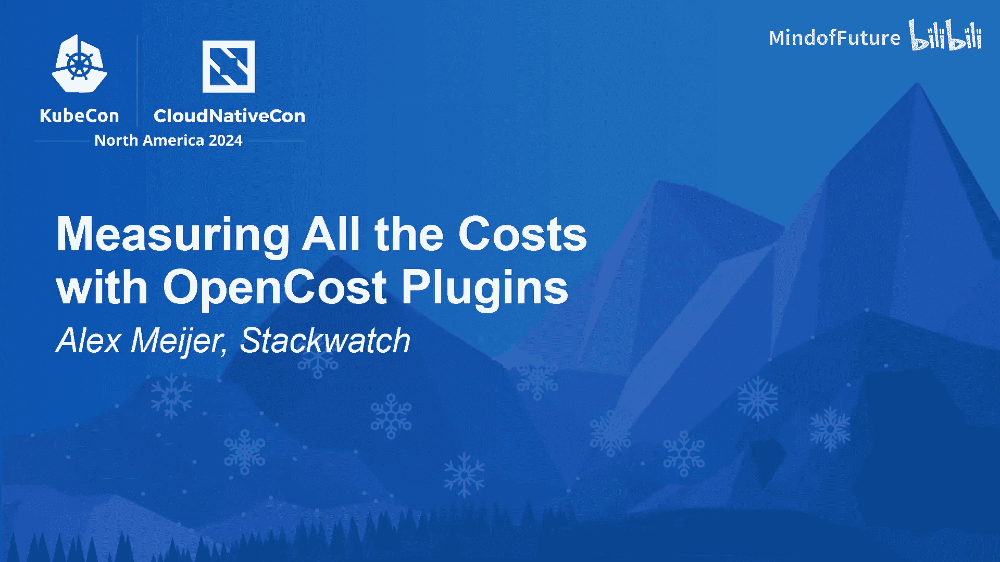
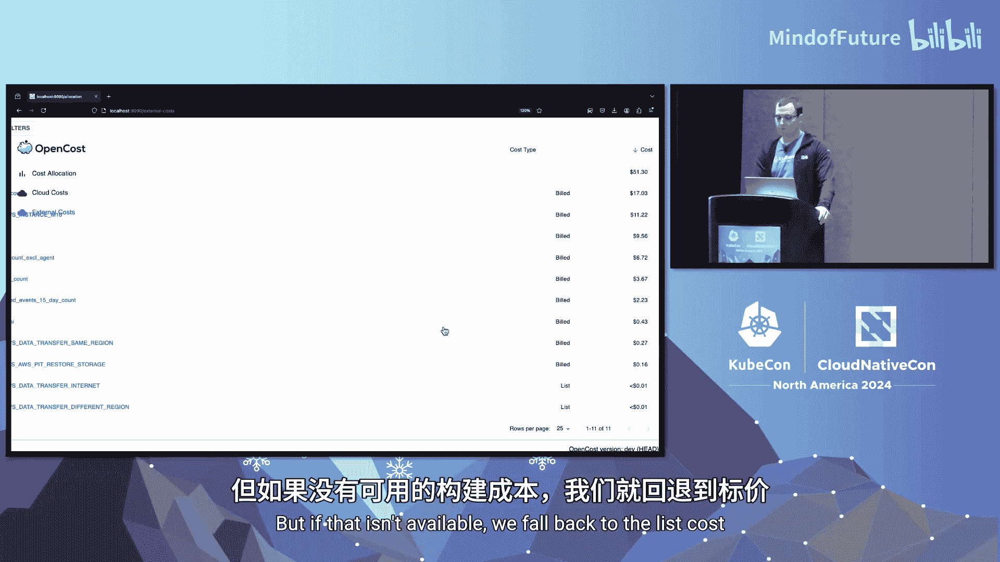

# 024：使用 OpenCost 插件衡量所有成本

## 概述

在本节课中，我们将学习 OpenCost 项目，特别是其最新的 OpenCost 插件功能。我们将了解 OpenCost 如何帮助您可视化和管理云原生环境中的成本，并深入探讨插件系统如何通过社区力量来整合任何类型的成本数据。

---

## Kubernetes 十年回顾与成本挑战

Kubernetes 已经走过了十年，它不再需要证明自己的价值。如今，大多数公司都在评估或使用 Kubernetes。早期采用者见证了计算成本的显著降低。然而，随着应用规模的扩大和复杂性的增加，成本再次成为关注的焦点。我们已进入“第二天”运营阶段，需要有效管理这些成本。

## OpenCost 项目简介

OpenCost 项目始于 2019 年初，旨在成为云原生支出的开放标准。它已从 CNCF 沙箱项目晋升为孵化项目，显示出强劲的发展势头。

OpenCost 目前包含三个主要方面：
1.  **Kubernetes 成本**：如命名空间、Pod 等资源的成本。
2.  **云提供商成本**：集成 AWS、GCP 等云服务商的成本数据。
3.  **OpenCost 插件**：通过插件系统整合任何你能想象到的成本。

OpenCost 提供了一个强大的 REST API，大多数用户首先利用它进行数据收集。项目愿景是成为可视化所有云原生支出的单一平台，连接供应商和客户，帮助双方实现成本透明和价值最大化。

## OpenCost 插件：社区驱动的成本衡量

上一节我们介绍了 OpenCost 的整体情况，本节中我们来看看其核心创新：OpenCost 插件。

这是一个始于 2024 年初的社区驱动项目，名为“衡量所有成本”。其核心理念是承认维护者无法独自衡量生态系统中所有类型的成本。因此，我们需要借助社区的力量。

**核心挑战与解决方案：FOCUS 规范**
项目面临的最大挑战是设计一个通用的接口。幸运的是，我们发现了 **FOCUS 规范**。

FOCUS 代表 FinOps 开放成本和用量规范，由 Linux 基金会旗下的 FinOps 基金会维护。其使命是建立一个社区驱动的、基于用量的计费数据规范。简而言之，它是一组可以描述任意成本的计费字段。

我们选择 FOCUS 规范作为接口的原因如下：
*   **由专门工作组维护**：得到全球众多大型公司的支持。
*   **文档详尽**：每个字段都有详细说明，便于贡献者自学。
*   **类型系统完善**：具有广泛的类型接口。
*   **版本化管理**：作为一个活跃的规范独立发展。

**接口设计：核心与扩展字段**
FOCUS 规范包含 43 个字段，对贡献者来说可能显得繁多。为了降低贡献门槛，我们将规范分为两部分：

1.  **核心接口**：包含最高影响力的字段，如主要成本、标签、账户名称等。OpenCost 的用户体验主要围绕这些字段构建。
2.  **扩展接口**：包含不常提供的字段，如承诺折扣、计费频率等。

这两个接口共同完全满足 FOCUS 1.0 规范。核心成本结构中包含一个指向扩展成本项的指针。这种设计确保贡献者即使无法提供所有字段，也能轻松提交插件。

## 插件工作原理与交付

了解了插件的设计理念后，我们来看看它们具体是如何工作和交付的。

**插件工作流程**
以下是插件与 OpenCost 交互的简化序列：

1.  OpenCost 自定义成本采集器获取已配置的插件列表。
2.  对于每个插件，它通过 gRPC 发送一个 `CustomCostRequest` Protobuf 对象。该对象包含：
    *   `window`：需要成本数据的时间窗口。
    *   `resolution`：所需的数据分辨率（如每日或每小时）。
3.  插件收到请求后，向特定的供应商 API 发起请求。
4.  插件将获取的数据尽可能转换为 FOCUS 对象。
5.  插件通过 gRPC 将 FOCUS 对象数组返回给 OpenCost。
6.  OpenCost 接收并存储这些数据，使其可通过核心 API 访问。

一个关键点是，我们使用 HashiCorp 的 `go-plugin` 包和 gRPC，这意味着**插件可以用任何支持 gRPC 和执行的语言编写**（如 Go、Rust、Python 等），这极大地降低了贡献的技术壁垒。

**插件交付方式**
Go 插件在编译时会包含大量样板代码，导致二进制文件体积较大。如果将所有插件都打包进 OpenCost 主容器，会导致镜像非常庞大。

我们的解决方案是：
1.  插件在 GitHub 仓库合并后，会自动为多种架构（ARM, AMD64）编译，并发布到 GitHub Releases。
2.  当 OpenCost Pod 启动并检测到需要使用插件时，会启动一个 Init 容器。
3.  Init 容器根据用户配置（特定版本或最新版）从 GitHub Releases 下载对应的插件二进制文件。
4.  下载的插件被存储在一个 `emptyDir` 卷中，供主 OpenCost 容器使用。

这种方式实现了插件的按需、动态交付，保持了主容器的轻量。

## 功能演示

现在，让我们通过一个演示来看看插件的实际效果。演示基于 OpenCost 1.113 版本，该版本引入了外部成本 UI 和 API。

目前我们发布了三个插件：
1.  **Datadog**：参考实现，也是最老的插件。
2.  **MongoDB Atlas**：由社区成员 Sajet 贡献。
3.  **OpenAI**：我们为本次演讲构建的插件。

在 OpenCost UI 中，你可以看到新的“外部成本”视图。以 OpenAI 插件为例，我们可以下钻查看：
*   **账户级别**：对应 API 令牌。
*   **资源类型**：OpenAI 主要提供 AI 模型资源。
*   **模型级别**：查看不同模型（如 GPT-4 与 GPT-4o-mini）的成本对比。

演示中设置了一个每 30 秒请求 OpenAI 生成俳句的任务，使用两种不同模型。成本视图清晰地显示了更小模型（GPT-4o-mini）的成本显著低于全功能模型（GPT-4）。这为成本优化提供了直观洞察。

**混合视图与成本类型**
OpenCost 支持“混合视图”，它同时处理两种成本类型：
*   **账单成本**：包含折扣后的实际成本。
*   **标价成本**：未折扣的列表价格。

混合视图的算法是：优先使用账单成本（若可用），否则回退到标价成本。用户也可以在 UI 中筛选，仅查看其中一种成本类型。

**数据聚合与时间窗口**
OpenCost 会持续获取并更新最近 7 天的成本数据。这是因为像 Datadog 这样的第三方服务，其成本数据可能需要长达 72 小时才能完全对账。滚动获取 7 天数据确保了视图能随着时间推移收敛到最终的实际发生成本。

在 UI 中，你可以按“提供商”（我们称为“域”）或资源名称聚合查看所有插件成本，从而快速识别跨 Kubernetes、云服务和第三方 SaaS 的最大成本驱动因素。

## 路线图与总结

**未来路线图**
OpenCost 插件项目的未来发展分为几个阶段：

1.  **生态系统丰富**：当前阶段。目标是增加插件数量，覆盖更多第三方服务（如 Snowflake, New Relic, Confluent Cloud 等）。我们呼吁社区共同参与建设。
2.  **供应链改进**：包括为插件添加签名以提高安全性，为离线环境提供包含所有插件的“重型”镜像，以及实现独立的插件版本管理和长期支持计划。
3.  **统一成本体验**：未来计划将云提供商成本也通过插件模型集成，从而统一所有成本源（EC2 实例、Datadog、OpenAI 等），真正实现“单一管理平台”。
4.  **高级聚合分析**：利用 FOCUS 扩展属性进行更深入的成本洞察和分析。

**总结与行动号召**
本节课我们一起学习了 OpenCost 及其强大的插件系统。

OpenCost 正获得越来越多的关注，因为它解决了云原生时代日益增长的成本管理需求。OpenCost 插件是我们最新的努力，旨在通过社区协作衡量所有成本。

我们精心设计了插件系统，使其贡献尽可能简单：
*   基于 **FOCUS** 标准接口。
*   支持多种编程语言。
*   提供动态交付机制。

目前我们已经有了 OpenAI、MongoDB Atlas 和 Datadog 的插件。

**行动号召**：如果您所在的组织有某个 SaaS 服务是成本支出的主要部分，并希望将其纳入 OpenCost 进行统一管理，我们非常欢迎您来贡献一个插件！您无需深入了解 OpenCost 内部原理。作为激励，前 10 个被合并的插件贡献者将获得奖励。

构建一个 OpenAI 这样的插件大约需要两天时间（一天学习 API，一天实现和测试）。我们希望您能尝试一下，共同参与这个社区驱动的“衡量所有成本”之旅。

我们相信，随着 FOCUS 标准的普及和 OpenCost 插件生态的壮大，未来在成本可视化和优化方面将充满更多可能性。