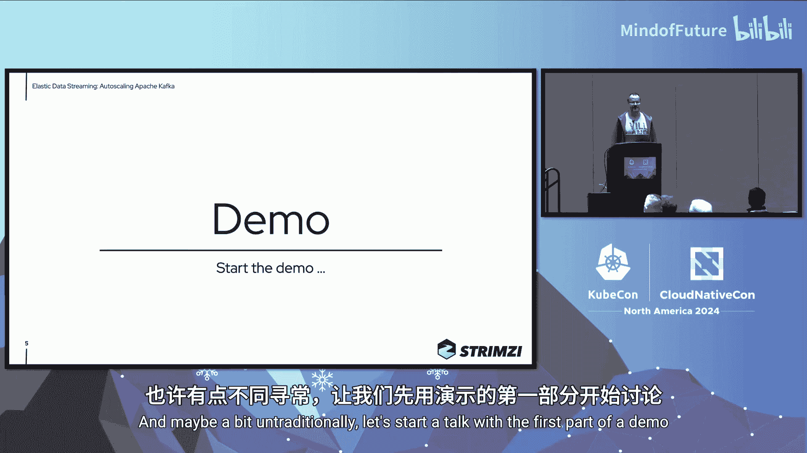
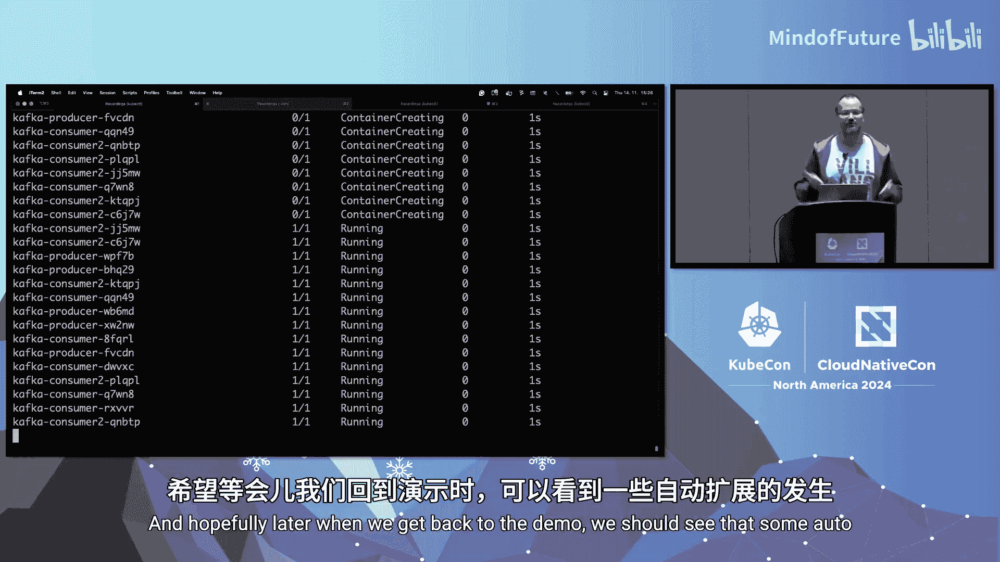
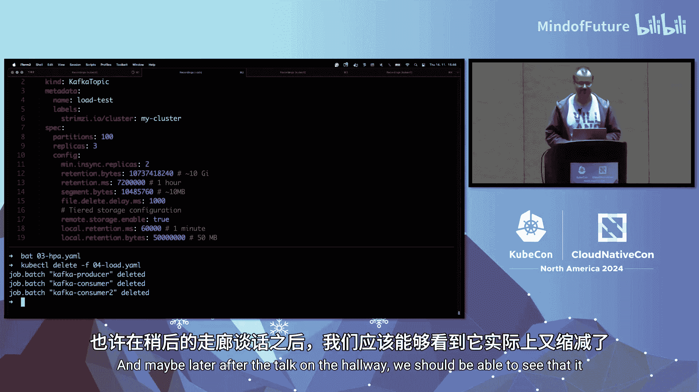

# 025：教程




在本教程中，我们将学习如何为运行在 Kubernetes 上的 Apache Kafka 集群实现自动扩缩容。我们将探讨其必要性、核心挑战、解决方案（包括 Strimzi 项目、自动再平衡和分层存储），并通过一个实际演示来理解整个过程。

## 为什么需要自动扩缩容 Kafka？🤔



Kafka 通常是一个资源消耗巨大的工作负载。如果能够以高效的方式实现自动扩缩容，我们或许可以节省成本、节约能源，变得更加环保。Kafka 在可扩展性方面表现出色，可以轻松地从几个代理扩展到数十甚至数百个。然而，可扩展性更多指的是随着业务长期增长而扩容的能力。

弹性则是指对即时需求做出反应的能力。例如，当您的应用因推广而流量激增几分钟后，又迅速回落。这种对瞬时需求的快速响应，正是自动扩缩容更适用的场景。Kafka 在长期可扩展性方面做得很好，但在短期弹性方面则不那么简单，而这正是 Strimzi 项目试图改进的地方。

## 在 Kubernetes 上实现自动扩缩容的第一步 🚀

上一节我们介绍了 Kafka 弹性的概念，本节中我们来看看在 Kubernetes 上实现自动扩缩容的基础。

如果要在 Kubernetes 上实现自动扩缩容，首先需要拥有 scale 子资源。对于 Deployment 或 StatefulSet，Kubernetes 已内置此功能。但对于像 Strimzi 这样的 Operator 及其自定义资源，则需要在自定义资源和 Operator 中支持此功能。

scale 子资源允许 Kubernetes 在不理解自定义资源内部结构的情况下对其进行扩缩容。这使得您可以执行类似 `kubectl scale kafkanodepool brokers --replicas=5` 的命令。这是 Strimzi 引入的概念，与 Kubernetes 本身无关。这也是您接入 Horizontal Pod Autoscaler 的地方，它是 Kubernetes 的基本资源，可以根据某些指标自动扩缩 Pod 数量。

以下是 Strimzi Kafka 自定义资源中启用扩缩容支持的示例配置片段：

```yaml
apiVersion: kafka.strimzi.io/v1beta2
kind: Kafka
metadata:
  name: my-cluster
spec:
  kafka:
    # ... 其他配置
    replicas: 3 # 初始副本数，可由 HPA 修改
```

## 仅有扩缩容还不够：数据分布问题 ⚖️

上一节我们介绍了如何启用基础的扩缩容，本节中我们来看看一个关键挑战：数据分布。

当我们从一个三节点的 Kafka 集群开始，分区副本被分配到这三个节点。当发生扩容时，新节点被添加到集群中，但它是空的。这是因为在 Kafka 中，所有分区副本都被分配给特定的代理，仅仅添加更多代理并不意味着数据会自动迁移。这对于长期扩展可能可以接受，因为新服务和新主题会逐渐在新节点上创建。但对于自动扩缩容，这并没有帮助。

同样，当您要缩容集群时，假设我们有一个四节点集群，并且第四个节点上存有数据。如果您直接删除这个 Pod，可能会导致数据丢失或集群可用性受损。您不能简单地这样做。

因此，在 Strimzi 中，我们创建了称为“自动再平衡”的功能。它是 Strimzi Operator 的一个特性，底层使用了 Cruise Control 工具。当您进行扩缩容并启用此功能时，Strimzi 会自动使用 Cruise Control 触发再平衡，在 Kafka 集群内迁移数据。在缩容时，它会首先启动再平衡，将数据从即将被移除的节点移走，只有当节点真正清空后，才会将其删除。

## 引入分层存储以加速扩缩容 💾

上一节我们通过自动再平衡解决了数据迁移问题，但大规模数据移动仍然耗时耗力。本节中我们来看看如何利用分层存储来优化这个过程。


现在，启用了自动再平衡后，当您从三节点集群开始并发生自动扩容时，新节点被添加到集群，然后发生再平衡，部分数据被迁移到新节点。这看起来很好。同样，在缩容时，Strimzi 会首先将数据移动到剩余节点之一，然后才缩容并移除空节点。

但实际情况是，如果每个代理存储了 4TB 数据，添加新代理后，再平衡需要将 3TB 数据从旧节点迁移到新节点。这需要网络资源、存储 I/O、CPU 和时间。移动数 TB 的数据不可能像幻灯片动画那样在几秒钟内完成。

分层存储是一个相对较新的 Kafka 特性，它意味着在 Kafka 集群中使用不同层级的存储。一些不那么重要、不常访问或非最新的数据可以被上传到其他存储层，而本地主要保留重要、频繁访问或刚从生产者接收的数据。

通常，添加的其他存储层可能是像 Amazon S3 这样的对象存储或 NFS 存储。它们通常比代理直接使用的块存储更便宜，容量更大，但延迟也可能更高。如果我们使用分层存储来减少代理上的数据量，那么在再平衡时需要迁移的数据就会减少。

将分层存储应用到之前的集群示例中，现在每个代理上可能只有 400GB 数据，其余的在云存储中。当我们扩容集群时，添加新节点并再平衡后，每个节点可能只有 300GB 数据。这虽然可能仍然很多，但比以前少了 10 倍，因此消耗的网络、存储资源和时间也大致减少 10 倍。这是改进集群扩缩速度和效率的下一个关键部分。

## 实战演示：配置与观察 🎬

以下是配置一个支持自动扩缩容、自动再平衡和分层存储的 Kafka 集群所涉及的核心组件。

**Kafka 集群配置**
这是用于部署集群的 Strimzi 自定义资源。我们指定了一个自定义镜像（因为分层存储插件当前未包含在默认 Strimzi 镜像中），并配置了分层存储。



```yaml
apiVersion: kafka.strimzi.io/v1beta2
kind: Kafka
metadata:
  name: my-kafka
spec:
  kafka:
    version: 3.6.0
    image: my-custom-image-with-tiered-storage-plugin:latest
    config:
      # ... 其他 Kafka 配置
    storage:
      type: jbod
      volumes:
      - id: 0
        type: persistent-claim
        size: 100Gi
        deleteClaim: false
      - id: 1
        type: persistent-claim # 用于分层存储的卷
        size: 500Gi
        class: nfs-client
        deleteClaim: false
```

**自动再平衡配置**
在 Kafka 自定义资源中启用并配置自动再平衡功能。

```yaml
    rebalance:
      auto: true
      addBrokers: true
      removeBrokers: true
      goals:
        - CpuCapacityGoal
        - DiskCapacityGoal
        - NetworkInboundCapacityGoal
        - NetworkOutboundCapacityGoal
        - ReplicaDistributionGoal
        - DiskUsageDistributionGoal
        - CpuUsageDistributionGoal
```

**Kafka 节点池配置**
这是 Kafka 代理的节点池，正是我们进行自动扩缩容的对象。关键部分是我们挂载了用作分层存储的额外 NFS 卷。

```yaml
apiVersion: kafka.strimzi.io/v1beta2
kind: KafkaNodePool
metadata:
  name: brokers
  labels:
    strimzi.io/cluster: my-kafka
spec:
  replicas: 3
  roles:
    - broker
  storage:
    volumes:
      - id: 0
        class: fast-ssd
        size: 100Gi
      - id: 1
        class: nfs-client
        size: 500Gi
        deleteClaim: false
```

**Horizontal Pod Autoscaler 配置**
我们配置 HPA 来根据 CPU 使用率自动扩缩 Kafka 节点池。

```yaml
apiVersion: autoscaling/v2
kind: HorizontalPodAutoscaler
metadata:
  name: kafka-brokers-hpa
spec:
  scaleTargetRef:
    apiVersion: kafka.strimzi.io/v1beta2
    kind: KafkaNodePool
    name: brokers
  minReplicas: 3
  maxReplicas: 5
  metrics:
  - type: Resource
    resource:
      name: cpu
      target:
        type: Utilization
        averageUtilization: 90
  behavior:
    scaleDown:
      stabilizationWindowSeconds: 600
      policies:
      - type: Percent
        value: 100
        periodSeconds: 60
```

在演示中，当负载增加时，HPA 检测到 CPU 使用率上升，将集群从 3 个节点扩展到 5 个节点。Strimzi Operator 添加了新代理（节点 13 和 14），然后触发了自动再平衡，使用 Cruise Control 将部分分区副本迁移到新节点上，从而平衡集群负载。整个过程可能需要数分钟，具体时间取决于数据量和集群资源。

## 挑战与注意事项 ⚠️

自动扩缩容虽然有效，但仍面临一些挑战：

1.  **时间**：扩缩容可能需要数分钟，主要耗时在数据迁移上。这意味着您不能等到流量洪峰来临时才启动扩容，需要提前规划。
2.  **成本与振荡**：扩缩容本身是昂贵的，因为再平衡会消耗资源。必须正确配置 HPA 的稳定窗口和时间参数，以避免集群在扩缩容阈值附近频繁振荡。例如，缩容后由于数据迁移会导致负载立即上升，如果 HPA 配置不当，可能又会立即触发扩容。
3.  **指标选择**：选择正确的扩缩容指标至关重要。演示中使用了 CPU 使用率，但 Kafka 有多种内部指标（如不同线程池的利用率），可能在某些场景下更合适。
4.  **分区数限制**：自动扩缩容不会改变主题的分区数。如果您的负载集中在少数几个分区上，那么增加代理可能无济于事。负载需要分布在足够多的分区上才能受益于新增的代理。
5.  **集群容量**：Kafka 代理通常是资源密集型工作负载。当尝试扩容时，Kubernetes 集群可能没有足够的资源来调度新的 Pod。此时需要依赖集群自动扩缩器（如 Karpenter）来添加新的工作节点，但这会进一步延长扩容时间。
6.  **分层存储的适用性**：分层存储并非万能。如果您的用例需要反复频繁访问所有数据，那么使用对象存储可能并不划算，因为您需要为请求和数据传输付费。分层存储最适合用于存储不常访问的冷数据或温数据。

## 总结与展望 📚

在本教程中，我们一起学习了为 Kubernetes 上的 Apache Kafka 实现自动扩缩容的完整旅程。

我们首先探讨了弹性的需求，然后了解了在 Kubernetes 上启用基础扩缩容的方法。接着，我们发现了单纯扩缩容导致的数据分布问题，并引入了 Strimzi 的**自动再平衡**功能来解决。为了优化大规模数据迁移的性能，我们探讨了使用**分层存储**来减少代理本地数据量，从而显著缩短再平衡时间。最后，我们通过一个实战演示观察了整个流程，并分析了当前方案仍面临的挑战，如时间开销、资源配置和指标选择等。

尽管存在挑战，但自动扩缩容 Kafka 集群是可行的。它更适合用于中长期的容量规划，例如根据工作日/夜间或周末的流量模式来调整集群规模。同时，它也能帮助解决 Kafka 集群 sizing 困难的问题，让您更有信心从小规模集群开始，让其随需求增长，而不是一开始就过度配置。


如果您对改进 Kafka 自动扩缩容感兴趣，欢迎通过 Strimzi 项目的各个渠道提供反馈，共同探索更合适的指标并改进功能。