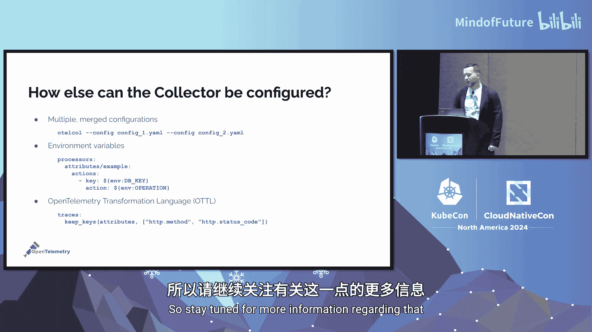

# 026：精通 OpenTelemetry Collector 配置


在本节课中，我们将要学习 OpenTelemetry 项目的核心组件之一——Collector 的配置方法。我们将从基础概念入手，逐步深入到配置的细节与实践，帮助你掌握如何有效地接收、处理和导出可观测性数据。

## 讲师介绍

我是 Steve Flanders，目前在 Splunk（近期被思科收购）担任工程高级总监。我参与可观测性领域已超过十年，曾参与 OpenCensus（OpenTelemetry 的前身项目）的工作，并在 VMware、Omniscient（后被 Splunk 收购）等公司负责日志、追踪和指标产品。最近，我刚刚发布了一本名为《精通 OpenTelemetry 与可观测性》的书籍。

## 什么是 OpenTelemetry？

OpenTelemetry 是一个开放标准，旨在实现遥测数据的生成、收集和处理。它涵盖了可观测性的三大支柱——追踪、指标和日志，并支持更多类型的信号，如客户端插桩、性能剖析和合成数据等。该项目专注于应用程序、浏览器、移动设备等所有环境中的遥测数据。

**核心公式**：`OpenTelemetry = 规范 (Specification) + 实现 (Instrumentation Libraries & Collector)`

OpenTelemetry 本身不提供数据后端，而是保持供应商中立，允许你将数据发送到任何目的地，无论是开源项目、自建方案还是商业供应商。

## 为什么 OpenTelemetry 很重要？

首先，它提供了一个开放标准，统一了术语和操作方法。其次，它实现了供应商中立，带来了数据可移植性和控制权。你可以自由选择生成多少数据、如何处理以及发送到哪里。作为 CNCF 中活跃度仅次于 Kubernetes 的项目，它拥有庞大的生态系统和广泛的社区支持。

## 聚焦：OpenTelemetry Collector

Collector 是一个独立的二进制文件，负责接收、处理和导出数据。其内部流程可以简化为：**接收数据 -> 处理数据 -> 导出数据**。

接收数据可以通过推（Push）或拉（Pull）机制。例如，Prometheus 使用拉取（Scrape），而分布式追踪通常使用推送。

处理数据可能包括过滤、脱敏、聚合或采样等操作。
导出数据则是将处理后的数据发送到最终的后端系统进行分析和可视化。

## Collector 的部署模式

Collector 主要有两种部署模式：

1.  **Agent 模式**：尽可能靠近应用程序运行（如二进制文件、Sidecar、DaemonSet）。其优点是快速将处理责任从应用中卸载，减少应用自身的资源消耗，并能以统一的方式处理所有数据。
2.  **网关/服务模式**：部署在网络边界（如数据中心、区域），通常以集群方式运行，前方配有负载均衡器，以支持高可用性和大规模流量。

两种模式都可以将数据发送到任何目的地。你甚至可以选择完全不使用 Collector，让应用程序库直接发送数据到后端。Collector 的强大之处在于其能够接收一种格式的数据（如 Prometheus），并在内部转换为另一种格式（如 OTLP）后导出，从而实现供应商中立。

## Collector 的构成与分发

Collector 是一个用 Go 语言编写的单二进制文件，支持主流操作系统和容器化部署。

OpenTelemetry 有几种官方“分发版”：
*   **Core**：包含 OpenTelemetry 核心协议（如 OTLP）所需的基本组件。
*   **Contrib**：包含非核心但常用的组件，如对接 Zipkin、Jaeger 等后端的导出器。
*   **Kubernetes**：为 Kubernetes 环境预打包了相关组件。

此外，任何人都可以使用 `OCB` 工具构建自己的分发版，仅包含所需的组件。许多供应商和云提供商都维护着自己的分发版。

## Collector 配置详解

Collector 主要通过 YAML 文件进行配置。配置文件主要包含五大类组件：



1.  **Receivers（接收器）**：定义如何接收数据。
2.  **Processors（处理器）**：定义如何处理数据（如过滤、修改、批处理）。
3.  **Exporters（导出器）**：定义如何将数据发送出去。
4.  **Extensions（扩展）**：提供不直接处理遥测数据的附加功能（如健康检查、身份验证）。
5.  **Connectors（连接器）**：同时作为接收器和导出器，用于在管道间重定向或重新处理数据。

配置是一个两步过程：
1.  **定义并配置组件**：在 YAML 文件的对应章节（`receivers`， `processors`， `exporters`）中声明和配置组件。
2.  **在服务管道中启用组件**：在 `service` -> `pipelines` 部分，为特定的信号类型（如 `metrics`， `traces`）指定要使用的接收器、处理器和导出器及其顺序（仅处理器顺序有意义）。

**配置示例代码**：
```yaml
receivers:
  otlp:
    protocols:
      grpc:
      http:
  hostmetrics:
    scrapers:
      memory:

exporters:
  debug:

service:
  pipelines:
    metrics:
      receivers: [hostmetrics]
      exporters: [debug]
```

## 配置验证与查找

在部署配置前，务必使用 `validate` 命令进行验证，以避免因配置错误导致 Collector 崩溃。
```bash
otelcol-contrib --config=config.yaml validate
```

所有组件的配置选项都可以在 GitHub 仓库对应组件的 README 文件中找到（需区分 core 或 contrib 仓库）。

## 实践演示：从基础到生产配置

上一节我们介绍了配置的结构，本节中我们来看看如何一步步构建一个可用的配置。

首先，我们创建一个最简单的配置，使用 `hostmetrics` 接收器收集内存指标，并通过 `debug` 导出器输出到控制台。使用 `validate` 命令确保语法正确后启动 Collector。

接着，我们添加对生产环境至关重要的处理器：
*   **`memory_limiter`**：防止 Collector 内存耗尽而崩溃。
*   **`batch`**：将数据批量发送，提高效率。

OpenTelemetry 文档建议处理器顺序为：`memory_limiter` 在前，`batch` 接近末尾。


然后，我们可以添加 `resource` 处理器来丰富数据，例如自动添加主机名和操作系统类型等元数据。这有助于后续的问题定位和根因分析。

**增强后的配置示例代码**：
```yaml
receivers:
  hostmetrics:
    scrapers:
      memory:

processors:
  memory_limiter:
    check_interval: 5s
    limit_mib: 400
  batch:
  resource:
    detectors: [system]

exporters:
  debug:

service:
  pipelines:
    metrics:
      receivers: [hostmetrics]
      processors: [memory_limiter, resource, batch]
      exporters: [debug]
```

通过处理器，你还可以执行更复杂的操作，如根据属性过滤数据、修改或删除元数据等。

## 总结与问答要点

本节课中我们一起学习了 OpenTelemetry Collector 的核心概念与配置方法。我们了解到 Collector 是一个强大的、供应商中立的数据处理管道，可以通过灵活的 YAML 配置来接收、丰富、处理和导出各种遥测数据。关键点包括：理解接收器、处理器、导出器的作用；掌握两步配置法；使用 `validate` 命令进行验证；以及为生产环境配置必要的处理器（如内存限制器和批处理器）。

在问答环节，讨论了一些高级主题：
*   **分层 Collector**：在需要全量指标但采样追踪的场景下，可以在 Agent 模式使用路由和连接器，或在极高规模下分离指标和追踪的 Collector 集群。
*   **调试**：除了日志，可使用 `debug` 导出器或在线 YAML 可视化工具来检查配置和数据流。
*   **有状态与无状态**：尽可能以无状态方式运行 Collector 以便于扩展。但在需要追踪关联（如尾部采样）或确保数据不丢失（如合规要求）时，需利用存储扩展等有状态功能。
*   **迁移价值**：如果现有工具链（如 Fluent Bit + Prometheus）满足需求且无供应商锁定问题，则无需立即迁移。OpenTelemetry 的主要价值在于提供标准化和供应商中立的灵活性，便于未来切换后端或整合不同信号。