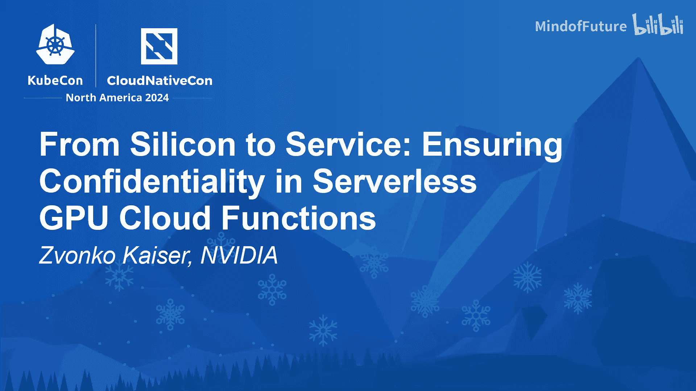

# 027：从芯片到服务，确保无服务器GPU云函数中的机密性

## 概述
在本节课中，我们将学习如何构建一个从硬件芯片到上层服务的全栈可信环境，特别是在无服务器GPU云函数场景下，确保数据的机密性。我们将探讨机密容器技术、远程证明、运行时完整性以及如何应对多租户环境中的安全挑战。

---

## 1：机密容器的用例与上游社区工作

上一节我们介绍了课程主题，本节中我们来看看机密容器技术旨在解决的具体业务场景，以及开源社区如何协作推动其发展。

我的主要职责是负责机密容器中的CAA（机密计算抽象层）。今天我想探讨一个从芯片到服务的全栈话题：确保无服务器GPU云函数中的机密性。

首先回顾一下我们在这个领域已完成的工作。我曾在巴黎的KubeCon EU上介绍过带GPU的机密容器和常规微服务。我讨论了机密计算的角色、我们为何选择CAA在Kubernetes上实现带GPU的机密计算、GPU使能栈和虚拟化参考架构、为支持GPU RDMA或GS等高级用例需要注意的事项、我们如何实现机密容器，并举例说明了如何用机密容器运行常规微服务。相关录播链接已提供，如果您对我们在此领域的底层细节感兴趣，可以查看。

今天，我想扩展我们正在用机密容器实现的用例，以及我们在上游社区建立的工作组的角色。

其中一个工作组是我们的“机密容器用例工作组”。IBM、Red Hat、NVIDIA、Intel、AMD等多家公司都参与其中。我们确定了三个希望在上游推动并实现的主要用例：

以下是三个主要用例：
1.  **联邦学习**：包含数据洁净室。不同参与方在一个机密环境中协同工作，我们需要共享此环境并为多个角色提供数据洁净室。这也关联到多方计算，它不只是在单个节点上运行机密容器，而是涉及多个节点，我们需要对此进行管理。
2.  **供应链安全**：如果您运行一个机密环境，那么所有环节都必须是可信的，包括您的构建流水线、CI/CD流水线。因此，我们社区中有多个成员正在研究供应链安全，包括所有与SBOMs（软件物料清单）、来源证明、CI/CD、构建的可重复性以及我们在飞地或机密环境中交付物的验证相关的事项。
3.  **生成式AI/大语言模型/神经信息管理系统**：如何正确部署和保护它们。

本质上，所有这些用例都有一个共同点：我们有不同的参与方在飞地中运行，我们需要确保为所有相关方提供一个洁净的、机密的“洁净室”。上游社区文档中也提供了链接，您可以通过一些幻灯片和演示文稿详细了解这些用例。

---

## 2：机密计算环境中的证明与信任

上一节我们了解了机密容器的关键用例，本节中我们来看看如何在这些复杂环境中建立和验证信任，特别是通过远程证明机制。

任何在机密计算用例中工作的人都会注意到参考架构。我们有一个专门的工作组，主要专注于机密容器中的证明和信任管道。目前，大多数传统环境都集中在单个节点上，并在运行开始时进行证明。但有些工作负载可能会运行数周或数月，我们正在研究的一件事是进行周期性的证明运行。如果有大量节点加入和离开，所有这些证明实体都需要被证明和验证。此外，我们希望禁用重放攻击。例如，如果您有机密存储，您可能希望进行周期性运行来验证您的机密存储是否仍处于预期状态。

正如之前所说，我们支持多角色。想象一下，云提供商提供基础设施，模型所有者提供第三方模型，然后用户可能拥有使用此模型的X张图像。这些角色中的每一个都需要相互证明和验证。因此，这也是我们信任工作组中的一个重要议题：如何实现这一点。

然后，我们还有复合证明支持这样的问题。想象一下，有许多证明实体进入和离开您的机密环境，您需要确保不会出现任何竞态条件，并且这些实体的证明是以正确的方式和在正确的时间完成的。因为在硬件层面存在一些定时攻击，特别是在有不同的策略和证明运行时。因此，我们正在思考如何将所有证明实体组合到一个报告中，或者我们是否进行轮询证明运行等。这些是我们试图回答的问题，以及如何正确地去做。

当然，另一个重要议题是运行时完整性。系统在运行时可能发生变化，我们希望捕捉到这一点。如果一切崩溃，我们希望有一个信号或警报表明某些东西发生了变化。

正如之前所说，大多数环境都是单节点的。我们需要考虑全局状态的证明。关于多个节点、多个集群甚至多个可用区的全局状态。您有一个全局状态，并且需要证明您的完整全局状态。

当然，还有身份管理。您需要知道谁正在进入您的安全飞地，谁正在离开。因此，您始终需要您的硬件设备、对等方、节点以及所有进出安全飞地的事物的正确身份。

机密容器的主要焦点正是我们所拥有的“直接迁移”策略：无需任何修改即可运行或终止。我们支持主要的硬件可信执行环境：AMD SEV、Intel TDX、ARM CCA、RISC-V COVE正在开发中，以及IBM CEX。我们可以在任何基础设施上运行，无论是在本地、云服务提供商还是混合环境，并且支持任何部署模型，无论是无服务器还是托管Kubernetes。我们正试图通过机密容器启用所有这些用例，这意味着一个相当好的直接迁移策略，因此您可以将容器作为传统容器、runC容器运行，或者如果您愿意，也可以作为机密容器运行。

之前我们看到的所有与机密虚拟机或可信执行环境相关的工作，都是为了使这些飞地更加安全。但我们忽略的一件事是主机。

我们目前正在研究的一个大议题是全栈证明。您本质上想要做的是保护您的完整环境和您的芯片，从芯片一直到容器。如果我们看看当前存在的各种攻击，比如“PK失败”，许多BIOS或固件供应商正在分发不可信的密钥，这意味着您的安全启动被破坏，您的度量启动被破坏，所以本质上您的UEFI已经损坏。然后在此基础上，我们运行一个内核，而您的内核因为缺乏正确的度量启动而损坏。再往上，在操作系统中，由于UEFI损坏、内核损坏，您的操作系统也同样损坏。例如，“Ahoo攻击”是针对机密虚拟机的一种攻击，您可以通过恶意通知（即中断溢出）来破坏可信执行环境。如果主机不受保护，您就可以对机密虚拟机发起攻击。

我知道周围有很多eBPF工具，它们试图保护主机。但问题在于，任何在Linux系统上运行的工具，它们都试图确保它们所依赖的运行时的完整性，因此存在循环依赖。您无法保护您正在运行的同一个运行时，因为如果它被破坏，您也就被破坏了。所以eBPF更像是一个可观测性工具，而不是安全工具。

为了给您一个印象，即使eBPF和所有这些工具都在工作，库尔特·哥德尔是一位奥地利数学家。我不知道你们是否熟悉不完备性定理，但一个足够复杂的公理系统中，存在一些命题和公理，您无法证明其真假。我们可以将其应用于运行时。您的运行时中有工具，任何试图在自身内部证明运行时环境完整性的尝试都会产生循环依赖，这使得在不依赖外部或更高级别验证的情况下建立绝对信任变得不可能。因此，您无法证明自己。这就是关键点。eBPF试图证明自己，试图证明主机，这在数学上是行不通的。即使数学上行得通，仍然存在无法证明的命题。

---

## 3：云环境与本地环境中的硬件信任根

上一节我们讨论了在软件层面建立信任的挑战，本节中我们来看看如何从硬件层面，通过“带外”管理来构建更底层的信任基础。

例如，云服务提供商如何验证他们如何保护其运行时。正如之前所说，它需要是一个开箱即用的解决方案。举个例子，我在这里以AWS Nitro为例。如果您查看AWS Nitro，他们在主机之外运行这些Nitro卡。主机对Nitro卡没有任何控制权。流程是从EC2控制平面到Nitro卡，然后从Nitro卡，它们启动Nitro hypervisor，并最终启动您在主机上拥有的所有实例。因此没有后门通道。Nitro hypervisor无法与Nitro卡通信，Nitro卡也无法与EC2控制平面通信。所以没有办法回到这些实例。我还在这里展示了ASIC和EEPROM。另一个问题是，我们如何保护所有的ASIC，因为恶意攻击者可以重新编程我们的EEPROM，而您的ASIC可能运行错误的代码。

Nitro的做法是，他们有一个服务处理器，可以将CPU保持在复位状态。在此复位期间，管理Nitro卡正在证明和度量所有的EEPROM。每个ASIC在I2C总线上都有一个钩子，他们可以在那里度量其EEPROM和固件，并可以用他们拥有的黄金度量值进行验证。因此，从EEPROM加载的所有内容都由Nitro卡检查。所以他们保护了ASIC。然后在此基础上，他们有一个TPM，意味着他们可以保护加载的hypervisor，并且CPU会保持复位状态，直到所有那些固件、内核、主机内核、客户机以及Nitro hypervisor等所有组件都被真正验证。这始终是相同的模式：在证明中，您度量某些东西并将其与预期值进行比较。主机无法访问所有这些功能，一切都是带外的。正如之前所说，它必须是带外的、更高特权的实体，以验证正在运行的主机是否处于真实且预期的状态。

这是在云上。但如果您关注本地环境，如果您对如何在本地实现感兴趣，有一家叫Oxide Computers的公司。他们本质上在做完全相同的事情：他们有一个服务处理器，可以将CPU保持在复位状态；他们有一个信任根。您需要一个信任根，您需要开始信任某个实体，信任根持有所有密钥和背书密钥来保护其他秘密。正如所说，服务处理器将CPU保持在复位状态，直到所有度量完成，直到所有固件被检查和度量并证明，然后CPU才被释放，CPU才能运行在主机上，创建hypervisor并执行我们需要的所有其他操作。他们还有一些更多功能，比如安全的秘密存储，完全从主机卸载，因此您不在主机上共享任何秘密，任何在主机上运行的恶意负载都将无法访问任何秘密。

通过这种带外管理和额外的信任根，我们基本上对ASIC、EEPROM亮了绿灯。我们现在有了度量启动、带有UEFI和内核的安全启动，所有这些都由TPM支持。但我们仍然没有解决主机上的任何问题，因为度量启动在您获得Linux提示符运行时就会停止。那么，我们可以在操作系统上做些什么来防止之前提到的攻击呢？

---

## 4：操作系统与虚拟化层的安全加固

上一节我们探讨了硬件信任根的建立，本节中我们来看看在操作系统和虚拟化层可以采取哪些额外措施来增强安全性。

一件事是操作系统的运行时完整性。有一些工具，如dm-verity和fs-verity。本质上，这些工具构建了一个默克尔树。这些本质上是哈希的哈希。最终，您会得到文件系统或操作系统的哈希或指纹，可以与预期值进行比较。然后，我们有Linux的完整性度量架构和EVM。这些本质上也是经过密码学签名和度量的文件及元数据，您可以再次与某些预期值进行比较。还有一些方法，如不可变操作系统（Red Hat CoreOS、Talos），您只是防止对用户分区的意外写入等。

然后，我们遇到的一个问题是与KVM和机密虚拟机（无论是QEMU、cloud-hypervisor还是其他正在运行的虚拟机）共享同一个内核。这与我们在容器中遇到的问题相同，这就是我们首先进行沙箱化的原因。突破仍然可能对其他虚拟机造成拒绝服务。如果您在主机中，您可以攻击那些其他虚拟机。如果您正在运行一个机密容器，数据仍然是加密的，但您仍然可以杀死所有QEMU进程，然后所有虚拟机都会消失。这就是问题所在。这也是我们正在上游研究的内容：如何在类型1 hypervisor上运行CAA和机密容器。为什么我们需要一个操作系统？为什么我们需要一个完整的操作系统运行在我们的虚拟机之下？我们只需要虚拟机管理。

我们在云服务提供商那里遇到的挑战是，他们提供机密虚拟机。为了运行传统的机密容器，我们某种程度上需要嵌套虚拟化，但我们也不需要它。嵌套虚拟化会引入很多问题，安全问题和性能问题。

解决这个问题的一种方法是移除嵌套虚拟化。熟悉Xen的人都知道，Xen有主虚拟机和次虚拟机，主虚拟机在同一L1级别管理所有用户虚拟机，因此它们没有任何嵌套虚拟化。这是一个更简单、更简化的架构。它扁平化了虚拟化层次结构。因此，所有虚拟机都作为L1客户机运行，我们不需要任何L2客户机，性能更高，安全性更强，当然，也减少了右侧的资源使用。右边这只是一个示例，说明如何使用Acon hypervisor实现这一点。这是一个现代的类型1 hypervisor，类似于Xen模型，您有一个服务虚拟机，负责所有资源管理，然后在同一级别上，您有用户虚拟机。

“Fractured turtles”是对Turtle项目的引用，该项目在Kata中引入了嵌套虚拟化的概念。这种次虚拟机模式的一个实现是机密容器的PeerPods。本质上，您有一个主虚拟机，它是云服务提供商实例上的工作节点，而Pod则运行在它自己的云服务提供商虚拟机实例中。我们没有在工作节点内部进行嵌套虚拟化。我们有一个对等虚拟机，它作为一个独立的云服务提供商实例运行。因此，我们将工作节点与工作负载解耦了。通过这种模型，您甚至可以完全将控制平面与您的工作节点解耦。您可以在本地运行控制平面，在云服务提供商那里拥有您的工作节点，并在云服务提供商那里运行您的工作负载。因此，您可以将工作负载与工作节点解耦，并可以完全将其与控制平面解耦。这使我们能够也将机密容器作为混合云运行。您可以在本地使用本地虚拟机运行您的Pod，然后通过PeerPods扩展到云服务提供商，这一切都是完全透明的直接迁移。唯一的接口是Kubernetes中的Pod，您只需将运行时类从PeerPods更改为本地虚拟机或CAA容器。

---

## 5：客户机虚拟机与容器负载的安全

上一节我们讨论了如何通过扁平化架构提升虚拟化层的安全性，本节中我们来看看在机密容器内部的客户机虚拟机和容器负载本身，还有哪些安全挑战和应对策略。

那么，我们已经处理了ASIC、UEFI、内核、操作系统。是的，我仍然有操作系统，比如Red Hat，因为如果您的机密虚拟机配置错误，您可以通过SSH访问它们。操作系统仍然可以进入您的机密虚拟机。因此，信任模型，我们也在研究的是，我们也不信任客户机，因为机密容器运行在机密虚拟机内部。本质上，客户机虚拟机仅用于启动容器、处理容器的生命周期。因此，我们本质上不需要在虚拟机中运行一个复杂的或完整的操作系统。所有在机密虚拟机中运行的工件，如固件、客户机内核和客户机文件系统，都来自主机。因此，如果您有恶意来源，它可能为您的机密虚拟机提供恶意工件，所以您再次在那里运行恶意代码。

在客户机上，我们也可以进行运行时完整性检查，使用我之前提到的相同工具：dm-verity、fs-verity、IMA、EVM、不可变操作系统。但一个大问题是，如果您正在进行安全启动，您有度量值。您有一个TPM，可以在硬件飞地中存储您自己的启动度量值。如果您在客户机中进行，我们如何保护这些度量值，因为它们可能被操纵，并且证明报告可能向远程证明实体提供错误的度量值。

这些运行时度量值可以在机密虚拟机内部通过证明来保护。证明报告中有报告字段可以扩展。TDX有一个RTMR（运行时度量寄存器），它本质上是一个TPM PCR寄存器，您可以在其中扩展哈希。

但社区一直在研究的一件事是如何在客户机中利用vTPM。显然，我们不能从主机透传一个vTPM，因为我们不信任主机。如果我们透传一个vTPM，它需要是一个软件实现，因为您无法虚拟化硬件TPM。如果您从主机透传一个虚拟化的TPM，您需要在某个地方保护它，您也需要在机密飞地中运行它以保护它免受主机和其他租户的影响。

因此，社区有一个想法：在机密虚拟机内部运行高特权固件。一个是Coconut SVSM，微软最近宣布了OpenHCL，这是一个在特殊虚拟机级别运行的高特权固件。如果您查看SEV-SNP，SEV-SNP可以在不同的虚拟机特权级别上在机密虚拟机内运行应用程序。它们在特权级别0运行这个自定义固件，它可以模拟一个vTPM。特权级别1将运行内核，特权级别2将运行操作系统。随着级别升高，您拥有的特权越来越少。因此，级别2无法访问级别1，级别1无法访问级别2。所以vTPM受到内核和用户空间的保护。

机密虚拟机内的vTPM是无状态的。我们不保存任何状态。但一个真正的问题是，您如何在机密虚拟机内制造TPM，因为通常硬件TPM在制造时内置到服务器中时就带有背书密钥。对于vTPM，您需要动态进行。因此，当您实例化vTPM时，您创建一个背书密钥，您可以将其绑定到CPU的证明报告，并且您拥有直到CPU供应商的证书链。因此，您证明您的背书密钥是有效的。从那里，您可以派生存储密钥和所有其他您将进行的TPM相关操作。

上游有一些讨论，因为一些人认为TPM不是保护机密虚拟机内部度量值的正确接口。因此，在内核端、用户空间端，以及我们的机密容器社区中，都有一些关于如何正确保护这些度量值的讨论，因为TDX有RTMR，SEV-SNP没有类似的东西，CCA的做法完全不同，所有其他可信执行环境都有自己的实现。

正如之前所说，客户机虚拟机只是一个部署载体。对于机密容器用例，我们并不真的需要一个完整的操作系统在那里运行。

我们正在做的是客户机内核加固，剥离所有我们不需要的选项，一个数字化的客户机文件系统，只包含我们生命周期管理容器所需的库和一些二进制文件。我们不运行一个完整的操作系统，还有固件加固，禁用我们不需要的功能和部分。

然后我们有了容器负载。您可以想象，由于我们在客户机文件系统中没有任何工具，攻击者可能使用容器作为负载，因为容器保存在镜像中，并使用容器内部部署的工具在虚拟机内部运行。我们如何防止这种情况是使用SELinux或AppArmor，这样没有容器上下文可以在主机上下文中执行任何操作，从而保护客户机虚拟机免受运行容器负载二进制文件的影响。本质上，我们希望为攻击者创造一个没有枚举任何东西或进行任何横向移动可能性的空间。

如您所见，我仍然在容器上有一个问号。我们可以对容器进行签名，验证容器来自我们期望的仓库。但我们如何知道容器部署了什么？里面有哪些工具？您在里面运行哪些软件包？这就是SBOM发挥作用的地方。我们需要一个运行在我们堆栈中的所有组件的清单。我们想知道是否需要针对CVE或错误修复做出反应，无论是容器、客户机文件系统还是操作系统。因此，我们正在跟踪清单，了解我们堆栈上运行的内容，并且我们正在验证容器的SBOM签名、固件、客户机内核以及所有需要的文件的签名，并且需要进行证明。

本质上，我们想要做的是通过远程证明验证所有签名、SBOM证书。我们需要构建一个从芯片到容器SBOM的信任链。只有当所有这些部分都是绿色的、经过验证和测试的，我们才能说，好的，我们正在运行一个可信的堆栈。

我们如何进行证明？再次强调，Trustee是我们的证明管道。我们正在扩展Trustee以支持我在这里解释的所有这些用例。

云服务提供商证明的问题在于他们证明自己。这就是问题所在。通常，您希望以租户所有者的身份证明您正在运行的环境。这就是Trustee发挥作用的地方，您可以在您可信的基础设施上部署Trustee，然后证明您的机密容器工作负载、vTPM引用、SBOM以及整个堆栈的所有签名。对每一层进行度量和测试。只信任您验证过的内容。

---

## 6：无服务器云函数中的全栈证明

上一节我们构建了从硬件到容器镜像的完整信任链，本节中我们来看看为什么这一切对于无服务器云函数场景至关重要，以及如何应用这些原则。

但这又引出了云函数以及我们为什么要进行全栈证明、运行无服务器。因为云函数运行在我们的共享、抽象的基础设施上，其中底层是隐藏的，但对安全至关重要。这些使用点来自云函数提供商、函数即服务提供商或工作负载所有者。我们有不透明的层，我们对硬件一无所知。我们希望确保硬件、hypervisor、操作系统以及我们部署的所有工件都处于用户期望的状态，反之亦然，用户也期望所有工具、工件和层都受到保护，以便多租户成为可能，因为我们希望保护同一硬件上的其他租户。在共享硬件上存在数据泄漏、恶意推理、租户间拒绝服务的可能性。

硬件或hypervisor中的所有漏洞都可能影响函数，而运行云函数的用户或基础设施所有者却不知情。

最后一点是，如果运行时、操作系统或其他层未经度量，它们可能被篡改，影响函数完整性和数据安全。因此，度量一切，验证一切，证明一切。确保堆栈的每一层都经过证明和可验证。

---

## 总结
在本节课中，我们一起学习了如何为无服务器GPU云函数构建全栈机密计算环境。我们从机密容器的具体用例和社区工作开始，探讨了建立信任所需的远程证明机制，并深入了解了从硬件信任根、操作系统加固到虚拟化层安全的最佳实践。最后，我们强调了在抽象的无服务器环境中实施全栈度量和验证的重要性，以确保多租户隔离和数据机密性。核心在于构建一个从硅芯片到服务容器、每一层都可验证的完整信任链。